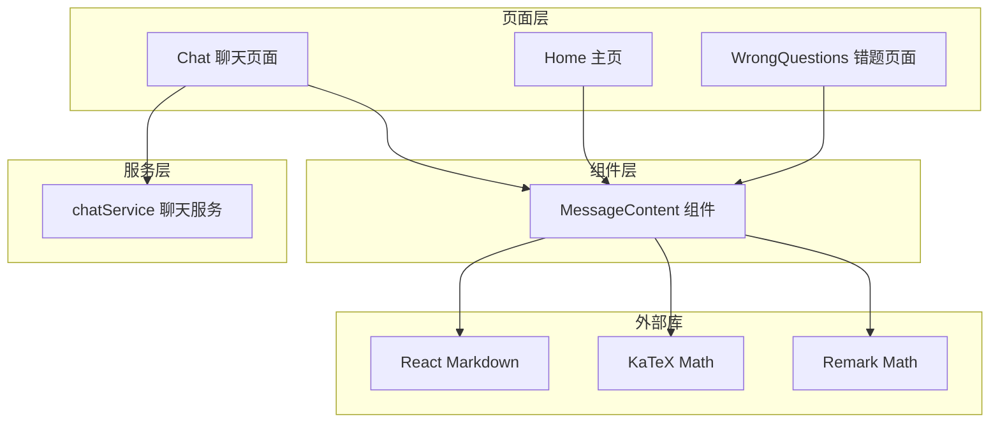
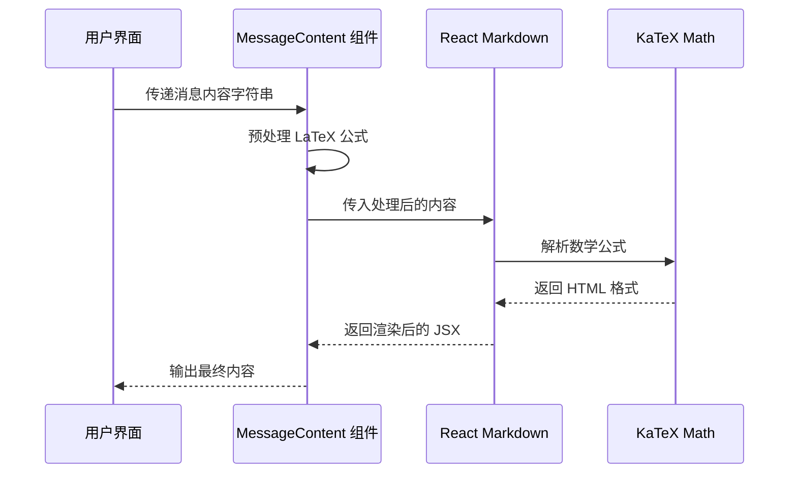
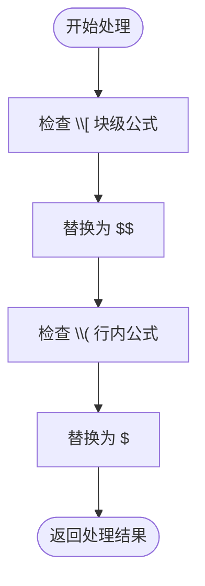
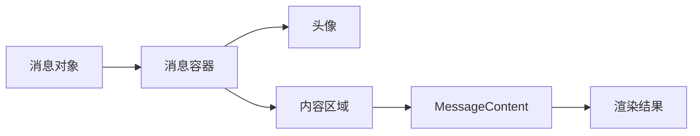
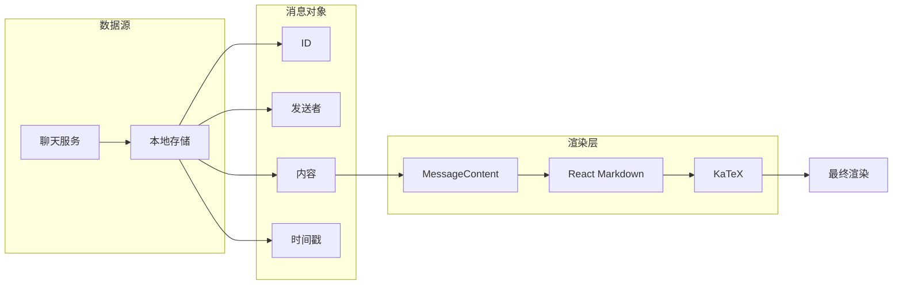
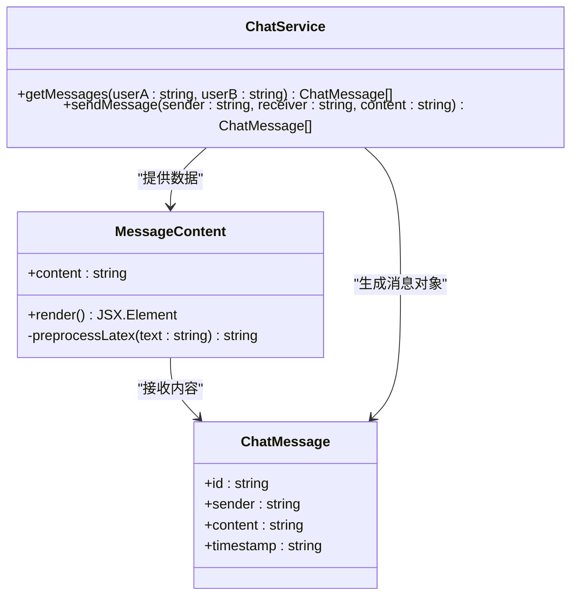

# MessageContent 消息内容组件

<cite>
**本文档引用的文件**
- [MessageContent.tsx](file://src/components/MessageContent.tsx)
- [Chat.tsx](file://src/pages/Chat.tsx)
- [Home.tsx](file://src/pages/Home.tsx)
- [WrongQuestions.tsx](file://src/pages/WrongQuestions.tsx)
- [chatService.ts](file://src/services/chatService.ts)
</cite>

## 目录
1. [简介](#简介)
2. [项目结构](#项目结构)
3. [核心组件](#核心组件)
4. [架构概览](#架构概览)
5. [详细组件分析](#详细组件分析)
6. [依赖关系分析](#依赖关系分析)
7. [性能考虑](#性能考虑)
8. [故障排除指南](#故障排除指南)
9. [结论](#结论)

## 简介

MessageContent 是一个专门用于渲染 AI 对话系统中消息内容的 React 组件。该组件的核心功能是将 Markdown 格式的文本内容转换为富文本格式，并支持 LaTeX 数学公式的渲染。它在 AI Studio 应用程序中扮演着关键角色，负责将从聊天服务获取的消息内容以美观、易读的方式呈现给用户。

该组件的设计理念是提供简洁、高效的文本渲染解决方案，同时保持对复杂内容格式的良好支持。通过集成 React Markdown 和 KaTeX 库，MessageContent 能够处理从简单文本到复杂数学公式的各种内容类型。

## 项目结构

MessageContent 组件位于项目的组件目录中，作为独立的功能模块存在。它与聊天页面和问答页面紧密集成，为整个应用的消息显示功能提供统一的渲染能力。



**图表来源**
- [MessageContent.tsx:1-31](file://src/components/MessageContent.tsx#L1-L31)
- [Chat.tsx:28-381](file://src/pages/Chat.tsx#L28-L381)
- [Home.tsx:4:358](file://src/pages/Home.tsx#L4-L358)

**章节来源**
- [MessageContent.tsx:1-31](file://src/components/MessageContent.tsx#L1-L31)
- [Chat.tsx:28-381](file://src/pages/Chat.tsx#L28-L381)

## 核心组件

### 组件接口定义

MessageContent 组件采用 TypeScript 接口定义其属性，目前只接受一个必需的 `content` 属性：

```typescript
interface MessageContentProps {
  content: string;
}
```

该设计遵循了单一职责原则，专注于内容渲染功能，避免了不必要的复杂性。

### 预处理机制

组件内置了 LaTeX 公式预处理功能，能够自动识别和转换不同格式的数学表达式：

- 支持块级公式：`\\[ ... \\]` → `$$ ... $$`
- 支持行内公式：`\\( ... \\)` → `$ ... $`

这种预处理确保了与多种 Markdown 解析器的兼容性。

### 渲染引擎配置

组件使用 React Markdown 作为核心渲染引擎，并配置了以下插件：

- **remark-math**: 支持 LaTeX 数学语法解析
- **rehype-katex**: 将 LaTeX 转换为 HTML 格式

**章节来源**
- [MessageContent.tsx:5-30](file://src/components/MessageContent.tsx#L5-L30)

## 架构概览

MessageContent 在整个应用架构中扮演着内容渲染层的角色，连接着数据层和服务层。



**图表来源**
- [MessageContent.tsx:19-29](file://src/components/MessageContent.tsx#L19-L29)

## 详细组件分析

### 组件实现细节

MessageContent 采用函数式组件模式，具有以下特点：

1. **纯函数特性**: 输入相同的内容总是产生相同的输出
2. **无状态设计**: 不维护内部状态，完全依赖 props
3. **高效渲染**: 使用 React 的虚拟 DOM 机制进行优化

### LaTeX 处理算法



**图表来源**
- [MessageContent.tsx:9-17](file://src/components/MessageContent.tsx#L9-L17)

### 内容渲染流程

组件的渲染过程可以分为三个主要阶段：

1. **预处理阶段**: LaTeX 公式标准化
2. **解析阶段**: Markdown 到 HTML 的转换
3. **渲染阶段**: HTML 到 React 组件的映射

**章节来源**
- [MessageContent.tsx:19-30](file://src/components/MessageContent.tsx#L19-L30)

### 页面集成模式

MessageContent 在多个页面中被集成使用：

#### 聊天页面集成

在聊天页面中，MessageContent 被嵌入到消息气泡容器中：



**图表来源**
- [Chat.tsx:244-278](file://src/pages/Chat.tsx#L244-L278)

#### 主页集成

在主页的问答展示中，MessageContent 同时处理文本和图片内容：

**章节来源**
- [Chat.tsx:244-278](file://src/pages/Chat.tsx#L244-L278)
- [Home.tsx:341-361](file://src/pages/Home.tsx#L341-L361)

### 数据流分析



**图表来源**
- [chatService.ts:34-71](file://src/services/chatService.ts#L34-L71)
- [MessageContent.tsx:19-29](file://src/components/MessageContent.tsx#L19-L29)

**章节来源**
- [chatService.ts:1-72](file://src/services/chatService.ts#L1-L72)

## 依赖关系分析

### 外部依赖

MessageContent 依赖于以下关键库：

| 依赖库 | 版本 | 用途 |
|--------|------|------|
| react-markdown | 最新版本 | Markdown 解析和渲染 |
| remark-math | 最新版本 | LaTeX 数学语法支持 |
| rehype-katex | 最新版本 | LaTeX 到 HTML 的转换 |

### 内部依赖

组件与聊天服务的集成关系：



**图表来源**
- [MessageContent.tsx:5-7](file://src/components/MessageContent.tsx#L5-L7)
- [chatService.ts:1-8](file://src/services/chatService.ts#L1-L8)

**章节来源**
- [MessageContent.tsx:1-3](file://src/components/MessageContent.tsx#L1-L3)
- [chatService.ts:1-72](file://src/services/chatService.ts#L1-L72)

## 性能考虑

### 渲染优化

1. **记忆化处理**: 对于重复内容，React 会自动缓存渲染结果
2. **懒加载**: 只在需要时才进行 LaTeX 公式渲染
3. **最小化重排**: 使用稳定的 key 值避免不必要的 DOM 更新

### 内存管理

- 组件无状态设计减少了内存占用
- 及时清理不需要的引用避免内存泄漏
- 合理的组件卸载时机

### 渲染性能建议

1. **内容分片**: 对长文本进行分片处理
2. **延迟渲染**: 对非首屏内容使用延迟渲染策略
3. **虚拟化**: 对大量消息列表使用虚拟化技术

## 故障排除指南

### 常见问题及解决方案

#### LaTeX 公式不显示

**问题**: 数学公式无法正确渲染
**原因**: LaTeX 语法不正确或缺少必要的插件
**解决方案**: 
- 确保使用标准的 LaTeX 语法
- 检查 remark-math 和 rehype-katex 插件是否正确安装
- 验证预处理函数是否正常工作

#### Markdown 格式异常

**问题**: Markdown 格式没有按预期显示
**原因**: 内容中包含不受支持的特殊字符
**解决方案**:
- 检查内容中的特殊字符编码
- 确保 Markdown 语法符合规范
- 验证 React Markdown 的配置

#### 性能问题

**问题**: 大量消息渲染缓慢
**原因**: 单次渲染内容过多
**解决方案**:
- 实现消息分页加载
- 使用虚拟滚动技术
- 优化组件的重新渲染频率

**章节来源**
- [MessageContent.tsx:9-17](file://src/components/MessageContent.tsx#L9-L17)

## 结论

MessageContent 组件是一个设计精良的消息内容渲染组件，它成功地解决了 AI 对话系统中的内容显示需求。通过简洁的 API 设计、强大的渲染能力和良好的性能表现，该组件为整个应用程序提供了可靠的内容展示基础。

组件的主要优势包括：

1. **简洁性**: API 设计简单直观，易于使用
2. **功能性**: 支持丰富的文本格式和数学公式
3. **可扩展性**: 易于添加新的渲染功能
4. **性能**: 高效的渲染机制和优化策略

未来可以考虑的功能增强包括：
- 更多的格式支持选项
- 自定义样式主题
- 更精细的性能控制
- 更好的错误处理机制