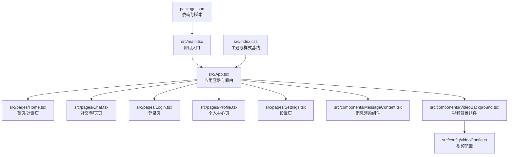
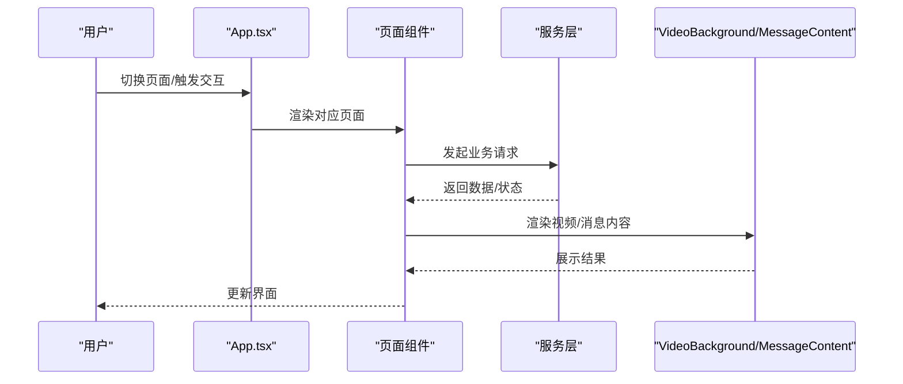
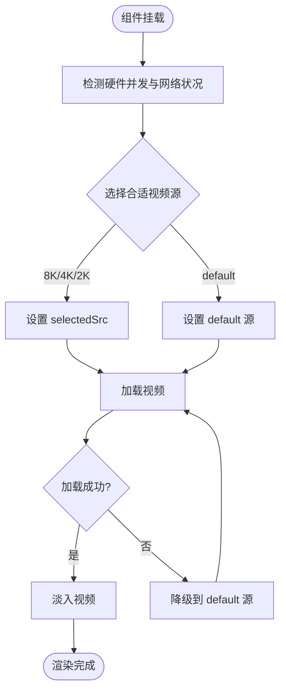
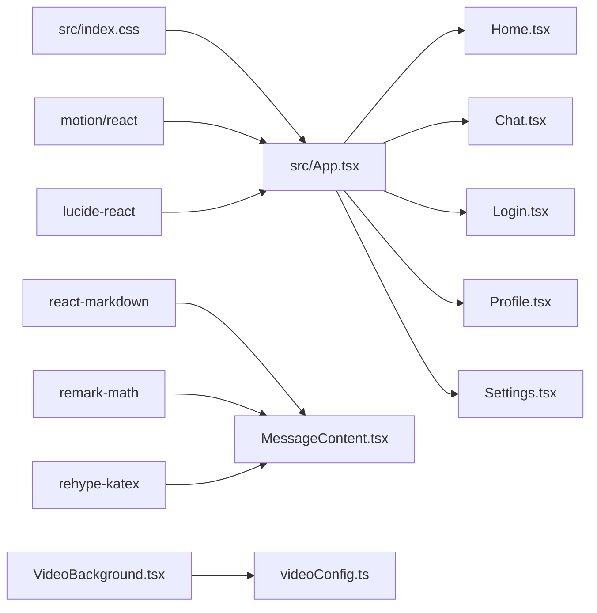

# UI 组件库

<cite>
**本文引用的文件**   
- [README.md](file://README.md)
- [package.json](file://package.json)
- [src/App.tsx](file://src/App.tsx)
- [src/main.tsx](file://src/main.tsx)
- [src/index.css](file://src/index.css)
- [src/components/MessageContent.tsx](file://src/components/MessageContent.tsx)
- [src/components/VideoBackground.tsx](file://src/components/VideoBackground.tsx)
- [src/pages/Home.tsx](file://src/pages/Home.tsx)
- [src/pages/Chat.tsx](file://src/pages/Chat.tsx)
- [src/pages/Login.tsx](file://src/pages/Login.tsx)
- [src/pages/Profile.tsx](file://src/pages/Profile.tsx)
- [src/pages/Settings.tsx](file://src/pages/Settings.tsx)
- [src/config/videoConfig.ts](file://src/config/videoConfig.ts)
</cite>

## 目录
1. [简介](#简介)
2. [项目结构](#项目结构)
3. [核心组件](#核心组件)
4. [架构总览](#架构总览)
5. [组件详解](#组件详解)
6. [依赖关系分析](#依赖关系分析)
7. [性能与体验](#性能与体验)
8. [故障排查](#故障排查)
9. [结论](#结论)
10. [附录](#附录)

## 简介
本文件为“智课通 AI Tutor”项目的 UI 组件库文档，聚焦可复用组件的设计理念、视觉外观、行为特征与交互模式，系统梳理各组件的属性参数、事件处理、插槽使用与自定义选项，并提供使用示例、代码片段路径与实时演示思路。同时覆盖响应式设计与无障碍合规要点、组件状态与动画过渡、样式自定义与主题支持，以及跨浏览器兼容与性能优化建议。

## 项目结构
项目采用基于页面的组织方式，核心入口位于 main.tsx，应用主体由 App.tsx 组织导航、侧边栏、顶部导航与主内容区域；页面组件位于 src/pages 下，通用 UI 组件位于 src/components。Tailwind CSS 提供基础样式与主题变量，配合 motion/react 实现流畅动画。

图表来源
- [src/main.tsx:1-11](file://src/main.tsx#L1-L11)
- [src/App.tsx:1-246](file://src/App.tsx#L1-L246)
- [src/index.css:1-34](file://src/index.css#L1-L34)
- [src/components/MessageContent.tsx:1-31](file://src/components/MessageContent.tsx#L1-L31)
- [src/components/VideoBackground.tsx:1-159](file://src/components/VideoBackground.tsx#L1-L159)
- [src/config/videoConfig.ts:1-47](file://src/config/videoConfig.ts#L1-L47)
- [package.json:1-42](file://package.json#L1-L42)

章节来源
- [src/main.tsx:1-11](file://src/main.tsx#L1-L11)
- [src/App.tsx:1-246](file://src/App.tsx#L1-L246)
- [src/index.css:1-34](file://src/index.css#L1-L34)
- [package.json:1-42](file://package.json#L1-L42)

## 核心组件
- 视频背景组件 VideoBackground：根据设备性能与网络状况自动选择视频源，支持占位图、遮罩层与错误降级。
- 消息内容组件 MessageContent：支持 LaTeX 数学公式渲染，适配 Markdown 内容展示。
- 页面级通用 UI：包括侧边栏项 SidebarItem、导航按钮 NavBtn、历史记录项 HistoryItem 等，统一风格与交互。

章节来源
- [src/components/VideoBackground.tsx:1-159](file://src/components/VideoBackground.tsx#L1-L159)
- [src/components/MessageContent.tsx:1-31](file://src/components/MessageContent.tsx#L1-L31)
- [src/App.tsx:213-245](file://src/App.tsx#L213-L245)

## 架构总览
应用通过 App.tsx 统一管理页面切换与全局状态，使用 AnimatePresence 与 motion/react 实现页面级过渡动画；页面内部通过服务层调用（如聊天、好友、设置）实现数据驱动的 UI 更新。

图表来源
- [src/App.tsx:189-206](file://src/App.tsx#L189-L206)
- [src/pages/Home.tsx:139-223](file://src/pages/Home.tsx#L139-L223)
- [src/pages/Chat.tsx:62-74](file://src/pages/Chat.tsx#L62-L74)
- [src/components/VideoBackground.tsx:42-84](file://src/components/VideoBackground.tsx#L42-L84)
- [src/components/MessageContent.tsx:19-30](file://src/components/MessageContent.tsx#L19-L30)

## 组件详解

### VideoBackground 组件
- 设计理念
  - 自适应视频源：依据硬件并发数与网络连接类型（navigator.connection）自动选择 8K/4K/2K/default，兼顾性能与体验。
  - 渐进式加载：支持占位图与加载提示，视频加载成功后淡入，失败时自动降级到 default。
  - 可视化增强：内置遮罩层与亮度调整，确保前景内容清晰可读。
- 视觉外观
  - 全屏覆盖，视频元素居中裁剪，遮罩层透明度可调。
  - 加载态提供渐变背景与文本提示，占位图可选。
- 行为特征
  - 支持 autoPlay/muted/loop/playInline；错误回调触发降级策略。
  - 通过 ref 获取 video 引用，便于外部控制。
- 用户交互
  - 点击登录页触发扩展动画时，可叠加轻微遮罩以提升焦点。
- 属性参数
  - videoSrc: { src8k?, src4k?, src2k?, default: string }
  - autoPlay?: boolean
  - muted?: boolean
  - loop?: boolean
  - placeholder?: string
  - overlayOpacity?: number
- 事件处理
  - onLoadedData: 视频数据加载完成回调
  - onError: 视频加载失败回调（触发降级）
- 插槽使用
  - 支持在组件内嵌套任意内容（如登录页品牌文案、按钮等）。
- 自定义选项
  - 通过 videoConfig.ts 配置不同页面的视频源与遮罩层透明度。
- 使用示例
  - 登录页使用：[src/pages/Login.tsx:14-26](file://src/pages/Login.tsx#L14-L26)
  - 代码片段路径：[src/components/VideoBackground.tsx:27-41](file://src/components/VideoBackground.tsx#L27-L41)
- 动画与过渡
  - 视频淡入淡出（opacity 过渡），加载态与占位图切换。
- 响应式设计
  - 全屏覆盖，适配任意屏幕尺寸；占位图与加载提示在移动端同样有效。
- 无障碍合规
  - 视频默认静音，避免自动播放影响听障用户；提供占位图与文本提示，保证非视频场景可用性。
- 性能优化
  - 自动选择合适分辨率，减少高分辨率视频在低端设备上的卡顿；错误降级避免阻塞主流程。

图表来源
- [src/components/VideoBackground.tsx:56-84](file://src/components/VideoBackground.tsx#L56-L84)
- [src/components/VideoBackground.tsx:87-103](file://src/components/VideoBackground.tsx#L87-L103)

章节来源
- [src/components/VideoBackground.tsx:1-159](file://src/components/VideoBackground.tsx#L1-L159)
- [src/pages/Login.tsx:14-26](file://src/pages/Login.tsx#L14-L26)
- [src/config/videoConfig.ts:1-47](file://src/config/videoConfig.ts#L1-L47)

### MessageContent 组件
- 设计理念
  - 将 Markdown 与 LaTeX 数学公式渲染统一到一个组件中，简化消息内容展示。
- 视觉外观
  - 保持 Markdown 的段落、列表、代码块、引用等语义化样式，适配浅色/深色主题。
- 行为特征
  - 预处理 LaTeX 语法（行内/块级），确保渲染一致性。
- 用户交互
  - 作为纯展示组件，不直接处理用户输入。
- 属性参数
  - content: string（支持 Markdown 与 LaTeX）
- 事件处理
  - 无显式事件；通过父组件传入内容更新。
- 插槽使用
  - 无插槽；通过 props 传入内容。
- 自定义选项
  - 可通过 Tailwind 类名与主题变量调整渲染样式。
- 使用示例
  - 首页对话消息渲染：[src/pages/Home.tsx:358-360](file://src/pages/Home.tsx#L358-L360)
  - 代码片段路径：[src/components/MessageContent.tsx:19-30](file://src/components/MessageContent.tsx#L19-L30)
- 动画与过渡
  - 由父组件负责消息列表的入场/出场动画（如使用 motion）。
- 响应式设计
  - 图片最大宽度与高度限制，保证在窄屏下可滚动查看。
- 无障碍合规
  - 渲染后的 DOM 语义良好，适合屏幕阅读器解析。
- 性能优化
  - 预处理 LaTeX 减少重复正则替换开销；合理拆分长消息以降低重排成本。

章节来源
- [src/components/MessageContent.tsx:1-31](file://src/components/MessageContent.tsx#L1-L31)
- [src/pages/Home.tsx:358-360](file://src/pages/Home.tsx#L358-L360)

### SidebarItem 与 NavBtn（页面级通用 UI）
- 设计理念
  - 统一的导航与侧边栏交互风格，强调状态高亮与悬停反馈。
- 视觉外观
  - 按 active 状态切换渐变背景与文字颜色；图标与副标题按状态调整透明度。
- 行为特征
  - 点击触发 onClick 回调；支持 subtitle 描述信息。
- 用户交互
  - 悬停缩放、点击反馈；active 状态提供阴影与渐变强调。
- 属性参数
  - SidebarItem: icon, label, active?, onClick?, subtitle?
  - NavBtn: children, active?, onClick?
- 事件处理
  - onClick: 外部传入的导航回调。
- 插槽使用
  - SidebarItem 的 children 为图标节点；NavBtn 的 children 为按钮文本。
- 自定义选项
  - 通过 Tailwind 类名组合实现不同尺寸与状态的变体。
- 使用示例
  - App.tsx 中的侧边栏与顶部导航：[src/App.tsx:76-134](file://src/App.tsx#L76-L134), [src/App.tsx:144-149](file://src/App.tsx#L144-L149)
  - 代码片段路径：[src/App.tsx:213-245](file://src/App.tsx#L213-L245)
- 动画与过渡
  - 按钮缩放与透明度过渡，active 状态带阴影强调。
- 响应式设计
  - 移动端隐藏部分导航项，保留核心功能入口。
- 无障碍合规
  - 使用 button 元素，具备可访问名称（label/subtitle）。
- 性能优化
  - 仅在状态变化时重渲染；避免在 render 中创建新对象。

章节来源
- [src/App.tsx:213-245](file://src/App.tsx#L213-L245)

### HistoryItem（对话历史项）
- 设计理念
  - 历史项卡片化展示，支持悬停删除按钮与选中态高亮。
- 视觉外观
  - active 状态带边框强调；删除按钮仅在悬停时可见。
- 行为特征
  - 点击选中；点击删除触发 onDelete 回调。
- 用户交互
  - 点击事件冒泡控制：删除按钮阻止冒泡，避免误触选中。
- 属性参数
  - title, time, agent, active?, onClick?, onDelete?
- 事件处理
  - onClick: 选中历史项；onDelete: 删除历史项。
- 插槽使用
  - 无插槽；通过 props 传入标题、时间、导师等信息。
- 自定义选项
  - 通过 Tailwind 类名控制卡片圆角、阴影与边框。
- 使用示例
  - 首页对话历史列表：[src/pages/Home.tsx:506-517](file://src/pages/Home.tsx#L506-L517)
  - 代码片段路径：[src/pages/Home.tsx:529-553](file://src/pages/Home.tsx#L529-L553)

章节来源
- [src/pages/Home.tsx:529-553](file://src/pages/Home.tsx#L529-L553)

### 登录页 Login
- 设计理念
  - 两阶段展开：初始触发态与表单态，配合视频背景与模糊遮罩营造沉浸感。
- 视觉外观
  - 视频背景叠加半透明遮罩；展开后表单卡片化，支持深色/浅色对比。
- 行为特征
  - 点击触发展开；表单提交后回调 onLogin；底部链接跳转帮助中心。
- 用户交互
  - Tab 切换、输入框聚焦、复选框与按钮交互。
- 属性参数
  - onLogin: 登录回调；onNavigate?: 导航回调。
- 事件处理
  - 表单提交、Tab 切换、记住登录状态、其他登录方式。
- 插槽使用
  - 无插槽；通过 props 传入回调。
- 自定义选项
  - 通过 videoConfig.ts 配置不同分辨率视频与遮罩层透明度。
- 使用示例
  - 登录页主流程：[src/pages/Login.tsx:10-174](file://src/pages/Login.tsx#L10-L174)
  - 代码片段路径：[src/pages/Login.tsx:14-26](file://src/pages/Login.tsx#L14-L26)

章节来源
- [src/pages/Login.tsx:1-175](file://src/pages/Login.tsx#L1-L175)
- [src/config/videoConfig.ts:1-47](file://src/config/videoConfig.ts#L1-L47)

### 首页 Home（多模态对话）
- 设计理念
  - 支持文本与图片混合输入，集成多代理（数学、Python、深度学习、矩阵）。
- 视觉外观
  - 对话气泡区分用户与助手；图片预览与删除按钮；加载态指示器。
- 行为特征
  - 本地存储会话历史；支持新建对话、清空当前会话、保存到错题本。
- 用户交互
  - 输入框回车发送、图片上传、保存/忽略错题操作。
- 属性参数
  - onNavigate?: 导航回调；activeAgent?: 代理键。
- 事件处理
  - 发送消息、选择图片、保存错题、清空会话。
- 插槽使用
  - 无插槽；通过 props 传入回调与代理信息。
- 自定义选项
  - 通过代理配置对象切换头像、占位提示与代理名称。
- 使用示例
  - 首页主流程与消息渲染：[src/pages/Home.tsx:139-223](file://src/pages/Home.tsx#L139-L223), [src/pages/Home.tsx:335-424](file://src/pages/Home.tsx#L335-L424)
  - 代码片段路径：[src/pages/Home.tsx:79-80](file://src/pages/Home.tsx#L79-L80)

章节来源
- [src/pages/Home.tsx:1-554](file://src/pages/Home.tsx#L1-L554)

### 聊天页 Chat（好友与消息）
- 设计理念
  - 左侧好友面板与右侧消息面板，支持好友请求、消息发送与删除好友。
- 视觉外观
  - 好友列表卡片化；消息气泡区分发送方；输入区圆角与阴影。
- 行为特征
  - 选择好友加载历史消息；发送消息后滚动到底部。
- 用户交互
  - 选择好友、发送消息、接受/拒绝好友请求、删除好友。
- 属性参数
  - onNavigate?: 导航回调。
- 事件处理
  - 选择好友、发送消息、处理好友请求、删除好友。
- 插槽使用
  - 无插槽；通过 props 传入回调。
- 自定义选项
  - 通过服务层数据结构扩展好友与消息模型。
- 使用示例
  - 聊天页主流程：[src/pages/Chat.tsx:28-380](file://src/pages/Chat.tsx#L28-L380)

章节来源
- [src/pages/Chat.tsx:1-381](file://src/pages/Chat.tsx#L1-L381)

### 个人中心 Profile
- 设计理念
  - 个人信息卡片、统计卡片网格、最近动态时间轴、成就徽章与目标进度。
- 视觉外观
  - 封面渐变背景与编辑按钮；头像徽章；统计卡片悬浮提升；目标进度条动画。
- 行为特征
  - 点击编辑资料跳转设置；进度条使用 motion 动画。
- 用户交互
  - 编辑资料、查看全部动态、切换导师卡片。
- 属性参数
  - onNavigate?: 导航回调。
- 事件处理
  - 导航到设置页。
- 插槽使用
  - 无插槽；通过 props 传入回调。
- 自定义选项
  - 通过统计卡片、活动项、导师卡片等子组件组合实现。
- 使用示例
  - 个人中心主流程：[src/pages/Profile.tsx:19-297](file://src/pages/Profile.tsx#L19-L297)

章节来源
- [src/pages/Profile.tsx:1-297](file://src/pages/Profile.tsx#L1-L297)

### 设置页 Settings
- 设计理念
  - 分区化的设置面板：个人资料、学习设置、通用设置、账户安全。
- 视觉外观
  - 卡片化布局，开关按钮、滑块、时间选择器等控件统一风格。
- 行为特征
  - 修改设置后保存，支持取消恢复默认；头像上传限制与错误回退。
- 用户交互
  - 切换深色模式、字体大小、推送开关、首选导师、每日复习时间。
- 属性参数
  - onNavigate?: 导航回调。
- 事件处理
  - 保存设置、取消修改、头像上传。
- 插槽使用
  - 无插槽；通过 props 传入回调。
- 自定义选项
  - 通过服务层持久化用户设置。
- 使用示例
  - 设置页主流程：[src/pages/Settings.tsx:32-368](file://src/pages/Settings.tsx#L32-L368)

章节来源
- [src/pages/Settings.tsx:1-369](file://src/pages/Settings.tsx#L1-L369)

## 依赖关系分析
- 样式与主题
  - index.css 定义主题变量与基础样式，Tailwind 作为原子化工具。
- 动画与过渡
  - motion/react 提供页面级与组件级动画，如登录页展开、进度条动画。
- 图标与数学渲染
  - lucide-react 提供图标；react-markdown + remark-math + rehype-katex 支持 Markdown 与 LaTeX。
- 页面与组件
  - App.tsx 作为容器，聚合页面与通用 UI；VideoBackground/MessageContent 作为通用组件被页面复用。

图表来源
- [src/index.css:1-34](file://src/index.css#L1-L34)
- [src/App.tsx:19-18](file://src/App.tsx#L19-L18)
- [src/components/MessageContent.tsx:1-3](file://src/components/MessageContent.tsx#L1-L3)
- [src/components/VideoBackground.tsx:1-159](file://src/components/VideoBackground.tsx#L1-L159)
- [src/config/videoConfig.ts:1-47](file://src/config/videoConfig.ts#L1-L47)

章节来源
- [src/index.css:1-34](file://src/index.css#L1-L34)
- [package.json:13-28](file://package.json#L13-L28)

## 性能与体验
- 性能优化
  - VideoBackground 自动选择合适分辨率，避免高分辨率视频在低端设备卡顿；错误降级保障稳定性。
  - 首页消息列表使用局部状态与本地存储，减少重复渲染与网络请求。
  - 设置页滑块与开关使用受控组件，避免不必要的重渲染。
- 动画与过渡
  - 页面切换使用 AnimatePresence + motion，对话气泡与按钮交互提供平滑过渡。
- 响应式设计
  - 采用 Tailwind 断点与相对单位，移动端与桌面端均提供良好体验。
- 无障碍合规
  - 使用语义化标签与可访问名称；视频默认静音；提供占位图与文本提示。
- 跨浏览器兼容
  - 使用标准 HTML5 video 与 CSS 属性；在旧版浏览器中提供降级提示与占位图。

## 故障排查
- 视频背景无法播放
  - 检查 videoSrc 是否正确配置；确认网络连通性；查看浏览器控制台错误信息。
  - 代码片段路径：[src/components/VideoBackground.tsx:94-103](file://src/components/VideoBackground.tsx#L94-L103)
- LaTeX 渲染异常
  - 确认 content 中的 LaTeX 语法格式；检查 remark-math 与 rehype-katex 插件是否正确引入。
  - 代码片段路径：[src/components/MessageContent.tsx:24-25](file://src/components/MessageContent.tsx#L24-L25)
- 页面切换动画不生效
  - 确认 AnimatePresence 与 key 的唯一性；检查 motion 版本与导入路径。
  - 代码片段路径：[src/App.tsx:189-206](file://src/App.tsx#L189-L206)
- 设置保存失败
  - 检查服务层 saveSettings 实现；确认本地存储权限与容量。
  - 代码片段路径：[src/pages/Settings.tsx:64-68](file://src/pages/Settings.tsx#L64-L68)

章节来源
- [src/components/VideoBackground.tsx:94-103](file://src/components/VideoBackground.tsx#L94-L103)
- [src/components/MessageContent.tsx:24-25](file://src/components/MessageContent.tsx#L24-L25)
- [src/App.tsx:189-206](file://src/App.tsx#L189-L206)
- [src/pages/Settings.tsx:64-68](file://src/pages/Settings.tsx#L64-L68)

## 结论
本 UI 组件库围绕“可复用、一致、可定制”的原则构建，通过 VideoBackground 与 MessageContent 等通用组件支撑多页面场景，结合 Tailwind 主题与 motion 动画实现良好的视觉与交互体验。建议后续进一步抽象更多通用 UI 组件（如弹窗、分页、筛选器等），并完善单元测试与可访问性测试，持续优化性能与跨平台兼容性。

## 附录
- 快速开始
  - 安装依赖与运行：参考 [README.md:16-20](file://README.md#L16-L20)
  - 本地开发命令：[package.json:7](file://package.json#L7)
- 主题与样式
  - 主题变量定义：[src/index.css:4-17](file://src/index.css#L4-L17)
  - 渐变与毛玻璃类：[src/index.css:25-33](file://src/index.css#L25-L33)
- 组件清单与使用示例
  - VideoBackground：[src/pages/Login.tsx:14-26](file://src/pages/Login.tsx#L14-L26)
  - MessageContent：[src/pages/Home.tsx:358-360](file://src/pages/Home.tsx#L358-L360)
  - SidebarItem/NavBtn：[src/App.tsx:76-134](file://src/App.tsx#L76-L134), [src/App.tsx:144-149](file://src/App.tsx#L144-L149)
  - HistoryItem：[src/pages/Home.tsx:529-553](file://src/pages/Home.tsx#L529-L553)