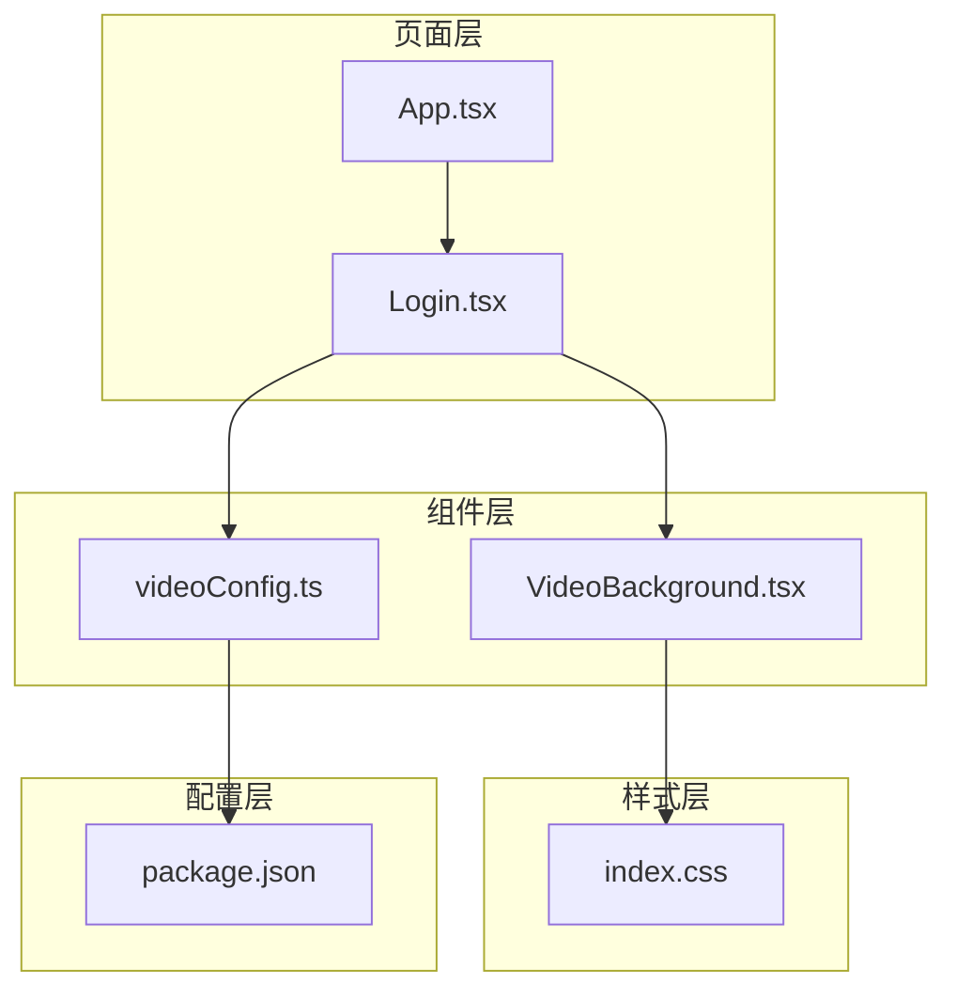
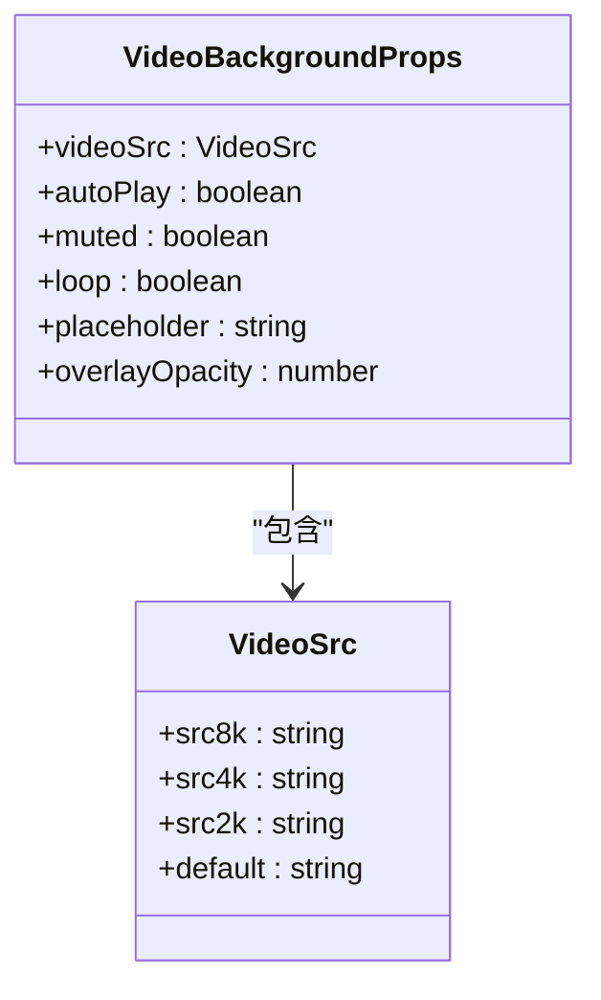
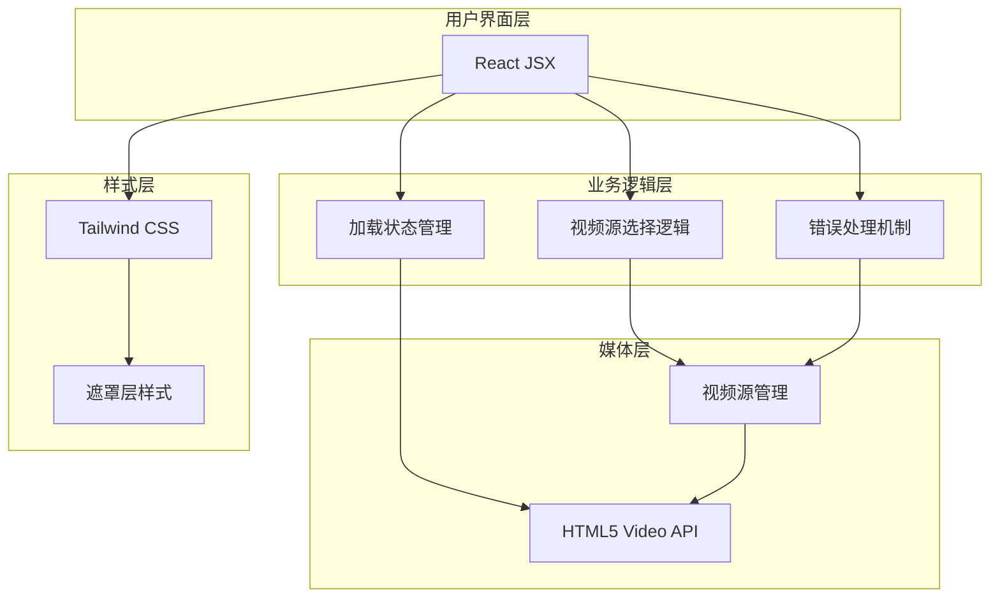
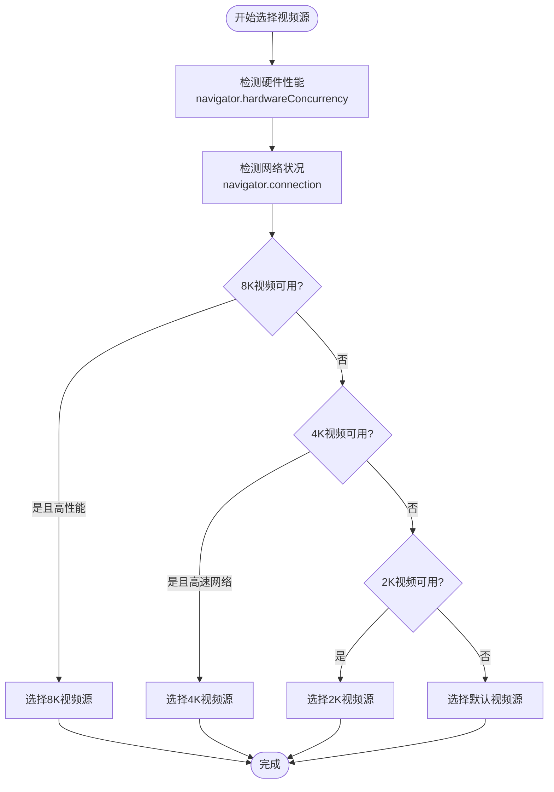
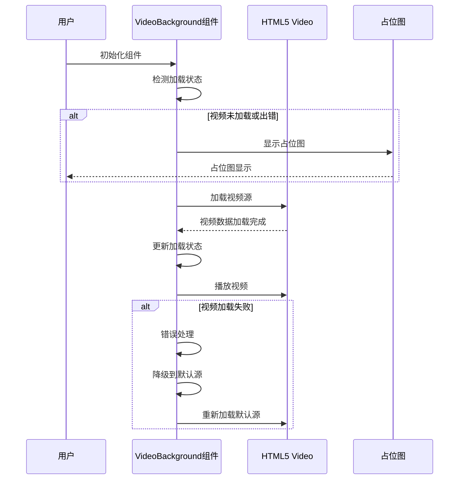
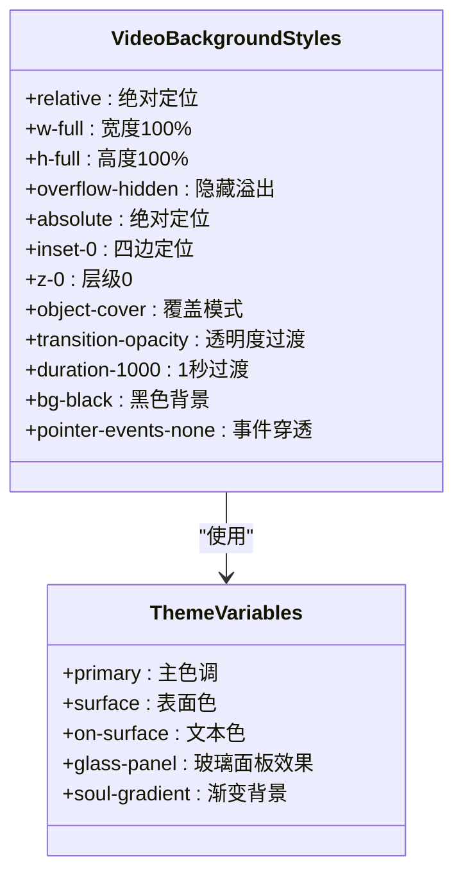
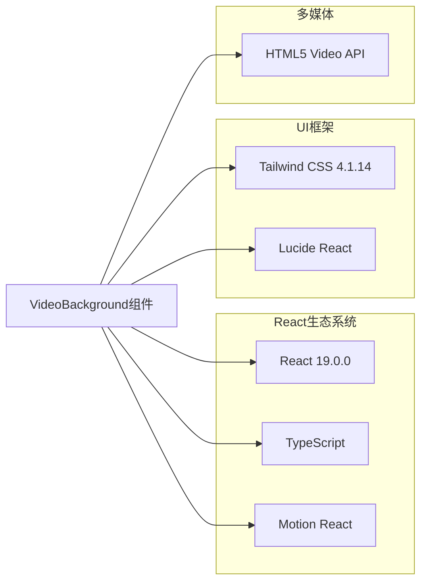
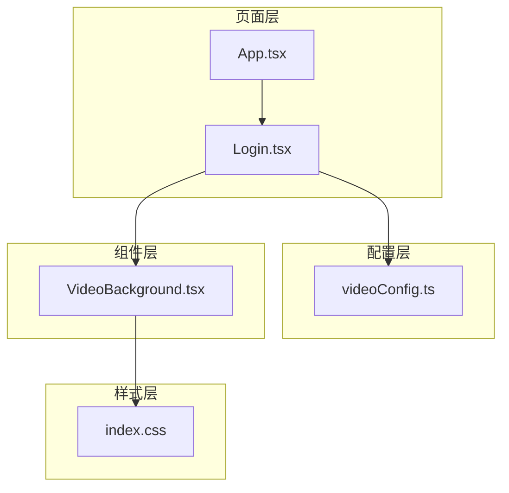

# VideoBackground 视频背景组件

<cite>
**本文档引用的文件**
- [VideoBackground.tsx](file://src/components/VideoBackground.tsx)
- [videoConfig.ts](file://src/config/videoConfig.ts)
- [VIDEO_BACKGROUND_GUIDE.md](file://VIDEO_BACKGROUND_GUIDE.md)
- [Login.tsx](file://src/pages/Login.tsx)
- [App.tsx](file://src/App.tsx)
- [index.css](file://src/index.css)
- [package.json](file://package.json)
</cite>

## 目录
1. [简介](#简介)
2. [项目结构](#项目结构)
3. [核心组件](#核心组件)
4. [架构概览](#架构概览)
5. [详细组件分析](#详细组件分析)
6. [依赖关系分析](#依赖关系分析)
7. [性能考虑](#性能考虑)
8. [故障排除指南](#故障排除指南)
9. [结论](#结论)
10. [附录](#附录)

## 简介

VideoBackground 是一个专为现代 Web 应用设计的视频背景组件，采用 React 和 TypeScript 构建。该组件提供了智能的视频源选择机制，能够根据设备性能和网络状况自动选择最适合的视频分辨率，同时具备优雅的降级策略和丰富的配置选项。

该组件的核心特性包括：
- 智能视频源选择（8K/4K/2K/默认）
- 自动播放控制和静音策略
- 响应式适配和性能优化
- 遮罩层透明度控制
- 加载状态管理和错误处理
- 占位图支持和渐进式加载体验

## 项目结构

VideoBackground 组件在项目中的组织结构如下：



**图表来源**
- [VideoBackground.tsx:1-159](file://src/components/VideoBackground.tsx#L1-L159)
- [videoConfig.ts:1-47](file://src/config/videoConfig.ts#L1-L47)
- [Login.tsx:1-175](file://src/pages/Login.tsx#L1-L175)

**章节来源**
- [VideoBackground.tsx:1-159](file://src/components/VideoBackground.tsx#L1-L159)
- [videoConfig.ts:1-47](file://src/config/videoConfig.ts#L1-L47)
- [Login.tsx:1-175](file://src/pages/Login.tsx#L1-L175)

## 核心组件

VideoBackground 组件是一个高度模块化的 React 组件，具有以下核心功能：

### 主要配置接口

组件通过 VideoBackgroundProps 接口定义了完整的配置选项：



**图表来源**
- [VideoBackground.tsx:3-25](file://src/components/VideoBackground.tsx#L3-L25)

### 关键配置参数

| 参数名 | 类型 | 默认值 | 描述 |
|--------|------|--------|------|
| videoSrc | VideoSrc | 必填 | 视频源配置对象 |
| autoPlay | boolean | true | 是否自动播放 |
| muted | boolean | true | 是否静音播放 |
| loop | boolean | true | 是否循环播放 |
| placeholder | string | undefined | 占位图地址 |
| overlayOpacity | number | 0.3 | 遮罩层透明度 |

**章节来源**
- [VideoBackground.tsx:3-25](file://src/components/VideoBackground.tsx#L3-L25)

## 架构概览

VideoBackground 组件采用了分层架构设计，确保了良好的可维护性和扩展性：



**图表来源**
- [VideoBackground.tsx:55-84](file://src/components/VideoBackground.tsx#L55-L84)
- [VideoBackground.tsx:86-103](file://src/components/VideoBackground.tsx#L86-L103)

## 详细组件分析

### 视频源智能选择算法

组件实现了基于设备性能和网络状况的智能视频源选择机制：



**图表来源**
- [VideoBackground.tsx:55-84](file://src/components/VideoBackground.tsx#L55-L84)

### 加载状态管理流程

组件提供了完整的加载状态管理，包括占位图显示和错误处理：



**图表来源**
- [VideoBackground.tsx:86-103](file://src/components/VideoBackground.tsx#L86-L103)

### 样式系统集成

组件与 Tailwind CSS 样式系统深度集成，提供了灵活的主题适配能力：



**图表来源**
- [VideoBackground.tsx:105-155](file://src/components/VideoBackground.tsx#L105-L155)
- [index.css:4-34](file://src/index.css#L4-L34)

**章节来源**
- [VideoBackground.tsx:105-155](file://src/components/VideoBackground.tsx#L105-L155)
- [index.css:4-34](file://src/index.css#L4-L34)

## 依赖关系分析

### 外部依赖

VideoBackground 组件依赖于以下关键外部库：



**图表来源**
- [package.json:13-28](file://package.json#L13-L28)

### 内部依赖关系

组件之间的依赖关系体现了清晰的分层架构：



**图表来源**
- [Login.tsx:4-5](file://src/pages/Login.tsx#L4-L5)
- [videoConfig.ts:1-47](file://src/config/videoConfig.ts#L1-L47)

**章节来源**
- [package.json:13-28](file://package.json#L13-L28)
- [Login.tsx:4-5](file://src/pages/Login.tsx#L4-L5)

## 性能考虑

### 智能降级策略

组件实现了多层次的性能优化策略：

1. **硬件性能检测**：通过 `navigator.hardwareConcurrency` 检测 CPU 核心数
2. **网络状况评估**：使用 `navigator.connection.effectiveType` 判断网络类型
3. **按需加载**：只加载当前最优分辨率的视频源
4. **自动降级**：加载失败时自动回退到更低分辨率

### 内存和带宽优化

- **视频预加载**：利用浏览器原生预加载机制
- **占位图缓存**：减少首屏渲染时间
- **渐进式加载**：平滑的透明度过渡动画
- **事件监听优化**：避免不必要的重渲染

### 移动端适配

组件针对移动端进行了专门优化：
- **触摸友好的交互**：支持点击展开/收起
- **响应式布局**：自适应不同屏幕尺寸
- **性能优先**：移动端自动选择较低分辨率
- **电池友好**：合理的播放策略减少电量消耗

## 故障排除指南

### 常见问题及解决方案

#### 视频无法播放

**问题症状**：视频加载失败，控制台出现错误信息

**可能原因**：
1. 视频格式不支持（需要 MP4 格式）
2. 浏览器不支持 HTML5 Video 标签
3. CORS 跨域限制（在线视频）
4. 视频文件路径错误

**解决方案**：
1. 确保视频格式为 MP4
2. 检查浏览器兼容性
3. 配置正确的 CORS 头部
4. 验证视频文件可访问性

#### 视频加载缓慢

**优化建议**：
1. **压缩视频文件**：参考格式建议章节
2. **使用 CDN**：提高视频加载速度
3. **提供占位图**：改善用户体验
4. **降低默认分辨率**：减少初始加载压力

#### 移动端性能问题

**移动端优化策略**：
1. 为移动设备提供 2K 或更低分辨率视频
2. 优化视频压缩参数
3. 使用占位图提升首屏体验
4. 考虑使用 WebRTC 或其他流媒体技术

### 调试技巧

1. **查看控制台日志**：组件会在关键节点输出调试信息
2. **检查网络请求**：确认视频文件加载状态
3. **验证配置文件**：确保 videoConfig.ts 配置正确
4. **测试不同设备**：在多种设备上验证组件表现

**章节来源**
- [VIDEO_BACKGROUND_GUIDE.md:123-147](file://VIDEO_BACKGROUND_GUIDE.md#L123-L147)

## 结论

VideoBackground 组件是一个功能完整、性能优化的视频背景解决方案。它通过智能的视频源选择机制、完善的错误处理策略和灵活的配置选项，为现代 Web 应用提供了优秀的视频背景体验。

组件的主要优势包括：
- **智能化的性能优化**：自动根据设备和网络状况选择最佳视频源
- **优雅的降级策略**：确保在各种条件下都能提供良好的用户体验
- **灵活的配置选项**：满足不同场景下的需求
- **深度的样式集成**：与 Tailwind CSS 和项目主题完美融合
- **完善的错误处理**：提供可靠的运行保障

对于开发者而言，VideoBackground 组件不仅是一个功能强大的工具，更是现代前端开发最佳实践的体现。它展示了如何在保证用户体验的同时，最大化地优化性能和资源使用。

## 附录

### 配置文件说明

videoConfig.ts 提供了统一的视频配置管理：

```typescript
export const videoBackgroundConfig = {
  login: {
    src8k: './public/videos/4月13日.mp4', 
    src4k: './public/videos/4月13日.mp4', 
    src2k: './public/videos/4月13日.mp4', 
    default: './public/videos/4月13日.mp4', 
    placeholder: '',
    overlayOpacity: 0.3,
  },
};
```

### 使用示例

基本使用方法：

```tsx
<VideoBackground
  videoSrc={{
    src8k: 'path/to/8k-video.mp4',
    src4k: 'path/to/4k-video.mp4',
    src2k: 'path/to/2k-video.mp4',
    default: 'path/to/default-video.mp4',
  }}
  overlayOpacity={0.3}
>
  {children}
</VideoBackground>
```

### 最佳实践

1. **视频格式选择**：优先使用 MP4 格式，支持 H.264 或 H.265 编码
2. **文件大小控制**：遵循建议的文件大小限制
3. **占位图设计**：提供高质量的占位图提升用户体验
4. **性能监控**：定期检查视频加载性能和用户反馈
5. **跨设备测试**：在不同设备和浏览器上充分测试