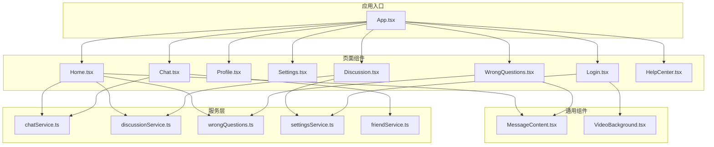
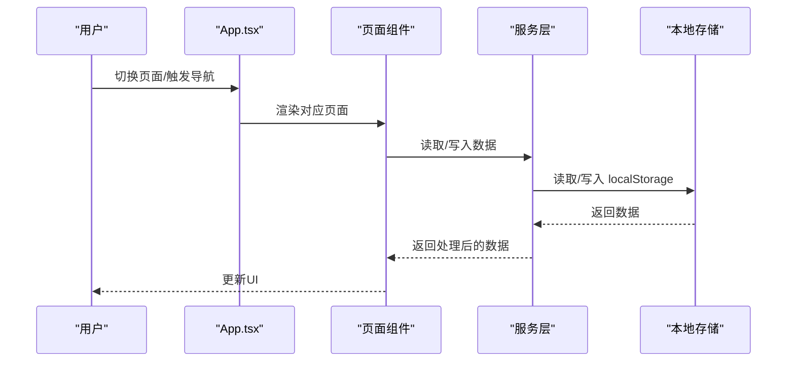
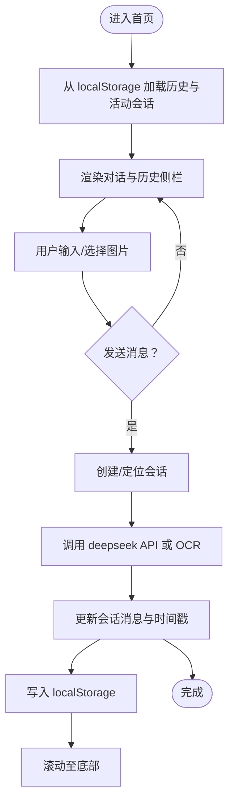
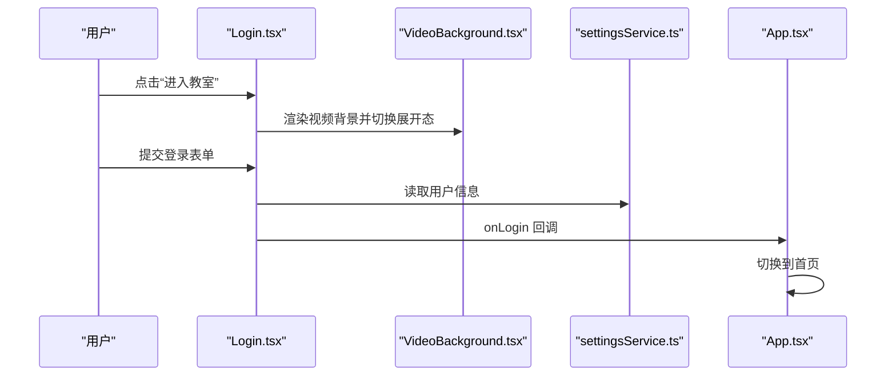
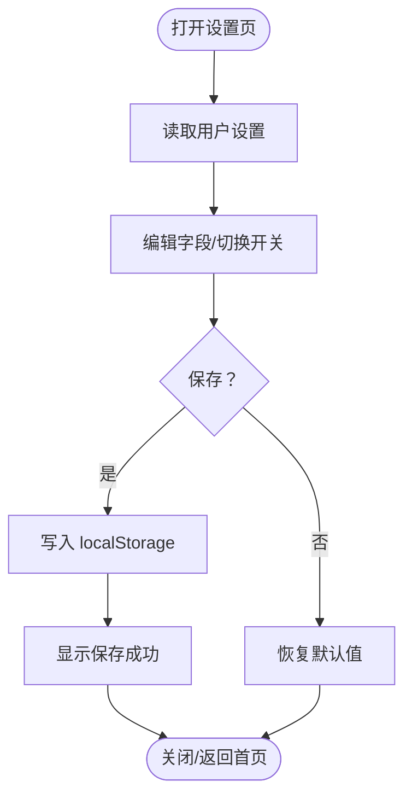
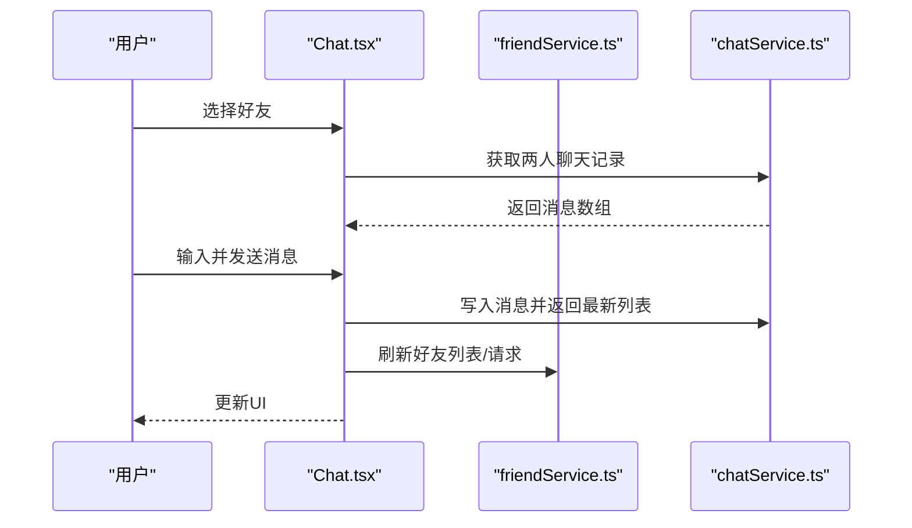
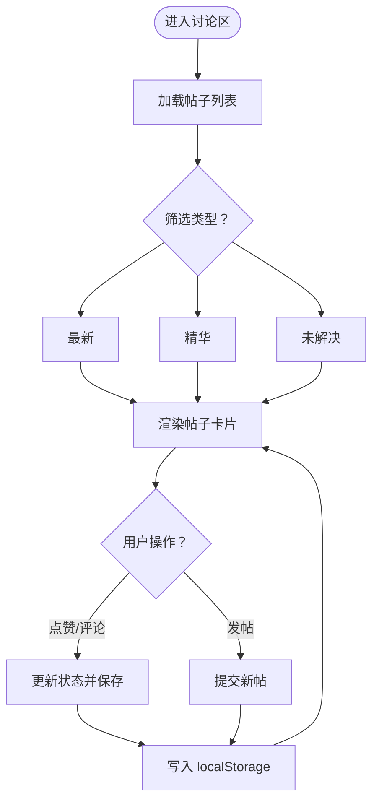
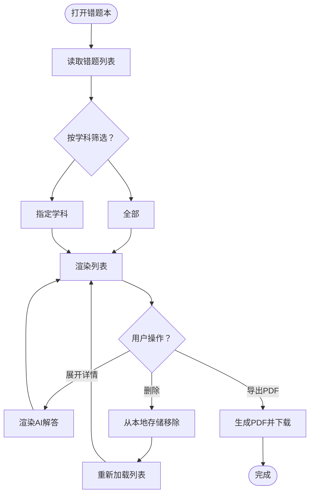
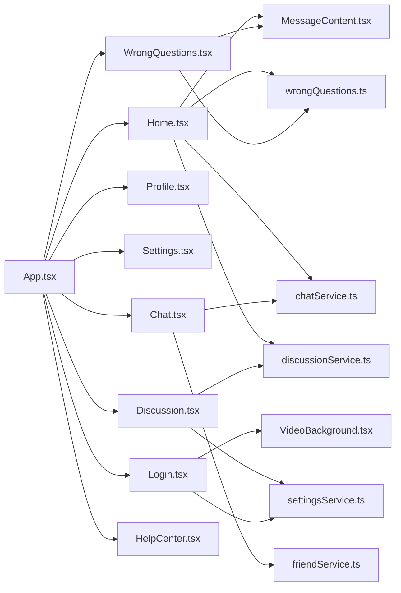

# 页面级组件

<cite>
**本文引用的文件**
- [App.tsx](file://src/App.tsx)
- [Home.tsx](file://src/pages/Home.tsx)
- [Login.tsx](file://src/pages/Login.tsx)
- [Profile.tsx](file://src/pages/Profile.tsx)
- [Settings.tsx](file://src/pages/Settings.tsx)
- [Chat.tsx](file://src/pages/Chat.tsx)
- [Discussion.tsx](file://src/pages/Discussion.tsx)
- [WrongQuestions.tsx](file://src/pages/WrongQuestions.tsx)
- [HelpCenter.tsx](file://src/pages/HelpCenter.tsx)
- [MessageContent.tsx](file://src/components/MessageContent.tsx)
- [VideoBackground.tsx](file://src/components/VideoBackground.tsx)
- [chatService.ts](file://src/services/chatService.ts)
- [discussionService.ts](file://src/services/discussionService.ts)
- [wrongQuestions.ts](file://src/services/wrongQuestions.ts)
- [settingsService.ts](file://src/services/settingsService.ts)
- [friendService.ts](file://src/services/friendService.ts)
</cite>

## 目录
1. [简介](#简介)
2. [项目结构](#项目结构)
3. [核心组件](#核心组件)
4. [架构总览](#架构总览)
5. [详细组件分析](#详细组件分析)
6. [依赖分析](#依赖分析)
7. [性能考虑](#性能考虑)
8. [故障排查指南](#故障排查指南)
9. [结论](#结论)
10. [附录](#附录)

## 简介
本文件面向智课通 AI Tutor 项目的主要页面级组件，系统化梳理各页面的功能定位、布局设计与用户体验流程；记录核心功能（首页 AI 对话、登录页身份验证、个人资料管理、设置页面配置、聊天页面社交、讨论区知识分享、错题本学习管理、帮助中心支持服务）；明确页面间导航关系、路由配置与状态传递机制；总结生命周期管理、数据获取策略与错误处理方案；并给出响应式设计与移动端适配建议、性能优化与 SEO 友好性实践。

## 项目结构
项目采用页面级组件与服务层分离的组织方式：
- 页面组件位于 src/pages 下，负责视图渲染与用户交互
- 业务服务位于 src/services 下，封装本地存储与数据操作
- 通用组件位于 src/components 下，如富文本渲染与视频背景
- 应用入口与全局导航位于 src/App.tsx

图表来源
- [App.tsx:1-246](file://src/App.tsx#L1-L246)
- [Home.tsx:1-554](file://src/pages/Home.tsx#L1-L554)
- [Login.tsx:1-175](file://src/pages/Login.tsx#L1-L175)
- [Profile.tsx:1-297](file://src/pages/Profile.tsx#L1-L297)
- [Settings.tsx:1-369](file://src/pages/Settings.tsx#L1-L369)
- [Chat.tsx:1-381](file://src/pages/Chat.tsx#L1-L381)
- [Discussion.tsx:1-800](file://src/pages/Discussion.tsx#L1-L800)
- [WrongQuestions.tsx:1-309](file://src/pages/WrongQuestions.tsx#L1-L309)
- [HelpCenter.tsx:1-115](file://src/pages/HelpCenter.tsx#L1-L115)
- [MessageContent.tsx:1-31](file://src/components/MessageContent.tsx#L1-L31)
- [VideoBackground.tsx:1-159](file://src/components/VideoBackground.tsx#L1-L159)
- [chatService.ts:1-72](file://src/services/chatService.ts#L1-L72)
- [discussionService.ts:1-155](file://src/services/discussionService.ts#L1-L155)
- [wrongQuestions.ts:1-35](file://src/services/wrongQuestions.ts#L1-L35)
- [settingsService.ts:1-50](file://src/services/settingsService.ts#L1-L50)
- [friendService.ts:1-151](file://src/services/friendService.ts#L1-L151)

章节来源
- [App.tsx:1-246](file://src/App.tsx#L1-L246)

## 核心组件
- 首页 Home：多模态 AI 对话、历史记录、图片 OCR、错题本保存动作
- 登录页 Login：登录表单、视频背景、帮助入口
- 个人中心 Profile：统计卡片、动态、导师、成就与目标
- 设置 Settings：个人资料、学习偏好、通用设置、账户安全
- 聊天 Chat：好友列表、请求通知、私聊消息
- 讨论区 Discussion：帖子流、点赞、评论、置顶/解决标记
- 错题本 WrongQuestions：筛选、展开详情、导出 PDF
- 帮助中心 HelpCenter：搜索、步骤引导、FAQ、人工客服

章节来源
- [Home.tsx:1-554](file://src/pages/Home.tsx#L1-L554)
- [Login.tsx:1-175](file://src/pages/Login.tsx#L1-L175)
- [Profile.tsx:1-297](file://src/pages/Profile.tsx#L1-L297)
- [Settings.tsx:1-369](file://src/pages/Settings.tsx#L1-L369)
- [Chat.tsx:1-381](file://src/pages/Chat.tsx#L1-L381)
- [Discussion.tsx:1-800](file://src/pages/Discussion.tsx#L1-L800)
- [WrongQuestions.tsx:1-309](file://src/pages/WrongQuestions.tsx#L1-L309)
- [HelpCenter.tsx:1-115](file://src/pages/HelpCenter.tsx#L1-L115)

## 架构总览
应用采用集中式状态与本地存储的服务架构：
- App.tsx 统一管理当前页面、用户登录态与全局导航
- 页面组件通过服务层访问本地存储，实现数据持久化
- 通用组件（MessageContent、VideoBackground）复用性强，提升开发效率

图表来源
- [App.tsx:35-211](file://src/App.tsx#L35-L211)
- [chatService.ts:34-71](file://src/services/chatService.ts#L34-L71)
- [discussionService.ts:45-154](file://src/services/discussionService.ts#L45-L154)
- [wrongQuestions.ts:12-34](file://src/services/wrongQuestions.ts#L12-L34)
- [settingsService.ts:27-49](file://src/services/settingsService.ts#L27-L49)
- [friendService.ts:61-150](file://src/services/friendService.ts#L61-L150)

## 详细组件分析

### 首页 Home
- 功能定位：多模态 AI 对话中心，支持文本与图片输入，提供错题本保存动作提示
- 布局设计：主区域展示对话内容，右侧侧边栏展示历史记录
- 用户体验：输入框支持回车发送、图片预览与移除、加载态指示、滚动至底部
- 核心能力：
  - 文本对话与图片 OCR 分析
  - 会话历史持久化（localStorage）
  - 错题本保存动作（去重、忽略、已保存状态）
- 生命周期与状态：
  - 初始化从 localStorage 加载历史与活动会话 ID
  - 发送消息时根据是否存在新会话创建或追加消息
  - 错误处理：捕获异常并在消息中提示
- 数据流与服务：
  - 与 deepseek 服务交互（调用路径见文件注释）
  - 与 wrongQuestions 服务交互用于保存错题
  - 与 MessageContent 组件渲染富文本与公式

图表来源
- [Home.tsx:79-223](file://src/pages/Home.tsx#L79-L223)
- [Home.tsx:38-121](file://src/pages/Home.tsx#L38-L121)
- [MessageContent.tsx:19-30](file://src/components/MessageContent.tsx#L19-L30)
- [wrongQuestions.ts:21-25](file://src/services/wrongQuestions.ts#L21-L25)

章节来源
- [Home.tsx:1-554](file://src/pages/Home.tsx#L1-L554)

### 登录页 Login
- 功能定位：学生/教师登录入口，支持多种登录方式与帮助入口
- 布局设计：视频背景（VideoBackground）、触发态与表单态切换
- 用户体验：点击进入教室触发视频背景放大与遮罩层变化；登录成功后跳转首页
- 服务集成：使用 settingsService 获取用户信息；VideoBackground 支持多分辨率自适应

图表来源
- [Login.tsx:7-174](file://src/pages/Login.tsx#L7-L174)
- [VideoBackground.tsx:42-158](file://src/components/VideoBackground.tsx#L42-L158)
- [settingsService.ts:43-49](file://src/services/settingsService.ts#L43-L49)
- [App.tsx:48-56](file://src/App.tsx#L48-L56)

章节来源
- [Login.tsx:1-175](file://src/pages/Login.tsx#L1-L175)

### 个人中心 Profile
- 功能定位：展示用户画像、统计数据、最近动态、导师互动、成就徽章与学习目标
- 布局设计：封面图、头像、等级徽章、统计网格、动态时间轴、导师卡片、成就徽章、目标进度
- 用户体验：编辑资料跳转设置页；动态与导师卡片悬停效果；目标进度动画

章节来源
- [Profile.tsx:1-297](file://src/pages/Profile.tsx#L1-L297)

### 设置 Settings
- 功能定位：个性化设置中心，包括个人资料、学习偏好、通用设置、账户安全
- 布局设计：四列布局，左侧资料与学习设置，右侧通用设置与账户安全
- 用户体验：头像上传限制、首选导师选择、深色模式开关、字体大小滑块、保存状态反馈
- 数据持久化：通过 settingsService 读写 localStorage

图表来源
- [Settings.tsx:32-76](file://src/pages/Settings.tsx#L32-L76)
- [settingsService.ts:27-41](file://src/services/settingsService.ts#L27-L41)

章节来源
- [Settings.tsx:1-369](file://src/pages/Settings.tsx#L1-L369)

### 聊天 Chat
- 功能定位：好友社交与私聊，支持添加好友、请求通知、消息收发
- 布局设计：左侧好友列表与请求面板，右侧聊天窗口
- 用户体验：选择好友自动加载历史消息；发送消息即时更新；删除好友同步刷新
- 数据流：通过 chatService 与 friendService 管理消息与好友关系

图表来源
- [Chat.tsx:28-98](file://src/pages/Chat.tsx#L28-L98)
- [chatService.ts:34-71](file://src/services/chatService.ts#L34-L71)
- [friendService.ts:61-150](file://src/services/friendService.ts#L61-L150)

章节来源
- [Chat.tsx:1-381](file://src/pages/Chat.tsx#L1-L381)

### 讨论区 Discussion
- 功能定位：知识分享与协作，支持发帖、评论、点赞、置顶/解决标记
- 布局设计：主贴流 + 侧栏精华推荐与活跃贡献者
- 用户体验：筛选最新/精华/未解决；评论展开/收起；图片放大查看；发布新帖弹窗
- 数据流：通过 discussionService 管理帖子、评论、点赞与状态变更

图表来源
- [Discussion.tsx:42-128](file://src/pages/Discussion.tsx#L42-L128)
- [discussionService.ts:45-154](file://src/services/discussionService.ts#L45-L154)

章节来源
- [Discussion.tsx:1-800](file://src/pages/Discussion.tsx#L1-L800)

### 错题本 WrongQuestions
- 功能定位：错题收集、分类筛选、详情展开、导出 PDF
- 布局设计：左侧列表时间轴，右侧侧边栏学科分布统计
- 用户体验：按学科筛选、展开/收起详情、删除错题、导出 PDF（含富文本渲染）
- 数据流：通过 wrongQuestions 服务管理本地存储

图表来源
- [WrongQuestions.tsx:14-31](file://src/pages/WrongQuestions.tsx#L14-L31)
- [wrongQuestions.ts:12-34](file://src/services/wrongQuestions.ts#L12-L34)
- [MessageContent.tsx:19-30](file://src/components/MessageContent.tsx#L19-L30)

章节来源
- [WrongQuestions.tsx:1-309](file://src/pages/WrongQuestions.tsx#L1-L309)

### 帮助中心 HelpCenter
- 功能定位：常见问题、使用步骤、人工客服入口
- 布局设计：搜索框、步骤卡片、FAQ、CTA 区域
- 用户体验：点击步骤卡片跳转对应页面；高亮常见问题

章节来源
- [HelpCenter.tsx:1-115](file://src/pages/HelpCenter.tsx#L1-L115)

## 依赖分析
- 组件耦合
  - App.tsx 作为全局容器，统一管理页面切换与用户信息
  - 页面组件与服务层松耦合，通过接口读写 localStorage
  - 通用组件（MessageContent、VideoBackground）跨页面复用
- 外部依赖
  - react-markdown + remark-math + rehype-katex：富文本与公式渲染
  - motion/react：页面切换动画
  - html2pdf.js：错题本导出 PDF（运行时按需引入）

图表来源
- [App.tsx:22-31](file://src/App.tsx#L22-L31)
- [Home.tsx:3-5](file://src/pages/Home.tsx#L3-L5)
- [Chat.tsx:14-26](file://src/pages/Chat.tsx#L14-L26)
- [Discussion.tsx:16-28](file://src/pages/Discussion.tsx#L16-L28)
- [WrongQuestions.tsx:4-5](file://src/pages/WrongQuestions.tsx#L4-L5)
- [Login.tsx:4-5](file://src/pages/Login.tsx#L4-L5)

章节来源
- [App.tsx:1-246](file://src/App.tsx#L1-L246)

## 性能考虑
- 渲染优化
  - 使用 AnimatePresence 与 motion 实现页面切换动画，避免不必要的重渲染
  - 列表渲染采用 key 与局部更新，减少重排
- 数据访问
  - 本地存储读写集中在服务层，避免页面组件直接操作 DOM
  - 对于大量数据（讨论区、错题本），建议分页或虚拟滚动（当前版本为内存内数组）
- 资源加载
  - VideoBackground 自动选择合适分辨率，失败时降级到默认源
  - 富文本渲染按需引入 html2pdf.js，避免首屏体积过大
- 移动端适配
  - 使用相对单位与弹性布局，确保在小屏设备上良好显示
  - 图片上传与 PDF 导出需注意移动端网络与性能限制

## 故障排查指南
- 登录页视频背景
  - 现象：视频无法加载或空白
  - 排查：检查 videoSrc 配置与网络连接；确认 hasError 状态与降级逻辑
- 对话发送失败
  - 现象：消息发送后显示“请求失败”
  - 排查：检查 API 调用与错误捕获；确认 localStorage 写入
- 聊天消息不同步
  - 现象：新增消息未显示
  - 排查：确认 chatService 的键名生成与 localStorage 写入
- 讨论区点赞/评论无效
  - 现象：点赞/评论不生效
  - 排查：检查 discussionService 的查找与更新逻辑
- 错题本导出 PDF 失败
  - 现象：导出报错或空白
  - 排查：确认 html2pdf.js 引入时机与容器结构；检查 MessageContent 渲染

章节来源
- [VideoBackground.tsx:87-103](file://src/components/VideoBackground.tsx#L87-L103)
- [Home.tsx:211-222](file://src/pages/Home.tsx#L211-L222)
- [chatService.ts:60-71](file://src/services/chatService.ts#L60-L71)
- [discussionService.ts:76-130](file://src/services/discussionService.ts#L76-L130)
- [WrongQuestions.tsx:156-161](file://src/pages/WrongQuestions.tsx#L156-L161)

## 结论
本项目页面组件围绕“AI 对话 + 社交 + 学习管理”的核心场景构建，采用本地存储与通用组件复用的设计，具备良好的可维护性与扩展性。建议后续在大数据量场景下引入分页/虚拟滚动、缓存策略与服务端同步机制，并完善国际化与无障碍支持。

## 附录
- 页面导航关系与状态传递
  - App.tsx 统一管理 currentPage、activeAgent、isLoggedIn、用户信息
  - 页面间通过 onNavigate 回调进行无参数跳转
- 响应式与移动端适配
  - 使用栅格与弹性布局；图片与输入框尺寸适配小屏
  - 视频背景在低性能设备自动降级
- SEO 友好性
  - 当前为 SPA，建议在部署环境配置静态化或服务端渲染（SSR）以提升 SEO