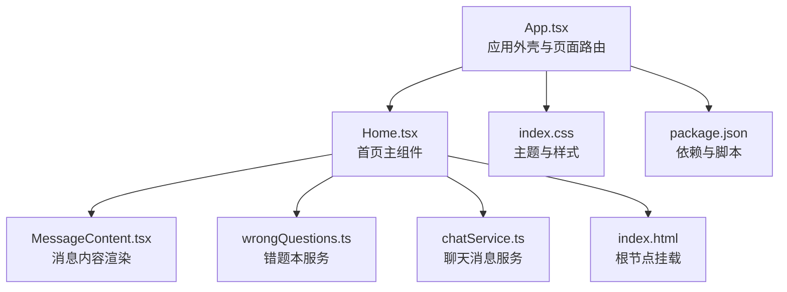
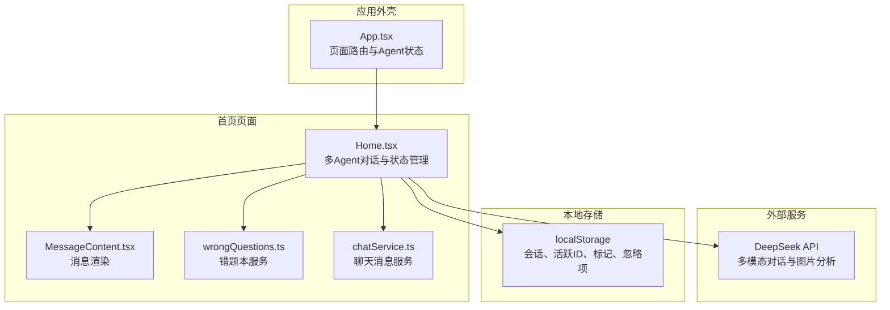
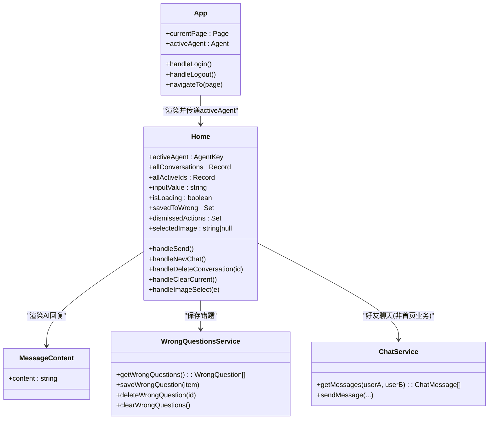
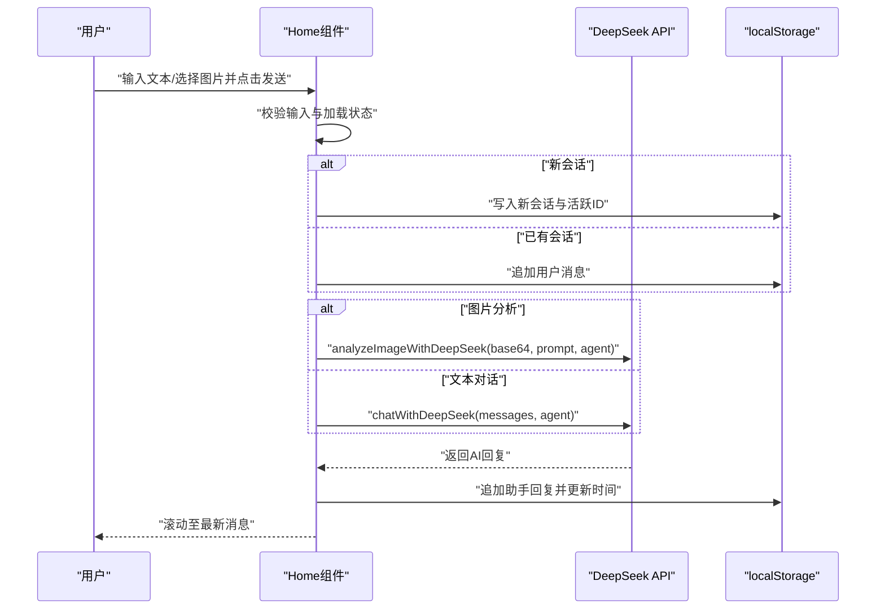
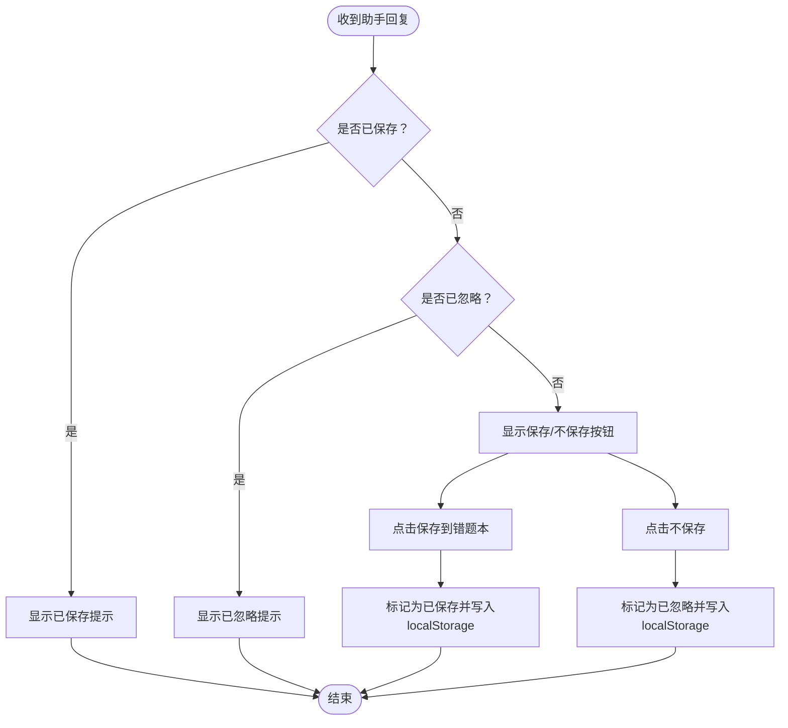
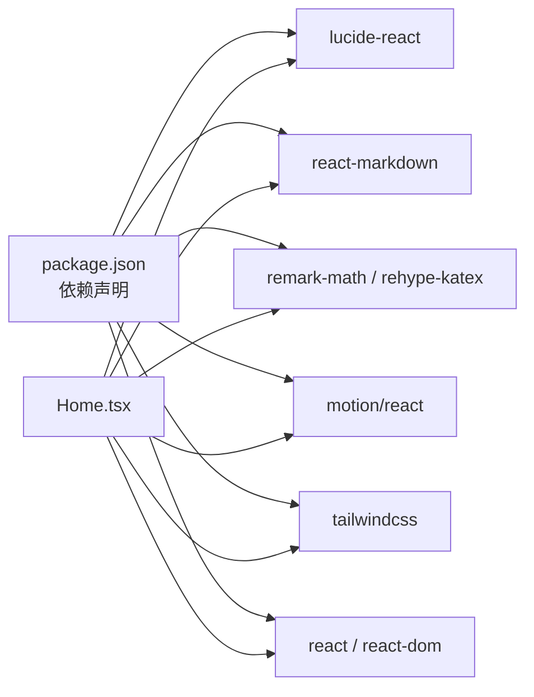

# 首页 (Home)

<cite>
**本文引用的文件**
- [Home.tsx](file://src/pages/Home.tsx)
- [App.tsx](file://src/App.tsx)
- [main.tsx](file://src/main.tsx)
- [MessageContent.tsx](file://src/components/MessageContent.tsx)
- [chatService.ts](file://src/services/chatService.ts)
- [wrongQuestions.ts](file://src/services/wrongQuestions.ts)
- [index.css](file://src/index.css)
- [AGENTS.md](file://AGENTS.md)
- [README.md](file://README.md)
- [package.json](file://package.json)
- [index.html](file://index.html)
- [videoConfig.ts](file://src/config/videoConfig.ts)
- [VideoBackground.tsx](file://src/components/VideoBackground.tsx)
</cite>

## 目录
1. [简介](#简介)
2. [项目结构](#项目结构)
3. [核心组件](#核心组件)
4. [架构总览](#架构总览)
5. [组件详细分析](#组件详细分析)
6. [依赖关系分析](#依赖关系分析)
7. [性能考量](#性能考量)
8. [故障排查指南](#故障排查指南)
9. [结论](#结论)
10. [附录](#附录)

## 简介
首页（Home）是智课通 AI Tutor 的主要入口页面，承担以下职责：
- 作为多智能体（Agent）切换与对话的统一入口，支持数学、Python、深度学习、矩阵四个专业 Agent。
- 提供多模态对话能力：支持纯文本对话与图片 OCR 分析。
- 通过本地存储持久化对话历史、活跃会话、错题本标记与忽略项。
- 集成实时对话界面与用户交互流程，包含输入框、发送按钮、图片上传、对话历史侧栏等。
- 采用 Material Design 3 色彩体系与 Tailwind CSS v4，提供响应式布局与主题适配。

首页在整体应用中的定位是“登录后首屏”，由 App.tsx 的路由状态驱动，通过 onNavigate 与 App.tsx 的页面状态联动。

章节来源
- [App.tsx:35-211](file://src/App.tsx#L35-L211)
- [Home.tsx:79-527](file://src/pages/Home.tsx#L79-L527)

## 项目结构
首页所在的关键文件与职责如下：
- src/pages/Home.tsx：首页主组件，负责多 Agent 切换、对话状态管理、图片上传与多模态调用、本地存储同步、消息渲染与交互。
- src/App.tsx：应用外壳，提供侧边栏导航、顶部导航、页面切换与 Agent 状态管理。
- src/components/MessageContent.tsx：消息内容渲染组件，支持 Markdown 与 KaTeX 数学公式。
- src/services/wrongQuestions.ts：错题本数据持久化服务。
- src/services/chatService.ts：好友聊天消息存储（与首页无关，但同属数据持久化模块）。
- src/index.css：Tailwind v4 主题与颜色变量定义。
- AGENTS.md：项目架构与约定说明，包含首页与 AI 对话系统、API 代理模式、数据持久化等关键信息。
- README.md：运行与部署说明。
- package.json：依赖与脚本。
- index.html：根节点挂载点。
- src/config/videoConfig.ts 与 src/components/VideoBackground.tsx：视频背景组件与配置（首页当前未直接使用，但项目具备该能力）。

图表来源
- [App.tsx:22-31](file://src/App.tsx#L22-L31)
- [Home.tsx:1-10](file://src/pages/Home.tsx#L1-L10)
- [MessageContent.tsx:1-31](file://src/components/MessageContent.tsx#L1-L31)
- [wrongQuestions.ts:1-35](file://src/services/wrongQuestions.ts#L1-L35)
- [chatService.ts:1-72](file://src/services/chatService.ts#L1-L72)
- [index.css:1-34](file://src/index.css#L1-L34)
- [index.html:1-14](file://index.html#L1-L14)
- [package.json:1-42](file://package.json#L1-L42)

章节来源
- [App.tsx:35-211](file://src/App.tsx#L35-L211)
- [Home.tsx:79-527](file://src/pages/Home.tsx#L79-L527)
- [index.css:1-34](file://src/index.css#L1-L34)
- [package.json:1-42](file://package.json#L1-L42)
- [index.html:1-14](file://index.html#L1-L14)

## 核心组件
- 多智能体（Agent）配置与切换
  - 预置四类 Agent：数学（高数酱）、Python（Py酱）、深度学习（Torch君）、矩阵（矩阵妹），每类包含名称、图标、副标题、占位提示与头像图片。
  - App.tsx 侧边栏与顶部导航提供 Agent 切换入口，Home.tsx 通过 activeAgent prop 接收当前激活的 Agent。
- 对话状态管理
  - 使用 useState 管理所有会话、活跃会话 ID、输入值、加载状态、错题本标记集合、忽略项集合、选中图片等。
  - 使用 localStorage 同步状态，键名包括 tutor_conversations、tutor_active_ids、tutor_saved_to_wrong、tutor_dismissed_actions。
- 多模态对话
  - 文本对话：将当前会话的消息序列转换为 API 消息数组，调用 chatWithDeepSeek。
  - 图片分析：通过 FileReader 将图片转为 base64，调用 analyzeImageWithDeepSeek，支持附带用户提示词。
- 实时对话界面
  - 消息列表按角色区分样式，支持图片消息与 Markdown+KaTeX 渲染。
  - 输入区域支持文件选择、回车发送、禁用态与加载态。
  - 对话历史侧栏展示最近会话，支持点击切换、删除单个会话。
- 错题本集成
  - 最后一条助手回复出现时，显示“保存到错题本”与“不保存”操作；保存后标记为已保存，忽略后标记为已忽略。
- 响应式布局与主题
  - 使用 Tailwind v4 的 @theme 定义主色、容器色、表面色与文字色，配合 glass-panel 与 soul-gradient 实现毛玻璃与渐变风格。
  - 通过 flex 与 max-w、mx-auto 控制宽度与居中，满足桌面端与移动端的阅读体验。

章节来源
- [Home.tsx:7-36](file://src/pages/Home.tsx#L7-L36)
- [Home.tsx:82-117](file://src/pages/Home.tsx#L82-L117)
- [Home.tsx:139-223](file://src/pages/Home.tsx#L139-L223)
- [Home.tsx:491-524](file://src/pages/Home.tsx#L491-L524)
- [MessageContent.tsx:19-30](file://src/components/MessageContent.tsx#L19-L30)
- [index.css:4-33](file://src/index.css#L4-L33)

## 架构总览
首页的运行时架构围绕“页面路由 + 组件状态 + 服务调用 + 本地存储”的闭环展开：

图表来源
- [App.tsx:35-211](file://src/App.tsx#L35-L211)
- [Home.tsx:1-10](file://src/pages/Home.tsx#L1-L10)
- [MessageContent.tsx:1-31](file://src/components/MessageContent.tsx#L1-L31)
- [wrongQuestions.ts:1-35](file://src/services/wrongQuestions.ts#L1-L35)
- [chatService.ts:1-72](file://src/services/chatService.ts#L1-L72)

## 组件详细分析

### 组件关系与类图

图表来源
- [App.tsx:35-211](file://src/App.tsx#L35-L211)
- [Home.tsx:79-527](file://src/pages/Home.tsx#L79-L527)
- [MessageContent.tsx:5-7](file://src/components/MessageContent.tsx#L5-L7)
- [wrongQuestions.ts:1-35](file://src/services/wrongQuestions.ts#L1-L35)
- [chatService.ts:1-72](file://src/services/chatService.ts#L1-L72)

### 对话流程时序图（文本/图片）

图表来源
- [Home.tsx:139-223](file://src/pages/Home.tsx#L139-L223)

### 错题本交互流程（保存/忽略）

图表来源
- [Home.tsx:363-410](file://src/pages/Home.tsx#L363-L410)
- [wrongQuestions.ts:21-25](file://src/services/wrongQuestions.ts#L21-L25)

### 数据结构与复杂度
- 会话与消息
  - Conversation: 包含 id、title、agent、agentKey、time、messages。
  - ConversationMessage: 包含 role、content、image。
  - 时间复杂度：新增/更新会话为 O(1)，查找活跃会话为 O(n)（n 为当前 Agent 会话数量）。
- 本地存储
  - 读写 localStorage 为 O(1)，序列化/反序列化为 O(k)，k 为存储数据大小。
- 渲染
  - 消息列表渲染为 O(m)，m 为消息数量；Markdown+KaTeX 渲染受内容长度影响。

章节来源
- [Home.tsx:44-51](file://src/pages/Home.tsx#L44-L51)
- [Home.tsx:103-117](file://src/pages/Home.tsx#L103-L117)
- [MessageContent.tsx:19-30](file://src/components/MessageContent.tsx#L19-L30)

## 依赖关系分析
- 组件依赖
  - Home 依赖 MessageContent 进行内容渲染，依赖 wrongQuestions 服务进行错题本写入。
  - App 作为外壳，依赖 Home 作为首页页面。
- 外部依赖
  - lucide-react：图标库。
  - react-markdown + remark-math + rehype-katex：Markdown 与 KaTeX 渲染。
  - motion/react：页面切换动画。
- 样式依赖
  - Tailwind CSS v4：通过 @theme 定义颜色变量，配合 glass-panel 与 soul-gradient。
- 运行时依赖
  - Vite：开发与构建工具。
  - Node.js：运行环境。

图表来源
- [package.json:13-28](file://package.json#L13-L28)
- [Home.tsx:1-6](file://src/pages/Home.tsx#L1-L6)

章节来源
- [package.json:1-42](file://package.json#L1-L42)
- [Home.tsx:1-10](file://src/pages/Home.tsx#L1-L10)

## 性能考量
- 状态更新与竞态
  - 使用 useRef 存储 allConversations，避免异步回调中读取旧状态导致的竞态问题。
- 渲染优化
  - 消息列表按角色分组渲染，减少不必要的重排；Markdown 渲染仅针对内容变化触发。
- 本地存储
  - 仅在状态变更时写入 localStorage，避免频繁 IO。
- 图片处理
  - 图片上传采用 FileReader 同步读取，建议在移动端谨慎使用大图，避免阻塞主线程。
- 动画与主题
  - 页面切换使用轻量动画，主题颜色变量集中管理，减少样式计算开销。

章节来源
- [Home.tsx:100-101](file://src/pages/Home.tsx#L100-L101)
- [Home.tsx:103-117](file://src/pages/Home.tsx#L103-L117)

## 故障排查指南
- 无法发送消息
  - 检查输入框是否为空且未选择图片；确认 isLoading 未被意外置为 true。
  - 确认 activeAgent 正确传入 Home。
- 图片无法分析
  - 确认选择了图片文件且类型为 image/*；检查 analyzeImageWithDeepSeek 的调用链路。
- 错题本未保存
  - 确认“保存到错题本”按钮可见且未被忽略；检查 localStorage 中 tutor_saved_to_wrong 标记。
- 对话历史不显示
  - 检查 localStorage 中 tutor_conversations 是否存在对应 Agent 的会话数据。
- 样式异常
  - 确认 Tailwind @theme 颜色变量已正确引入；检查 glass-panel 与 soul-gradient 类是否生效。

章节来源
- [Home.tsx:139-223](file://src/pages/Home.tsx#L139-L223)
- [Home.tsx:363-410](file://src/pages/Home.tsx#L363-L410)
- [index.css:1-34](file://src/index.css#L1-L34)

## 结论
首页通过清晰的组件划分与状态管理，实现了多智能体、多模态的实时对话体验，并结合本地存储与主题系统提供了良好的可用性与一致性。其架构简洁、扩展性强，便于后续在保持现有交互的基础上增加更多 Agent 或增强消息渲染能力。

## 附录

### 使用示例
- 切换智能体
  - 在 App 侧边栏点击“高数酱/Py酱/Torch君/矩阵妹”，首页将切换到对应 Agent 的会话。
- 发送消息
  - 在输入框输入文本并点击发送，或选择图片后输入提示词再发送。
- 新建/清空会话
  - 点击“新对话”新建会话；在有活跃会话时点击“清空”可删除当前会话。
- 保存错题
  - 在助手回复出现时，点击“保存到错题本”将当前问答加入错题本。

章节来源
- [App.tsx:75-104](file://src/App.tsx#L75-L104)
- [Home.tsx:225-242](file://src/pages/Home.tsx#L225-L242)
- [Home.tsx:363-410](file://src/pages/Home.tsx#L363-L410)

### 配置选项与自定义
- 主题与样式
  - 通过 src/index.css 的 @theme 块修改主色、容器色与文字色；通过 glass-panel 与 soul-gradient 类定制面板与渐变风格。
- 多智能体扩展
  - 在 Home.tsx 的 agents 对象中新增 Agent，包含 name、icon、subtitle、placeholder、image 等字段。
- API 集成
  - 遵循 AGENTS.md 中的 API 代理模式，在开发环境通过 Vite proxy 或生产环境通过 api/deepseek.js 转发请求。
- 视频背景（可选）
  - 若需在首页使用视频背景，可参考 VIDEO_BACKGROUND_GUIDE.md 与 videoConfig.ts 进行配置。

章节来源
- [index.css:4-33](file://src/index.css#L4-L33)
- [Home.tsx:7-36](file://src/pages/Home.tsx#L7-L36)
- [AGENTS.md:43-49](file://AGENTS.md#L43-L49)
- [VIDEO_BACKGROUND_GUIDE.md:1-163](file://VIDEO_BACKGROUND_GUIDE.md#L1-L163)
- [videoConfig.ts:1-47](file://src/config/videoConfig.ts#L1-L47)

### 错误处理机制
- 发送失败
  - 捕获异常并将错误信息以“请求失败：...”形式写入助手消息，避免 UI 崩溃。
- 图片选择错误
  - 非图片文件时弹出提示并终止流程。
- 本地存储异常
  - 读取/写入 localStorage 失败时使用回退值，保证功能可用。

章节来源
- [Home.tsx:211-220](file://src/pages/Home.tsx#L211-L220)
- [Home.tsx:244-256](file://src/pages/Home.tsx#L244-L256)
- [Home.tsx:70-77](file://src/pages/Home.tsx#L70-L77)

### 性能优化策略
- 使用 useRef 避免闭包读取旧状态。
- 仅在状态变更时写入 localStorage。
- 合理使用动画与渐变，避免过度绘制。
- Markdown 渲染按需触发，避免重复解析。

章节来源
- [Home.tsx:100-101](file://src/pages/Home.tsx#L100-L101)
- [Home.tsx:103-117](file://src/pages/Home.tsx#L103-L117)