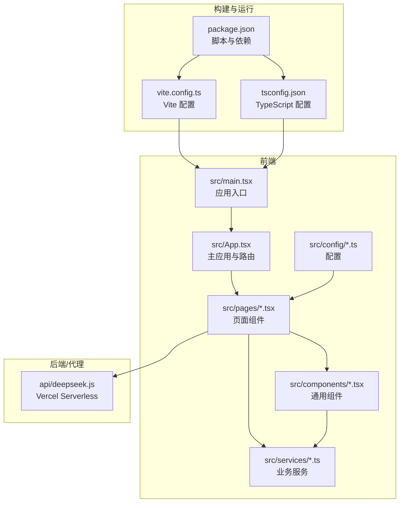
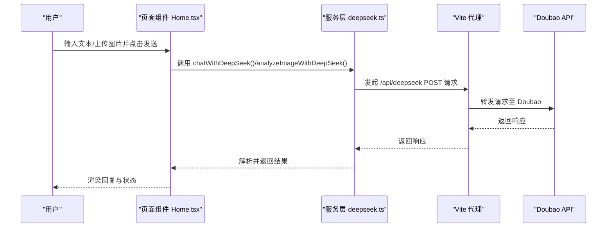
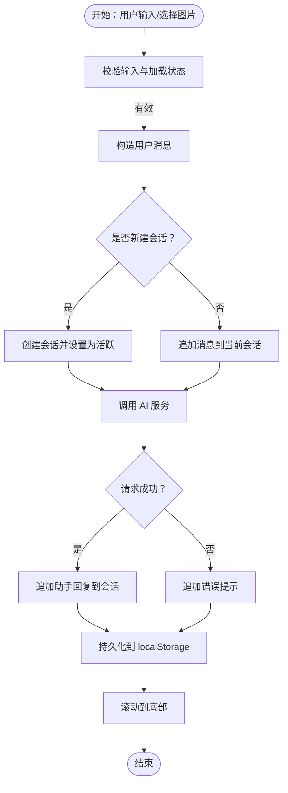
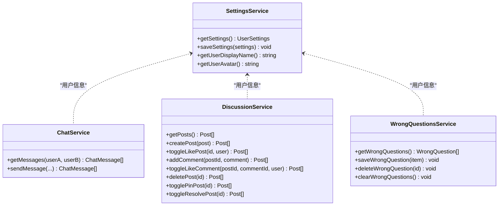
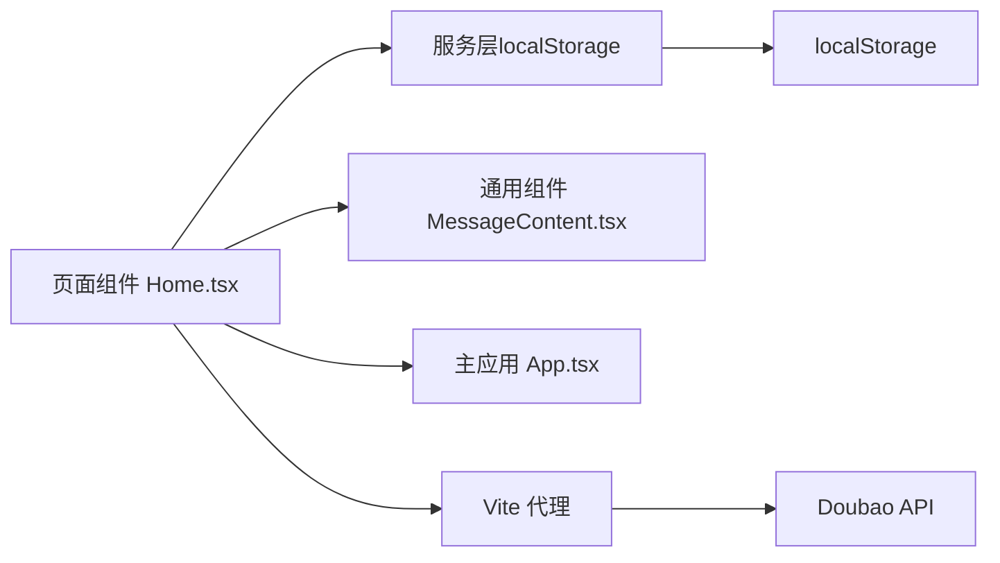

# 开发者指南

<cite>
**本文引用的文件**
- [README.md](file://README.md)
- [AGENTS.md](file://AGENTS.md)
- [package.json](file://package.json)
- [tsconfig.json](file://tsconfig.json)
- [vite.config.ts](file://vite.config.ts)
- [src/main.tsx](file://src/main.tsx)
- [src/App.tsx](file://src/App.tsx)
- [src/pages/Home.tsx](file://src/pages/Home.tsx)
- [src/components/MessageContent.tsx](file://src/components/MessageContent.tsx)
- [src/config/videoConfig.ts](file://src/config/videoConfig.ts)
- [src/services/chatService.ts](file://src/services/chatService.ts)
- [src/services/discussionService.ts](file://src/services/discussionService.ts)
- [src/services/wrongQuestions.ts](file://src/services/wrongQuestions.ts)
- [src/services/settingsService.ts](file://src/services/settingsService.ts)
- [api/deepseek.js](file://api/deepseek.js)
</cite>

## 目录
1. [简介](#简介)
2. [项目结构](#项目结构)
3. [核心组件](#核心组件)
4. [架构总览](#架构总览)
5. [详细组件分析](#详细组件分析)
6. [依赖关系分析](#依赖关系分析)
7. [性能考虑](#性能考虑)
8. [故障排查指南](#故障排查指南)
9. [结论](#结论)
10. [附录](#附录)

## 简介
本指南面向“智课通 AI Tutor”项目的开发者与贡献者，目标是帮助你快速理解项目架构、掌握开发与协作流程，并高效完成日常开发任务。内容涵盖代码规范、提交规范、分支管理、代码审查流程、调试与性能分析、问题诊断方法、开发工具配置与 IDE 设置、以及常见问题的解决方案与最佳实践。

## 项目结构
项目采用 React 19 + Vite 6 + Tailwind CSS v4 的单页应用架构，核心页面通过状态驱动的路由切换实现，服务层基于 localStorage 进行数据持久化，AI 对话通过 Vite 代理或 Vercel Serverless Function 转发至 Doubao（豆包）多模态模型。

图表来源
- [src/main.tsx:1-11](file://src/main.tsx#L1-L11)
- [src/App.tsx:1-246](file://src/App.tsx#L1-L246)
- [vite.config.ts:1-32](file://vite.config.ts#L1-L32)
- [tsconfig.json:1-28](file://tsconfig.json#L1-L28)
- [package.json:1-42](file://package.json#L1-L42)
- [api/deepseek.js:1-34](file://api/deepseek.js#L1-L34)

章节来源
- [README.md:1-21](file://README.md#L1-L21)
- [AGENTS.md:27-29](file://AGENTS.md#L27-L29)

## 核心组件
- 应用入口与挂载：应用通过入口文件创建根节点并渲染主应用组件。
- 主应用与路由：主应用负责登录态管理、侧边栏与顶部导航、页面切换与动画。
- 页面组件：包含首页对话、错题本、讨论区、帮助中心、设置、个人中心、聊天等页面。
- 通用组件：消息内容渲染组件，支持 LaTeX 数学公式渲染。
- 服务层：聊天、讨论区、错题本、用户设置等业务服务，均基于 localStorage。
- 配置：视频背景配置、路径别名、代理规则等。
- 构建与运行：Vite 配置、TypeScript 编译选项、NPM 脚本。

章节来源
- [src/main.tsx:1-11](file://src/main.tsx#L1-L11)
- [src/App.tsx:1-246](file://src/App.tsx#L1-L246)
- [src/pages/Home.tsx:1-554](file://src/pages/Home.tsx#L1-L554)
- [src/components/MessageContent.tsx:1-31](file://src/components/MessageContent.tsx#L1-L31)
- [src/services/chatService.ts:1-72](file://src/services/chatService.ts#L1-L72)
- [src/services/discussionService.ts:1-155](file://src/services/discussionService.ts#L1-L155)
- [src/services/wrongQuestions.ts:1-35](file://src/services/wrongQuestions.ts#L1-L35)
- [src/services/settingsService.ts:1-50](file://src/services/settingsService.ts#L1-L50)
- [src/config/videoConfig.ts:1-47](file://src/config/videoConfig.ts#L1-L47)
- [vite.config.ts:1-32](file://vite.config.ts#L1-L32)
- [tsconfig.json:1-28](file://tsconfig.json#L1-L28)
- [package.json:1-42](file://package.json#L1-L42)

## 架构总览
系统采用“前端 SPA + 云端模型服务”的架构。开发时通过 Vite 代理将 /api/deepseek 请求转发至 Doubao；生产环境通过 Vercel Serverless Function 执行转发逻辑，避免前端暴露密钥。

图表来源
- [src/pages/Home.tsx:139-223](file://src/pages/Home.tsx#L139-L223)
- [vite.config.ts:22-28](file://vite.config.ts#L22-L28)
- [api/deepseek.js:9-33](file://api/deepseek.js#L9-L33)

## 详细组件分析

### 主应用与路由（App.tsx）
- 功能要点
  - 登录态管理与页面切换：通过状态控制当前页面与激活的 AI Agent。
  - 侧边栏与顶部导航：提供 Agent 切换、好友、个人中心、退出登录等入口。
  - 页面动画：使用动画库实现页面切换过渡效果。
  - 用户信息：从设置服务获取当前用户名与头像。
- 设计模式
  - 状态集中管理：登录态、当前页面、激活 Agent、用户信息等。
  - 组件组合：侧边栏项、导航按钮等子组件复用性高。
- 性能与可用性
  - 避免不必要的重渲染，合理拆分子组件。
  - 使用动画库的过渡参数控制流畅度。

章节来源
- [src/App.tsx:1-246](file://src/App.tsx#L1-L246)

### 首页对话（Home.tsx）
- 功能要点
  - 多 Agent 支持：数学、Python、深度学习、矩阵四个 Agent，各自独立的历史与活跃会话。
  - 多模态对话：支持文本与图片上传，图片经前端转 base64 后发送给 AI。
  - 会话持久化：localStorage 存储各 Agent 的对话历史、活跃会话 ID、错题保存标记等。
  - 错题本集成：在助手回复后提供“保存到错题本”快捷操作。
- 数据流
  - 输入处理 → 生成消息 → 调用服务 → 更新状态 → 渲染 UI。
- 错误处理
  - 对话异常时插入错误提示消息，避免 UI 卡死。
- 性能优化
  - 使用 useRef 缓存最新状态，避免闭包陷阱导致的竞态。
  - 滚动到底部使用防抖式 effect，减少重排。

图表来源
- [src/pages/Home.tsx:139-223](file://src/pages/Home.tsx#L139-L223)
- [src/pages/Home.tsx:65-117](file://src/pages/Home.tsx#L65-L117)

章节来源
- [src/pages/Home.tsx:1-554](file://src/pages/Home.tsx#L1-L554)

### 消息内容渲染（MessageContent.tsx）
- 功能要点
  - 使用 Markdown 渲染 AI 回复，支持数学公式块与行内公式。
  - 预处理 LaTeX 分隔符，确保渲染一致性。
- 性能与兼容性
  - 插件链路稳定，避免重复解析与渲染开销。

章节来源
- [src/components/MessageContent.tsx:1-31](file://src/components/MessageContent.tsx#L1-L31)

### 视频背景配置（videoConfig.ts）
- 功能要点
  - 提供登录页视频背景的多分辨率配置与遮罩层透明度。
  - 支持本地与在线视频路径示例。
- 使用建议
  - 根据设备性能与网络状况选择合适的分辨率源。

章节来源
- [src/config/videoConfig.ts:1-47](file://src/config/videoConfig.ts#L1-L47)

### 服务层（localStorage 驱动）
- 聊天服务（chatService.ts）
  - 以排序后的用户 ID 组合生成聊天 key，实现双向聊天分区存储。
  - 时间戳转换为北京时间字符串，便于展示。
- 讨论区服务（discussionService.ts）
  - 支持发帖、评论、点赞、置顶、标记已解决、删除等完整功能。
  - 使用数组存储，按时间倒序展示。
- 错题本服务（wrongQuestions.ts）
  - 统一的增删改查接口，支持清空与批量清理。
- 用户设置服务（settingsService.ts）
  - 默认值合并策略，提供昵称与头像的全局访问器。

图表来源
- [src/services/settingsService.ts:1-50](file://src/services/settingsService.ts#L1-L50)
- [src/services/chatService.ts:1-72](file://src/services/chatService.ts#L1-L72)
- [src/services/discussionService.ts:1-155](file://src/services/discussionService.ts#L1-L155)
- [src/services/wrongQuestions.ts:1-35](file://src/services/wrongQuestions.ts#L1-L35)

章节来源
- [src/services/chatService.ts:1-72](file://src/services/chatService.ts#L1-L72)
- [src/services/discussionService.ts:1-155](file://src/services/discussionService.ts#L1-L155)
- [src/services/wrongQuestions.ts:1-35](file://src/services/wrongQuestions.ts#L1-L35)
- [src/services/settingsService.ts:1-50](file://src/services/settingsService.ts#L1-L50)

### 构建与运行（Vite + TypeScript）
- Vite 配置
  - 插件：React 与 Tailwind CSS。
  - 路径别名：@ 指向项目根目录。
  - 代理：/api/deepseek → Doubao 服务。
  - 环境变量：通过 loadEnv 注入 GEMINI_API_KEY。
- TypeScript 配置
  - ES2022 目标、实验装饰器、bundler 模式、JSX 支持、路径映射等。
- NPM 脚本
  - dev、build、preview、lint 等常用命令。

章节来源
- [vite.config.ts:1-32](file://vite.config.ts#L1-L32)
- [tsconfig.json:1-28](file://tsconfig.json#L1-L28)
- [package.json:1-42](file://package.json#L1-L42)
- [AGENTS.md:5-12](file://AGENTS.md#L5-L12)
- [AGENTS.md:14-16](file://AGENTS.md#L14-L16)

### AI 对话与 API 代理（Doubao）
- 开发环境
  - Vite 代理将 /api/deepseek 重写为 /api/v3 并转发至 Doubao。
- 生产环境
  - Vercel Serverless Function 接收 POST 请求，转发到 Doubao 并设置响应头。
  - 限制请求体大小以支持大图片上传。

章节来源
- [vite.config.ts:22-28](file://vite.config.ts#L22-L28)
- [api/deepseek.js:1-34](file://api/deepseek.js#L1-L34)
- [AGENTS.md:43-49](file://AGENTS.md#L43-L49)

## 依赖关系分析
- 组件耦合
  - 页面组件依赖服务层与通用组件，服务层之间低耦合，通过 localStorage 交互。
  - 主应用负责顶层状态与导航，页面组件聚焦自身业务。
- 外部依赖
  - React 19、Vite 6、Tailwind CSS v4、motion、react-markdown、katex 等。
- 环境与部署
  - 本地开发通过 Vite，生产部署于 Vercel + AI Studio。

图表来源
- [src/pages/Home.tsx:1-554](file://src/pages/Home.tsx#L1-L554)
- [src/components/MessageContent.tsx:1-31](file://src/components/MessageContent.tsx#L1-L31)
- [src/App.tsx:1-246](file://src/App.tsx#L1-L246)
- [vite.config.ts:22-28](file://vite.config.ts#L22-L28)
- [api/deepseek.js:1-34](file://api/deepseek.js#L1-L34)

章节来源
- [package.json:13-28](file://package.json#L13-L28)
- [vite.config.ts:1-32](file://vite.config.ts#L1-L32)

## 性能考虑
- 渲染优化
  - 使用动画库的过渡参数控制页面切换流畅度。
  - 避免在渲染路径中执行重计算，将计算移出渲染函数。
- 状态管理
  - 使用 useRef 缓存最新状态，防止闭包陷阱引发的竞态。
  - 合理拆分状态，减少不必要的重渲染。
- 网络与 I/O
  - 图片上传前进行类型校验与尺寸评估，避免无效请求。
  - 代理与 Serverless 转发时注意请求体大小限制。
- 存储与缓存
  - localStorage 操作集中在服务层，避免分散在多个组件中。
  - 对频繁读取的数据进行内存缓存，减少序列化开销。

## 故障排查指南
- 环境变量与密钥
  - 确认本地环境变量文件中设置了必要的 API Key，并在构建配置中正确注入。
- API 代理与转发
  - 开发环境：检查 Vite 代理规则与目标地址是否匹配。
  - 生产环境：确认 Vercel Serverless 函数的请求体大小限制与响应头设置。
- 前端渲染问题
  - Markdown 与 LaTeX 渲染异常：检查预处理逻辑与插件链路。
- 本地存储异常
  - localStorage 异常或被禁用：服务层已包含异常捕获，必要时清理或降级处理。
- 性能问题
  - 页面卡顿：检查是否存在大量重渲染或阻塞主线程的操作。
  - 图片上传慢：检查网络与图片压缩策略。

章节来源
- [AGENTS.md:14-16](file://AGENTS.md#L14-L16)
- [vite.config.ts:22-28](file://vite.config.ts#L22-L28)
- [api/deepseek.js:3-7](file://api/deepseek.js#L3-L7)
- [src/components/MessageContent.tsx:9-17](file://src/components/MessageContent.tsx#L9-L17)
- [src/services/chatService.ts:34-42](file://src/services/chatService.ts#L34-L42)
- [src/services/discussionService.ts:45-52](file://src/services/discussionService.ts#L45-L52)
- [src/services/wrongQuestions.ts:12-19](file://src/services/wrongQuestions.ts#L12-L19)

## 结论
本指南提供了从项目结构、核心组件、架构到开发与运维全流程的系统性说明。建议在开发过程中遵循本文的规范与最佳实践，结合调试与性能分析方法，持续提升开发效率与用户体验。

## 附录

### 代码规范与命名约定
- 文件与目录
  - 页面组件放置于 pages 目录，通用组件放置于 components 目录，业务服务放置于 services 目录。
  - 配置文件放置于 config 目录。
- 命名
  - 组件文件使用帕斯卡命名法（如 Home.tsx）。
  - 接口与类型使用帕斯卡命名法（如 UserSettings）。
  - 常量使用大写下划线命名法（如 STORAGE_KEY）。
- 导入路径
  - 使用 @ 路径别名指向项目根目录，避免相对路径过深。
- 样式
  - 使用 Tailwind CSS v4 的原子类与主题块，避免内联样式。
- 图标与动画
  - 统一使用 lucide-react 图标库。
  - 动画库使用 motion/react。

章节来源
- [AGENTS.md:18-26](file://AGENTS.md#L18-L26)
- [tsconfig.json:18-22](file://tsconfig.json#L18-L22)

### 提交规范与分支管理
- 分支策略
  - 主分支：保护分支，仅允许通过代码审查合并。
  - 开发分支：feature/* 或 chore/*，用于功能开发与维护。
  - 修复分支：fix/*，用于紧急修复。
- 提交信息
  - 类型：feat、fix、docs、style、refactor、test、chore 等。
  - 格式：type(scope): subject，subject 首字母不大写。
  - 示例：feat(chat): 增加消息去重逻辑。
- 代码审查
  - 至少一名维护者审查，确保通过本地 lint 与最小可运行验证。
  - 合并前清理无用分支与提交历史。

章节来源
- [AGENTS.md:5-12](file://AGENTS.md#L5-L12)

### 开发工作流程
- 环境准备
  - 安装依赖、配置环境变量、启动开发服务器。
- 功能开发
  - 新增页面或组件时，先设计接口与状态，再实现 UI 与服务层。
  - 使用 localStorage 服务层进行数据持久化，避免直接操作 DOM。
- 本地验证
  - 通过本地预览与浏览器调试工具验证交互与性能。
- 提交与合并
  - 提交前执行类型检查与本地预览，发起 Pull Request 并等待审查。

章节来源
- [README.md:11-21](file://README.md#L11-L21)
- [package.json:6-11](file://package.json#L6-L11)

### 调试技巧与性能分析
- 浏览器调试
  - 使用 React DevTools 检查组件树与状态变化。
  - 使用网络面板观察代理与转发请求。
- 日志与断点
  - 在关键流程（输入处理、API 调用、状态更新）设置断点。
- 性能分析
  - 使用浏览器性能面板测量长任务与重排。
  - 关注渲染热点区域，减少不必要的重渲染。

章节来源
- [src/pages/Home.tsx:139-223](file://src/pages/Home.tsx#L139-L223)
- [vite.config.ts:18-21](file://vite.config.ts#L18-L21)

### 开发工具配置与 IDE 设置
- VS Code 推荐扩展
  - TypeScript Importer、Tailwind CSS IntelliSense、ESLint、Prettier。
- 编辑器设置
  - 统一缩进与换行符，启用保存时格式化。
- 调试配置
  - 配置浏览器调试任务，断点调试与网络监控结合使用。

章节来源
- [tsconfig.json:1-28](file://tsconfig.json#L1-L28)
- [package.json:30-39](file://package.json#L30-L39)

### 常见问题与最佳实践
- 问题：图片无法上传或解析
  - 检查文件类型校验与 FileReader 使用。
- 问题：会话历史丢失
  - 确认 localStorage 写入与异常捕获逻辑。
- 问题：LaTeX 渲染异常
  - 检查预处理替换规则与插件链路。
- 最佳实践
  - 将 UI 与逻辑分离，保持组件单一职责。
  - 使用类型约束与严格模式，减少运行时错误。
  - 对外暴露稳定的接口与清晰的错误信息。

章节来源
- [src/pages/Home.tsx:244-256](file://src/pages/Home.tsx#L244-L256)
- [src/services/chatService.ts:34-42](file://src/services/chatService.ts#L34-L42)
- [src/components/MessageContent.tsx:9-17](file://src/components/MessageContent.tsx#L9-L17)