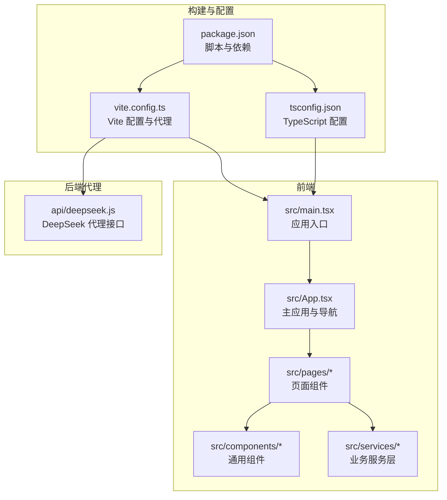
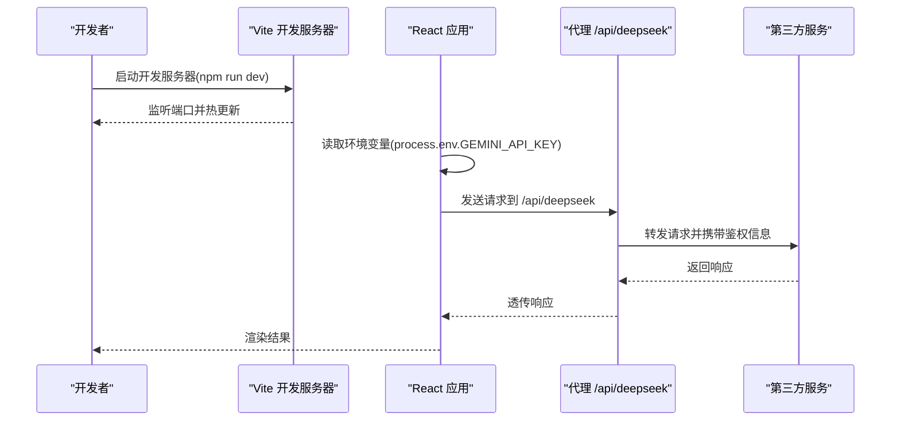
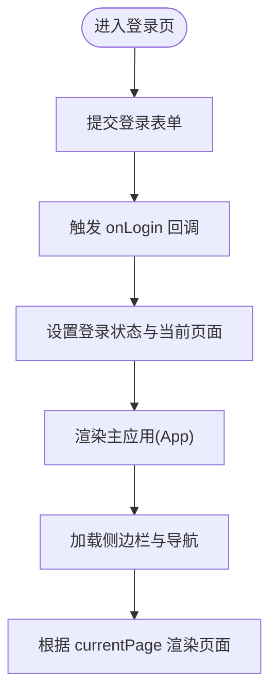
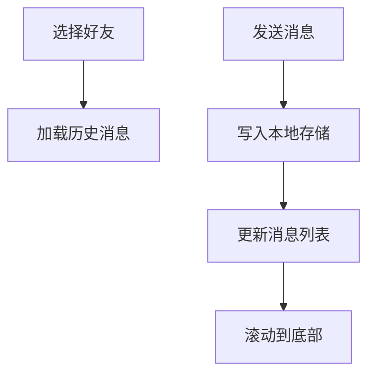
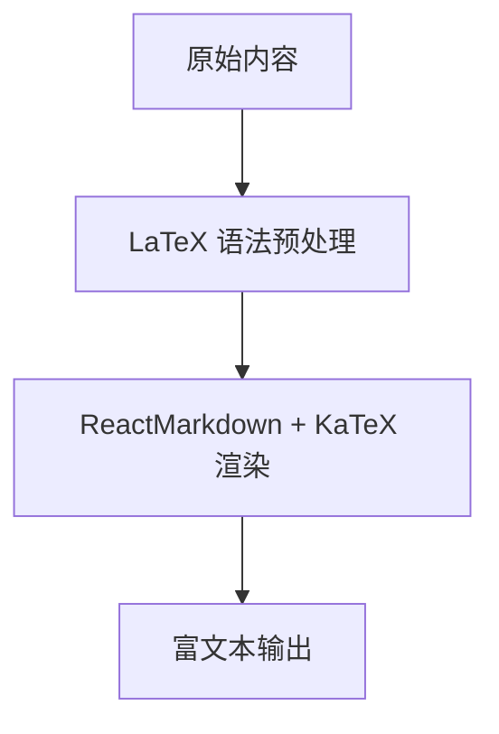
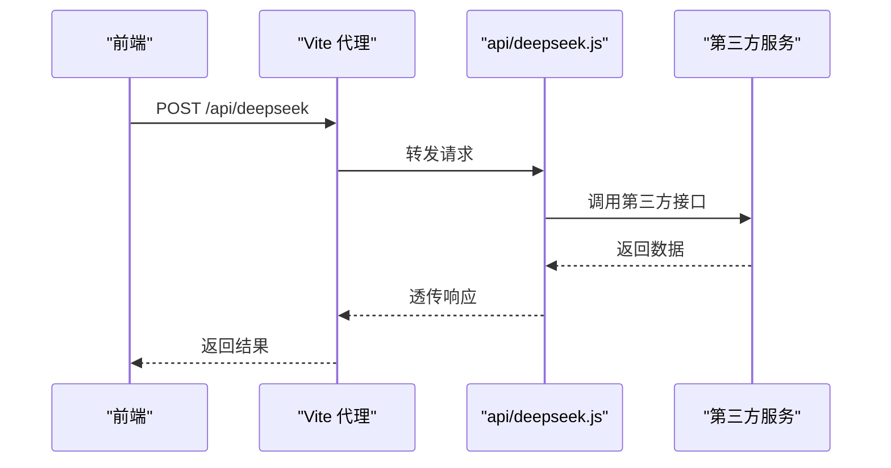
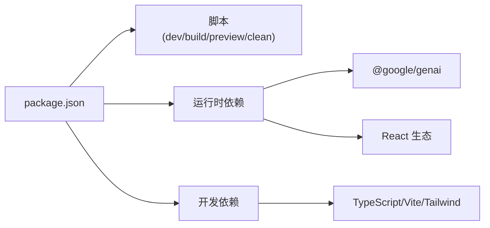

# 快速开始

<cite>
**本文引用的文件**
- [README.md](file://README.md)
- [package.json](file://package.json)
- [vite.config.ts](file://vite.config.ts)
- [tsconfig.json](file://tsconfig.json)
- [src/main.tsx](file://src/main.tsx)
- [src/App.tsx](file://src/App.tsx)
- [src/pages/Login.tsx](file://src/pages/Login.tsx)
- [src/pages/Chat.tsx](file://src/pages/Chat.tsx)
- [src/components/MessageContent.tsx](file://src/components/MessageContent.tsx)
- [src/services/chatService.ts](file://src/services/chatService.ts)
- [api/deepseek.js](file://api/deepseek.js)
</cite>

## 目录
1. [简介](#简介)
2. [项目结构](#项目结构)
3. [核心组件](#核心组件)
4. [架构总览](#架构总览)
5. [详细组件分析](#详细组件分析)
6. [依赖分析](#依赖分析)
7. [性能考虑](#性能考虑)
8. [故障排除指南](#故障排除指南)
9. [结论](#结论)
10. [附录](#附录)

## 简介
本指南面向首次接触“智课通 AI Tutor”项目的开发者，帮助你在最短时间内完成开发环境准备、依赖安装、API 密钥配置与本地运行。文档覆盖以下关键点：
- 开发环境要求与系统配置
- 依赖安装步骤与脚本说明
- .env.local 环境变量配置方法
- GEMINI_API_KEY 获取与使用
- 本地运行流程与常见问题排查
- 不同操作系统的具体安装指导

## 项目结构
该项目采用 Vite + React + TypeScript 技术栈，前端页面通过路由式切换展示不同功能模块；后端代理用于转发 DeepSeek 等第三方接口请求。

**图表来源**
- [src/main.tsx:1-11](file://src/main.tsx#L1-L11)
- [src/App.tsx:1-246](file://src/App.tsx#L1-L246)
- [vite.config.ts:1-32](file://vite.config.ts#L1-L32)
- [tsconfig.json:1-28](file://tsconfig.json#L1-L28)
- [package.json:1-42](file://package.json#L1-L42)
- [api/deepseek.js:1-34](file://api/deepseek.js#L1-L34)

**章节来源**
- [README.md:11-20](file://README.md#L11-L20)
- [package.json:6-11](file://package.json#L6-L11)
- [vite.config.ts:6-31](file://vite.config.ts#L6-L31)
- [tsconfig.json:1-28](file://tsconfig.json#L1-L28)

## 核心组件
- 应用入口与渲染：负责挂载根组件并引入样式。
- 主应用与导航：维护侧边栏、顶部导航、页面切换与登录状态。
- 页面组件：包含登录、聊天、个人中心等页面。
- 通用组件：如富文本与公式渲染组件。
- 服务层：封装聊天消息存储与好友关系管理。
- 构建与代理：Vite 配置定义环境变量注入、路径别名、HMR 与代理规则。

**章节来源**
- [src/main.tsx:1-11](file://src/main.tsx#L1-L11)
- [src/App.tsx:35-211](file://src/App.tsx#L35-L211)
- [src/pages/Login.tsx:1-175](file://src/pages/Login.tsx#L1-L175)
- [src/pages/Chat.tsx:1-381](file://src/pages/Chat.tsx#L1-L381)
- [src/components/MessageContent.tsx:1-31](file://src/components/MessageContent.tsx#L1-L31)
- [src/services/chatService.ts:1-72](file://src/services/chatService.ts#L1-L72)
- [vite.config.ts:6-31](file://vite.config.ts#L6-L31)

## 架构总览
应用采用前后端分离思路：前端通过 Vite 开发服务器运行，使用代理将特定 API 请求转发至第三方服务；应用通过环境变量注入密钥以调用模型服务。

**图表来源**
- [vite.config.ts:18-29](file://vite.config.ts#L18-L29)
- [api/deepseek.js:9-33](file://api/deepseek.js#L9-L33)
- [src/App.tsx:35-211](file://src/App.tsx#L35-L211)

## 详细组件分析

### 登录与主应用
- 登录页负责触发登录回调并切换到主页。
- 主应用维护页面状态、侧边栏与顶部导航，根据当前页面渲染对应组件。

**图表来源**
- [src/pages/Login.tsx:7-175](file://src/pages/Login.tsx#L7-L175)
- [src/App.tsx:35-211](file://src/App.tsx#L35-L211)

**章节来源**
- [src/pages/Login.tsx:7-175](file://src/pages/Login.tsx#L7-L175)
- [src/App.tsx:35-211](file://src/App.tsx#L35-L211)

### 聊天与消息存储
- 聊天页面支持好友列表、请求处理与消息发送。
- 消息存储使用本地存储，按用户对生成键值进行持久化。

**图表来源**
- [src/pages/Chat.tsx:41-97](file://src/pages/Chat.tsx#L41-L97)
- [src/services/chatService.ts:34-71](file://src/services/chatService.ts#L34-L71)

**章节来源**
- [src/pages/Chat.tsx:28-381](file://src/pages/Chat.tsx#L28-L381)
- [src/services/chatService.ts:1-72](file://src/services/chatService.ts#L1-L72)

### 公式渲染组件
- 使用 Markdown 与 KaTeX 插件渲染数学公式，支持行内与块级公式语法预处理。

**图表来源**
- [src/components/MessageContent.tsx:9-29](file://src/components/MessageContent.tsx#L9-L29)

**章节来源**
- [src/components/MessageContent.tsx:1-31](file://src/components/MessageContent.tsx#L1-L31)

### 代理与第三方集成
- Vite 代理将 /api/deepseek 请求重写并转发至指定目标地址。
- 后端代理实现接收 POST 请求，转发至第三方服务并回传响应。

**图表来源**
- [vite.config.ts:22-27](file://vite.config.ts#L22-L27)
- [api/deepseek.js:9-33](file://api/deepseek.js#L9-L33)

**章节来源**
- [vite.config.ts:18-31](file://vite.config.ts#L18-L31)
- [api/deepseek.js:1-34](file://api/deepseek.js#L1-L34)

## 依赖分析
- 脚本与命令：提供开发、构建、预览与清理等常用命令。
- 运行时依赖：包含 React、Vite、TailwindCSS、@google/genai、dotenv、express 等。
- 开发依赖：包含 TypeScript、Vite 插件、TailwindCSS、类型声明等。
- Node.js 版本要求：根据 @google/genai 的引擎要求，需满足较高版本 Node.js。

**图表来源**
- [package.json:6-40](file://package.json#L6-L40)

**章节来源**
- [package.json:1-42](file://package.json#L1-L42)

## 性能考虑
- Vite 提供快速冷启动与热更新能力，建议在开发时保持 HMR 启用以提升迭代效率。
- 代理仅用于开发阶段，生产部署时应调整为直接访问目标服务或通过后端统一转发。
- 大体积资源与视频背景在开发环境中可能影响首屏渲染，建议在生产构建中优化资源体积。

[本节为通用建议，无需引用具体文件]

## 故障排除指南
- 无法启动开发服务器
  - 确认已安装 Node.js 并满足版本要求（参考依赖项中的 Node.js 引擎要求）。
  - 确认端口未被占用，必要时修改 Vite 配置中的端口。
- 环境变量未生效
  - 确保在项目根目录创建 .env.local 文件并正确设置 GEMINI_API_KEY。
  - 确认 Vite 已加载该文件并在 define 中注入了环境变量。
- 代理请求失败
  - 检查代理规则是否匹配 /api/deepseek。
  - 确认第三方服务可用且鉴权信息正确。
- 聊天消息不显示
  - 检查本地存储权限与浏览器隐私模式设置。
  - 确认消息键值生成逻辑与用户选择一致。

**章节来源**
- [README.md:16-20](file://README.md#L16-L20)
- [vite.config.ts:6-12](file://vite.config.ts#L6-L12)
- [api/deepseek.js:14-33](file://api/deepseek.js#L14-L33)
- [src/services/chatService.ts:34-71](file://src/services/chatService.ts#L34-L71)

## 结论
通过本指南，你可以在本地快速搭建“智课通 AI Tutor”的开发环境，完成依赖安装、密钥配置与本地运行。若遇到问题，可依据故障排除指南逐项排查。建议在开发过程中关注代理与密钥的安全性，并在生产部署前完善后端转发与静态资源优化。

[本节为总结，无需引用具体文件]

## 附录

### 环境准备清单
- 安装 Node.js（满足依赖项中的 Node.js 版本要求）
- 安装包管理器（推荐 npm）
- 准备一个支持现代浏览器的开发环境

**章节来源**
- [package.json:13-28](file://package.json#L13-L28)

### 依赖安装步骤
- 在项目根目录执行安装命令以下载所有依赖。
- 安装完成后，即可使用提供的脚本进行开发与构建。

**章节来源**
- [README.md:16](file://README.md#L16)
- [package.json:6-11](file://package.json#L6-L11)

### API 密钥配置
- 在项目根目录创建 .env.local 文件。
- 将 GEMINI_API_KEY 设置为你的实际密钥。
- Vite 会在开发时加载该文件并将密钥注入到应用中。

**章节来源**
- [README.md:18](file://README.md#L18)
- [vite.config.ts:6-12](file://vite.config.ts#L6-L12)

### 本地运行流程
- 安装依赖后，执行开发脚本启动本地服务。
- 打开浏览器访问开发服务器地址，完成登录与功能体验。

**章节来源**
- [README.md:16-20](file://README.md#L16-L20)
- [package.json:7](file://package.json#L7)

### 不同操作系统安装指导
- Windows
  - 安装 Node.js 并确保其加入系统 PATH。
  - 在项目目录打开终端，执行安装与启动命令。
- macOS/Linux
  - 使用包管理器安装 Node.js（如 nvm）。
  - 在项目目录执行安装与启动命令。

**章节来源**
- [README.md:13](file://README.md#L13)
- [package.json:13-28](file://package.json#L13-L28)