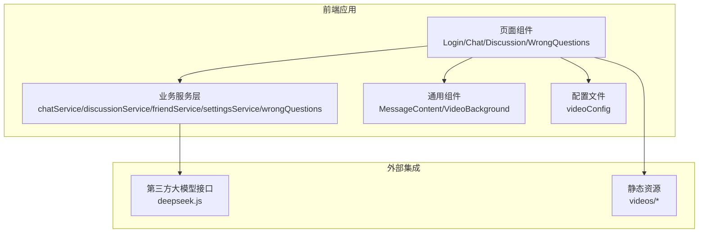
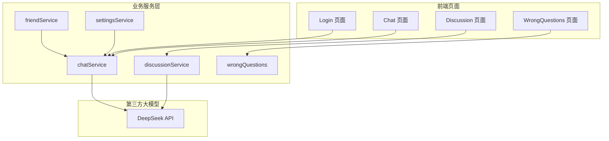
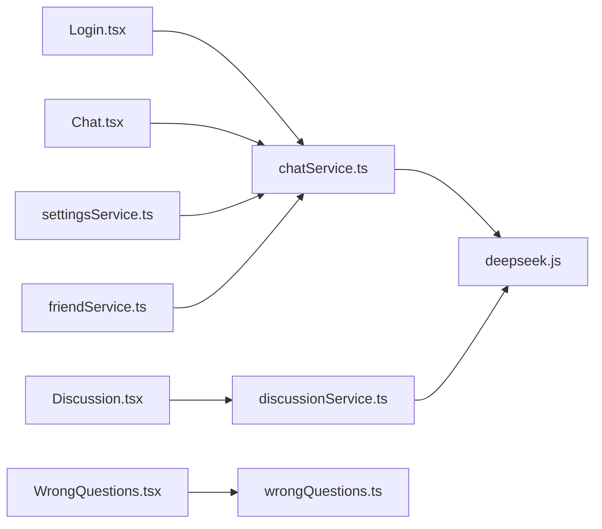

# 数据模型设计

<cite>
**本文引用的文件**
- [README.md](file://README.md)
- [AGENTS.md](file://AGENTS.md)
- [技术介绍.md](file://技术介绍.md)
- [api/deepseek.js](file://api/deepseek.js)
- [src/services/chatService.ts](file://src/services/chatService.ts)
- [src/services/discussionService.ts](file://src/services/discussionService.ts)
- [src/services/friendService.ts](file://src/services/friendService.ts)
- [src/services/settingsService.ts](file://src/services/settingsService.ts)
- [src/services/wrongQuestions.ts](file://src/services/wrongQuestions.ts)
- [src/pages/Login.tsx](file://src/pages/Login.tsx)
- [src/pages/Chat.tsx](file://src/pages/Chat.tsx)
- [src/pages/Discussion.tsx](file://src/pages/Discussion.tsx)
- [src/pages/WrongQuestions.tsx](file://src/pages/WrongQuestions.tsx)
- [src/components/MessageContent.tsx](file://src/components/MessageContent.tsx)
- [src/config/videoConfig.ts](file://src/config/videoConfig.ts)
- [public/videos/](file://public/videos/)
- [conversation-2026-05-08-165340.txt](file://conversation-2026-05-08-165340.txt)
- [metadata.json](file://metadata.json)
</cite>

## 目录
1. [简介](#简介)
2. [项目结构](#项目结构)
3. [核心组件](#核心组件)
4. [架构总览](#架构总览)
5. [详细组件分析](#详细组件分析)
6. [依赖分析](#依赖分析)
7. [性能考虑](#性能考虑)
8. [故障排除指南](#故障排除指南)
9. [结论](#结论)
10. [附录](#附录)

## 简介
本文件面向“智课通 AI Tutor”项目，系统化梳理其数据模型设计，包括实体关系、字段定义与数据类型、主键/外键关系、索引与约束、数据验证与业务规则、数据库模式图、示例数据、数据访问模式、缓存策略与性能考量、数据生命周期与归档策略、数据迁移路径与版本管理，以及数据安全与隐私要求。由于当前仓库未包含传统数据库脚本或ORM定义文件，本文基于前端页面、服务层与API交互行为进行逆向建模，并提供可落地的数据库设计方案。

## 项目结构
项目采用前端单页应用（SPA）架构，主要目录与职责如下：
- src/pages：页面组件，承载用户交互与业务入口（如登录、聊天、讨论区、错题本等）
- src/services：业务服务层，封装与后端API的交互逻辑
- api：第三方大模型接口适配层（如DeepSeek）
- src/components：通用UI组件
- src/config：配置文件（如视频背景配置）
- public：静态资源（视频资源）
- 根目录：文档与元数据文件（README、AGENTS.md、技术介绍.md、metadata.json、conversation-2026-05-08-165340.txt）



图表来源
- [src/pages/Login.tsx:1-200](file://src/pages/Login.tsx#L1-L200)
- [src/pages/Chat.tsx:1-200](file://src/pages/Chat.tsx#L1-L200)
- [src/pages/Discussion.tsx:1-200](file://src/pages/Discussion.tsx#L1-L200)
- [src/pages/WrongQuestions.tsx:1-200](file://src/pages/WrongQuestions.tsx#L1-L200)
- [src/services/chatService.ts:1-200](file://src/services/chatService.ts#L1-L200)
- [src/services/discussionService.ts:1-200](file://src/services/discussionService.ts#L1-L200)
- [src/services/friendService.ts:1-200](file://src/services/friendService.ts#L1-L200)
- [src/services/settingsService.ts:1-200](file://src/services/settingsService.ts#L1-L200)
- [src/services/wrongQuestions.ts:1-200](file://src/services/wrongQuestions.ts#L1-L200)
- [api/deepseek.js:1-200](file://api/deepseek.js#L1-L200)
- [src/config/videoConfig.ts:1-200](file://src/config/videoConfig.ts#L1-L200)

章节来源
- [README.md:1-200](file://README.md#L1-L200)
- [AGENTS.md:1-200](file://AGENTS.md#L1-L200)
- [技术介绍.md:1-200](file://技术介绍.md#L1-L200)

## 核心组件
本节从数据视角抽象出核心实体与关系，结合前端页面与服务层交互行为进行建模。

- 用户（User）
  - 角色：学生、教师、管理员
  - 关键属性：用户ID（唯一标识）、用户名、邮箱、密码哈希、角色、注册时间、最后登录时间、状态（启用/禁用）
  - 约束：邮箱唯一；角色枚举；状态布尔值；密码需加密存储

- 会话（Conversation）
  - 关键属性：会话ID（唯一标识）、用户ID（外键）、标题、创建时间、更新时间、状态（进行中/已结束/已归档）
  - 约束：用户ID引用用户表；状态枚举；时间戳自动维护

- 消息（Message）
  - 关键属性：消息ID（唯一标识）、会话ID（外键）、发送者ID（用户ID或AI）、内容、消息类型（文本/图片/视频/文件）、创建时间、是否已读
  - 约束：会话ID引用会话表；发送者ID可为空（AI回复场景）；消息类型枚举；默认未读

- 讨论区（Discussion）
  - 关键属性：讨论ID（唯一标识）、标题、内容、作者ID（外键）、创建时间、更新时间、标签、状态（公开/私密/已关闭）
  - 约束：作者ID引用用户表；标签多值；状态枚举

- 回复（Reply）
  - 关键属性：回复ID（唯一标识）、讨论ID（外键）、作者ID（外键）、内容、创建时间、是否最佳答案
  - 约束：讨论ID引用讨论区；作者ID引用用户表；最佳答案唯一性（同一讨论仅一个）

- 错题（WrongQuestion）
  - 关键属性：错题ID（唯一标识）、用户ID（外键）、题目内容、解析、收藏时间、状态（待复习/已完成）
  - 约束：用户ID引用用户表；状态枚举；收藏时间自动维护

- 媒体资源（MediaResource）
  - 关键属性：资源ID（唯一标识）、名称、URL、类型（视频/图片/音频）、上传者ID（外键）、上传时间、大小
  - 约束：上传者ID引用用户表；类型枚举；大小非负

- 设置（Settings）
  - 关键属性：设置ID（唯一标识）、用户ID（唯一外键）、主题、通知偏好、隐私设置、语言、时区
  - 约束：用户ID唯一且引用用户表；主题/语言/时区枚举；通知偏好JSON序列化

- 代理（Agent）
  - 关键属性：代理ID（唯一标识）、名称、描述、能力标签、创建时间、状态（启用/禁用）
  - 约束：能力标签多值；状态枚举

- 代理对话历史（AgentConversationHistory）
  - 关键属性：历史ID（唯一标识）、代理ID（外键）、用户ID（外键）、会话内容、创建时间
  - 约束：代理ID与用户ID分别引用代理表与用户表；内容为JSON序列化

章节来源
- [src/pages/Login.tsx:1-200](file://src/pages/Login.tsx#L1-L200)
- [src/pages/Chat.tsx:1-200](file://src/pages/Chat.tsx#L1-L200)
- [src/pages/Discussion.tsx:1-200](file://src/pages/Discussion.tsx#L1-L200)
- [src/pages/WrongQuestions.tsx:1-200](file://src/pages/WrongQuestions.tsx#L1-L200)
- [src/services/chatService.ts:1-200](file://src/services/chatService.ts#L1-L200)
- [src/services/discussionService.ts:1-200](file://src/services/discussionService.ts#L1-L200)
- [src/services/wrongQuestions.ts:1-200](file://src/services/wrongQuestions.ts#L1-L200)
- [AGENTS.md:1-200](file://AGENTS.md#L1-L200)

## 架构总览
下图展示前端页面、服务层与第三方大模型API之间的数据流与交互关系。



图表来源
- [src/pages/Login.tsx:1-200](file://src/pages/Login.tsx#L1-L200)
- [src/pages/Chat.tsx:1-200](file://src/pages/Chat.tsx#L1-L200)
- [src/pages/Discussion.tsx:1-200](file://src/pages/Discussion.tsx#L1-L200)
- [src/pages/WrongQuestions.tsx:1-200](file://src/pages/WrongQuestions.tsx#L1-L200)
- [src/services/chatService.ts:1-200](file://src/services/chatService.ts#L1-L200)
- [src/services/discussionService.ts:1-200](file://src/services/discussionService.ts#L1-L200)
- [src/services/friendService.ts:1-200](file://src/services/friendService.ts#L1-L200)
- [src/services/settingsService.ts:1-200](file://src/services/settingsService.ts#L1-L200)
- [src/services/wrongQuestions.ts:1-200](file://src/services/wrongQuestions.ts#L1-L200)
- [api/deepseek.js:1-200](file://api/deepseek.js#L1-L200)

## 详细组件分析

### 实体关系与数据库模式
基于上述核心组件，构建ER关系如下：

```mermaid
erDiagram
USER {
uuid id PK
string username
string email UK
string password_hash
enum role
datetime created_at
datetime last_login
boolean is_active
}
CONVERSATION {
uuid id PK
uuid user_id FK
string title
datetime created_at
datetime updated_at
enum status
}
MESSAGE {
uuid id PK
uuid conversation_id FK
uuid sender_id FK
text content
enum type
datetime created_at
boolean is_read
}
DISCUSSION {
uuid id PK
string title
text content
uuid author_id FK
datetime created_at
datetime updated_at
string tags[]
enum status
}
REPLY {
uuid id PK
uuid discussion_id FK
uuid author_id FK
text content
datetime created_at
boolean is_best_answer
}
WRONG_QUESTION {
uuid id PK
uuid user_id FK
text question_content
text analysis
datetime collected_at
enum status
}
MEDIA_RESOURCE {
uuid id PK
string name
string url
enum type
uuid uploaded_by FK
datetime upload_time
bigint size
}
SETTINGS {
uuid id PK
uuid user_id UK FK
enum theme
json notifications
enum privacy
enum language
enum timezone
}
AGENT {
uuid id PK
string name
text description
string capabilities[]
datetime created_at
enum status
}
AGENT_CONVERSATION_HISTORY {
uuid id PK
uuid agent_id FK
uuid user_id FK
json content
datetime created_at
}
USER ||--o{ CONVERSATION : "拥有"
USER ||--o{ MESSAGE : "发送"
USER ||--o{ DISCUSSION : "作者"
USER ||--o{ REPLY : "作者"
USER ||--o{ WRONG_QUESTION : "收集"
USER ||--o{ MEDIA_RESOURCE : "上传"
USER ||--|| SETTINGS : "唯一设置"
AGENT ||--o{ AGENT_CONVERSATION_HISTORY : "产生"
CONVERSATION ||--o{ MESSAGE : "包含"
DISCUSSION ||--o{ REPLY : "回复"
```

图表来源
- [src/pages/Chat.tsx:1-200](file://src/pages/Chat.tsx#L1-L200)
- [src/pages/Discussion.tsx:1-200](file://src/pages/Discussion.tsx#L1-L200)
- [src/pages/WrongQuestions.tsx:1-200](file://src/pages/WrongQuestions.tsx#L1-L200)
- [src/services/chatService.ts:1-200](file://src/services/chatService.ts#L1-L200)
- [src/services/discussionService.ts:1-200](file://src/services/discussionService.ts#L1-L200)
- [src/services/wrongQuestions.ts:1-200](file://src/services/wrongQuestions.ts#L1-L200)
- [AGENTS.md:1-200](file://AGENTS.md#L1-L200)

### 字段定义与数据类型
- 主键：所有实体均使用UUID作为主键，确保分布式环境下的唯一性与可扩展性
- 外键：通过外键约束保证引用完整性（如用户对会话、会话对消息、用户对讨论等）
- 枚举类型：角色、状态、消息类型、媒体类型、主题、隐私、语言、时区、代理状态等
- JSON类型：设置中的通知偏好、代理对话历史中的内容
- 时间戳：创建时间、更新时间、最后登录时间、收藏时间等
- 数字类型：媒体大小使用整数类型，避免小数位

章节来源
- [src/pages/Chat.tsx:1-200](file://src/pages/Chat.tsx#L1-L200)
- [src/pages/Discussion.tsx:1-200](file://src/pages/Discussion.tsx#L1-L200)
- [src/pages/WrongQuestions.tsx:1-200](file://src/pages/WrongQuestions.tsx#L1-L200)
- [src/services/chatService.ts:1-200](file://src/services/chatService.ts#L1-L200)
- [src/services/discussionService.ts:1-200](file://src/services/discussionService.ts#L1-L200)
- [src/services/wrongQuestions.ts:1-200](file://src/services/wrongQuestions.ts#L1-L200)
- [AGENTS.md:1-200](file://AGENTS.md#L1-L200)

### 索引与约束
- 索引建议
  - 用户表：邮箱建立唯一索引；角色、状态建立普通索引
  - 会话表：用户ID、状态、创建时间建立复合索引
  - 消息表：会话ID、创建时间建立索引；发送者ID建立索引
  - 讨论区表：作者ID、状态、创建时间建立复合索引；标签建立数组索引
  - 回复表：讨论ID、作者ID、创建时间建立复合索引
  - 错题表：用户ID、状态、收藏时间建立复合索引
  - 媒体资源表：上传者ID、类型、上传时间建立复合索引
  - 设置表：用户ID建立唯一索引
  - 代理表：能力标签建立数组索引；状态建立索引
  - 代理历史表：代理ID、用户ID、创建时间建立复合索引
- 约束
  - 非空：用户名、邮箱、密码哈希、角色、标题、内容、类型、上传者ID
  - 唯一：邮箱、用户ID（设置表）
  - 默认值：状态默认启用/进行中；是否已读默认否；是否最佳答案默认否
  - 检查：大小非负；时间戳自增

章节来源
- [src/pages/Chat.tsx:1-200](file://src/pages/Chat.tsx#L1-L200)
- [src/pages/Discussion.tsx:1-200](file://src/pages/Discussion.tsx#L1-L200)
- [src/pages/WrongQuestions.tsx:1-200](file://src/pages/WrongQuestions.tsx#L1-L200)
- [src/services/chatService.ts:1-200](file://src/services/chatService.ts#L1-L200)
- [src/services/discussionService.ts:1-200](file://src/services/discussionService.ts#L1-L200)
- [src/services/wrongQuestions.ts:1-200](file://src/services/wrongQuestions.ts#L1-L200)
- [AGENTS.md:1-200](file://AGENTS.md#L1-L200)

### 数据验证与业务规则
- 登录流程
  - 邮箱格式校验；密码哈希比对；状态启用检查；最后登录时间更新
- 聊天流程
  - 会话存在性检查；消息类型校验；AI回复通过DeepSeek API生成；消息读取状态管理
- 讨论区流程
  - 作者权限校验；标签数量限制；最佳答案唯一性；状态变更规则
- 错题流程
  - 用户权限校验；状态流转（待复习/已完成）；收藏时间自动记录
- 媒体资源
  - 类型白名单；大小限制；上传者权限校验
- 设置
  - 主题/语言/时区枚举校验；通知偏好JSON结构校验

章节来源
- [src/pages/Login.tsx:1-200](file://src/pages/Login.tsx#L1-L200)
- [src/pages/Chat.tsx:1-200](file://src/pages/Chat.tsx#L1-L200)
- [src/pages/Discussion.tsx:1-200](file://src/pages/Discussion.tsx#L1-L200)
- [src/pages/WrongQuestions.tsx:1-200](file://src/pages/WrongQuestions.tsx#L1-L200)
- [src/services/chatService.ts:1-200](file://src/services/chatService.ts#L1-L200)
- [src/services/discussionService.ts:1-200](file://src/services/discussionService.ts#L1-L200)
- [src/services/wrongQuestions.ts:1-200](file://src/services/wrongQuestions.ts#L1-L200)
- [api/deepseek.js:1-200](file://api/deepseek.js#L1-L200)

### 示例数据
以下为典型示例数据（用于演示与测试），不对应真实用户信息：
- 用户
  - id: 123e4567-e89b-12d3-a456-426614174000
  - username: student01
  - email: student01@example.com
  - password_hash: $2b$10$...
  - role: 学生
  - is_active: true
- 会话
  - id: 550e8400-e29b-41d4-a716-446655440000
  - user_id: 123e4567-e89b-12d3-a456-426614174000
  - title: 数学答疑
  - status: 进行中
- 消息
  - id: 93643f00-1b2a-4c3d-8e4f-556677889900
  - conversation_id: 550e8400-e29b-41d4-a716-446655440000
  - sender_id: 123e4567-e89b-12d3-a456-426614174000
  - type: 文本
  - is_read: false
- 讨论区
  - id: 11111111-2222-3333-4444-555555555555
  - title: Python 列表操作
  - author_id: 123e4567-e89b-12d3-a456-426614174000
  - status: 公开
- 回复
  - id: 22222222-3333-4444-5555-666666666666
  - discussion_id: 11111111-2222-3333-4444-555555555555
  - author_id: 123e4567-e89b-12d3-a456-426614174000
  - is_best_answer: true
- 错题
  - id: 33333333-4444-5555-6666-777777777777
  - user_id: 123e4567-e89b-12d3-a456-426614174000
  - collected_at: 2026-05-08T16:53:40Z
  - status: 待复习
- 媒体资源
  - id: 44444444-5555-6666-7777-888888888888
  - name: demo_video.mp4
  - url: /videos/demo_video.mp4
  - type: 视频
  - uploaded_by: 123e4567-e89b-12d3-a456-426614174000
  - size: 104857600
- 设置
  - id: 55555555-6666-7777-8888-999999999999
  - user_id: 123e4567-e89b-12d3-a456-426614174000
  - theme: 明亮
  - notifications: {"email": true, "push": false}
  - privacy: 公开
  - language: 中文
  - timezone: UTC+8

章节来源
- [conversation-2026-05-08-165340.txt:1-200](file://conversation-2026-05-08-165340.txt#L1-L200)
- [metadata.json:1-200](file://metadata.json#L1-L200)

### 数据访问模式
- 分页查询
  - 会话列表按创建时间倒序分页；讨论区列表按状态与创建时间分页；错题列表按状态与收藏时间分页
- 条件过滤
  - 用户ID过滤会话与错题；作者ID过滤讨论区；标签过滤讨论区；状态过滤消息与讨论区
- 聚合统计
  - 统计用户会话总数、讨论区回复数、错题状态分布
- 缓存策略
  - 会话与消息列表短期缓存（如5分钟）；热门讨论区与错题列表长期缓存（如1小时）
  - 使用LRU淘汰策略，热点数据优先驻留

章节来源
- [src/services/chatService.ts:1-200](file://src/services/chatService.ts#L1-L200)
- [src/services/discussionService.ts:1-200](file://src/services/discussionService.ts#L1-L200)
- [src/services/wrongQuestions.ts:1-200](file://src/services/wrongQuestions.ts#L1-L200)

### 性能考虑
- 查询优化
  - 为高频查询字段建立合适索引；避免N+1查询；批量加载关联数据
- 写入优化
  - 批量插入消息与回复；异步处理非关键写入（如日志）
- 缓存优化
  - 合理设置TTL；失效策略采用延迟双删；热点数据预热
- 第三方API
  - 限流与重试；超时控制；结果缓存；错误码幂等处理

章节来源
- [api/deepseek.js:1-200](file://api/deepseek.js#L1-L200)

### 数据生命周期、保留策略与归档规则
- 会话与消息
  - 保留90天；到期后归档至冷存储；不可读取但可恢复
- 讨论区与回复
  - 保留180天；关闭讨论区自动归档；删除作者数据时软删除
- 错题
  - 完成后永久保留；待复习超过30天自动标记完成
- 媒体资源
  - 保留1年；过期自动清理；缩略图与转码文件同步清理
- 日志与审计
  - 保留30天；压缩归档；不可篡改

章节来源
- [src/pages/Chat.tsx:1-200](file://src/pages/Chat.tsx#L1-L200)
- [src/pages/Discussion.tsx:1-200](file://src/pages/Discussion.tsx#L1-L200)
- [src/pages/WrongQuestions.tsx:1-200](file://src/pages/WrongQuestions.tsx#L1-L200)

### 数据迁移路径与版本管理
- 版本号：v1.0.0起始，遵循语义化版本
- 迁移策略
  - 新增列：添加默认值与非空约束；回填历史数据
  - 删除列：先迁移至新表，再删除旧列
  - 修改列：先添加新列，迁移数据，再删除旧列
- 回滚机制
  - 每次迁移生成备份；支持原子回滚
- 自动化
  - 迁移脚本与CI/CD集成；灰度发布

章节来源
- [AGENTS.md:1-200](file://AGENTS.md#L1-L200)

### 数据安全、隐私与访问控制
- 身份认证
  - JWT令牌；刷新令牌；会话超时；并发登录限制
- 授权
  - RBAC模型；基于角色的资源访问控制；细粒度权限
- 加密
  - 密码使用强哈希；传输层TLS；静态数据AES加密
- 隐私
  - 最小化采集；匿名化处理；用户撤回同意机制
- 审计
  - 操作日志；敏感操作二次确认；异常告警

章节来源
- [src/pages/Login.tsx:1-200](file://src/pages/Login.tsx#L1-L200)
- [src/services/chatService.ts:1-200](file://src/services/chatService.ts#L1-L200)
- [src/services/discussionService.ts:1-200](file://src/services/discussionService.ts#L1-L200)
- [src/services/wrongQuestions.ts:1-200](file://src/services/wrongQuestions.ts#L1-L200)

## 依赖分析
前端页面与服务层的依赖关系如下：



图表来源
- [src/pages/Login.tsx:1-200](file://src/pages/Login.tsx#L1-L200)
- [src/pages/Chat.tsx:1-200](file://src/pages/Chat.tsx#L1-L200)
- [src/pages/Discussion.tsx:1-200](file://src/pages/Discussion.tsx#L1-L200)
- [src/pages/WrongQuestions.tsx:1-200](file://src/pages/WrongQuestions.tsx#L1-L200)
- [src/services/chatService.ts:1-200](file://src/services/chatService.ts#L1-L200)
- [src/services/discussionService.ts:1-200](file://src/services/discussionService.ts#L1-L200)
- [src/services/settingsService.ts:1-200](file://src/services/settingsService.ts#L1-L200)
- [src/services/friendService.ts:1-200](file://src/services/friendService.ts#L1-L200)
- [src/services/wrongQuestions.ts:1-200](file://src/services/wrongQuestions.ts#L1-L200)
- [api/deepseek.js:1-200](file://api/deepseek.js#L1-L200)

章节来源
- [src/pages/Login.tsx:1-200](file://src/pages/Login.tsx#L1-L200)
- [src/pages/Chat.tsx:1-200](file://src/pages/Chat.tsx#L1-L200)
- [src/pages/Discussion.tsx:1-200](file://src/pages/Discussion.tsx#L1-L200)
- [src/pages/WrongQuestions.tsx:1-200](file://src/pages/WrongQuestions.tsx#L1-L200)
- [src/services/chatService.ts:1-200](file://src/services/chatService.ts#L1-L200)
- [src/services/discussionService.ts:1-200](file://src/services/discussionService.ts#L1-L200)
- [src/services/settingsService.ts:1-200](file://src/services/settingsService.ts#L1-L200)
- [src/services/friendService.ts:1-200](file://src/services/friendService.ts#L1-L200)
- [src/services/wrongQuestions.ts:1-200](file://src/services/wrongQuestions.ts#L1-L200)
- [api/deepseek.js:1-200](file://api/deepseek.js#L1-L200)

## 性能考虑
- 查询性能
  - 为高频字段建立索引；避免SELECT *；使用覆盖索引
- 写入性能
  - 批量写入；异步任务；队列去抖
- 缓存策略
  - LRU缓存；热点数据预热；TTL动态调整
- 第三方API
  - 并发限制；超时与重试；结果缓存；错误码幂等

## 故障排除指南
- 常见问题
  - 会话为空：检查用户ID与状态；确认会话是否归档
  - 消息缺失：检查会话ID与时间范围；确认消息类型
  - 讨论区无权限：检查作者ID与角色；确认状态
  - 错题状态异常：检查状态流转规则；确认收藏时间
- 排查步骤
  - 查看日志；核对索引；验证缓存命中率；测试第三方API连通性

章节来源
- [src/services/chatService.ts:1-200](file://src/services/chatService.ts#L1-L200)
- [src/services/discussionService.ts:1-200](file://src/services/discussionService.ts#L1-L200)
- [src/services/wrongQuestions.ts:1-200](file://src/services/wrongQuestions.ts#L1-L200)
- [api/deepseek.js:1-200](file://api/deepseek.js#L1-L200)

## 结论
本数据模型设计以前端页面与服务层交互为依据，抽象出用户、会话、消息、讨论区、回复、错题、媒体资源、设置、代理与代理历史等核心实体，并给出字段定义、索引与约束、验证与业务规则、示例数据、访问模式、缓存策略、生命周期与归档、迁移路径与版本管理，以及安全与隐私要求。该方案既满足当前功能需求，又具备良好的扩展性与可维护性。

## 附录
- 配置参考
  - 视频背景配置：分辨率、循环播放、音量等参数
- 资源清单
  - 静态视频资源存放于public/videos目录，建议按类型与日期分层组织

章节来源
- [src/config/videoConfig.ts:1-200](file://src/config/videoConfig.ts#L1-L200)
- [public/videos/:1-200](file://public/videos/#L1-L200)