# 好友服务

<cite>
**本文档引用的文件**
- [friendService.ts](file://src/services/friendService.ts)
- [Chat.tsx](file://src/pages/Chat.tsx)
- [chatService.ts](file://src/services/chatService.ts)
- [settingsService.ts](file://src/services/settingsService.ts)
- [App.tsx](file://src/App.tsx)
- [Settings.tsx](file://src/pages/Settings.tsx)
- [Profile.tsx](file://src/pages/Profile.tsx)
- [package.json](file://package.json)
</cite>

## 目录
1. [简介](#简介)
2. [项目结构](#项目结构)
3. [核心组件](#核心组件)
4. [架构概览](#架构概览)
5. [详细组件分析](#详细组件分析)
6. [依赖关系分析](#依赖关系分析)
7. [性能考虑](#性能考虑)
8. [故障排除指南](#故障排除指南)
9. [结论](#结论)
10. [附录](#附录)

## 简介

智课通 AI Tutor 项目的好友服务是一个基于浏览器本地存储的社交功能模块，为学生用户提供好友管理、社交互动和消息通信能力。该服务采用纯前端实现，使用 localStorage 作为数据持久化层，实现了完整的社交网络功能，包括好友申请、接受/拒绝、好友列表管理、在线聊天等核心功能。

## 项目结构

好友服务主要分布在以下目录结构中：

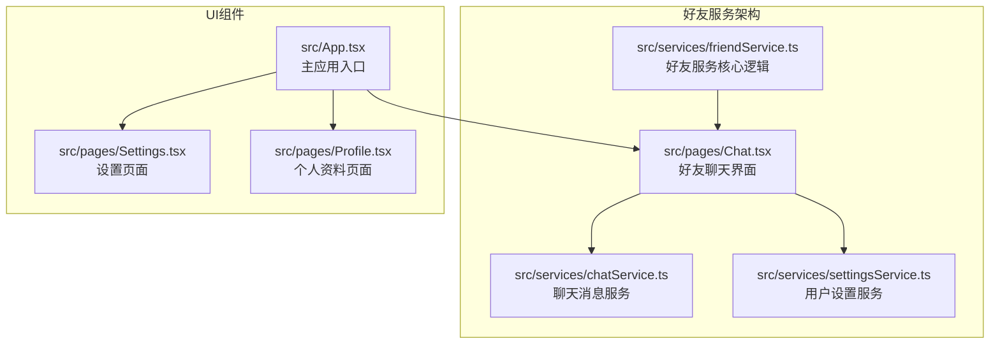

**图表来源**
- [friendService.ts:1-151](file://src/services/friendService.ts#L1-L151)
- [Chat.tsx:1-381](file://src/pages/Chat.tsx#L1-L381)
- [chatService.ts:1-72](file://src/services/chatService.ts#L1-L72)

**章节来源**
- [friendService.ts:1-151](file://src/services/friendService.ts#L1-L151)
- [Chat.tsx:1-381](file://src/pages/Chat.tsx#L1-L381)
- [chatService.ts:1-72](file://src/services/chatService.ts#L1-L72)

## 核心组件

### 数据模型

好友服务定义了两个核心数据接口：

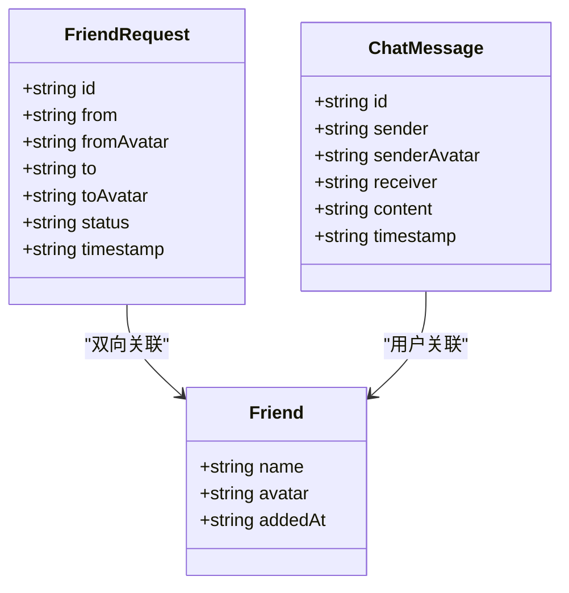

**图表来源**
- [friendService.ts:1-9](file://src/services/friendService.ts#L1-L9)
- [friendService.ts:11-15](file://src/services/friendService.ts#L11-L15)
- [chatService.ts:1-8](file://src/services/chatService.ts#L1-L8)

### 关键服务接口

好友服务提供了以下核心功能接口：

| 功能 | 函数名 | 参数 | 返回值 | 描述 |
|------|--------|------|--------|------|
| 发送好友申请 | sendFriendRequest | from, fromAvatar, to, toAvatar | FriendRequest[] | 创建新的好友申请 |
| 获取待处理申请 | getPendingRequests | userName | FriendRequest[] | 获取指定用户收到的待处理申请 |
| 获取已发送申请 | getSentRequests | userName | FriendRequest[] | 获取指定用户发出的所有申请 |
| 接受好友申请 | acceptRequest | requestId | {requests, friends} | 接受好友申请并建立双向好友关系 |
| 拒绝好友申请 | rejectRequest | requestId | FriendRequest[] | 拒绝好友申请 |
| 删除好友 | removeFriend | friendName | Friend[] | 从好友列表中移除好友 |
| 获取好友列表 | getFriends | 无 | Friend[] | 获取当前用户的好友列表 |

**章节来源**
- [friendService.ts:74-150](file://src/services/friendService.ts#L74-L150)

## 架构概览

好友服务采用分层架构设计，实现了清晰的关注点分离：

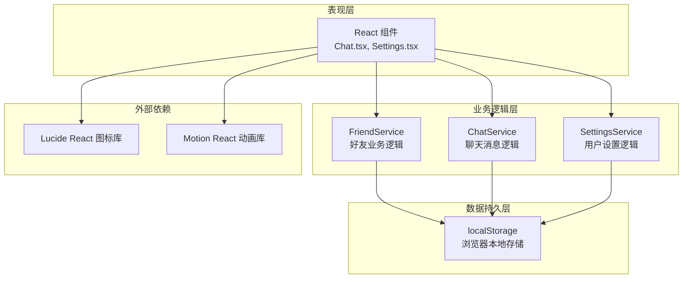

**图表来源**
- [App.tsx:1-246](file://src/App.tsx#L1-L246)
- [Chat.tsx:1-381](file://src/pages/Chat.tsx#L1-L381)
- [friendService.ts:1-151](file://src/services/friendService.ts#L1-L151)

## 详细组件分析

### 好友服务核心实现

#### 数据持久化策略

好友服务使用 localStorage 实现数据持久化，通过不同的存储键区分不同类型的数据：

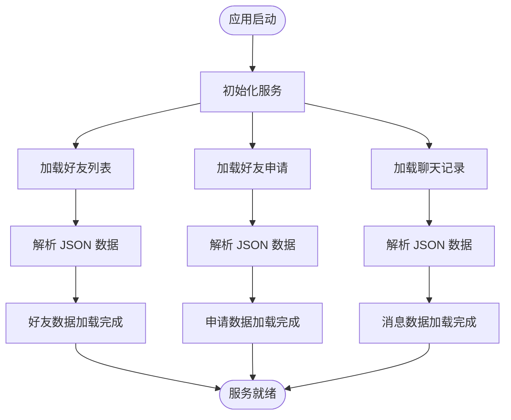

**图表来源**
- [friendService.ts:48-72](file://src/services/friendService.ts#L48-L72)
- [chatService.ts:34-42](file://src/services/chatService.ts#L34-L42)

#### 好友申请处理流程

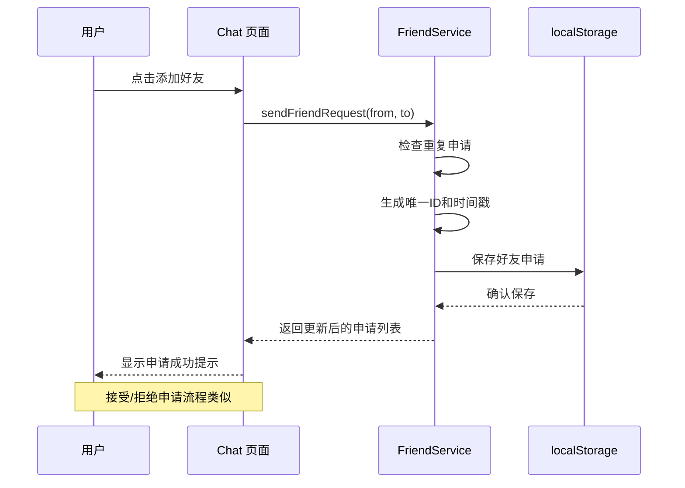

**图表来源**
- [Chat.tsx:76-80](file://src/pages/Chat.tsx#L76-L80)
- [friendService.ts:74-100](file://src/services/friendService.ts#L74-L100)

#### 好友关系管理

好友服务实现了双向关系管理，确保好友关系的完整性：

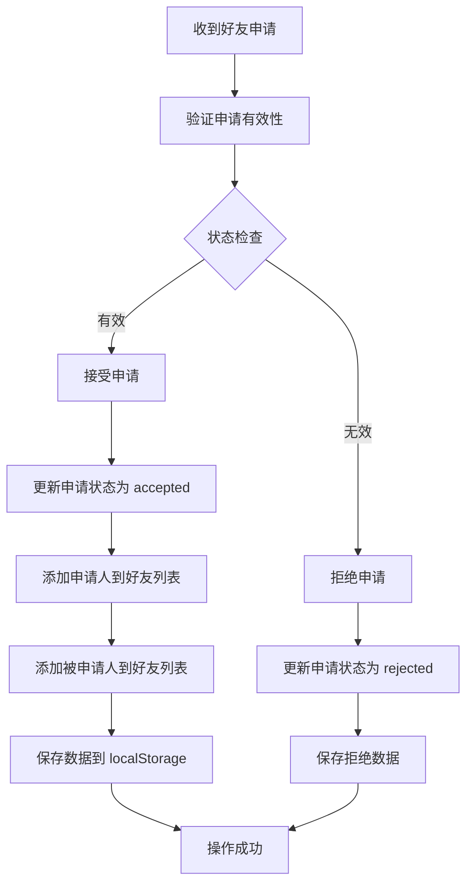

**图表来源**
- [friendService.ts:112-134](file://src/services/friendService.ts#L112-L134)

### 聊天服务集成

#### 消息存储机制

聊天服务与好友服务紧密集成，实现了基于用户对的消息存储：

```mermaid
classDiagram
class ChatService {
+getMessages(userA, userB) ChatMessage[]
+sendMessage(sender, receiver, content) ChatMessage[]
-getChatKey(userA, userB) string
-generateId() string
-getBeijingTime() string
}
class FriendService {
+getFriends() Friend[]
+sendFriendRequest(from, to) FriendRequest[]
+acceptRequest(requestId) {requests, friends}
+rejectRequest(requestId) FriendRequest[]
+removeFriend(friendName) Friend[]
}
ChatService --> FriendService : "用户验证"
ChatService --> localStorage : "消息存储"
FriendService --> localStorage : "好友数据"
```

**图表来源**
- [chatService.ts:29-32](file://src/services/chatService.ts#L29-L32)
- [friendService.ts:61-72](file://src/services/friendService.ts#L61-L72)

#### 在线状态跟踪

虽然当前版本主要基于本地存储，但系统设计支持未来扩展在线状态跟踪功能：

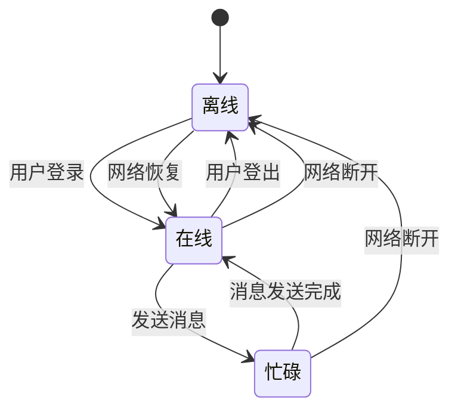

### 用户界面集成

#### 好友聊天界面

好友聊天界面提供了完整的社交交互体验：

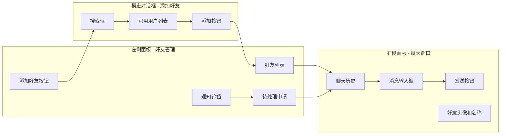

**图表来源**
- [Chat.tsx:105-381](file://src/pages/Chat.tsx#L105-L381)

**章节来源**
- [Chat.tsx:1-381](file://src/pages/Chat.tsx#L1-L381)
- [friendService.ts:1-151](file://src/services/friendService.ts#L1-L151)

## 依赖关系分析

### 外部依赖

好友服务依赖以下主要外部库：

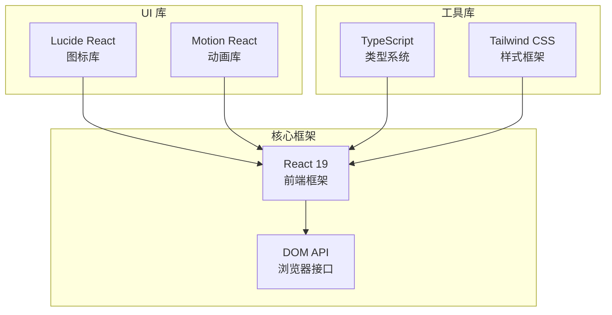

**图表来源**
- [package.json:13-28](file://package.json#L13-L28)

### 内部依赖关系

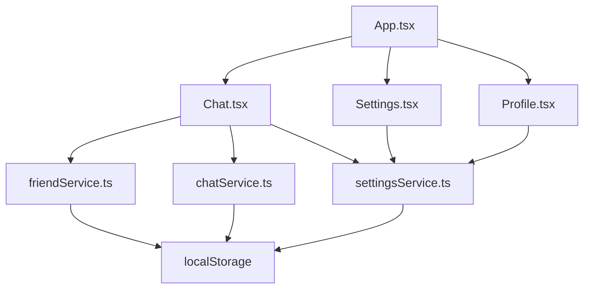

**图表来源**
- [App.tsx:23-31](file://src/App.tsx#L23-L31)
- [Chat.tsx:14-26](file://src/pages/Chat.tsx#L14-L26)

**章节来源**
- [package.json:1-42](file://package.json#L1-L42)
- [App.tsx:1-246](file://src/App.tsx#L1-L246)

## 性能考虑

### 数据存储优化

好友服务采用了高效的本地存储策略：

1. **键值存储设计**: 使用特定的存储键区分不同类型的数据，避免数据冲突
2. **增量更新**: 仅更新受影响的数据片段，减少不必要的存储操作
3. **错误处理**: 全面的 try-catch 机制确保数据操作的健壮性

### 内存管理

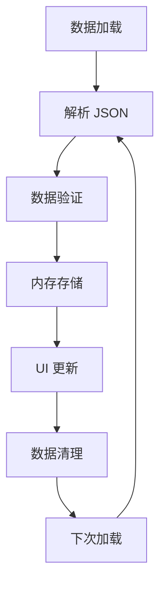

### 扩展性考虑

当前实现支持以下扩展方向：

1. **缓存策略**: 实现 LRU 缓存减少内存占用
2. **批量操作**: 支持批量好友操作提升用户体验
3. **数据同步**: 实现本地与云端数据同步机制

## 故障排除指南

### 常见问题及解决方案

#### 数据丢失问题

**症状**: 好友列表或聊天记录消失
**原因**: 浏览器清除数据或存储空间不足
**解决方案**: 
1. 检查浏览器存储容量
2. 确认 localStorage 权限
3. 实现数据备份机制

#### 同步问题

**症状**: 多设备间数据不同步
**原因**: 本地存储限制
**解决方案**:
1. 实现云端数据同步
2. 添加数据导入导出功能
3. 提供跨设备登录支持

#### 性能问题

**症状**: 页面加载缓慢或响应迟滞
**原因**: 大量数据导致的性能问题
**解决方案**:
1. 实现数据分页加载
2. 优化数据结构
3. 添加数据压缩机制

**章节来源**
- [friendService.ts:48-72](file://src/services/friendService.ts#L48-L72)
- [chatService.ts:34-42](file://src/services/chatService.ts#L34-L42)

## 结论

智课通 AI Tutor 项目的好友服务展现了现代前端应用的优秀实践，通过精心设计的架构实现了完整的社交功能。该服务具有以下特点：

1. **模块化设计**: 清晰的职责分离和接口定义
2. **数据持久化**: 基于 localStorage 的可靠数据存储
3. **用户体验**: 直观的界面设计和流畅的交互体验
4. **扩展性**: 支持未来功能扩展和性能优化

该服务为开发者提供了良好的基础，可以在此基础上实现更复杂的功能，如在线状态跟踪、实时消息推送、好友搜索算法等高级特性。

## 附录

### 开发者实践指导

#### 扩展好友关系类型

要添加新的好友关系类型，需要：

1. 在数据模型中添加新的关系类型
2. 更新相应的服务接口
3. 在 UI 中添加对应的显示逻辑

#### 自定义隐私设置

实现自定义隐私设置的方法：

1. 在用户设置中添加隐私选项
2. 在好友服务中实现权限控制
3. 在 UI 中提供设置界面

#### 安全最佳实践

1. **数据验证**: 对所有用户输入进行严格验证
2. **权限控制**: 实施细粒度的访问控制
3. **数据加密**: 对敏感数据进行加密存储
4. **审计日志**: 记录重要的用户操作