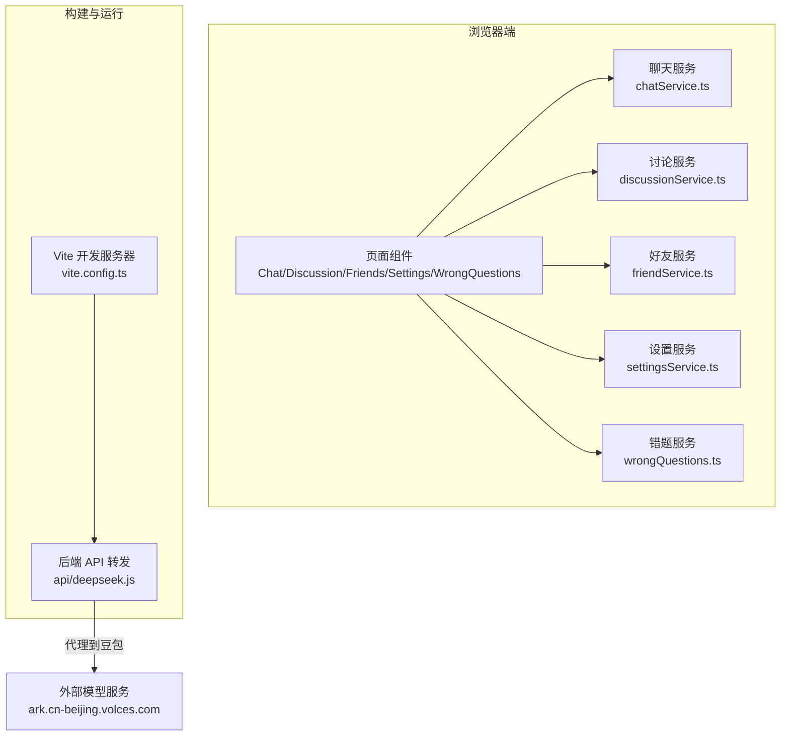
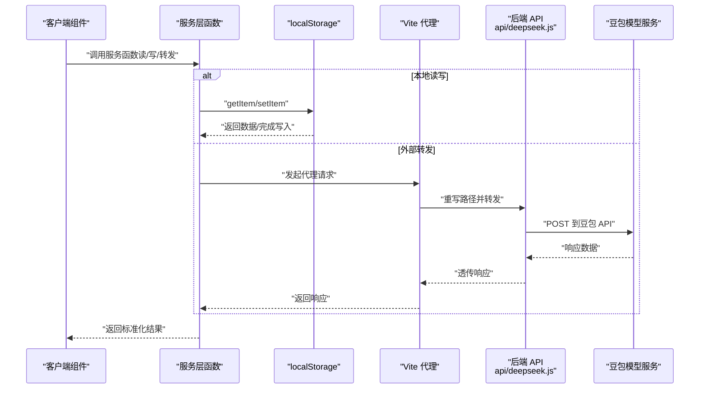
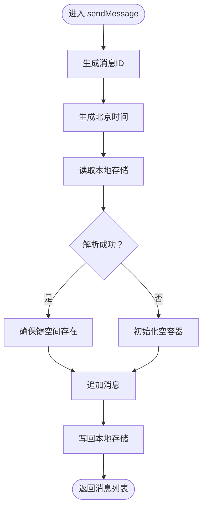
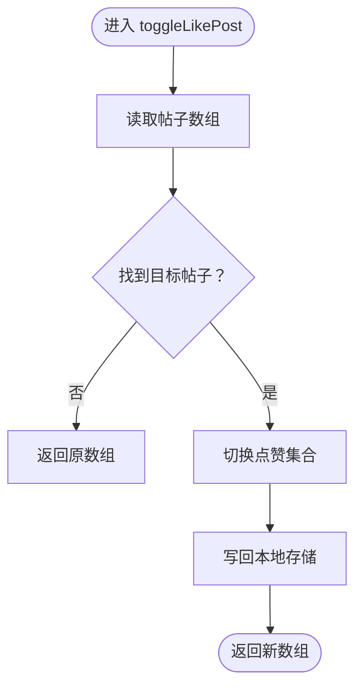
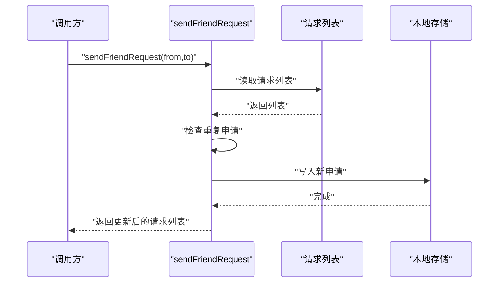
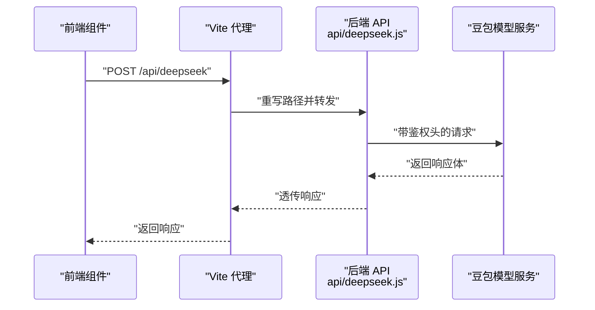
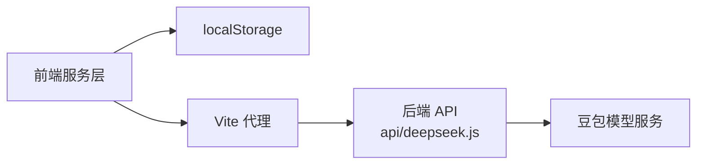

# 服务层设计

<cite>
**本文引用的文件**
- [src/services/chatService.ts](file://src/services/chatService.ts)
- [src/services/discussionService.ts](file://src/services/discussionService.ts)
- [src/services/friendService.ts](file://src/services/friendService.ts)
- [src/services/settingsService.ts](file://src/services/settingsService.ts)
- [src/services/wrongQuestions.ts](file://src/services/wrongQuestions.ts)
- [api/deepseek.js](file://api/deepseek.js)
- [vite.config.ts](file://vite.config.ts)
- [package.json](file://package.json)
- [README.md](file://README.md)
</cite>

## 目录
1. [引言](#引言)
2. [项目结构](#项目结构)
3. [核心组件](#核心组件)
4. [架构总览](#架构总览)
5. [详细组件分析](#详细组件分析)
6. [依赖分析](#依赖分析)
7. [性能考量](#性能考量)
8. [故障排查指南](#故障排查指南)
9. [结论](#结论)
10. [附录](#附录)

## 引言
本文件面向“智课通 AI Tutor”项目的前端服务层，系统性梳理服务层架构、数据持久化策略与错误处理机制；明确各服务模块的职责边界、接口设计与数据传输模式；结合现有实现，给出 DeepSeek/豆包 API 集成、本地存储管理、异步处理与状态同步的实践建议，并提供扩展与定制指导。

## 项目结构
服务层位于 src/services 下，围绕聊天、讨论区、好友关系、用户设置与错题本等业务域提供纯前端本地持久化的服务函数；同时通过 Vite 代理与后端 API 文件实现对外部模型服务（如豆包）的转发。

图表来源
- [vite.config.ts:1-31](file://vite.config.ts#L1-L31)
- [api/deepseek.js:1-34](file://api/deepseek.js#L1-L34)

章节来源
- [vite.config.ts:1-31](file://vite.config.ts#L1-L31)
- [api/deepseek.js:1-34](file://api/deepseek.js#L1-L34)

## 核心组件
- 聊天服务：提供用户间消息的生成、时间戳、本地存储读写与键空间组织。
- 讨论服务：提供帖子的增删改查、点赞、评论、置顶与解决标记等操作。
- 好友服务：提供好友申请、接受/拒绝、删除好友与本地持久化。
- 设置服务：提供用户偏好设置的读取、保存与默认值合并。
- 错题服务：提供错题记录的增删清空与本地持久化。
- 外部 API 转发：通过 Vite 代理与后端 API 文件，将前端请求转发至豆包模型服务。

章节来源
- [src/services/chatService.ts:1-72](file://src/services/chatService.ts#L1-L72)
- [src/services/discussionService.ts:1-155](file://src/services/discussionService.ts#L1-L155)
- [src/services/friendService.ts:1-151](file://src/services/friendService.ts#L1-L151)
- [src/services/settingsService.ts:1-50](file://src/services/settingsService.ts#L1-L50)
- [src/services/wrongQuestions.ts:1-35](file://src/services/wrongQuestions.ts#L1-L35)
- [api/deepseek.js:1-34](file://api/deepseek.js#L1-L34)

## 架构总览
服务层采用“纯前端本地持久化 + 外部模型服务转发”的混合架构：
- 本地持久化：所有业务数据均使用 localStorage 存储，避免后端耦合，便于离线与快速迭代。
- 外部模型服务：通过 Vite 代理与后端 API 文件，将前端请求转发至豆包服务，实现多模态能力接入。
- 数据一致性：本地服务函数内部通过 try/catch 保证容错；对外暴露统一的数据结构与方法签名，便于上层组件调用。

图表来源
- [vite.config.ts:22-28](file://vite.config.ts#L22-L28)
- [api/deepseek.js:9-33](file://api/deepseek.js#L9-L33)

## 详细组件分析

### 聊天服务（chatService）
职责与接口
- 生成消息 ID、北京时间字符串、用户间聊天键空间。
- 提供获取消息列表与发送消息的函数，内部进行本地存储读写与异常兜底。

数据结构与复杂度
- ChatMessage 结构简单，字段固定；消息列表按键空间组织，查找与插入为 O(n)（n 为该键空间下消息数量）。
- 本地存储为 JSON 字符串，整体读写为 O(m)（m 为全部键空间的序列化大小）。

错误处理与边界
- 读取/解析失败或写入失败时，函数返回空数组或单条消息，避免抛出异常影响 UI。

图表来源
- [src/services/chatService.ts:44-71](file://src/services/chatService.ts#L44-L71)

章节来源
- [src/services/chatService.ts:1-72](file://src/services/chatService.ts#L1-L72)

### 讨论服务（discussionService）
职责与接口
- 定义讨论帖子与评论的数据结构，提供获取、创建、点赞、评论、置顶、解决标记与删除等操作。
- 所有操作基于 localStorage 的统一键空间，支持并发修改与状态切换。

数据结构与复杂度
- DiscussionPost 与 DiscussionComment 均为扁平对象，操作主要为数组遍历与更新，时间复杂度 O(n)。
- 本地存储为完整帖子数组，读写为 O(n)（n 为帖子总数）。

错误处理与边界
- 解析失败时返回空数组；未找到目标帖子/评论时直接返回原数组，不抛错。

图表来源
- [src/services/discussionService.ts:76-89](file://src/services/discussionService.ts#L76-L89)

章节来源
- [src/services/discussionService.ts:1-155](file://src/services/discussionService.ts#L1-L155)

### 好友服务（friendService）
职责与接口
- 管理好友申请与好友列表，提供发送申请、获取待处理/已发送申请、接受/拒绝、删除好友等。
- 使用两个键空间分别存储申请与好友列表，避免交叉污染。

数据结构与复杂度
- FriendRequest 与 Friend 为轻量对象，操作为数组查找与去重，时间复杂度 O(n)。
- 本地存储为两个数组，读写为 O(n)。

错误处理与边界
- 重复申请被拒绝；接受申请时双向去重添加，失败则返回当前状态。

图表来源
- [src/services/friendService.ts:75-100](file://src/services/friendService.ts#L75-L100)

章节来源
- [src/services/friendService.ts:1-151](file://src/services/friendService.ts#L1-L151)

### 设置服务（settingsService）
职责与接口
- 统一管理用户偏好设置，提供读取、保存、默认值合并与常用查询（昵称、头像）。
- 默认值集中定义，便于快速定制与迁移。

数据结构与复杂度
- 用户设置为单一对象，读写为 O(1)。

错误处理与边界
- 解析失败时回退到默认值，保证 UI 正常渲染。

章节来源
- [src/services/settingsService.ts:1-50](file://src/services/settingsService.ts#L1-L50)

### 错题服务（wrongQuestions）
职责与接口
- 提供错题记录的读取、新增、删除与清空，统一使用数组头部插入，便于按时间倒序展示。

数据结构与复杂度
- 错题数组为 O(n) 查找与删除；新增为 O(1)。

章节来源
- [src/services/wrongQuestions.ts:1-35](file://src/services/wrongQuestions.ts#L1-L35)

### 外部模型服务集成（DeepSeek/豆包）
职责与接口
- 通过后端 API 文件实现对豆包模型服务的转发，前端通过 Vite 代理访问。
- 后端 API 文件负责鉴权头拼接与响应透传。

图表来源
- [vite.config.ts:22-28](file://vite.config.ts#L22-L28)
- [api/deepseek.js:9-33](file://api/deepseek.js#L9-L33)

章节来源
- [vite.config.ts:1-31](file://vite.config.ts#L1-L31)
- [api/deepseek.js:1-34](file://api/deepseek.js#L1-L34)

## 依赖分析
- 内部依赖
  - 所有服务模块仅依赖浏览器内置的 localStorage 与标准日期/随机数工具，无第三方依赖。
- 外部依赖
  - 构建期：Vite 用于开发服务器与代理配置。
  - 运行期：后端 API 文件依赖 Node.js 环境（在部署平台作为 Serverless 执行）。
- 关键耦合点
  - Vite 代理规则与后端 API 路径重写必须保持一致，否则转发失败。
  - 后端 API 文件中的鉴权信息需与实际服务密钥一致。

图表来源
- [vite.config.ts:22-28](file://vite.config.ts#L22-L28)
- [api/deepseek.js:14-33](file://api/deepseek.js#L14-L33)

章节来源
- [vite.config.ts:1-31](file://vite.config.ts#L1-L31)
- [api/deepseek.js:1-34](file://api/deepseek.js#L1-L34)

## 性能考量
- 本地存储读写
  - 读写为 O(1) 次操作，但序列化/反序列化成本与数据总量相关；建议控制单个键空间规模，必要时拆分键或分页加载。
- 数组操作
  - 讨论与错题服务的数组遍历为 O(n)，建议在 UI 层做虚拟滚动与懒加载，减少一次性渲染压力。
- 外部请求
  - 豆包转发为网络 IO，建议在 UI 层增加加载态与超时/重试策略；对长文本输入可做节流与分片处理。
- 缓存与去重
  - 好友服务在接受申请时进行双向去重，避免重复好友项；可在 UI 层缓存常用头像与昵称，减少重复计算。

## 故障排查指南
常见问题与定位
- 无法读取/保存数据
  - 检查浏览器隐私模式或禁用 localStorage 的情况；确认键名是否被意外覆盖。
- 豆包转发失败
  - 确认 Vite 代理路径与后端 API 重写一致；核对后端 API 文件中的鉴权头与服务地址。
- 时间显示异常
  - 检查本地时区设置与北京时间转换逻辑；确保 UI 层格式化一致。
- 重复申请或重复好友
  - 检查去重逻辑与键空间命名；确保在写入前进行幂等判断。

章节来源
- [src/services/chatService.ts:34-42](file://src/services/chatService.ts#L34-L42)
- [src/services/discussionService.ts:76-89](file://src/services/discussionService.ts#L76-L89)
- [src/services/friendService.ts:82-87](file://src/services/friendService.ts#L82-L87)
- [api/deepseek.js:14-33](file://api/deepseek.js#L14-L33)
- [vite.config.ts:22-28](file://vite.config.ts#L22-L28)

## 结论
服务层通过“纯前端本地持久化 + 外部模型服务转发”的方式，实现了低耦合、易扩展与快速迭代的架构。聊天、讨论、好友、设置与错题等模块职责清晰，接口简洁，具备良好的可维护性。建议在后续版本中引入更细粒度的错误日志、数据校验与增量持久化策略，以进一步提升稳定性与性能。

## 附录
- 最佳实践
  - 本地数据：统一键空间命名与版本迁移策略；对大对象进行分片或压缩。
  - 外部服务：统一鉴权与错误码映射；在 UI 层提供重试与降级提示。
  - 接口设计：保持函数幂等与不可变更新；对数组类操作返回新数组，避免副作用。
- 安全考虑
  - 鉴权头与密钥应通过后端 API 管理，前端避免直接暴露敏感信息。
  - 对用户输入进行最小权限校验与长度限制，防止滥用。
- 扩展与定制
  - 新增业务模块时，遵循现有键空间命名与默认值合并模式。
  - 外部模型服务替换时，调整后端 API 与 Vite 代理配置，保持路径一致。