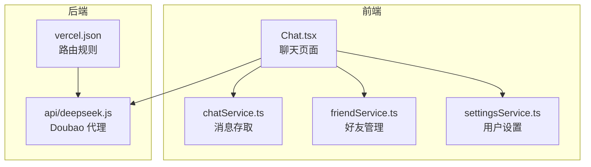
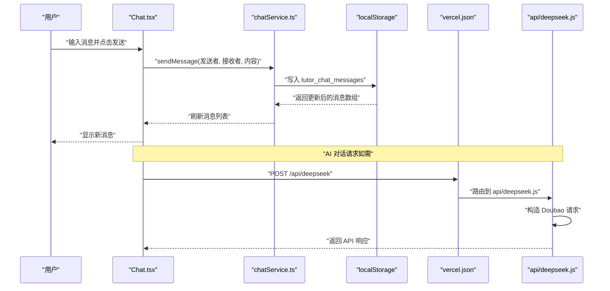
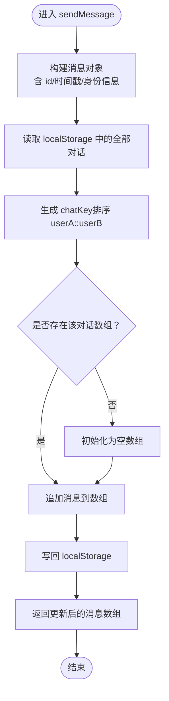
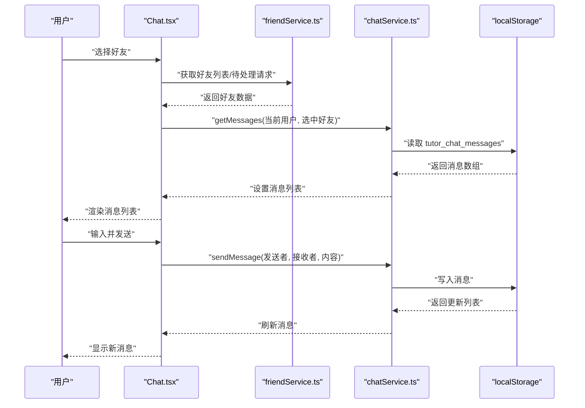
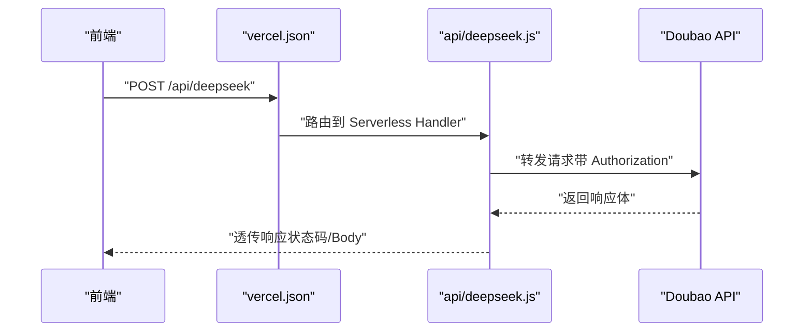
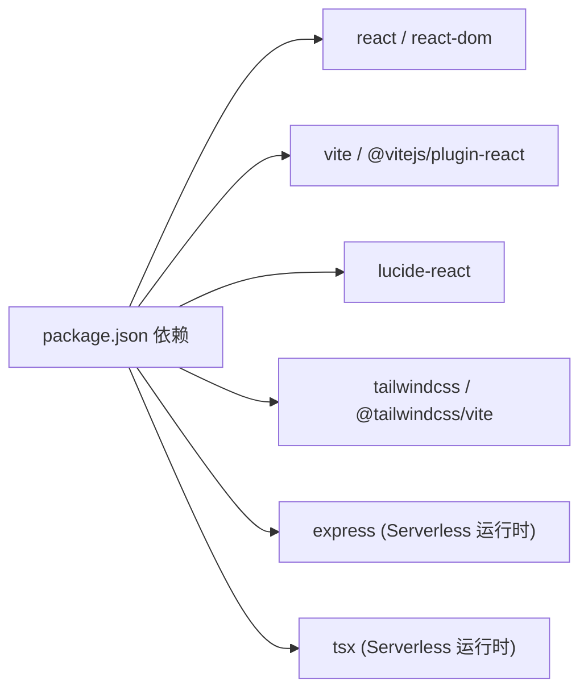

# 聊天服务

<cite>
**本文引用的文件**
- [chatService.ts](file://src/services/chatService.ts)
- [Chat.tsx](file://src/pages/Chat.tsx)
- [friendService.ts](file://src/services/friendService.ts)
- [settingsService.ts](file://src/services/settingsService.ts)
- [deepseek.js](file://api/deepseek.js)
- [vercel.json](file://vercel.json)
- [package.json](file://package.json)
- [AGENTS.md](file://AGENTS.md)
</cite>

## 目录
1. [简介](#简介)
2. [项目结构](#项目结构)
3. [核心组件](#核心组件)
4. [架构总览](#架构总览)
5. [详细组件分析](#详细组件分析)
6. [依赖关系分析](#依赖关系分析)
7. [性能考虑](#性能考虑)
8. [故障排除指南](#故障排除指南)
9. [结论](#结论)
10. [附录](#附录)

## 简介
本文件为智课通 AI Tutor 项目的聊天服务提供系统化技术文档。重点覆盖以下方面：
- 聊天服务的整体架构与模块职责
- 消息处理流程与本地存储机制
- AI 对话集成现状与扩展建议（当前仓库中以 Doubao API 代理为主）
- 聊天状态管理、消息队列与实时通信实现
- 多代理切换、上下文保持与会话管理
- 配置选项、性能优化与故障排除
- 开发者扩展聊天功能与自定义 AI 代理的实践指导

## 项目结构
聊天服务主要由三部分组成：
- 前端页面与状态管理：负责用户交互、好友选择、消息展示与发送
- 聊天消息持久化：基于 localStorage 的消息存储与检索
- AI 对话代理：通过 Vercel Serverless Function 转发至 Doubao API

图表来源
- [Chat.tsx:1-381](file://src/pages/Chat.tsx#L1-L381)
- [chatService.ts:1-72](file://src/services/chatService.ts#L1-L72)
- [friendService.ts](file://src/services/friendService.ts)
- [settingsService.ts:1-49](file://src/services/settingsService.ts#L1-L49)
- [vercel.json:1-6](file://vercel.json#L1-L6)
- [deepseek.js:1-34](file://api/deepseek.js#L1-L34)

章节来源
- [Chat.tsx:1-381](file://src/pages/Chat.tsx#L1-L381)
- [chatService.ts:1-72](file://src/services/chatService.ts#L1-L72)
- [friendService.ts](file://src/services/friendService.ts)
- [settingsService.ts:1-49](file://src/services/settingsService.ts#L1-L49)
- [vercel.json:1-6](file://vercel.json#L1-L6)
- [deepseek.js:1-34](file://api/deepseek.js#L1-L34)

## 核心组件
- 聊天消息模型与存储
  - ChatMessage 接口定义消息字段
  - 本地存储键值 tutor_chat_messages，按 userA::userB 排序生成 chatKey
  - 提供 getMessages 与 sendMessage 两个核心方法
- 好友系统
  - 好友列表、申请、接受、拒绝、删除等操作
  - 可添加用户集合 AVAILABLE_USERS
- 用户设置
  - 当前用户昵称与头像，用于消息发送时的身份标识
- 页面交互
  - 选择好友 → 加载消息 → 输入发送 → 自动滚动到底部

章节来源
- [chatService.ts:1-72](file://src/services/chatService.ts#L1-L72)
- [Chat.tsx:28-98](file://src/pages/Chat.tsx#L28-L98)
- [friendService.ts](file://src/services/friendService.ts)
- [settingsService.ts:43-49](file://src/services/settingsService.ts#L43-L49)

## 架构总览
聊天服务采用“前端本地存储 + 后端 API 代理”的轻量架构：
- 前端负责 UI 与状态管理，消息持久化使用 localStorage
- AI 对话通过 Vercel Serverless Function 代理 Doubao API，避免前端暴露密钥
- 路由规则将 /api/deepseek 转发到 api/deepseek.js

图表来源
- [Chat.tsx:62-74](file://src/pages/Chat.tsx#L62-L74)
- [chatService.ts:44-71](file://src/services/chatService.ts#L44-L71)
- [vercel.json:1-6](file://vercel.json#L1-L6)
- [deepseek.js:9-33](file://api/deepseek.js#L9-L33)

## 详细组件分析

### 组件一：聊天消息服务（chatService.ts）
- 设计要点
  - 使用 localStorage 作为消息存储介质，键为 tutor_chat_messages
  - 按 userA::userB 排序生成 chatKey，确保双向一致性
  - 时间戳使用北京时间字符串，便于本地展示
  - 生成唯一消息 ID，避免重复
- 数据结构与复杂度
  - getMessages：O(1) 读取；sendMessage：O(n) 写入（n 为该对话消息数量）
- 错误处理
  - JSON 解析与存储异常时返回空或单条消息，保证 UI 不崩溃
- 性能与扩展
  - 当前为单页应用本地存储，适合小规模聊天
  - 如需扩展，建议引入分页加载、增量同步与去重策略

图表来源
- [chatService.ts:44-71](file://src/services/chatService.ts#L44-L71)

章节来源
- [chatService.ts:1-72](file://src/services/chatService.ts#L1-L72)

### 组件二：聊天页面（Chat.tsx）
- 功能概述
  - 好友列表与申请通知
  - 选择好友后加载对应对话
  - 输入框发送消息并自动滚动到底部
  - 添加好友弹窗与好友管理操作
- 状态管理
  - useState 管理好友、选中好友、消息列表、输入框、待处理请求等
  - useEffect 监听选中好友变化与消息列表变化，触发滚动
- 与服务层交互
  - 通过 friendService 获取好友与请求
  - 通过 chatService 读写消息
  - 通过 settingsService 获取当前用户身份信息

图表来源
- [Chat.tsx:28-98](file://src/pages/Chat.tsx#L28-L98)
- [chatService.ts:34-71](file://src/services/chatService.ts#L34-L71)
- [friendService.ts](file://src/services/friendService.ts)

章节来源
- [Chat.tsx:1-381](file://src/pages/Chat.tsx#L1-L381)

### 组件三：AI 对话代理（api/deepseek.js 与 vercel.json）
- 当前实现
  - api/deepseek.js 作为 Vercel Serverless Function，接收前端 POST 请求
  - 将请求转发至 Doubao API（ark.cn-beijing.volces.com/api/v3/responses）
  - 返回原始响应给前端
- 配置与路由
  - vercel.json 将 /api/deepseek/(.*) 重写到 api/deepseek
  - 服务端 body 大小限制为 10MB，支持较大图片上传
- 错误处理
  - 代理层捕获异常并返回 500 与错误信息
- 扩展建议
  - 未来可替换为 DeepSeek API 或其他模型，只需调整代理函数与前端调用点
  - 建议增加速率限制、缓存与日志审计

图表来源
- [deepseek.js:9-33](file://api/deepseek.js#L9-L33)
- [vercel.json:1-6](file://vercel.json#L1-L6)

章节来源
- [deepseek.js:1-34](file://api/deepseek.js#L1-L34)
- [vercel.json:1-6](file://vercel.json#L1-L6)

### 组件四：好友系统与用户设置
- 好友系统
  - 提供好友增删、申请、接受/拒绝、删除等能力
  - 可添加用户集合 AVAILABLE_USERS
- 用户设置
  - 提供当前用户昵称与头像的读取接口
  - 用于聊天消息发送时的身份标识

章节来源
- [friendService.ts](file://src/services/friendService.ts)
- [settingsService.ts:43-49](file://src/services/settingsService.ts#L43-L49)

## 依赖关系分析
- 前端依赖
  - React 19、Vite 6、Tailwind CSS v4
  - lucide-react 图标库
  - 无 react-router，页面切换通过 App.tsx 状态控制
- 后端依赖
  - Express、tsx 仅用于 Vercel Serverless 运行时
- 关键约定
  - @ 路径别名指向项目根目录
  - 环境变量 GEMINI_API_KEY（用于其他 Agent）与 Doubao Key（当前硬编码于代理层）

图表来源
- [package.json:13-28](file://package.json#L13-L28)

章节来源
- [package.json:1-42](file://package.json#L1-L42)
- [AGENTS.md:14-25](file://AGENTS.md#L14-L25)

## 性能考虑
- 本地存储读写
  - getMessages 为 O(1)，sendMessage 为 O(n)
  - 建议在消息较多时进行分页加载与去重
- UI 渲染
  - 使用 useRef 自动滚动到底部，避免不必要的重排
  - 列表项按需渲染，减少大列表的重绘
- 网络请求
  - Doubao 代理层已做 10MB body 限制，适合图片上传场景
  - 建议前端在发送前做长度与格式校验
- 缓存与并发
  - 可在代理层增加缓存策略（如针对相同输入的响应缓存）
  - 避免重复请求同一问题

## 故障排除指南
- Doubao 代理 500 错误
  - 检查 api/deepseek.js 是否正确转发请求
  - 确认 vercel.json 的路由规则是否生效
- 前端无法显示消息
  - 检查 localStorage 中 tutor_chat_messages 是否存在
  - 确认 chatKey 生成逻辑（排序 userA::userB）是否一致
- 环境变量与密钥
  - AGENTS.md 指出 Doubao Key 当前硬编码于代理层
  - 其他 Agent 的 GEMINI_API_KEY 需要在 .env.local 中配置并通过 Vite 注入
- 跨域与路由
  - 确保 /api/deepseek 路由被 vercel.json 正确重写

章节来源
- [deepseek.js:30-32](file://api/deepseek.js#L30-L32)
- [vercel.json:1-6](file://vercel.json#L1-L6)
- [AGENTS.md:14-16](file://AGENTS.md#L14-L16)

## 结论
智课通 AI Tutor 的聊天服务采用轻量级前端本地存储与 Vercel Serverless 代理的组合方案，满足基础的好友聊天与 AI 对话需求。当前以 Doubao API 为核心，具备良好的可扩展性。后续可在以下方向演进：
- 引入更完善的会话管理与上下文保持机制
- 增强消息队列与实时通信能力（如 WebSocket）
- 支持多代理切换与动态系统提示词
- 优化性能与可维护性（分页、缓存、去重、日志）

## 附录

### 多代理切换与上下文保持建议
- 多代理切换
  - 在前端维护代理配置表，按 agentKey 选择不同 system prompt 与模型参数
  - 通过 settingsService 或全局状态管理当前偏好代理
- 上下文保持
  - 将历史消息按会话 ID 分组，避免跨会话污染
  - 对长对话进行截断与摘要，维持上下文窗口上限
- 会话管理
  - 新建会话时生成唯一 ID，并记录创建时间与标题
  - 支持会话列表、重命名、删除与导出

### 配置选项与最佳实践
- 前端
  - 使用 @ 路径别名简化导入
  - Tailwind v4 通过 @theme 块配置主题色
  - 无 react-router，页面切换通过 App.tsx 状态控制
- 后端
  - 通过 vercel.json 配置 cleanUrls 与路由重写
  - api/deepseek.js 设置 body 大小限制以适配图片上传
- 安全
  - Doubao Key 当前硬编码于代理层，建议迁移到环境变量与受控的代理层
  - 其他 Agent 的 API Key 通过 .env.local 与 Vite 注入

章节来源
- [AGENTS.md:14-25](file://AGENTS.md#L14-L25)
- [vercel.json:1-6](file://vercel.json#L1-L6)
- [deepseek.js:1-7](file://api/deepseek.js#L1-L7)