# 讨论服务

<cite>
**本文档引用的文件**
- [discussionService.ts](file://src/services/discussionService.ts)
- [Discussion.tsx](file://src/pages/Discussion.tsx)
- [App.tsx](file://src/App.tsx)
- [settingsService.ts](file://src/services/settingsService.ts)
- [Login.tsx](file://src/pages/Login.tsx)
- [Settings.tsx](file://src/pages/Settings.tsx)
- [package.json](file://package.json)
- [README.md](file://README.md)
</cite>

## 目录
1. [简介](#简介)
2. [项目结构](#项目结构)
3. [核心组件](#核心组件)
4. [架构概览](#架构概览)
5. [详细组件分析](#详细组件分析)
6. [依赖关系分析](#依赖关系分析)
7. [性能考虑](#性能考虑)
8. [故障排除指南](#故障排除指南)
9. [结论](#结论)
10. [附录](#附录)

## 简介

智课通 AI Tutor 项目的讨论服务是一个基于本地存储的社区互动平台，为学生提供学术讨论、问题解答和知识分享的功能。该服务实现了完整的讨论生态系统，包括话题管理、用户交互、内容审核和社区治理等功能。

讨论服务的核心特点：
- 基于浏览器本地存储的无服务器架构
- 支持多学科主题分类（高数、线性代数、Python、深度学习）
- 实时点赞和评论系统
- 管理员权限控制（精华贴和问题解决状态）
- 用户个性化设置集成

## 项目结构

讨论服务在项目中的组织结构如下：

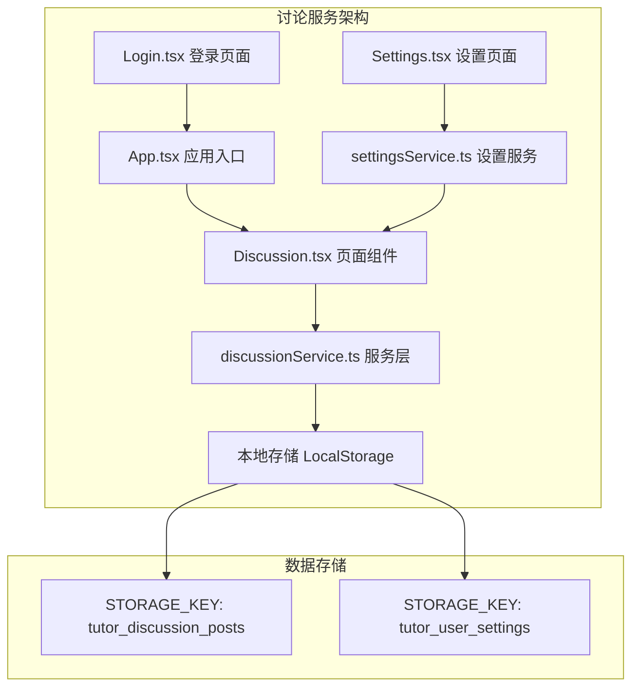

**图表来源**
- [Discussion.tsx: 1-800:1-800](file://src/pages/Discussion.tsx#L1-L800)
- [discussionService.ts: 1-155:1-155](file://src/services/discussionService.ts#L1-L155)
- [App.tsx: 1-246:1-246](file://src/App.tsx#L1-L246)

**章节来源**
- [Discussion.tsx: 1-800:1-800](file://src/pages/Discussion.tsx#L1-L800)
- [discussionService.ts: 1-155:1-155](file://src/services/discussionService.ts#L1-L155)
- [App.tsx: 1-246:1-246](file://src/App.tsx#L1-L246)

## 核心组件

### 数据模型

讨论服务采用简洁而强大的数据模型设计：

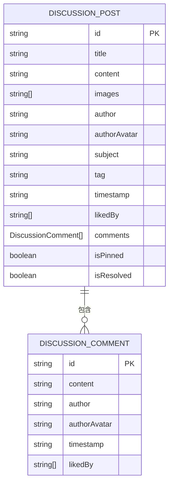

**图表来源**
- [discussionService.ts: 10-24:10-24](file://src/services/discussionService.ts#L10-L24)

### 主要功能模块

1. **帖子管理**：创建、删除、编辑讨论帖子
2. **评论系统**：支持嵌套评论和实时更新
3. **点赞机制**：用户对帖子和评论进行点赞
4. **内容标记**：精华贴和问题解决状态管理
5. **过滤筛选**：按最新、精华、未解决状态过滤

**章节来源**
- [discussionService.ts: 45-155:45-155](file://src/services/discussionService.ts#L45-L155)

## 架构概览

讨论服务采用分层架构设计，确保关注点分离和代码可维护性：

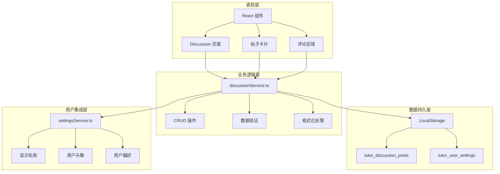

**图表来源**
- [Discussion.tsx: 16-30:16-30](file://src/pages/Discussion.tsx#L16-L30)
- [discussionService.ts: 26-56:26-56](file://src/services/discussionService.ts#L26-L56)
- [settingsService.ts: 13-50:13-50](file://src/services/settingsService.ts#L13-L50)

## 详细组件分析

### 讨论服务核心实现

讨论服务的核心功能通过单一的服务文件实现，提供了完整的 CRUD 操作：

#### 数据访问模式

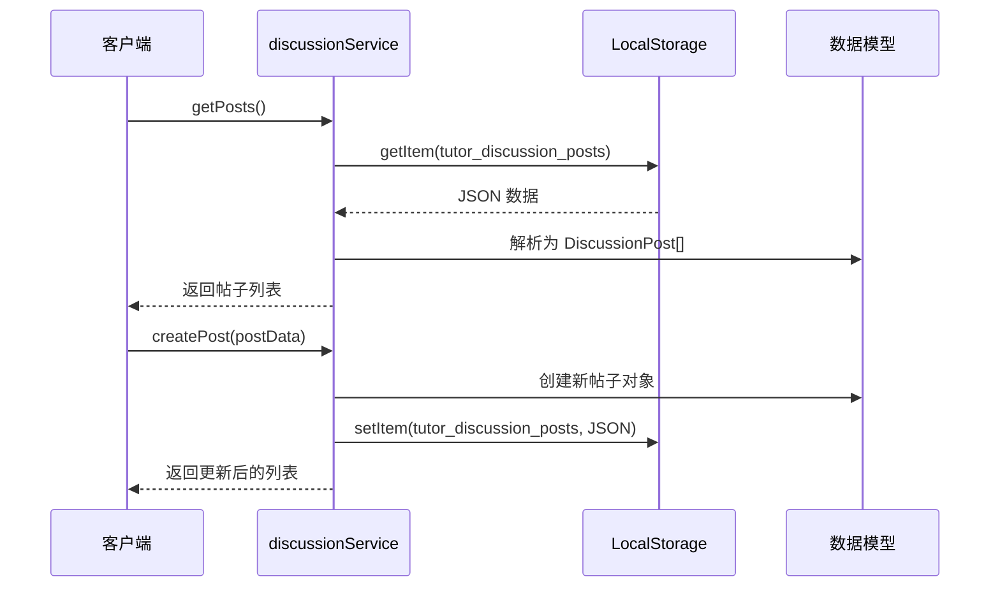

**图表来源**
- [discussionService.ts: 45-74:45-74](file://src/services/discussionService.ts#L45-L74)

#### 用户交互处理

讨论服务实现了丰富的用户交互功能：

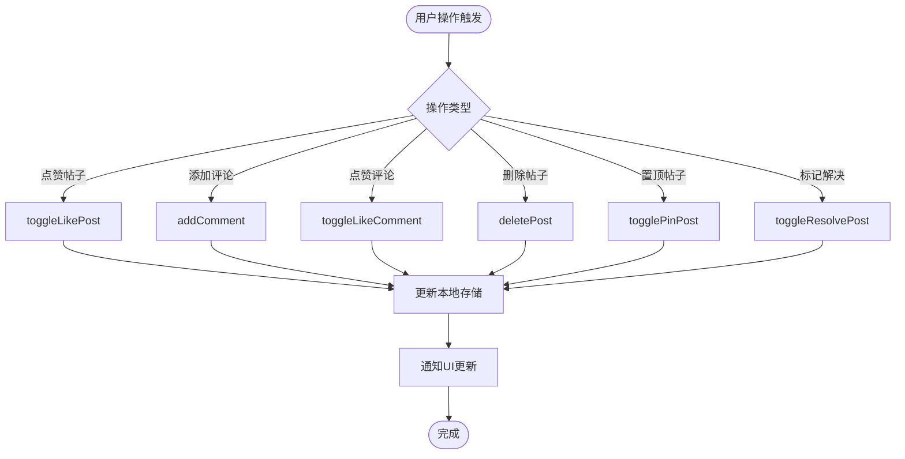

**图表来源**
- [discussionService.ts: 76-154:76-154](file://src/services/discussionService.ts#L76-L154)

**章节来源**
- [discussionService.ts: 1-155:1-155](file://src/services/discussionService.ts#L1-L155)

### 页面组件实现

讨论页面组件提供了完整的用户界面和交互体验：

#### 帖子展示系统

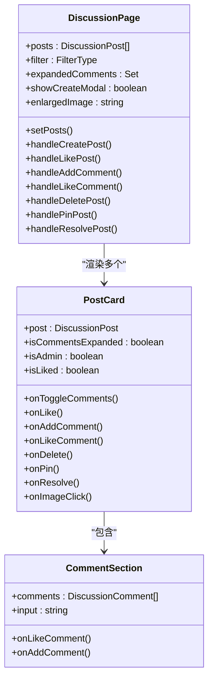

**图表来源**
- [Discussion.tsx: 42-308:42-308](file://src/pages/Discussion.tsx#L42-L308)
- [Discussion.tsx: 327-473:327-473](file://src/pages/Discussion.tsx#L327-L473)
- [Discussion.tsx: 483-579:483-579](file://src/pages/Discussion.tsx#L483-L579)

#### 用户认证集成

讨论服务与用户认证系统无缝集成：

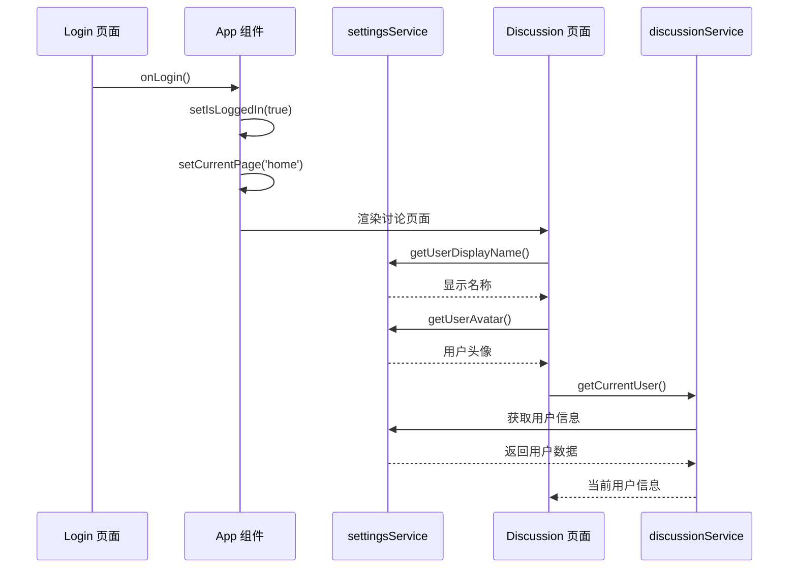

**图表来源**
- [Login.tsx: 48-56:48-56](file://src/pages/Login.tsx#L48-L56)
- [App.tsx: 35-60:35-60](file://src/App.tsx#L35-L60)
- [settingsService.ts: 43-49:43-49](file://src/services/settingsService.ts#L43-L49)

**章节来源**
- [Discussion.tsx: 1-800:1-800](file://src/pages/Discussion.tsx#L1-L800)
- [App.tsx: 1-246:1-246](file://src/App.tsx#L1-L246)

### 权限控制系统

讨论服务实现了基于角色的权限控制：

#### 管理员权限

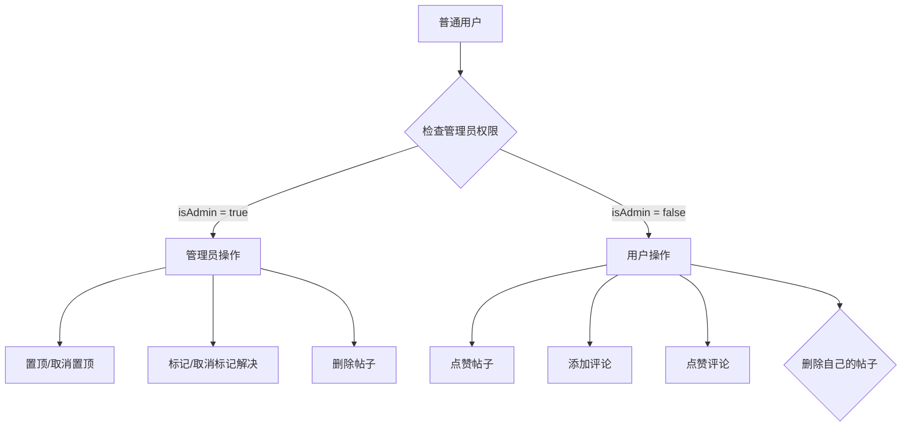

**图表来源**
- [Discussion.tsx: 366-400:366-400](file://src/pages/Discussion.tsx#L366-L400)

#### 内容审核机制

讨论服务内置了基本的内容审核功能：

- **图片限制**：最多4张图片，每张不超过2MB
- **文本验证**：标题不能为空，内容必须有实际内容
- **用户身份验证**：所有操作都需要有效的用户身份
- **数据完整性**：自动处理缺失字段和异常情况

**章节来源**
- [Discussion.tsx: 594-767:594-767](file://src/pages/Discussion.tsx#L594-L767)

## 依赖关系分析

### 外部依赖

讨论服务主要依赖以下外部库：

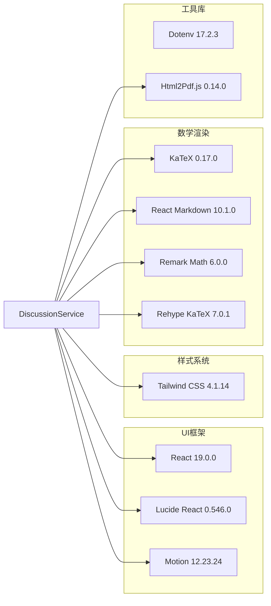

**图表来源**
- [package.json: 13-28:13-28](file://package.json#L13-L28)

### 内部依赖关系

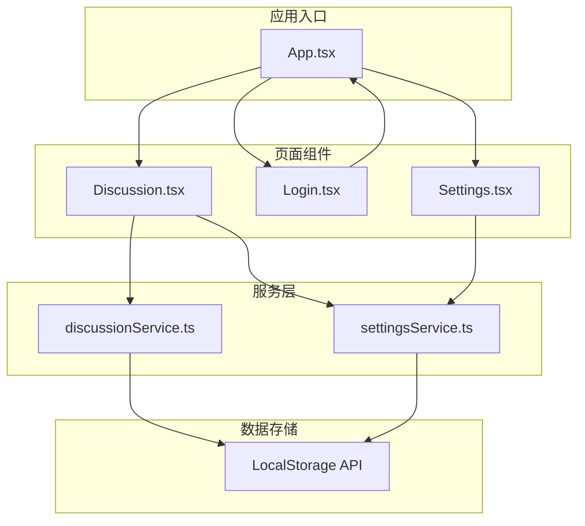

**图表来源**
- [App.tsx: 22-31:22-31](file://src/App.tsx#L22-L31)
- [Discussion.tsx: 16-28:16-28](file://src/pages/Discussion.tsx#L16-L28)

**章节来源**
- [package.json: 1-42:1-42](file://package.json#L1-L42)
- [App.tsx: 1-246:1-246](file://src/App.tsx#L1-L246)

## 性能考虑

### 本地存储优化

讨论服务针对本地存储进行了专门的性能优化：

#### 存储策略

- **单键存储**：使用单一键 `tutor_discussion_posts` 存储所有讨论数据
- **批量操作**：所有 CRUD 操作都进行批量读取和写入
- **内存缓存**：在组件中维护本地状态副本，减少重复读取

#### 性能指标

| 操作类型 | 时间复杂度 | 空间复杂度 | 优化策略 |
|---------|-----------|-----------|----------|
| 读取帖子 | O(n) | O(n) | 单次读取，批量解析 |
| 创建帖子 | O(n) | O(n) | 在内存中操作后一次性写入 |
| 点赞操作 | O(n) | O(1) | 局部更新，避免全量重写 |
| 过滤显示 | O(n) | O(k) | 客户端过滤，减少网络请求 |

### 用户体验优化

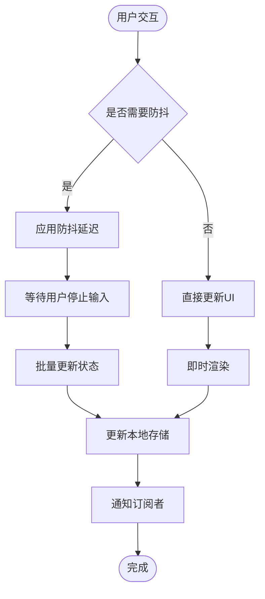

**图表来源**
- [Discussion.tsx: 49-51:49-51](file://src/pages/Discussion.tsx#L49-L51)

## 故障排除指南

### 常见问题诊断

#### 数据丢失问题

**症状**：讨论数据无法加载或丢失
**可能原因**：
- 浏览器禁用了本地存储
- 存储空间不足
- 数据格式损坏

**解决方案**：
1. 检查浏览器开发者工具的 Application 标签
2. 验证 `tutor_discussion_posts` 键是否存在
3. 使用浏览器的存储清理功能
4. 检查浏览器隐私设置

#### 性能问题

**症状**：页面加载缓慢或响应迟钝
**可能原因**：
- 帖子数量过多导致内存压力
- 频繁的重新渲染
- 大量图片数据

**优化建议**：
1. 实施虚拟滚动以处理大量帖子
2. 优化图片压缩和懒加载
3. 实现数据分页加载
4. 减少不必要的状态更新

#### 用户体验问题

**症状**：点赞状态不正确或评论显示异常
**排查步骤**：
1. 检查用户身份验证状态
2. 验证用户名唯一性
3. 确认点赞数组的去重逻辑
4. 检查时间戳格式一致性

**章节来源**
- [discussionService.ts: 45-56:45-56](file://src/services/discussionService.ts#L45-L56)
- [Discussion.tsx: 119-127:119-127](file://src/pages/Discussion.tsx#L119-L127)

## 结论

智课通 AI Tutor 项目的讨论服务展现了优秀的前端架构设计，通过合理的分层结构和本地存储策略，成功构建了一个功能完整、用户体验良好的社区讨论平台。

### 主要优势

1. **架构清晰**：分层设计确保了代码的可维护性和可测试性
2. **用户体验**：流畅的交互设计和即时反馈机制
3. **扩展性强**：模块化的组件设计便于功能扩展
4. **性能优化**：针对本地存储的专门优化策略

### 改进建议

1. **数据迁移**：考虑实现数据导入导出功能
2. **搜索功能**：添加全文搜索和标签过滤
3. **通知系统**：实现基于用户的实时通知
4. **内容审核**：集成更完善的审核机制

## 附录

### 配置参数

讨论服务的主要配置参数：

| 参数名 | 类型 | 默认值 | 描述 |
|--------|------|--------|------|
| MAX_IMAGES | number | 4 | 最大图片上传数量 |
| MAX_IMAGE_SIZE | number | 2MB | 图片文件大小限制 |
| STORAGE_KEY | string | 'tutor_discussion_posts' | 本地存储键名 |
| SUBJECTS | string[] | ['高数','线性代数','Python','深度学习'] | 学科主题列表 |
| TAGS | string[] | ['🆕 新问题','🔥 急需','💡 分享','❓ 求助'] | 帖子标签列表 |

### 开发指南

#### 自定义讨论功能

1. **添加新学科主题**：修改 SUBJECTS 数组
2. **扩展标签系统**：修改 TAGS 数组
3. **调整存储策略**：修改 STORAGE_KEY
4. **优化性能**：实施分页和虚拟滚动

#### 集成第三方讨论系统

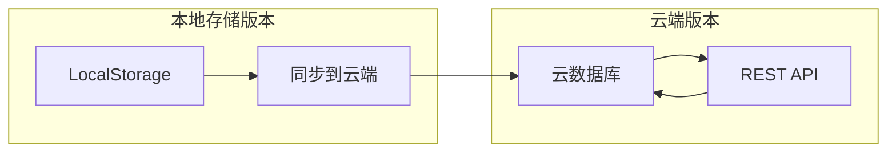

**章节来源**
- [Discussion.tsx: 37-38:37-38](file://src/pages/Discussion.tsx#L37-L38)
- [Discussion.tsx: 594-596:594-596](file://src/pages/Discussion.tsx#L594-L596)
- [discussionService.ts: 26](file://src/services/discussionService.ts#L26)