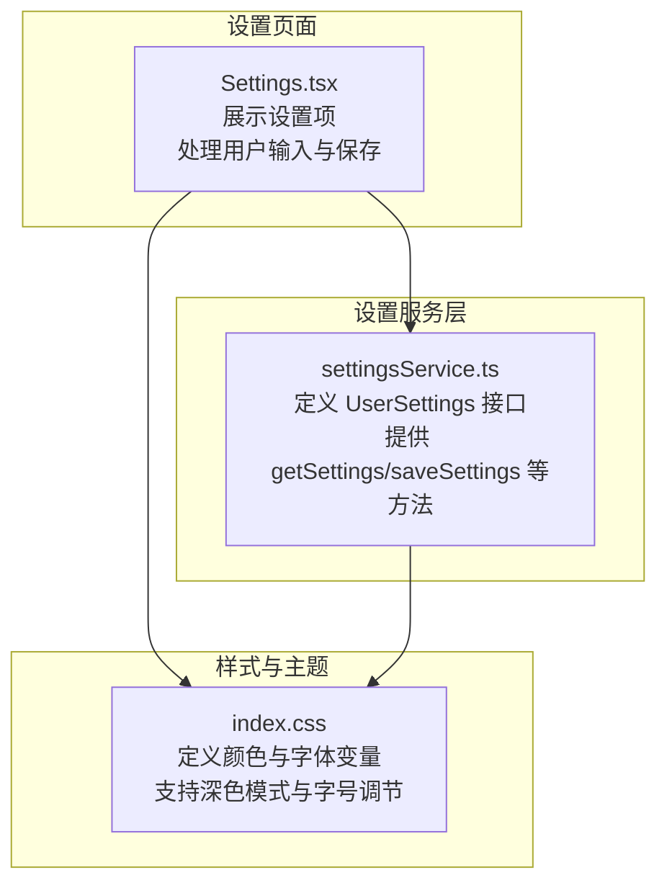
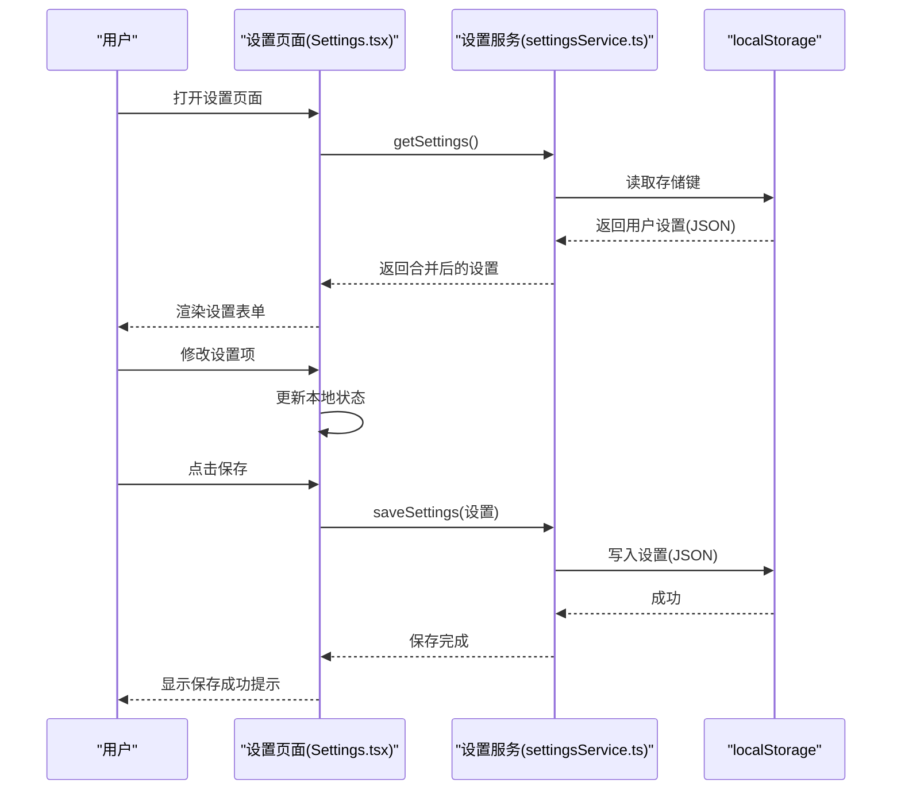
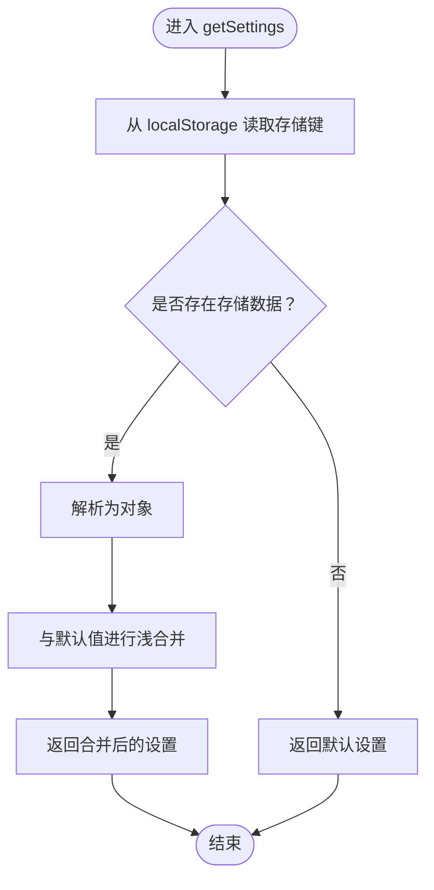
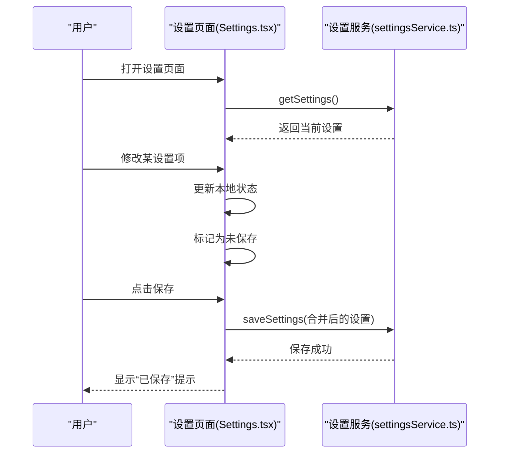
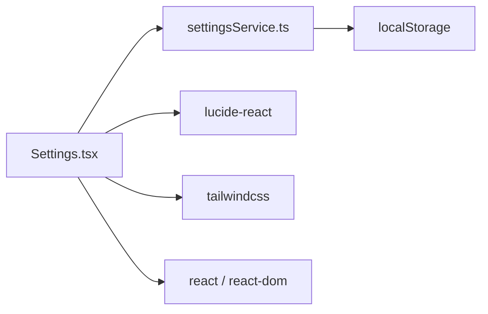

# 设置服务

<cite>
**本文引用的文件**
- [settingsService.ts](file://src/services/settingsService.ts)
- [Settings.tsx](file://src/pages/Settings.tsx)
- [index.css](file://src/index.css)
- [package.json](file://package.json)
- [README.md](file://README.md)
</cite>

## 目录
1. [简介](#简介)
2. [项目结构](#项目结构)
3. [核心组件](#核心组件)
4. [架构总览](#架构总览)
5. [详细组件分析](#详细组件分析)
6. [依赖分析](#依赖分析)
7. [性能考量](#性能考量)
8. [故障排查指南](#故障排查指南)
9. [结论](#结论)
10. [附录](#附录)

## 简介
本文件面向“智课通 AI Tutor”项目的设置服务，系统化阐述用户设置管理的架构设计、配置项管理与个性化定制机制。重点覆盖以下方面：
- 设置数据的存储方式与同步策略
- 默认值处理与数据合并策略
- 用户偏好设置、主题配置与功能开关的实现细节
- 设置验证规则、数据迁移与版本兼容性处理建议
- 设置服务的扩展接口、性能优化与缓存策略
- 为开发者提供自定义设置项与集成第三方配置系统的指导

## 项目结构
设置服务位于前端工程中，采用“服务层 + 页面组件”的分层设计：
- 服务层：封装设置的读取、保存与默认值合并逻辑
- 页面组件：提供设置界面，负责用户交互与实时预览
- 主题与样式：通过 CSS 变量与 Tailwind 配置实现主题切换与字体大小调节

图表来源
- [settingsService.ts:1-50](file://src/services/settingsService.ts#L1-L50)
- [Settings.tsx:1-369](file://src/pages/Settings.tsx#L1-L369)
- [index.css:1-33](file://src/index.css#L1-L33)

章节来源
- [settingsService.ts:1-50](file://src/services/settingsService.ts#L1-L50)
- [Settings.tsx:1-369](file://src/pages/Settings.tsx#L1-L369)
- [index.css:1-33](file://src/index.css#L1-L33)

## 核心组件
- 设置数据模型（UserSettings）：包含昵称、个性签名、头像、首选导师、每日复习时间、推送开关、深色模式、字体大小、邮箱等字段。
- 默认设置（DEFAULT_SETTINGS）：定义所有字段的默认值，用于首次加载或数据损坏时的兜底。
- 本地存储键（STORAGE_KEY）：统一的本地存储键名，保证设置持久化。
- 读取与保存函数：
  - getSettings：从 localStorage 读取用户设置，若存在则与默认值进行浅合并，否则返回默认值。
  - saveSettings：将当前设置写入 localStorage。
- 辅助函数：getUserDisplayName、getUserAvatar 提供便捷的用户展示信息。

章节来源
- [settingsService.ts:1-50](file://src/services/settingsService.ts#L1-L50)

## 架构总览
设置服务采用“单页应用 + 本地存储”的轻量架构：
- 数据持久化：localStorage
- 数据合并：默认值与用户设置浅合并
- 界面交互：React 组件负责表单渲染与变更通知
- 主题与样式：CSS 变量与 Tailwind 类控制深色模式与字号

图表来源
- [settingsService.ts:27-41](file://src/services/settingsService.ts#L27-L41)
- [Settings.tsx:32-68](file://src/pages/Settings.tsx#L32-L68)

## 详细组件分析

### 设置服务（settingsService.ts）
- 数据模型与默认值
  - UserSettings 接口定义了全部可配置项
  - DEFAULT_SETTINGS 提供默认值，确保首次使用与异常恢复时的可用性
- 读取策略
  - 从 localStorage 读取存储键
  - 若存在则解析为对象并与默认值进行浅合并，确保缺失字段由默认值补齐
  - 解析失败或无存储时返回默认值
- 保存策略
  - 将当前设置序列化后写入 localStorage
  - 保存时不会做字段校验，需在 UI 层或调用侧保证数据有效性
- 辅助函数
  - getUserDisplayName：优先使用昵称，不存在时回退到默认昵称
  - getUserAvatar：优先使用用户头像，不存在时回退到默认头像

图表来源
- [settingsService.ts:27-37](file://src/services/settingsService.ts#L27-L37)

章节来源
- [settingsService.ts:1-50](file://src/services/settingsService.ts#L1-L50)

### 设置页面（Settings.tsx）
- 组件职责
  - 初始化加载：组件挂载时调用 getSettings，确保初始状态与持久化一致
  - 实时编辑：每个设置项通过受控组件更新本地状态，同时触发“未保存”状态
  - 头像上传：限制文件大小，读取为 DataURL 并即时预览
  - 保存与取消：保存时写入 localStorage；取消时回滚到当前持久化状态
- 设置项与交互
  - 个人资料：昵称、个性签名、头像上传
  - 学习设置：首选导师（多导师可选）、每日复习时间、推送开关
  - 通用设置：深色模式、字体大小（滑杆）、界面语言（固定为简体中文）
  - 账户安全：绑定邮箱展示、重置密码入口、注销账户入口
- UI 与主题联动
  - 深色模式与字号通过 CSS 变量与 Tailwind 类控制
  - 头像错误时回退到默认头像

图表来源
- [Settings.tsx:32-68](file://src/pages/Settings.tsx#L32-L68)
- [settingsService.ts:27-41](file://src/services/settingsService.ts#L27-L41)

章节来源
- [Settings.tsx:1-369](file://src/pages/Settings.tsx#L1-L369)

### 主题与样式（index.css）
- CSS 变量定义：集中管理主色、容器色、表面色与文本色等
- 深色模式：通过 CSS 变量与 Tailwind 类实现主题切换
- 字号调节：通过 CSS 变量与 Tailwind 类控制全局字体大小
- 其他样式：玻璃面板、渐变背景等视觉效果

章节来源
- [index.css:1-33](file://src/index.css#L1-L33)

## 依赖分析
- 设置服务依赖
  - localStorage：用于设置的持久化存储
  - UserSettings 接口：约束设置数据结构
- 设置页面依赖
  - 设置服务：读取与保存设置
  - 图标库：lucide-react，用于界面图标
  - Tailwind CSS：用于主题与布局
- 外部依赖
  - React 与 React DOM：页面渲染与生命周期
  - lucide-react：图标
  - tailwindcss：样式框架

图表来源
- [Settings.tsx:19-23](file://src/pages/Settings.tsx#L19-L23)
- [package.json:13-28](file://package.json#L13-L28)

章节来源
- [package.json:13-28](file://package.json#L13-L28)
- [README.md:16-20](file://README.md#L16-L20)

## 性能考量
- 本地存储访问
  - 读取与保存均为 O(1) 操作，性能开销极低
  - 建议避免在高频事件中频繁保存，可在用户停止编辑一段时间后批量保存
- 渲染优化
  - 使用受控组件与最小化状态更新，减少不必要的重渲染
  - 对大范围设置项的保存操作可增加防抖
- 样式与主题
  - 深色模式与字号切换通过 CSS 变量与 Tailwind 类实现，切换成本低
  - 头像加载失败时的回退逻辑避免了额外请求

[本节为通用性能建议，不直接分析具体文件，故无章节来源]

## 故障排查指南
- 设置无法读取或丢失
  - 检查 localStorage 中的存储键是否存在
  - 若解析失败，服务会回退到默认值；确认存储数据格式是否合法
- 头像上传失败
  - 文件大小超过限制会弹出提示；请确保不超过 2MB
  - DataURL 读取失败时，界面会回退到默认头像
- 深色模式与字号未生效
  - 确认 CSS 变量与 Tailwind 类是否正确应用
  - 检查浏览器是否禁用了 CSS 变量或相关样式

章节来源
- [settingsService.ts:27-37](file://src/services/settingsService.ts#L27-L37)
- [Settings.tsx:47-62](file://src/pages/Settings.tsx#L47-L62)
- [index.css:1-33](file://src/index.css#L1-L33)

## 结论
设置服务以简洁的 localStorage 为基础，结合默认值合并策略，实现了稳定可靠的用户设置管理。页面组件提供了直观的交互体验，配合 CSS 变量与 Tailwind 实现了主题与字号的灵活定制。未来可在验证、迁移与版本兼容性方面进一步增强，以满足更复杂的配置场景。

[本节为总结性内容，不直接分析具体文件，故无章节来源]

## 附录

### 设置数据模型与默认值
- 数据模型：UserSettings
  - 字段：昵称、个性签名、头像、首选导师、每日复习时间、推送开关、深色模式、字体大小、邮箱
- 默认值：DEFAULT_SETTINGS
  - 为每个字段提供合理默认值，确保首次使用与异常恢复时的可用性

章节来源
- [settingsService.ts:1-25](file://src/services/settingsService.ts#L1-L25)

### 设置验证规则与数据迁移建议
- 验证规则（建议）
  - 字段类型校验：如时间格式、布尔值、数值范围（字号 12-24）
  - 字段长度与格式：如邮箱格式、头像 URL 合法性
  - 互斥与依赖：如“推送开关开启时才允许设置复习时间”
- 数据迁移与版本兼容
  - 新增字段：在读取时进行默认值合并，避免破坏旧数据
  - 字段重命名：提供迁移脚本或版本化存储键，逐步替换旧键
  - 版本号：在存储中加入版本字段，便于后续升级策略

[本节为扩展建议，不直接分析具体文件，故无章节来源]

### 扩展接口与第三方集成
- 扩展接口
  - 增加设置验证函数：在保存前进行字段校验
  - 增加设置订阅：提供变更回调，实现跨组件共享
  - 增加批量导入/导出：支持设置的备份与迁移
- 第三方配置系统集成
  - 云端同步：在本地存储基础上增加远程同步（需注意隐私与安全）
  - A/B 实验：通过配置开关控制实验组与对照组
  - 多环境配置：按环境（开发/测试/生产）加载不同默认值

[本节为扩展建议，不直接分析具体文件，故无章节来源]