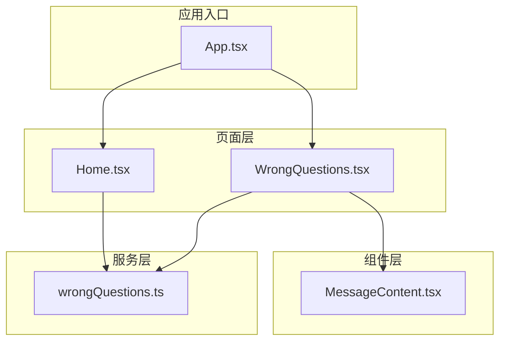
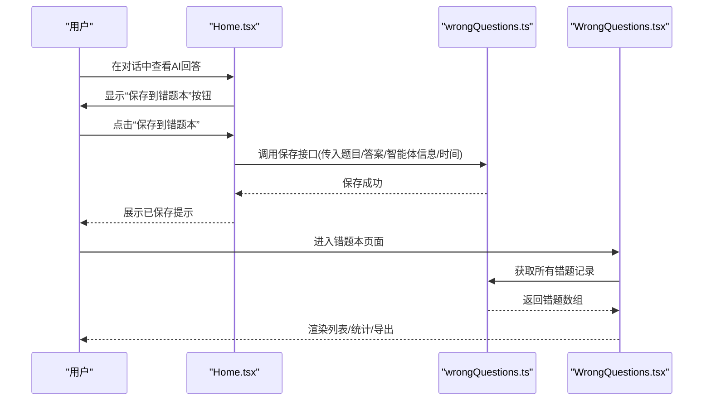
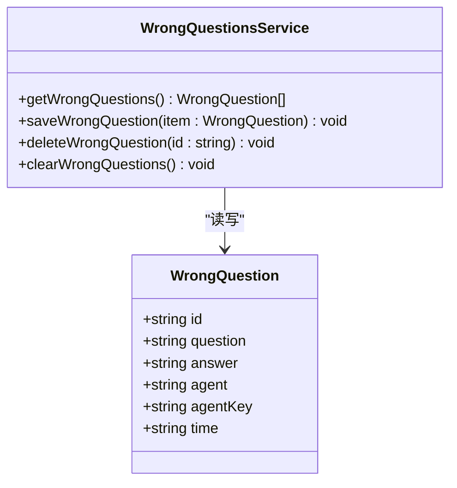
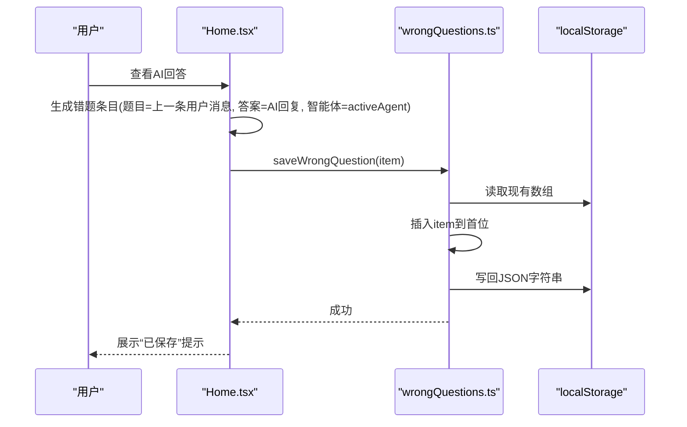
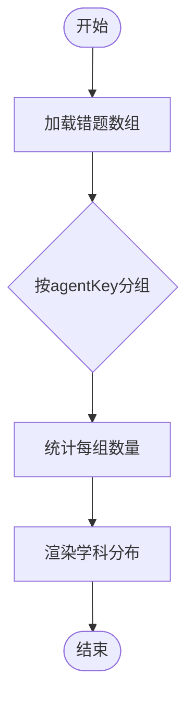
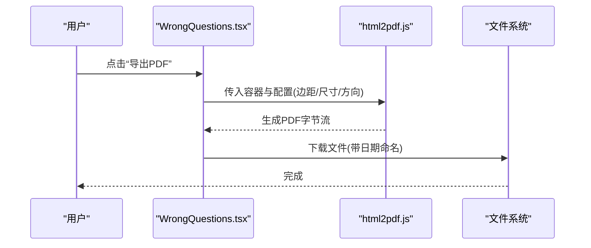
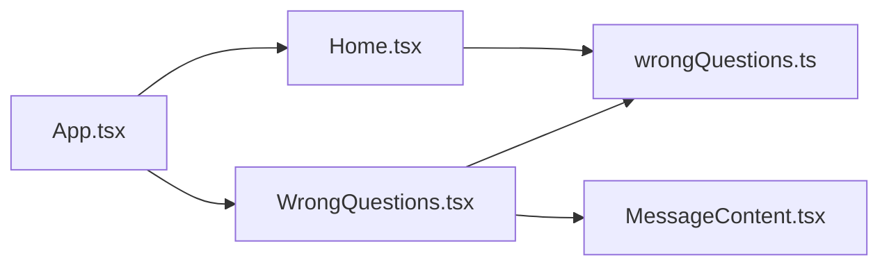

# 错题本服务

<cite>
**本文引用的文件**
- [src/pages/WrongQuestions.tsx](file://src/pages/WrongQuestions.tsx)
- [src/services/wrongQuestions.ts](file://src/services/wrongQuestions.ts)
- [src/pages/Home.tsx](file://src/pages/Home.tsx)
- [src/App.tsx](file://src/App.tsx)
- [src/components/MessageContent.tsx](file://src/components/MessageContent.tsx)
- [package.json](file://package.json)
- [README.md](file://README.md)
</cite>

## 目录
1. [简介](#简介)
2. [项目结构](#项目结构)
3. [核心组件](#核心组件)
4. [架构总览](#架构总览)
5. [详细组件分析](#详细组件分析)
6. [依赖关系分析](#依赖关系分析)
7. [性能考虑](#性能考虑)
8. [故障排查指南](#故障排查指南)
9. [结论](#结论)
10. [附录](#附录)

## 简介
本文件面向“智课通 AI Tutor”项目的错题本服务，系统性阐述其架构设计、数据模型与学习分析机制，覆盖错题记录的创建流程、分类管理、复习提醒能力、数据存储与检索、统计分析、以及可扩展的难度评估、知识点关联与学习进度跟踪建议。同时提供备份与恢复策略、性能优化方案与开发者实践指导。

## 项目结构
错题本相关的核心文件集中在前端页面与服务层：
- 页面层：错题列表页负责展示、筛选、导出与删除；首页提供“保存到错题本”的入口。
- 服务层：封装本地存储的增删查与清空操作。
- 组件层：消息内容渲染组件用于安全显示富文本/Markdown等。
- 应用路由：通过应用主入口进行页面切换。

图表来源
- [src/pages/Home.tsx](file://src/pages/Home.tsx)
- [src/pages/WrongQuestions.tsx](file://src/pages/WrongQuestions.tsx)
- [src/services/wrongQuestions.ts](file://src/services/wrongQuestions.ts)
- [src/components/MessageContent.tsx](file://src/components/MessageContent.tsx)
- [src/App.tsx](file://src/App.tsx)

章节来源
- [src/pages/WrongQuestions.tsx](file://src/pages/WrongQuestions.tsx)
- [src/services/wrongQuestions.ts](file://src/services/wrongQuestions.ts)
- [src/pages/Home.tsx](file://src/pages/Home.tsx)
- [src/App.tsx](file://src/App.tsx)
- [src/components/MessageContent.tsx](file://src/components/MessageContent.tsx)

## 核心组件
- 错题数据模型：定义错题记录的字段集合，包括唯一标识、题目、答案、所属智能体名称与键、记录时间等。
- 本地存储服务：提供获取、新增、删除、清空错题记录的统一接口，基于浏览器本地存储实现。
- 错题列表页面：负责渲染错题列表、筛选学科、展开详情、导出 PDF、删除错题，并统计学科分布。
- 首页入口：在对话结束时提供“保存到错题本”的快捷按钮，触发错题记录创建。
- 消息内容组件：对题目与答案内容进行安全渲染，支持富文本/Markdown等格式。

章节来源
- [src/services/wrongQuestions.ts](file://src/services/wrongQuestions.ts)
- [src/pages/WrongQuestions.tsx](file://src/pages/WrongQuestions.tsx)
- [src/pages/Home.tsx](file://src/pages/Home.tsx)
- [src/components/MessageContent.tsx](file://src/components/MessageContent.tsx)

## 架构总览
错题本采用“页面 + 服务 + 组件 + 路由”的分层架构，数据持久化采用浏览器本地存储，保证离线可用与零后端成本。整体交互流程从首页对话触发，到错题列表展示与分析，再到导出与清理。

图表来源
- [src/pages/Home.tsx](file://src/pages/Home.tsx)
- [src/services/wrongQuestions.ts](file://src/services/wrongQuestions.ts)
- [src/pages/WrongQuestions.tsx](file://src/pages/WrongQuestions.tsx)

## 详细组件分析

### 数据模型与存储
- 数据模型：错题记录包含唯一ID、题目、答案、智能体名称、智能体键、记录时间等字段，便于后续扩展难度、知识点标签与复习提醒。
- 存储策略：以单一键名集中存储错题数组，新增时插入头部，删除时过滤，清空时写入空数组。该策略简单可靠，适合小规模个人使用场景。

图表来源
- [src/services/wrongQuestions.ts](file://src/services/wrongQuestions.ts)

章节来源
- [src/services/wrongQuestions.ts](file://src/services/wrongQuestions.ts)

### 错题记录创建流程（从对话到错题本）
- 触发点：在首页对话界面，当AI回复完成后出现“保存到错题本”按钮。
- 参数组装：从前一条用户消息与当前AI回复生成错题条目，填充智能体名称与键、记录时间等。
- 写入逻辑：调用服务层保存接口，将新条目插入数组首位并写回本地存储。
- 反馈与状态：标记该对话片段已保存，避免重复保存；列表页刷新后可见新增条目。

图表来源
- [src/pages/Home.tsx](file://src/pages/Home.tsx)
- [src/services/wrongQuestions.ts](file://src/services/wrongQuestions.ts)

章节来源
- [src/pages/Home.tsx](file://src/pages/Home.tsx)
- [src/services/wrongQuestions.ts](file://src/services/wrongQuestions.ts)

### 分类管理与学科分布统计
- 分类依据：以智能体键作为学科/科目分类键，页面提供下拉筛选。
- 统计实现：遍历错题数组按智能体键聚合数量，形成学科分布图所需的数据结构。
- 展示方式：侧边栏以条形图形式呈现各学科数量与占比，无数据时提示暂无。

图表来源
- [src/pages/WrongQuestions.tsx](file://src/pages/WrongQuestions.tsx)

章节来源
- [src/pages/WrongQuestions.tsx](file://src/pages/WrongQuestions.tsx)

### 复习提醒与导出机制
- 复习提醒：当前版本未内置定时提醒功能，可在服务层扩展“下次复习时间”字段与调度器，结合浏览器通知或本地计划任务实现。
- 导出PDF：在筛选后的错题列表基础上，动态构建HTML容器，使用第三方库将DOM转为PDF并下载，包含基础样式与图片质量配置。

图表来源
- [src/pages/WrongQuestions.tsx](file://src/pages/WrongQuestions.tsx)

章节来源
- [src/pages/WrongQuestions.tsx](file://src/pages/WrongQuestions.tsx)

### 删除与清空
- 单条删除：根据ID过滤数组并重写存储。
- 全部清空：写入空数组，同时关闭展开详情。

章节来源
- [src/pages/WrongQuestions.tsx](file://src/pages/WrongQuestions.tsx)
- [src/services/wrongQuestions.ts](file://src/services/wrongQuestions.ts)

### 学习分析与统计
- 学科分布：按agentKey统计数量与占比，用于可视化展示。
- 建议指标：可扩展“正确率趋势”、“错误类型分布”、“近似遗忘曲线”等，辅助制定复习计划。

章节来源
- [src/pages/WrongQuestions.tsx](file://src/pages/WrongQuestions.tsx)

### 知识点关联与难度评估（扩展建议）
- 知识点标签：在数据模型中增加“知识点标签数组”，在保存时由AI或规则引擎标注，支持按标签检索与统计。
- 难度评估：引入“难度系数”字段，结合错误次数、时间间隔与正确率动态调整；可参考间隔重复算法（如Anki算法）进行复习提醒排期。

（本节为概念性扩展说明，不直接对应具体源码）

## 依赖关系分析
- 页面依赖服务：错题列表页依赖服务层接口进行数据读写；首页依赖服务层完成保存动作。
- 组件依赖：错题列表页依赖消息内容组件进行内容渲染。
- 第三方库：导出PDF依赖第三方库，需在安装清单中声明。

图表来源
- [src/pages/Home.tsx](file://src/pages/Home.tsx)
- [src/pages/WrongQuestions.tsx](file://src/pages/WrongQuestions.tsx)
- [src/services/wrongQuestions.ts](file://src/services/wrongQuestions.ts)
- [src/components/MessageContent.tsx](file://src/components/MessageContent.tsx)
- [src/App.tsx](file://src/App.tsx)

章节来源
- [src/pages/Home.tsx](file://src/pages/Home.tsx)
- [src/pages/WrongQuestions.tsx](file://src/pages/WrongQuestions.tsx)
- [src/services/wrongQuestions.ts](file://src/services/wrongQuestions.ts)
- [src/components/MessageContent.tsx](file://src/components/MessageContent.tsx)
- [src/App.tsx](file://src/App.tsx)

## 性能考虑
- 本地存储读写：单次读写为O(n)（n为错题数量），建议控制单页渲染数量，启用虚拟滚动与懒加载。
- 导出PDF：DOM渲染与截图可能阻塞UI，建议在后台线程或异步队列中执行，并提供加载状态提示。
- 数据量增长：当错题数量较大时，建议拆分为多页分页加载与增量导出，避免一次性渲染全部DOM。
- 缓存策略：对常用统计结果进行内存缓存，减少重复计算。

（本节为通用性能建议，不直接对应具体源码）

## 故障排查指南
- 无法保存错题：检查本地存储是否被禁用或空间不足；确认保存函数调用路径与参数完整性。
- 列表为空：确认本地存储键名一致且未被意外清空；检查页面初始化是否正确读取数据。
- 导出失败：检查第三方库是否正确安装与动态导入；查看控制台错误日志定位问题。
- 删除无效：确认删除函数按ID过滤并重写存储；检查页面刷新逻辑是否重新读取数据。

章节来源
- [src/services/wrongQuestions.ts](file://src/services/wrongQuestions.ts)
- [src/pages/WrongQuestions.tsx](file://src/pages/WrongQuestions.tsx)

## 结论
当前错题本服务以简洁的本地存储为核心，实现了从对话到错题记录的闭环，具备学科分类、统计与导出等基础能力。建议后续在数据模型中引入难度与知识点标签，完善复习提醒与学习分析功能，并针对大规模数据进行性能优化与可扩展性增强。

## 附录

### 开发者实践指导
- 扩展数据模型：在服务层接口与页面组件中同步新增字段，确保前后端一致。
- 引入复习提醒：在服务层新增“下次复习时间”字段与调度器，结合浏览器通知实现提醒。
- 导入统计分析：在列表页增加更多维度的统计图表，如正确率趋势、错误类型分布等。
- 性能优化：对大量数据进行分页与虚拟滚动，导出流程异步化并提供进度反馈。
- 备份与恢复：提供一键导出为JSON的功能，支持跨设备迁移；在设置页提供导入入口。

章节来源
- [src/services/wrongQuestions.ts](file://src/services/wrongQuestions.ts)
- [src/pages/WrongQuestions.tsx](file://src/pages/WrongQuestions.tsx)
- [src/pages/Home.tsx](file://src/pages/Home.tsx)