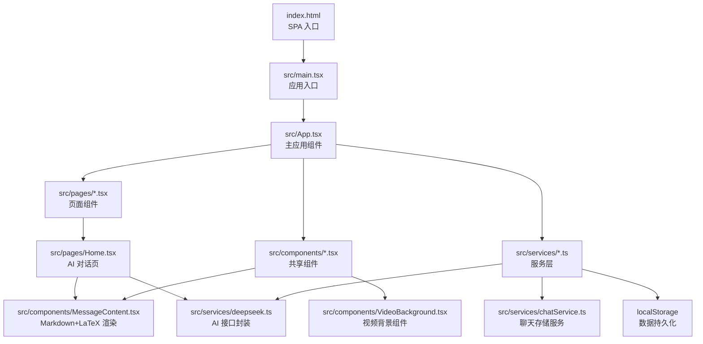
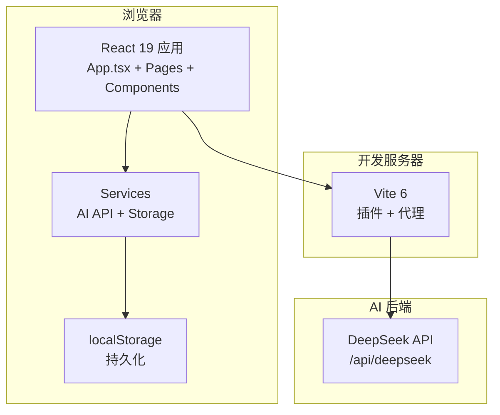
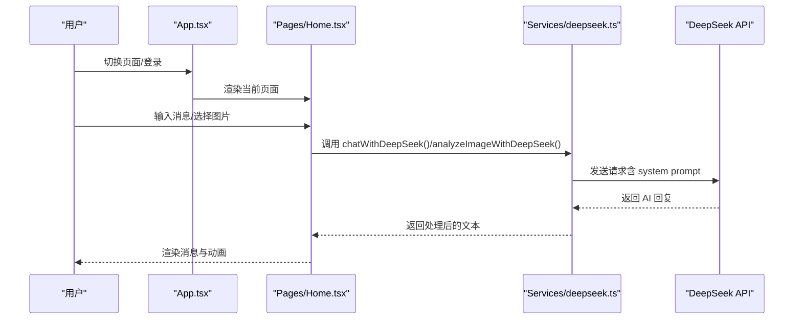
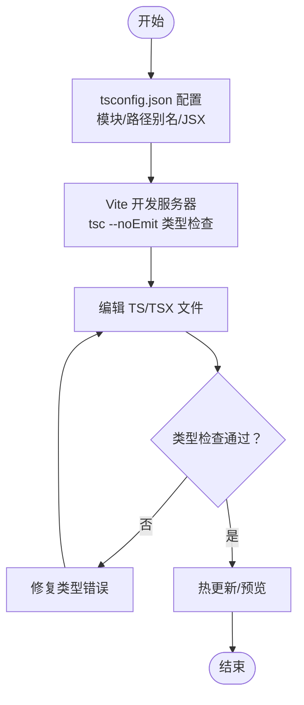
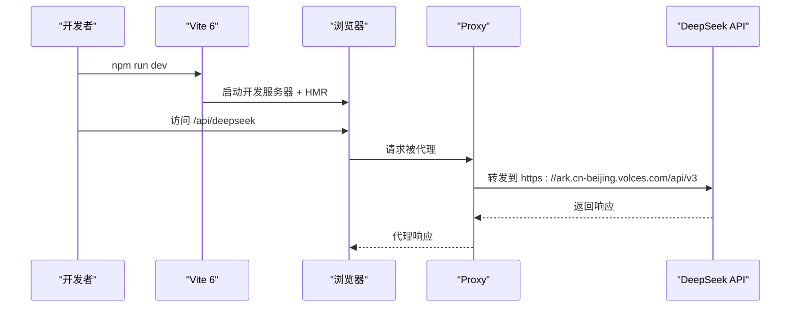
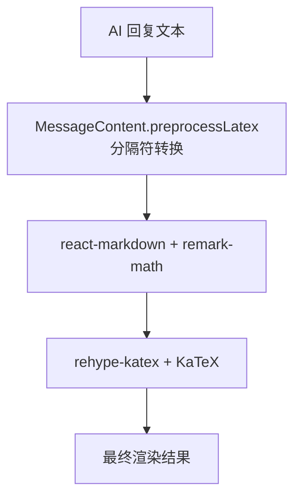
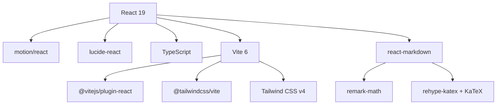

# 技术选型说明

<cite>
**本文档引用的文件**
- [package.json](file://package.json)
- [vite.config.ts](file://vite.config.ts)
- [tsconfig.json](file://tsconfig.json)
- [src/main.tsx](file://src/main.tsx)
- [src/App.tsx](file://src/App.tsx)
- [src/pages/Home.tsx](file://src/pages/Home.tsx)
- [src/services/deepseek.ts](file://src/services/deepseek.ts)
- [src/components/MessageContent.tsx](file://src/components/MessageContent.tsx)
- [src/services/chatService.ts](file://src/services/chatService.ts)
- [src/config/videoConfig.ts](file://src/config/videoConfig.ts)
- [src/components/VideoBackground.tsx](file://src/components/VideoBackground.tsx)
- [README.md](file://README.md)
- [技术介绍.md](file://技术介绍.md)
</cite>

## 目录
1. [引言](#引言)
2. [项目结构](#项目结构)
3. [核心组件](#核心组件)
4. [架构总览](#架构总览)
5. [详细组件分析](#详细组件分析)
6. [依赖关系分析](#依赖关系分析)
7. [性能考量](#性能考量)
8. [故障排查指南](#故障排查指南)
9. [结论](#结论)
10. [附录](#附录)

## 引言
本技术选型说明围绕“智课通 AI Tutor”项目的前端技术栈展开，重点解释 React 19、TypeScript、Vite 的选择原因、具体应用场景与配置方式，并阐述它们之间的协同工作机制。文档同时提供版本兼容性、性能对比与未来演进方向的建议，帮助开发者理解架构设计的技术基础与权衡考量。

## 项目结构
项目采用以功能模块为中心的组织方式，前端入口位于 src/main.tsx，主应用组件 App.tsx 负责路由与页面切换；页面组件集中在 src/pages 下，服务层封装 API 与本地存储，组件层负责可复用 UI 与内容渲染。

图表来源
- [src/main.tsx:1-11](file://src/main.tsx#L1-L11)
- [src/App.tsx:1-246](file://src/App.tsx#L1-L246)
- [src/pages/Home.tsx:1-554](file://src/pages/Home.tsx#L1-L554)
- [src/services/deepseek.ts:1-133](file://src/services/deepseek.ts#L1-L133)
- [src/services/chatService.ts:1-72](file://src/services/chatService.ts#L1-L72)
- [src/components/MessageContent.tsx:1-31](file://src/components/MessageContent.tsx#L1-L31)
- [src/components/VideoBackground.tsx:1-159](file://src/components/VideoBackground.tsx#L1-L159)

章节来源
- [技术介绍.md:62-94](file://技术介绍.md#L62-L94)
- [README.md:1-21](file://README.md#L1-L21)

## 核心组件
- React 19：函数组件 + Hooks，提供声明式 UI 与状态管理能力，配合 motion/react 实现流畅动画。
- TypeScript：全项目强类型，提升开发体验与可维护性，配合 Vite 的快速类型检查。
- Vite 6：开发服务器 + 生产构建，提供极快的冷启动与热更新，支持插件生态与代理配置。
- Tailwind CSS v4：通过 @theme 块定义设计令牌，无需 tailwind.config.js，简化样式配置。
- motion：从 motion/react 导入，实现页面切换与元素动画。
- lucide-react：轻量级 SVG 图标库，统一视觉风格。
- react-markdown + remark-math + rehype-katex + KaTeX：实现 AI 回复中的 Markdown 与 LaTeX 公式渲染。
- localStorage：全量持久化，保障会话与状态在刷新后不丢失。

章节来源
- [技术介绍.md:9-23](file://技术介绍.md#L9-L23)
- [package.json:13-28](file://package.json#L13-L28)
- [tsconfig.json:1-28](file://tsconfig.json#L1-L28)
- [vite.config.ts:1-32](file://vite.config.ts#L1-L32)

## 架构总览
系统采用 SPA 架构，前端通过 Vite 开发服务器提供静态资源与代理，页面切换由 App.tsx 内部状态驱动，服务层封装 AI API 与本地存储，组件层负责内容渲染与交互优化。

图表来源
- [src/App.tsx:35-211](file://src/App.tsx#L35-L211)
- [src/pages/Home.tsx:79-527](file://src/pages/Home.tsx#L79-L527)
- [src/services/deepseek.ts:45-82](file://src/services/deepseek.ts#L45-L82)
- [vite.config.ts:18-29](file://vite.config.ts#L18-L29)

## 详细组件分析

### React 19 选型与应用
- 选择原因
  - 函数组件 + Hooks 提供更简洁的状态管理与副作用处理。
  - 与 TypeScript 结合，类型推断与编译期检查增强稳定性。
  - 与 Vite 生态良好，开发体验流畅。
- 具体应用
  - 应用入口使用 createRoot + StrictMode，确保并发特性与严格模式。
  - App.tsx 通过 useState 控制页面路由与登录状态，配合 AnimatePresence 实现页面切换动画。
  - Home.tsx 使用多个状态钩子管理对话历史、活跃会话、图片上传与加载状态。
- 协同机制
  - 与 TypeScript 的类型系统配合，确保 props 与状态接口明确，减少运行时错误。
  - 与 Vite 的 HMR 结合，在修改组件时实现快速热更新。

图表来源
- [src/App.tsx:35-211](file://src/App.tsx#L35-L211)
- [src/pages/Home.tsx:139-223](file://src/pages/Home.tsx#L139-L223)
- [src/services/deepseek.ts:45-82](file://src/services/deepseek.ts#L45-L82)

章节来源
- [src/main.tsx:1-11](file://src/main.tsx#L1-L11)
- [src/App.tsx:35-211](file://src/App.tsx#L35-L211)
- [src/pages/Home.tsx:79-527](file://src/pages/Home.tsx#L79-L527)

### TypeScript 选型与应用
- 选择原因
  - 全项目强类型，提升开发效率与代码质量，减少潜在 bug。
  - 与 Vite 的快速类型检查配合，提升迭代速度。
- 具体应用
  - tsconfig.json 配置 ESNext 模块、React JSX、路径别名、类型声明等。
  - 服务层与组件层广泛使用接口定义，如 ChatMessage、MessageContentProps 等。
- 协同机制
  - Vite 在开发时通过 tsc --noEmit 进行类型检查，避免构建阶段才暴露问题。
  - 路径别名 @/* 与模块解析策略提升导入便捷性。

图表来源
- [tsconfig.json:1-28](file://tsconfig.json#L1-L28)
- [package.json:6-12](file://package.json#L6-L12)

章节来源
- [tsconfig.json:1-28](file://tsconfig.json#L1-L28)
- [package.json:6-12](file://package.json#L6-L12)

### Vite 6 选型与应用
- 选择原因
  - 极快的冷启动与热更新，显著提升开发体验。
  - 插件生态完善，Tailwind CSS v4 与 React 插件开箱即用。
  - 代理配置简化跨域问题，便于对接后端 API。
- 具体应用
  - vite.config.ts 配置 React 插件、Tailwind CSS 插件、路径别名、环境变量注入与代理。
  - 代理将 /api/deepseek 重写到目标 API，解决 CORS 问题。
- 协同机制
  - 与 React 19 + TypeScript 协同，提供快速反馈与类型安全。
  - define 配置将环境变量注入到客户端代码，便于条件判断。

图表来源
- [vite.config.ts:6-31](file://vite.config.ts#L6-L31)
- [src/services/deepseek.ts:45-82](file://src/services/deepseek.ts#L45-L82)

章节来源
- [vite.config.ts:1-32](file://vite.config.ts#L1-L32)
- [package.json:6-12](file://package.json#L6-L12)

### Tailwind CSS v4 与样式体系
- 选择原因
  - 通过 @theme 块集中定义设计令牌，无需 tailwind.config.js，简化配置。
  - 与 Material Design 3 色彩体系契合，统一视觉风格。
- 具体应用
  - 全局样式中定义主题色、毛玻璃效果、渐变工具类等。
  - 页面与组件广泛使用 Tailwind 类名，保证一致性与可维护性。

章节来源
- [技术介绍.md:16-21](file://技术介绍.md#L16-L21)

### 动画与交互：motion 与 lucide-react
- 选择原因
  - motion 提供高性能动画与页面切换效果，与 React 19 并行特性兼容。
  - lucide-react 提供一致的图标风格，减少体积与维护成本。
- 具体应用
  - App.tsx 使用 AnimatePresence 与 motion/react 实现页面切换动画。
  - 各页面与组件使用 lucide-react 图标，统一视觉语言。

章节来源
- [src/App.tsx:19-211](file://src/App.tsx#L19-L211)
- [技术介绍.md:17-18](file://技术介绍.md#L17-L18)

### 内容渲染：react-markdown + LaTeX
- 选择原因
  - AI 回复中包含大量 Markdown 与 LaTeX 公式，需要稳定渲染方案。
- 具体应用
  - MessageContent.tsx 预处理 DeepSeek 输出的 LaTeX 分隔符，再交给 react-markdown + remark-math + rehype-katex + KaTeX 渲染。
  - Home.tsx 在消息气泡中渲染处理后的 Markdown 内容。

图表来源
- [src/components/MessageContent.tsx:9-30](file://src/components/MessageContent.tsx#L9-L30)
- [src/pages/Home.tsx:336-412](file://src/pages/Home.tsx#L336-L412)

章节来源
- [src/components/MessageContent.tsx:1-31](file://src/components/MessageContent.tsx#L1-L31)
- [技术介绍.md:106-107](file://技术介绍.md#L106-L107)

### 数据持久化：localStorage 与状态管理
- 选择原因
  - 项目为前端 SPA，localStorage 能满足会话、历史、设置等数据持久化需求。
- 具体应用
  - Home.tsx 使用 localStorage 存储对话历史、活跃会话 ID、保存/忽略状态。
  - chatService.ts 提供聊天消息的读取与发送，基于 localStorage 的键值结构。
- 协同机制
  - 与 React 状态钩子配合，实现页面切换与刷新后的状态恢复。

章节来源
- [src/pages/Home.tsx:65-117](file://src/pages/Home.tsx#L65-L117)
- [src/services/chatService.ts:10-72](file://src/services/chatService.ts#L10-L72)
- [技术介绍.md:57](file://技术介绍.md#L57)

### 视频背景组件：自适应与降级
- 选择原因
  - 登录页需要高质量视频背景，但需考虑设备性能与网络状况。
- 具体应用
  - VideoBackground.tsx 根据硬件并发数与网络连接类型自动选择视频源，支持占位图与错误降级。
  - videoConfig.ts 提供视频源配置示例与说明。

章节来源
- [src/components/VideoBackground.tsx:1-159](file://src/components/VideoBackground.tsx#L1-L159)
- [src/config/videoConfig.ts:1-47](file://src/config/videoConfig.ts#L1-L47)

## 依赖关系分析
- 核心依赖
  - React 19 与 react-dom：提供 UI 渲染与生命周期。
  - TypeScript：提供类型系统与编译时检查。
  - Vite 6：提供开发服务器与构建工具链。
  - Tailwind CSS v4：提供原子化样式与设计令牌。
  - motion/react：提供动画与页面切换。
  - lucide-react：提供图标库。
  - react-markdown + remark-math + rehype-katex + KaTeX：提供 Markdown 与 LaTeX 渲染。
  - @vitejs/plugin-react：Vite React 插件。
  - @tailwindcss/vite：Vite Tailwind 插件。
- 开发依赖
  - @types/*：类型声明。
  - autoprefixer、tailwindcss：CSS 后处理与框架。
  - tsx：TypeScript 运行器。
  - typescript：类型检查与编译。
  - vite：构建与开发服务器。

图表来源
- [package.json:13-39](file://package.json#L13-L39)

章节来源
- [package.json:13-39](file://package.json#L13-L39)

## 性能考量
- 开发体验
  - Vite 6 提供极快的冷启动与热更新，结合 React 19 的并发特性，提升迭代效率。
  - TypeScript 的快速类型检查（tsc --noEmit）在开发阶段及时发现类型问题。
- 构建性能
  - Vite 基于 esbuild 与 Rollup，生产构建速度快，适合中小型项目。
  - Tailwind CSS v4 通过 @theme 块集中定义，减少配置开销。
- 运行时性能
  - React 19 + motion/react 提供流畅动画与页面切换。
  - localStorage 读写为同步操作，适合小规模数据；大规模数据建议分批或异步处理。
- 网络与代理
  - Vite 代理简化跨域问题，减少开发阶段的网络配置复杂度。

章节来源
- [vite.config.ts:18-29](file://vite.config.ts#L18-L29)
- [package.json:6-12](file://package.json#L6-L12)

## 故障排查指南
- 环境变量与代理
  - 确认 .env.local 中的 API Key 配置正确，Vite 代理配置需重启开发服务器生效。
- 构建与类型检查
  - 使用 npm run lint 执行类型检查，修复类型错误后再进行构建。
- 跨域与 API 调用
  - 检查 vite.config.ts 的代理规则与目标地址，确认请求路径与重写规则一致。
- 动画与 HMR
  - 若 HMR 异常，检查 DISABLE_HMR 环境变量与代理配置，必要时关闭 HMR 以避免文件监听冲突。

章节来源
- [技术介绍.md:258-281](file://技术介绍.md#L258-L281)
- [vite.config.ts:18-31](file://vite.config.ts#L18-L31)
- [package.json:6-12](file://package.json#L6-L12)

## 结论
本项目采用 React 19、TypeScript、Vite 的组合，充分体现了现代前端开发的高效与稳定。React 19 提供声明式 UI 与状态管理，TypeScript 提升开发体验与代码质量，Vite 6 提供快速开发与构建体验。Tailwind CSS v4、motion、lucide-react、react-markdown + LaTeX 等生态工具进一步增强了视觉表现与内容渲染能力。通过 localStorage 实现的数据持久化与 Vite 代理解决跨域问题，使得项目在功能与性能上达到平衡。未来可关注 React 19 的新特性演进、TypeScript 的类型系统优化以及 Vite 生态的持续发展。

## 附录
- 版本兼容性
  - React 19 与 TypeScript 5.8 搭配使用，模块解析与 JSX 策略在 tsconfig.json 中明确。
  - Vite 6 支持 Node.js 18/20/22，需根据团队 Node 版本选择。
- 未来演进方向
  - React：关注并发特性与新 Hook 的使用场景。
  - TypeScript：持续优化类型定义与工具类型，提升可维护性。
  - Vite：关注插件生态与构建优化，探索更高效的打包策略。
- 决策依据与权衡
  - 选择 React 19 与 Vite 6 主要出于开发体验与构建性能的考量。
  - 选择 TypeScript 以提升代码质量与长期可维护性。
  - 选择 Tailwind CSS v4 与 motion/lucide-react 以统一视觉风格与提升交互体验。