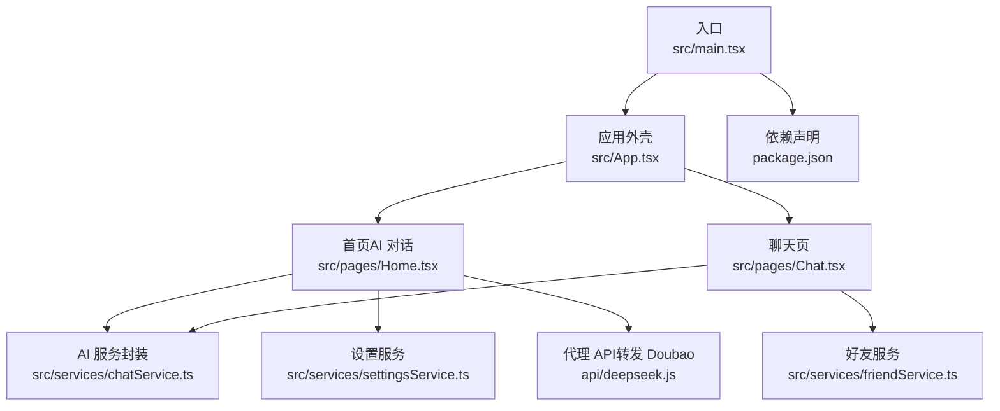
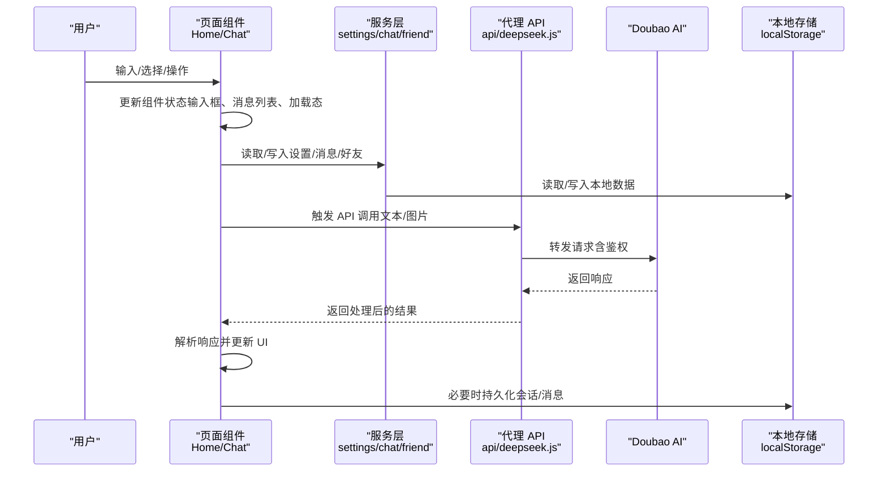
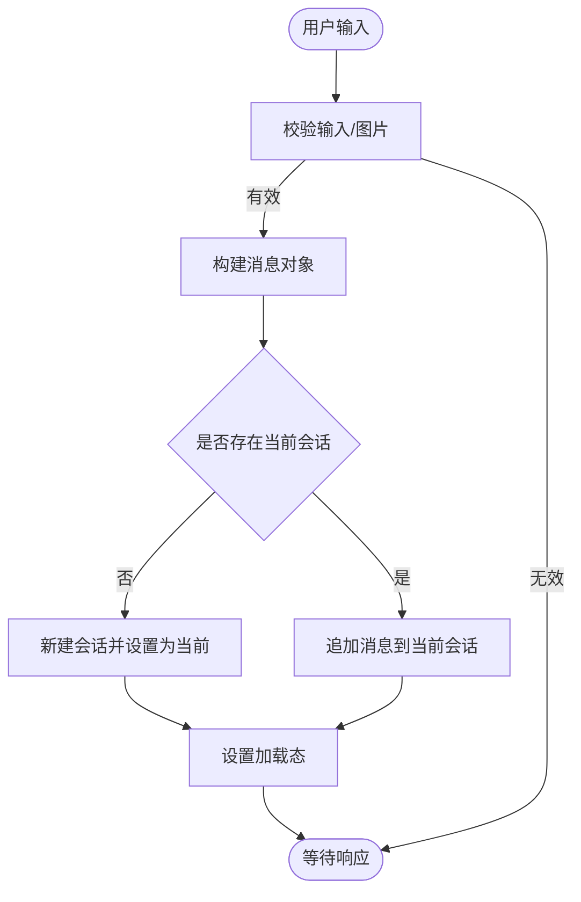
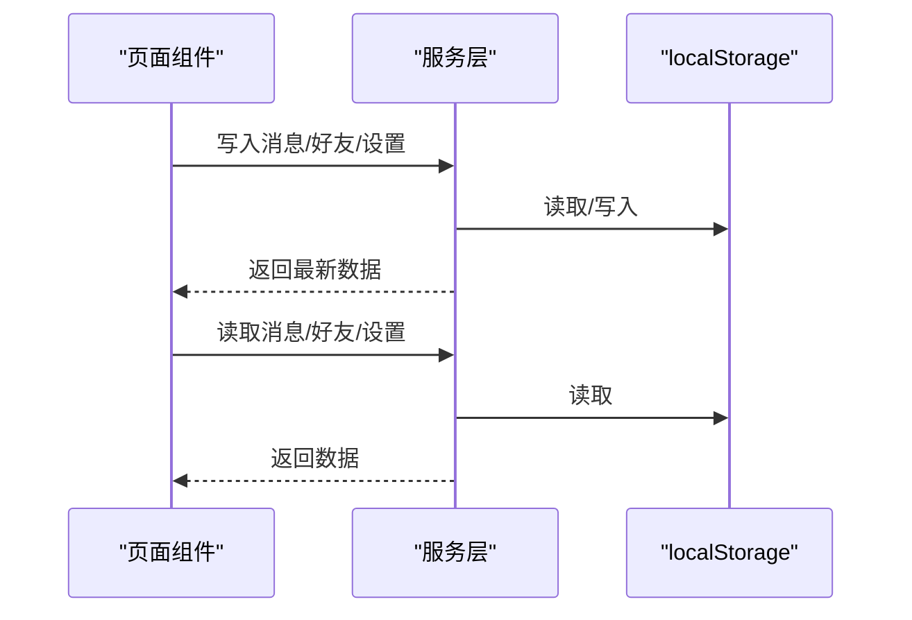
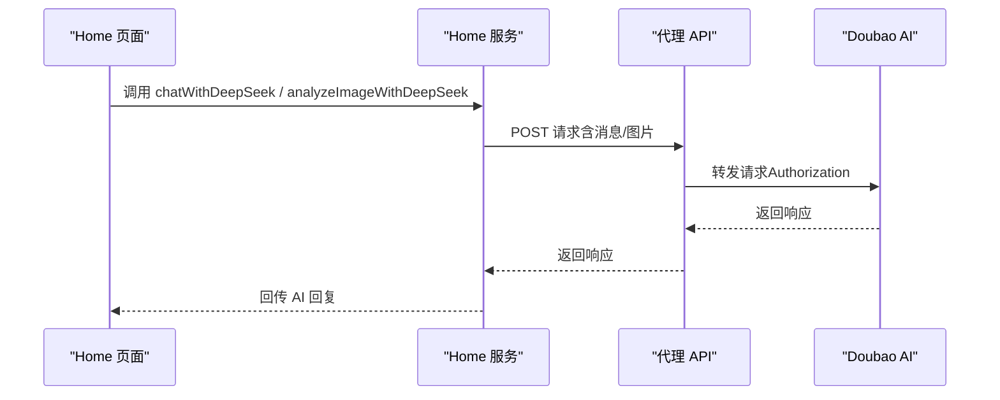
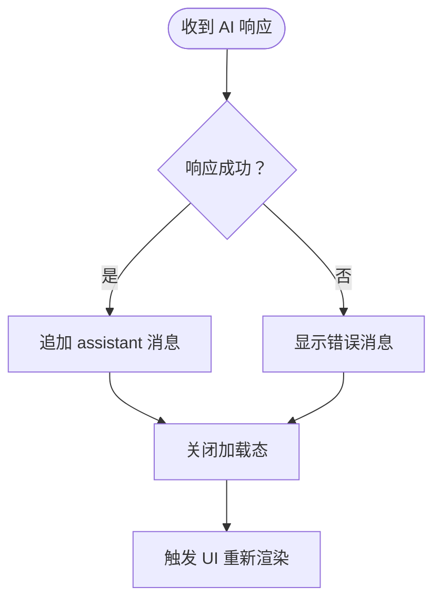
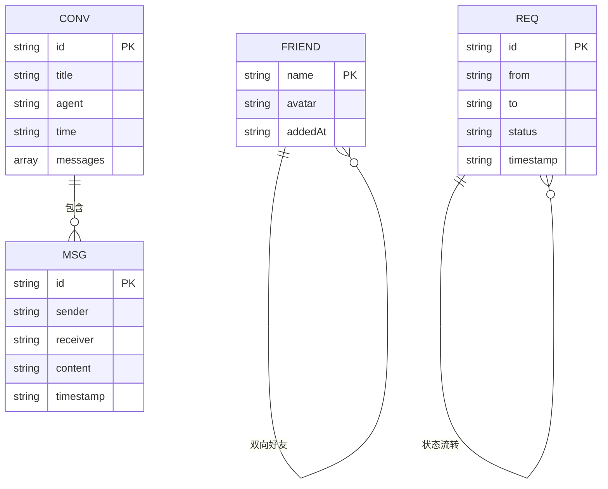
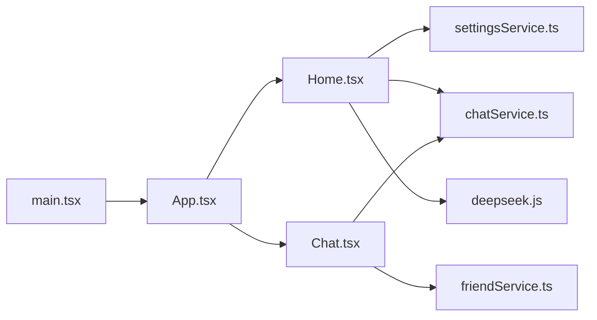

# 数据流设计

<cite>
**本文引用的文件**
- [src/main.tsx](file://src/main.tsx)
- [src/App.tsx](file://src/App.tsx)
- [src/pages/Home.tsx](file://src/pages/Home.tsx)
- [src/pages/Chat.tsx](file://src/pages/Chat.tsx)
- [src/services/chatService.ts](file://src/services/chatService.ts)
- [src/services/friendService.ts](file://src/services/friendService.ts)
- [src/services/settingsService.ts](file://src/services/settingsService.ts)
- [api/deepseek.js](file://api/deepseek.js)
- [package.json](file://package.json)
</cite>

## 目录
1. [简介](#简介)
2. [项目结构](#项目结构)
3. [核心组件](#核心组件)
4. [架构总览](#架构总览)
5. [详细组件分析](#详细组件分析)
6. [依赖关系分析](#依赖关系分析)
7. [性能考量](#性能考量)
8. [故障排查指南](#故障排查指南)
9. [结论](#结论)
10. [附录](#附录)

## 简介
本文件面向“智课通 AI Tutor”项目，系统性梳理从用户输入到 UI 更新的完整数据流路径，并深入解析状态管理策略（本地状态、全局状态与第三方状态管理）、数据持久化策略（本地存储、缓存与同步）、以及异步数据处理模式（API 调用、错误处理与加载状态）。同时提供数据流图与状态转换图，帮助开发者快速理解复杂交互。

## 项目结构
项目采用前端单页应用（React + Vite）架构，页面按功能模块组织，服务层封装本地存储与外部 API 调用，入口文件负责挂载根组件。

图表来源
- [src/main.tsx:1-11](file://src/main.tsx#L1-L11)
- [src/App.tsx:1-246](file://src/App.tsx#L1-L246)
- [src/pages/Home.tsx:1-554](file://src/pages/Home.tsx#L1-L554)
- [src/pages/Chat.tsx:1-381](file://src/pages/Chat.tsx#L1-L381)
- [src/services/chatService.ts:1-72](file://src/services/chatService.ts#L1-L72)
- [src/services/friendService.ts:1-151](file://src/services/friendService.ts#L1-L151)
- [src/services/settingsService.ts:1-50](file://src/services/settingsService.ts#L1-L50)
- [api/deepseek.js:1-34](file://api/deepseek.js#L1-L34)
- [package.json:1-42](file://package.json#L1-L42)

章节来源
- [src/main.tsx:1-11](file://src/main.tsx#L1-L11)
- [src/App.tsx:1-246](file://src/App.tsx#L1-L246)
- [package.json:1-42](file://package.json#L1-L42)

## 核心组件
- 应用外壳与路由控制：通过状态切换当前页面与激活的 AI Agent，承载导航栏、侧边栏与主内容区域。
- 首页（AI 对话）：多模态对话（文本+图片），维护会话列表与当前会话，负责与 AI 服务交互。
- 聊天页：好友系统与私聊，基于本地存储实现消息与好友关系持久化。
- 服务层：
  - settingsService：用户设置与显示名/头像读取。
  - chatService：聊天消息的生成、去重键、时间戳与本地存储。
  - friendService：好友关系、申请、接受/拒绝、删除等。
- 代理 API：转发至 Doubao AI，统一处理请求体大小限制与错误响应。

章节来源
- [src/App.tsx:32-60](file://src/App.tsx#L32-L60)
- [src/pages/Home.tsx:79-134](file://src/pages/Home.tsx#L79-L134)
- [src/pages/Chat.tsx:28-98](file://src/pages/Chat.tsx#L28-L98)
- [src/services/settingsService.ts:27-50](file://src/services/settingsService.ts#L27-L50)
- [src/services/chatService.ts:34-72](file://src/services/chatService.ts#L34-L72)
- [src/services/friendService.ts:61-151](file://src/services/friendService.ts#L61-L151)
- [api/deepseek.js:9-33](file://api/deepseek.js#L9-L33)

## 架构总览
下图展示从用户输入到 UI 更新的端到端数据流，涵盖组件状态、服务层、AI API 与响应处理。

图表来源
- [src/pages/Home.tsx:139-223](file://src/pages/Home.tsx#L139-L223)
- [src/pages/Chat.tsx:62-74](file://src/pages/Chat.tsx#L62-L74)
- [src/services/chatService.ts:34-72](file://src/services/chatService.ts#L34-L72)
- [src/services/friendService.ts:74-151](file://src/services/friendService.ts#L74-L151)
- [api/deepseek.js:9-33](file://api/deepseek.js#L9-L33)

## 详细组件分析

### 用户输入到组件状态
- 首页（AI 对话）：
  - 输入框与图片选择触发状态更新，构建用户消息对象。
  - 若无当前会话则新建；否则追加消息。
  - 设置加载态以阻断重复提交。
- 聊天页：
  - 输入框变更与回车事件驱动发送流程。
  - 选择好友后读取本地存储的消息列表并滚动到底部。

图表来源
- [src/pages/Home.tsx:139-174](file://src/pages/Home.tsx#L139-L174)
- [src/pages/Chat.tsx:62-74](file://src/pages/Chat.tsx#L62-L74)

章节来源
- [src/pages/Home.tsx:139-174](file://src/pages/Home.tsx#L139-L174)
- [src/pages/Chat.tsx:62-74](file://src/pages/Chat.tsx#L62-L74)

### 组件状态到服务层
- 首页：
  - 将当前会话消息序列化为 API 消息格式，调用 AI 服务接口。
  - 图片分析时将图片转为可识别格式并传入服务。
- 聊天页：
  - 发送消息时调用服务层写入本地存储，返回最新消息列表。
  - 好友相关操作（申请、接受、拒绝、删除）均通过服务层持久化。

图表来源
- [src/pages/Home.tsx:178-223](file://src/pages/Home.tsx#L178-L223)
- [src/pages/Chat.tsx:62-98](file://src/pages/Chat.tsx#L62-L98)
- [src/services/chatService.ts:34-72](file://src/services/chatService.ts#L34-L72)
- [src/services/friendService.ts:61-151](file://src/services/friendService.ts#L61-L151)
- [src/services/settingsService.ts:27-50](file://src/services/settingsService.ts#L27-L50)

章节来源
- [src/pages/Home.tsx:178-223](file://src/pages/Home.tsx#L178-L223)
- [src/pages/Chat.tsx:62-98](file://src/pages/Chat.tsx#L62-L98)
- [src/services/chatService.ts:34-72](file://src/services/chatService.ts#L34-L72)
- [src/services/friendService.ts:61-151](file://src/services/friendService.ts#L61-L151)
- [src/services/settingsService.ts:27-50](file://src/services/settingsService.ts#L27-L50)

### 服务层到 AI API
- 首页：
  - 文本对话：将消息数组与当前 Agent 信息传递给 AI 服务。
  - 图片分析：将图片与文本提示一并传入 AI 服务。
- 代理 API：
  - 限制请求体大小，转发至 Doubao AI。
  - 统一设置响应头并返回原始响应体。

图表来源
- [src/pages/Home.tsx:178-202](file://src/pages/Home.tsx#L178-L202)
- [api/deepseek.js:9-33](file://api/deepseek.js#L9-L33)

章节来源
- [src/pages/Home.tsx:178-202](file://src/pages/Home.tsx#L178-L202)
- [api/deepseek.js:9-33](file://api/deepseek.js#L9-L33)

### 响应处理到 UI 更新
- 首页：
  - 成功：将 AI 回复作为 assistant 消息追加到当前会话。
  - 失败：构造错误消息提示，避免 UI 卡死。
  - 加载态在 finally 中关闭，确保交互连续性。
- 聊天页：
  - 发送成功后立即更新本地消息列表并滚动到底部。
  - 好友请求状态变化后刷新界面。

图表来源
- [src/pages/Home.tsx:204-222](file://src/pages/Home.tsx#L204-L222)
- [src/pages/Chat.tsx:62-74](file://src/pages/Chat.tsx#L62-L74)

章节来源
- [src/pages/Home.tsx:204-222](file://src/pages/Home.tsx#L204-L222)
- [src/pages/Chat.tsx:62-74](file://src/pages/Chat.tsx#L62-L74)

### 状态管理策略
- 本地状态管理（组件级）：
  - 首页：会话列表、当前会话 ID、输入值、加载态、图片预览、历史记录集合等均在组件内维护，使用 useState/useEffect 控制。
  - 聊天页：好友列表、选择的好友、消息列表、输入框、待处理请求等均为组件本地状态。
- 全局状态管理（应用级）：
  - App 层维护当前页面、激活 Agent、登录态、用户昵称与头像等，用于跨页面共享与导航。
- 第三方状态管理方案选择：
  - 当前项目未引入集中式状态库（如 Redux/Zustand），推荐在以下场景引入：
    - 复杂跨组件共享（如多处需要访问当前会话树）。
    - 需要时间旅行调试或持久化到 Redux DevTools。
    - 大规模并发更新与订阅模型。

章节来源
- [src/App.tsx:36-46](file://src/App.tsx#L36-L46)
- [src/pages/Home.tsx:82-96](file://src/pages/Home.tsx#L82-L96)
- [src/pages/Chat.tsx:32-39](file://src/pages/Chat.tsx#L32-L39)

### 数据持久化策略
- 本地存储（localStorage）：
  - 首页会话与历史：分别以不同键持久化，支持新增、清空、删除会话。
  - 聊天消息：按“双方用户排序后的键”分组存储，保证双向一致性。
  - 好友关系与申请：独立键空间，支持增删改查与状态流转。
  - 用户设置：合并默认配置与本地覆盖项。
- 缓存机制：
  - 组件内使用 useRef 保持对最新会话的引用，避免闭包陷阱导致的读取旧数据。
- 数据同步方案：
  - 本地存储变更通过 useEffect 自动落盘，确保刷新后不丢失。
  - 聊天页在好友选择变化时主动读取对应分组消息，保证视图一致性。

图表来源
- [src/pages/Home.tsx:44-51](file://src/pages/Home.tsx#L44-L51)
- [src/services/chatService.ts:1-8](file://src/services/chatService.ts#L1-L8)
- [src/services/friendService.ts:11-15](file://src/services/friendService.ts#L11-L15)

章节来源
- [src/pages/Home.tsx:65-117](file://src/pages/Home.tsx#L65-L117)
- [src/services/chatService.ts:10-72](file://src/services/chatService.ts#L10-L72)
- [src/services/friendService.ts:17-151](file://src/services/friendService.ts#L17-L151)
- [src/services/settingsService.ts:13-41](file://src/services/settingsService.ts#L13-L41)

### 异步数据处理模式
- API 调用：
  - 首页：根据是否有图片决定调用不同服务方法；服务内部负责将消息序列化并转发代理 API。
  - 代理 API：统一处理请求体大小限制与错误返回。
- 错误处理：
  - 首页：捕获异常并注入错误消息，避免 UI 崩溃。
  - 代理 API：网络异常时返回统一错误结构。
- 加载状态管理：
  - 首页：发送前开启加载态，finally 关闭，保证交互连续性。
  - 聊天页：发送按钮禁用与输入框置灰，提升可用性。

章节来源
- [src/pages/Home.tsx:178-223](file://src/pages/Home.tsx#L178-L223)
- [api/deepseek.js:17-32](file://api/deepseek.js#L17-L32)
- [src/pages/Chat.tsx:62-74](file://src/pages/Chat.tsx#L62-L74)

## 依赖关系分析
- 入口与根组件：
  - main.tsx 创建根节点并渲染 App。
  - App 负责页面切换与全局状态。
- 页面与服务：
  - Home/Chat 直接依赖 settingsService、chatService、friendService。
  - Home 间接依赖代理 API（通过服务层封装）。
- 外部依赖：
  - 项目使用 React、Lucide、Motion、Tailwind 等，未引入集中式状态库。

图表来源
- [src/main.tsx:1-11](file://src/main.tsx#L1-L11)
- [src/App.tsx:23-31](file://src/App.tsx#L23-L31)
- [src/pages/Home.tsx:1-6](file://src/pages/Home.tsx#L1-L6)
- [src/pages/Chat.tsx:14-26](file://src/pages/Chat.tsx#L14-L26)
- [api/deepseek.js:1-7](file://api/deepseek.js#L1-L7)

章节来源
- [src/main.tsx:1-11](file://src/main.tsx#L1-L11)
- [src/App.tsx:23-31](file://src/App.tsx#L23-L31)
- [package.json:13-28](file://package.json#L13-L28)

## 性能考量
- 本地存储读写：
  - 首页与聊天页均在状态变更时写入 localStorage，建议在高频更新场景使用节流/防抖减少写入次数。
- 图片处理：
  - 首页图片分析前进行类型校验与 FileReader 读取，建议限制最大尺寸与并发数量。
- 列表渲染：
  - 使用 key 与 useRef 优化滚动与重渲染，避免不必要的全量更新。
- 代理 API：
  - 限制请求体大小，避免超限导致失败；对网络波动做好重试与降级策略。

## 故障排查指南
- 无法登录/跳转异常：
  - 检查 App 的登录回调与页面切换逻辑。
- 聊天消息不显示：
  - 确认好友选择是否正确，消息分组键是否一致；检查 localStorage 是否存在对应键。
- 好友申请状态异常：
  - 检查请求状态字段与接受/拒绝流程，确认双向添加逻辑。
- AI 响应失败：
  - 查看代理 API 的错误返回；确认鉴权头与请求体格式；检查网络连通性。
- 加载态不消失：
  - 确保 finally 分支执行；检查异常捕获是否覆盖所有分支。

章节来源
- [src/App.tsx:48-56](file://src/App.tsx#L48-L56)
- [src/pages/Chat.tsx:57-98](file://src/pages/Chat.tsx#L57-L98)
- [src/services/friendService.ts:112-151](file://src/services/friendService.ts#L112-L151)
- [api/deepseek.js:30-32](file://api/deepseek.js#L30-L32)
- [src/pages/Home.tsx:220-223](file://src/pages/Home.tsx#L220-L223)

## 结论
本项目以组件本地状态为主、服务层封装为辅、localStorage 作为持久化载体，结合代理 API 实现与 Doubao AI 的对接。整体数据流清晰、职责分离明确。建议在后续迭代中引入集中式状态管理以支撑更复杂的跨组件协作，并完善错误重试与性能优化策略。

## 附录
- 关键状态与存储键：
  - 首页会话与历史：tutor_conversations、tutor_active_ids
  - 错题保存与忽略动作：tutor_saved_to_wrong、tutor_dismissed_actions
  - 聊天消息：tutor_chat_messages（按双方键分组）
  - 好友与申请：tutor_friends、tutor_friend_requests
  - 用户设置：tutor_user_settings

章节来源
- [src/pages/Home.tsx:65-68](file://src/pages/Home.tsx#L65-L68)
- [src/services/chatService.ts:10](file://src/services/chatService.ts#L10)
- [src/services/friendService.ts:17-18](file://src/services/friendService.ts#L17-L18)
- [src/services/settingsService.ts:13](file://src/services/settingsService.ts#L13)