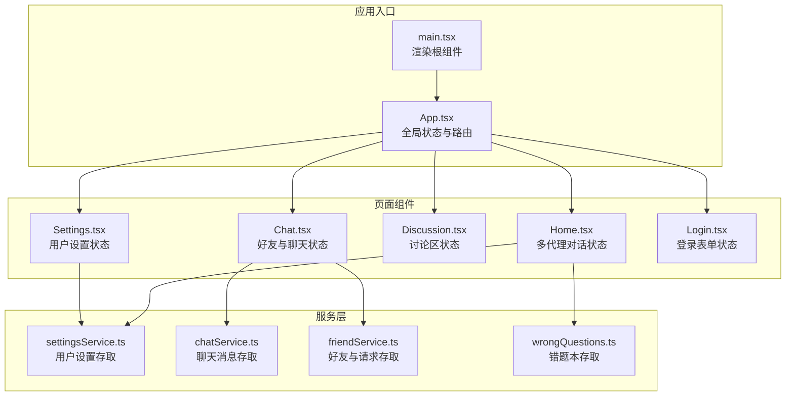
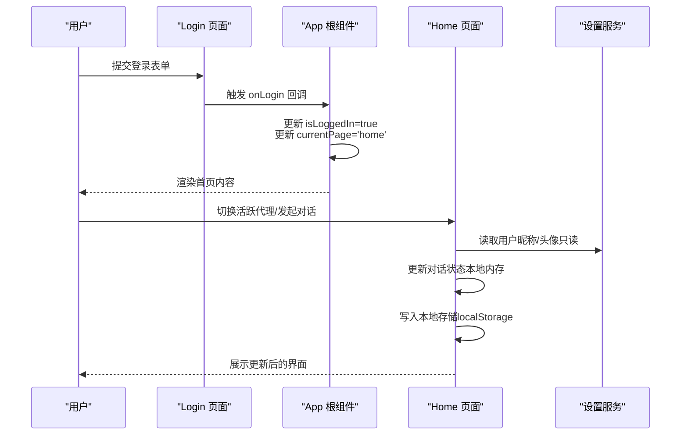
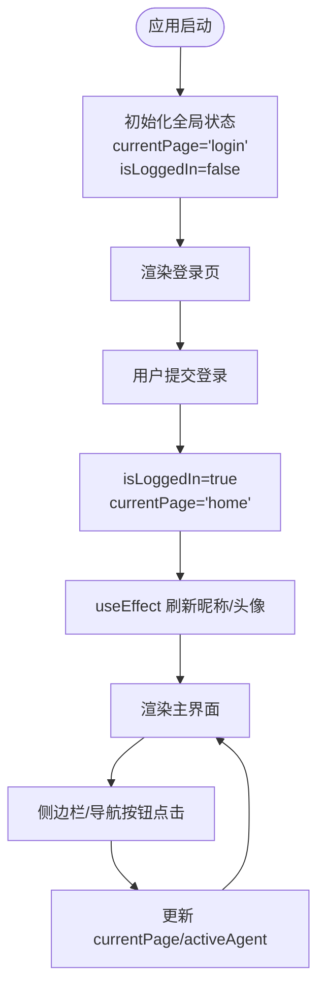
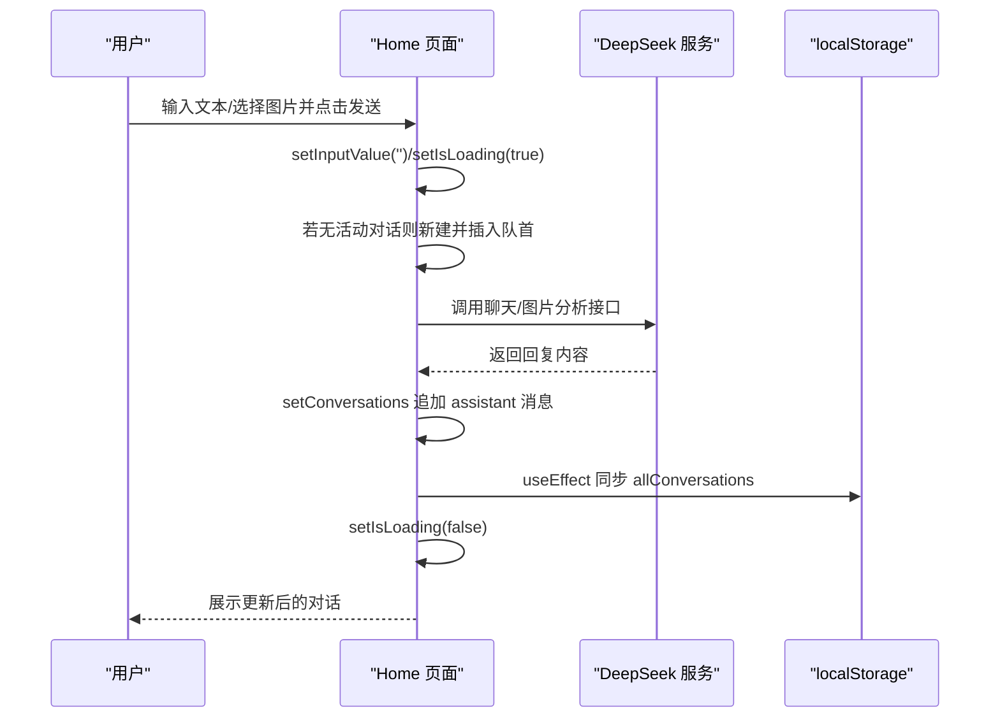
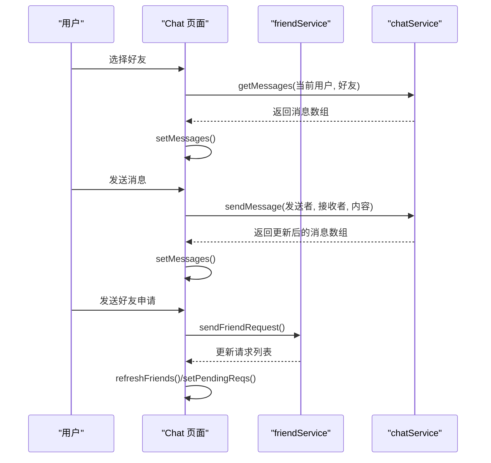
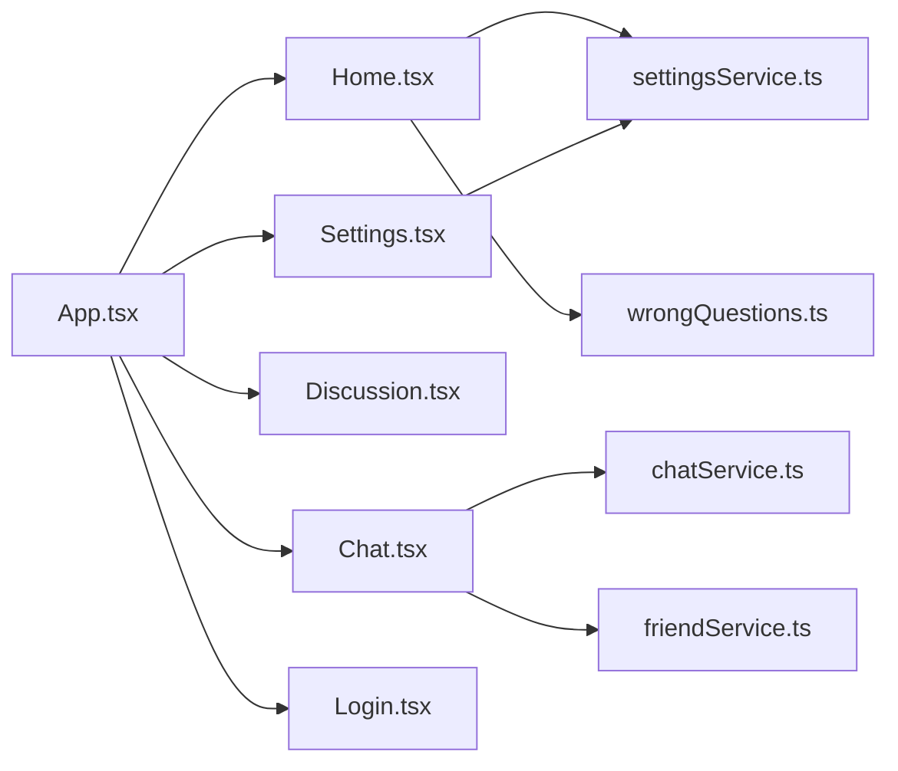

# 状态管理设计

<cite>
**本文档引用的文件**
- [App.tsx](file://src/App.tsx)
- [main.tsx](file://src/main.tsx)
- [Home.tsx](file://src/pages/Home.tsx)
- [Login.tsx](file://src/pages/Login.tsx)
- [Chat.tsx](file://src/pages/Chat.tsx)
- [Discussion.tsx](file://src/pages/Discussion.tsx)
- [Settings.tsx](file://src/pages/Settings.tsx)
- [settingsService.ts](file://src/services/settingsService.ts)
- [chatService.ts](file://src/services/chatService.ts)
- [friendService.ts](file://src/services/friendService.ts)
- [wrongQuestions.ts](file://src/services/wrongQuestions.ts)
</cite>

## 目录
1. [引言](#引言)
2. [项目结构](#项目结构)
3. [核心组件](#核心组件)
4. [架构总览](#架构总览)
5. [详细组件分析](#详细组件分析)
6. [依赖关系分析](#依赖关系分析)
7. [性能考量](#性能考量)
8. [故障排除指南](#故障排除指南)
9. [结论](#结论)

## 引言
本设计文档聚焦于智课通 AI Tutor 项目的状态管理策略，系统阐述全局状态与组件局部状态的划分、React Hooks 的使用模式、状态提升与下沉的原则，以及在多代理 AI 架构下的复杂用户界面状态管理方法。文档通过状态流转图与代码片段路径，清晰展示从用户交互到状态更新的完整流程。

## 项目结构
项目采用按功能模块组织的目录结构，核心状态管理集中在根组件与页面级组件中，服务层负责持久化与数据操作，形成清晰的分层：

- 根入口与全局状态：App.tsx 负责全局路由与用户会话状态
- 页面级状态：各页面组件维护自身业务状态
- 服务层：封装本地存储与业务逻辑，提供纯函数式接口
- 组件复用：通用 UI 组件不持有业务状态

**图表来源**
- [main.tsx:1-11](file://src/main.tsx#L1-L11)
- [App.tsx:35-211](file://src/App.tsx#L35-L211)
- [Home.tsx:79-527](file://src/pages/Home.tsx#L79-L527)
- [Chat.tsx:28-381](file://src/pages/Chat.tsx#L28-L381)
- [Discussion.tsx:42-200](file://src/pages/Discussion.tsx#L42-L200)
- [Settings.tsx:32-200](file://src/pages/Settings.tsx#L32-L200)
- [settingsService.ts:27-50](file://src/services/settingsService.ts#L27-L50)
- [chatService.ts:34-72](file://src/services/chatService.ts#L34-L72)
- [friendService.ts:61-151](file://src/services/friendService.ts#L61-L151)
- [wrongQuestions.ts:12-35](file://src/services/wrongQuestions.ts#L12-L35)

**章节来源**
- [main.tsx:1-11](file://src/main.tsx#L1-L11)
- [App.tsx:35-211](file://src/App.tsx#L35-L211)

## 核心组件
本节梳理应用的关键状态实体与职责边界：

- 全局状态（App.tsx）
  - 当前页面 currentPage：控制主内容区渲染的页面标识
  - 活跃代理 activeAgent：在首页下区分不同 AI 导师的上下文
  - 登录状态 isLoggedIn：决定是否显示登录页
  - 用户信息 userName、userAvatar：来自设置服务的动态读取
  - 导航回调 navigateTo：供子页面触发页面切换

- 页面级状态（Home.tsx）
  - 多代理对话状态：allConversations、allActiveIds（按代理键聚合）
  - 输入与加载状态：inputValue、isLoading
  - 交互动作状态：savedToWrong、dismissedActions（去重与记忆）
  - 图片选择状态：selectedImage、fileInputRef
  - 滚动定位：messagesEndRef

- 页面级状态（Chat.tsx）
  - 好友列表 friends 与当前会话 selectedFriend
  - 聊天消息 messages 与输入 input
  - 好友请求 pendingReqs 与弹窗状态 showRequests、showAddModal
  - 滚动定位：chatEndRef

- 页面级状态（Discussion.tsx）
  - 帖子 posts 与过滤 filter
  - 评论展开 expandedComments 与图片放大 enlargedImage
  - 创建帖子弹窗 showCreateModal

- 页面级状态（Settings.tsx）
  - 用户设置 settings 与头像预览 avatarSrc
  - 保存状态 saved 与文件变更处理

- 页面级状态（Login.tsx）
  - 展开状态 isExpanded：控制欢迎视图与登录表单切换

**章节来源**
- [App.tsx:35-60](file://src/App.tsx#L35-L60)
- [App.tsx:38-46](file://src/App.tsx#L38-L46)
- [Home.tsx:82-137](file://src/pages/Home.tsx#L82-L137)
- [Chat.tsx:32-53](file://src/pages/Chat.tsx#L32-L53)
- [Discussion.tsx:42-51](file://src/pages/Discussion.tsx#L42-L51)
- [Settings.tsx:32-75](file://src/pages/Settings.tsx#L32-L75)
- [Login.tsx:7-175](file://src/pages/Login.tsx#L7-L175)

## 架构总览
本项目采用“根组件集中路由 + 页面组件局部状态”的混合架构。全局状态仅包含必要的导航与用户会话信息；页面组件内部通过 useState/useEffect 管理各自业务状态，并通过服务层实现持久化与数据一致性。

**图表来源**
- [Login.tsx:78-120](file://src/pages/Login.tsx#L78-L120)
- [App.tsx:48-60](file://src/App.tsx#L48-L60)
- [Home.tsx:43-49](file://src/pages/Home.tsx#L43-L49)
- [settingsService.ts:43-49](file://src/services/settingsService.ts#L43-L49)

## 详细组件分析

### 全局状态管理（App.tsx）
- 状态定义与初始化
  - currentPage：初始值为登录页，用于控制主内容区渲染
  - activeAgent：默认数学代理，配合首页多代理上下文
  - isLoggedIn：初始为 false，登录成功后置为 true
  - userName/userAvatar：通过设置服务读取，支持动态刷新
- 生命周期与副作用
  - 使用 useEffect 监听 currentPage，当切换至任意页面时刷新用户昵称与头像
- 导航与事件
  - handleLogin/handleLogout：切换登录状态并跳转页面
  - navigateTo：统一的页面切换入口

**图表来源**
- [App.tsx:35-60](file://src/App.tsx#L35-L60)
- [App.tsx:43-46](file://src/App.tsx#L43-L46)

**章节来源**
- [App.tsx:35-60](file://src/App.tsx#L35-L60)
- [App.tsx:43-46](file://src/App.tsx#L43-L46)

### 首页对话状态（Home.tsx）
- 多代理状态聚合
  - allConversations：以代理键聚合的对话数组
  - allActiveIds：当前激活的对话 ID，按代理键维护
  - 通过 setAllConversations/setAllActiveIds 实现按代理维度的状态更新
- 本地存储同步
  - 通过多个 useEffect 将 allConversations/allActiveIds 同步到 localStorage
  - savedToWrong/dismissedActions 作为 Set 类型，分别持久化为数组
- 对话生命周期
  - 新建对话：若无活动对话则生成新 ID 并插入队首
  - 追加消息：更新指定对话的消息数组与时间戳
  - 加载状态：isLoading 控制输入禁用与加载指示
- 图片与文本混合输入
  - 支持图片 OCR 分析与文本对话的组合场景
- 滚动与焦点
  - messagesEndRef 自动滚动到底部，确保最新消息可见

**图表来源**
- [Home.tsx:139-223](file://src/pages/Home.tsx#L139-L223)
- [Home.tsx:103-117](file://src/pages/Home.tsx#L103-L117)

**章节来源**
- [Home.tsx:82-137](file://src/pages/Home.tsx#L82-L137)
- [Home.tsx:139-223](file://src/pages/Home.tsx#L139-L223)
- [Home.tsx:103-117](file://src/pages/Home.tsx#L103-L117)

### 好友与聊天状态（Chat.tsx）
- 好友系统
  - friends：本地存储的好友列表
  - pendingReqs：待处理请求，支持接受/拒绝/删除好友
  - availableToAdd：可添加用户集合（基于预设）
- 聊天消息
  - messages：按用户对（排序后 key）存储的消息数组
  - sendMessage：生成消息 ID 与时间戳，写入 localStorage
- 状态同步
  - 通过多个 useEffect 在依赖变化时刷新消息与请求状态
  - 选中好友后自动加载其消息

**图表来源**
- [Chat.tsx:41-97](file://src/pages/Chat.tsx#L41-L97)
- [chatService.ts:34-72](file://src/services/chatService.ts#L34-L72)
- [friendService.ts:74-100](file://src/services/friendService.ts#L74-L100)

**章节来源**
- [Chat.tsx:32-97](file://src/pages/Chat.tsx#L32-L97)
- [chatService.ts:34-72](file://src/services/chatService.ts#L34-L72)
- [friendService.ts:61-100](file://src/services/friendService.ts#L61-L100)

### 讨论区状态（Discussion.tsx）
- 帖子管理
  - posts：本地存储的帖子数组
  - createPost/toggleLikePost/addComment 等纯函数式更新
- 过滤与交互
  - filter：最新/置顶/未解决
  - expandedComments：控制评论区展开
  - enlargedImage：图片放大预览

**章节来源**
- [Discussion.tsx:42-132](file://src/pages/Discussion.tsx#L42-L132)

### 设置状态（Settings.tsx）
- 用户设置
  - settings：从本地存储读取的完整设置对象
  - updateField：按字段更新设置并标记未保存
  - handleSave：合并临时头像源后写回本地存储
- 头像处理
  - 文件读取与预览 avatarSrc，限制文件大小

**章节来源**
- [Settings.tsx:32-75](file://src/pages/Settings.tsx#L32-L75)
- [settingsService.ts:27-50](file://src/services/settingsService.ts#L27-L50)

### 登录状态（Login.tsx）
- 视图切换
  - isExpanded：控制欢迎视图与登录表单的动画切换
- 表单行为
  - 提交表单时调用 onLogin 回调，触发全局登录流程

**章节来源**
- [Login.tsx:7-175](file://src/pages/Login.tsx#L7-L175)

## 依赖关系分析
- 组件耦合
  - App.tsx 作为根容器，向下传递导航回调与活跃代理，降低页面间耦合
  - 页面组件内部状态自洽，避免跨组件共享复杂状态
- 服务层契约
  - 所有持久化操作通过服务层完成，保证数据访问的一致性与可测试性
  - 服务层返回纯数组/对象，页面组件负责状态更新与副作用

**图表来源**
- [App.tsx:23-31](file://src/App.tsx#L23-L31)
- [Home.tsx:3-5](file://src/pages/Home.tsx#L3-L5)
- [Chat.tsx:14-26](file://src/pages/Chat.tsx#L14-L26)
- [Settings.tsx:19-23](file://src/pages/Settings.tsx#L19-L23)

**章节来源**
- [App.tsx:23-31](file://src/App.tsx#L23-L31)
- [Home.tsx:3-5](file://src/pages/Home.tsx#L3-L5)
- [Chat.tsx:14-26](file://src/pages/Chat.tsx#L14-L26)
- [Settings.tsx:19-23](file://src/pages/Settings.tsx#L19-L23)

## 性能考量
- 状态粒度
  - 将多代理对话状态按代理键聚合，避免全量重渲染
  - 使用 Set 类型记录动作状态，减少重复计算
- 副作用优化
  - 仅在状态变化时写入 localStorage，避免频繁 IO
  - 通过 ref 缓存最近状态，减少闭包捕获成本
- 渲染优化
  - 使用动画包装与条件渲染，减少不必要的 DOM 更新
  - 滚动定位使用 ref，避免强制布局

## 故障排除指南
- 登录后头像/昵称未更新
  - 检查 App.tsx 中的 useEffect 是否监听 currentPage
  - 确认设置服务读取逻辑正常
- 对话历史未持久化
  - 检查 Home.tsx 中对应 useEffect 的依赖数组与写入时机
- 聊天消息丢失
  - 确认 chatService 的 key 生成与排序逻辑一致
- 好友请求状态异常
  - 检查 friendService 的状态转换与本地存储写入

**章节来源**
- [App.tsx:43-46](file://src/App.tsx#L43-L46)
- [Home.tsx:103-117](file://src/pages/Home.tsx#L103-L117)
- [chatService.ts:29-32](file://src/services/chatService.ts#L29-L32)
- [friendService.ts:112-134](file://src/services/friendService.ts#L112-L134)

## 结论
本项目通过“根组件集中路由 + 页面组件局部状态”的设计，在保持代码简洁的同时有效管理了多代理 AI 场景下的复杂状态。全局状态仅承担导航与会话职责，页面组件内部通过服务层实现数据持久化与一致性，符合 React Hooks 最佳实践。建议后续在需要跨页面共享复杂状态时，考虑引入轻量状态库或 Context，以进一步降低耦合与提升可维护性。