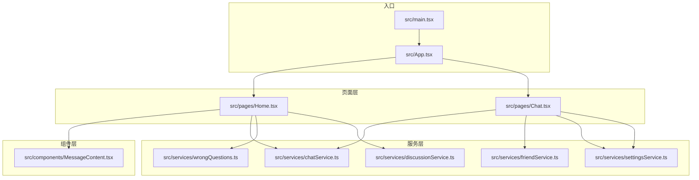
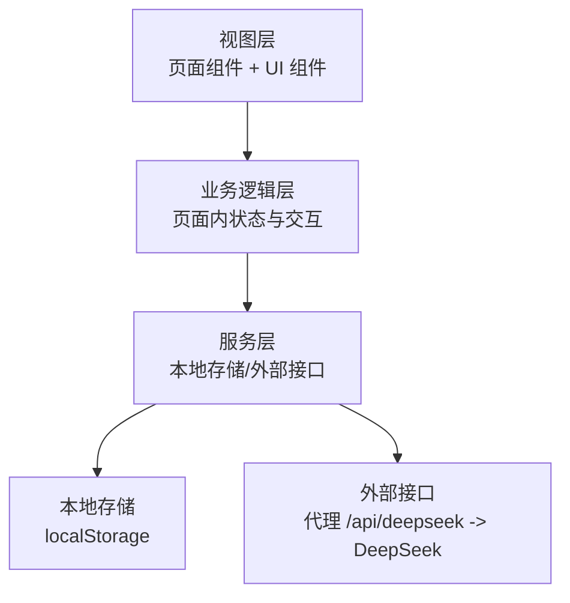
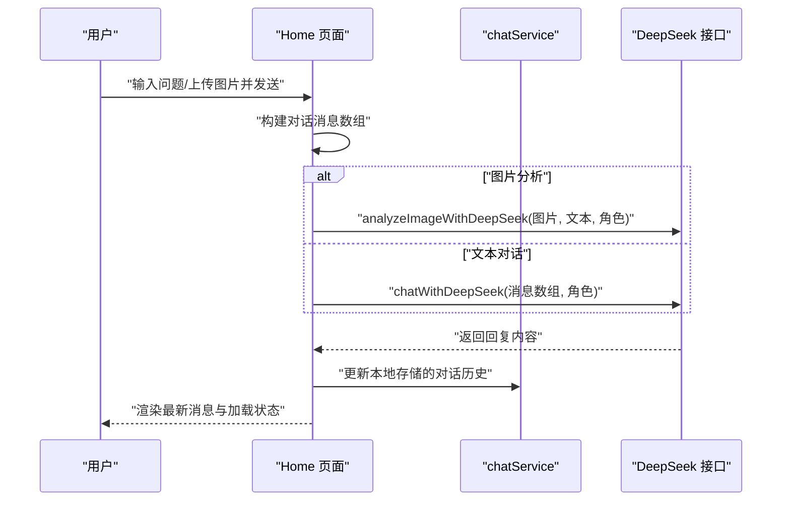
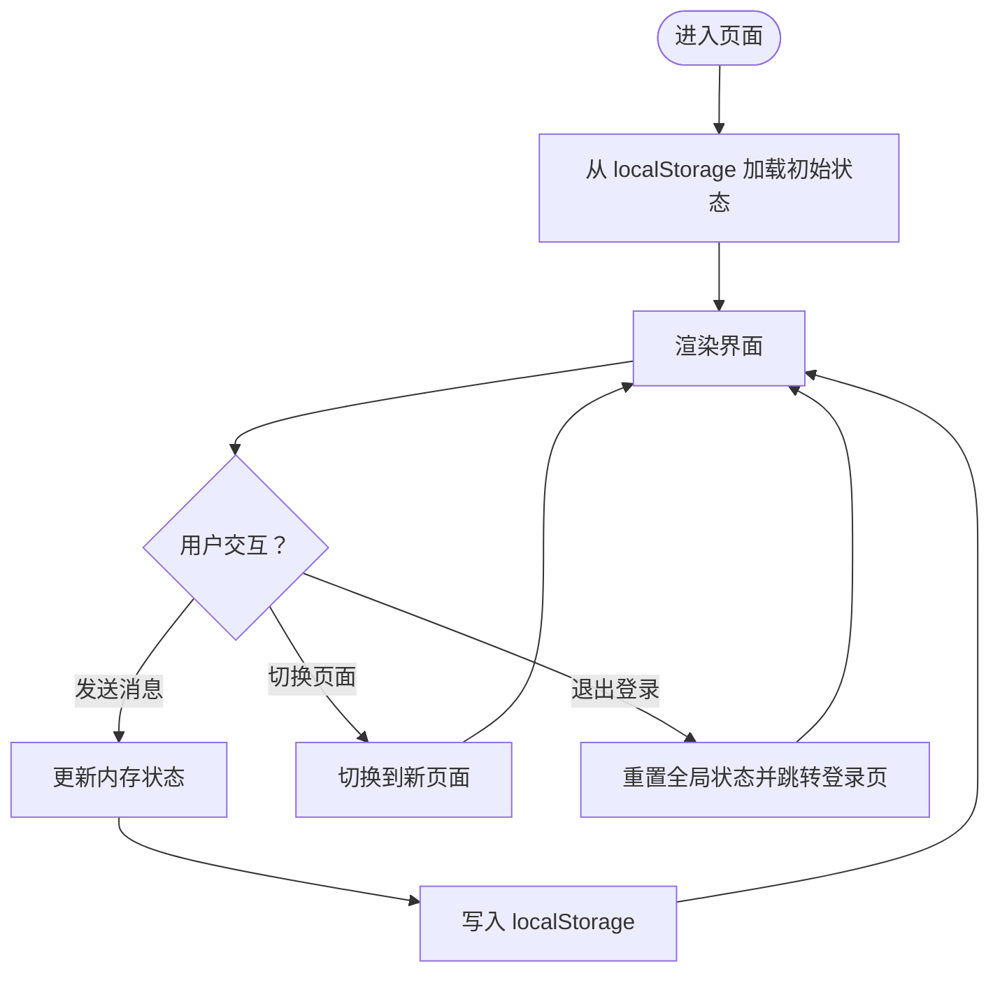
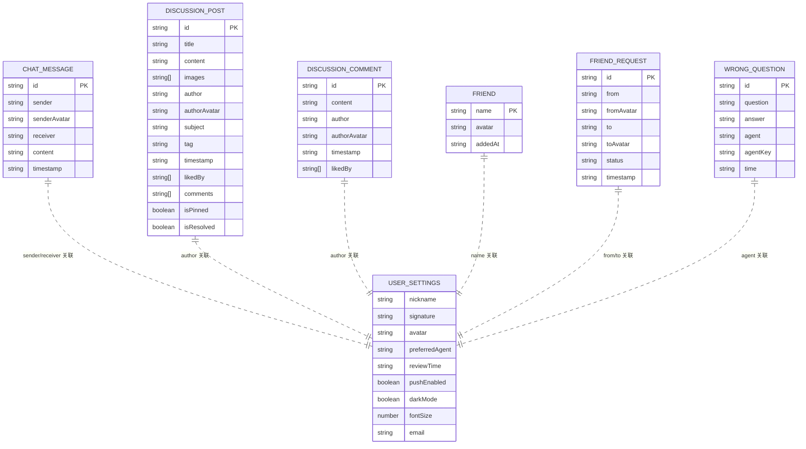
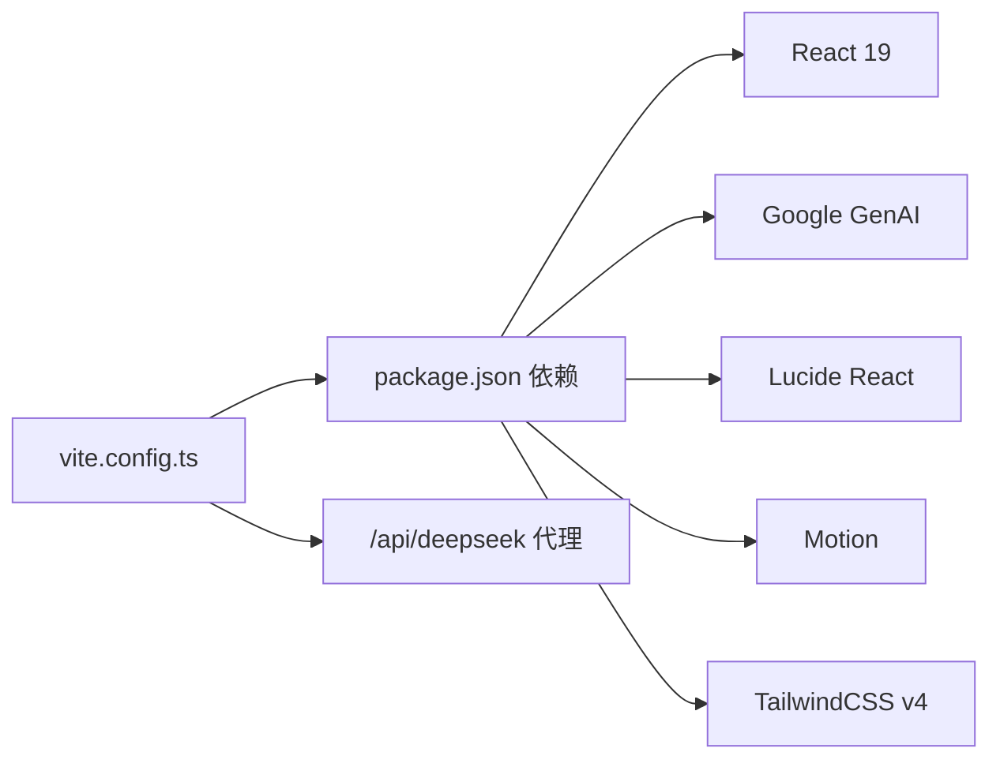

# 整体架构概览

<cite>
**本文档引用的文件**
- [README.md](file://README.md)
- [package.json](file://package.json)
- [vite.config.ts](file://vite.config.ts)
- [tsconfig.json](file://tsconfig.json)
- [src/main.tsx](file://src/main.tsx)
- [src/App.tsx](file://src/App.tsx)
- [src/pages/Home.tsx](file://src/pages/Home.tsx)
- [src/pages/Chat.tsx](file://src/pages/Chat.tsx)
- [src/components/MessageContent.tsx](file://src/components/MessageContent.tsx)
- [src/services/chatService.ts](file://src/services/chatService.ts)
- [src/services/discussionService.ts](file://src/services/discussionService.ts)
- [src/services/friendService.ts](file://src/services/friendService.ts)
- [src/services/settingsService.ts](file://src/services/settingsService.ts)
- [src/services/wrongQuestions.ts](file://src/services/wrongQuestions.ts)
- [src/config/videoConfig.ts](file://src/config/videoConfig.ts)
</cite>

## 目录
1. [引言](#引言)
2. [项目结构](#项目结构)
3. [核心组件](#核心组件)
4. [架构总览](#架构总览)
5. [详细组件分析](#详细组件分析)
6. [依赖关系分析](#依赖关系分析)
7. [性能考量](#性能考量)
8. [故障排查指南](#故障排查指南)
9. [结论](#结论)
10. [附录](#附录)

## 引言
本项目为“智课通 AI Tutor”前端应用，采用 React 19 + TypeScript 构建，结合 Vite 打包与 TailwindCSS 样式框架，围绕“三层架构”组织代码：视图层（页面与组件）、业务逻辑层（页面内状态与交互逻辑）、服务层（数据持久化与外部接口封装）。应用提供多智能体对话、错题本、讨论区、好友社交等模块，并通过本地存储实现离线可用的数据持久化。

## 项目结构
项目采用按功能域分层的目录组织方式：
- src/pages：页面级组件，承载具体业务页面（如首页、聊天、设置等）
- src/components：通用 UI 组件（如消息内容渲染组件）
- src/services：服务层，封装数据访问与外部接口调用（如聊天、讨论、好友、设置、错题）
- src/config：静态配置（如视频背景配置）
- 根目录配置：Vite、TypeScript、依赖声明与运行脚本

**图表来源**
- [src/main.tsx:1-11](file://src/main.tsx#L1-L11)
- [src/App.tsx:1-246](file://src/App.tsx#L1-L246)
- [src/pages/Home.tsx:1-554](file://src/pages/Home.tsx#L1-L554)
- [src/pages/Chat.tsx:1-381](file://src/pages/Chat.tsx#L1-L381)
- [src/components/MessageContent.tsx:1-31](file://src/components/MessageContent.tsx#L1-L31)
- [src/services/chatService.ts:1-72](file://src/services/chatService.ts#L1-L72)
- [src/services/discussionService.ts:1-155](file://src/services/discussionService.ts#L1-L155)
- [src/services/friendService.ts:1-151](file://src/services/friendService.ts#L1-L151)
- [src/services/settingsService.ts:1-50](file://src/services/settingsService.ts#L1-L50)
- [src/services/wrongQuestions.ts:1-35](file://src/services/wrongQuestions.ts#L1-L35)

**章节来源**
- [package.json:1-42](file://package.json#L1-L42)
- [vite.config.ts:1-32](file://vite.config.ts#L1-L32)
- [tsconfig.json:1-28](file://tsconfig.json#L1-L28)

## 核心组件
- 应用入口与根组件
  - 入口文件负责挂载根组件，根组件负责全局状态与页面导航。
- 页面组件
  - Home：多智能体对话、历史记录、图片 OCR 分析、错题保存等。
  - Chat：好友列表、好友请求、实时聊天消息。
- UI 组件
  - MessageContent：支持 LaTeX 数学公式渲染的消息内容组件。
- 服务层
  - chatService：本地存储聊天消息。
  - discussionService：本地存储讨论贴、点赞、评论、置顶与解决状态。
  - friendService：本地存储好友关系与请求。
  - settingsService：用户设置与头像昵称读取。
  - wrongQuestions：错题本本地存储。

**章节来源**
- [src/main.tsx:1-11](file://src/main.tsx#L1-L11)
- [src/App.tsx:1-246](file://src/App.tsx#L1-L246)
- [src/pages/Home.tsx:1-554](file://src/pages/Home.tsx#L1-L554)
- [src/pages/Chat.tsx:1-381](file://src/pages/Chat.tsx#L1-L381)
- [src/components/MessageContent.tsx:1-31](file://src/components/MessageContent.tsx#L1-L31)
- [src/services/chatService.ts:1-72](file://src/services/chatService.ts#L1-L72)
- [src/services/discussionService.ts:1-155](file://src/services/discussionService.ts#L1-L155)
- [src/services/friendService.ts:1-151](file://src/services/friendService.ts#L1-L151)
- [src/services/settingsService.ts:1-50](file://src/services/settingsService.ts#L1-L50)
- [src/services/wrongQuestions.ts:1-35](file://src/services/wrongQuestions.ts#L1-L35)

## 架构总览
应用采用“视图层-业务逻辑层-服务层”的三层架构：
- 视图层：页面组件与通用 UI 组件，负责渲染与用户交互。
- 业务逻辑层：页面内部的状态管理、事件处理与数据编排。
- 服务层：封装本地存储与外部接口调用，统一数据访问与格式化。

**图表来源**
- [src/App.tsx:35-211](file://src/App.tsx#L35-L211)
- [src/pages/Home.tsx:79-223](file://src/pages/Home.tsx#L79-L223)
- [src/pages/Chat.tsx:28-97](file://src/pages/Chat.tsx#L28-L97)
- [src/services/chatService.ts:34-71](file://src/services/chatService.ts#L34-L71)
- [src/services/discussionService.ts:45-154](file://src/services/discussionService.ts#L45-L154)
- [vite.config.ts:22-28](file://vite.config.ts#L22-L28)

## 详细组件分析

### 视图层与页面组件
- App 根组件
  - 负责全局页面切换、侧边栏导航、顶部导航、登录状态与用户信息展示。
  - 使用动画过渡与条件渲染实现页面切换。
- Home 页面
  - 多智能体对话：数学、Python、深度学习、矩阵四个角色，支持文本与图片混合输入。
  - 对话历史管理与滚动定位。
  - 错题保存与忽略动作提示。
- Chat 页面
  - 好友管理：添加好友、请求列表、接受/拒绝、删除好友。
  - 实时聊天：消息列表、发送消息、自动滚动。

**图表来源**
- [src/pages/Home.tsx:139-223](file://src/pages/Home.tsx#L139-L223)
- [src/services/chatService.ts:34-71](file://src/services/chatService.ts#L34-L71)
- [vite.config.ts:22-28](file://vite.config.ts#L22-L28)

**章节来源**
- [src/App.tsx:35-211](file://src/App.tsx#L35-L211)
- [src/pages/Home.tsx:1-554](file://src/pages/Home.tsx#L1-L554)
- [src/pages/Chat.tsx:1-381](file://src/pages/Chat.tsx#L1-L381)

### 业务逻辑层与状态管理
- 全局状态
  - App 中维护当前页面、登录状态、用户信息、当前激活智能体等。
- 页面内状态
  - Home：对话历史、当前会话 ID、输入框、加载状态、图片选择、错题与忽略动作集合。
  - Chat：好友列表、选中好友、消息列表、输入框、请求列表。
- 数据持久化
  - 通过 localStorage 将对话、讨论、好友、错题等数据持久化，页面挂载时恢复。

**图表来源**
- [src/pages/Home.tsx:70-117](file://src/pages/Home.tsx#L70-L117)
- [src/pages/Chat.tsx:32-53](file://src/pages/Chat.tsx#L32-L53)
- [src/App.tsx:36-56](file://src/App.tsx#L36-L56)

**章节来源**
- [src/App.tsx:35-211](file://src/App.tsx#L35-L211)
- [src/pages/Home.tsx:70-117](file://src/pages/Home.tsx#L70-L117)
- [src/pages/Chat.tsx:32-53](file://src/pages/Chat.tsx#L32-L53)

### 服务层与数据模型
- 数据模型
  - ChatMessage、DiscussionPost/Comment、Friend/FriendRequest、WrongQuestion、UserSettings。
- 存储策略
  - 以 localStorage 为主，键名区分不同实体类型。
  - 时间戳统一转换为北京时间字符串，ID 生成使用时间戳与随机串组合。
- 外部接口
  - 通过 Vite 代理将 /api/deepseek 转发至 DeepSeek 服务，便于本地开发与部署。

**图表来源**
- [src/services/chatService.ts:1-8](file://src/services/chatService.ts#L1-L8)
- [src/services/discussionService.ts:10-24](file://src/services/discussionService.ts#L10-L24)
- [src/services/friendService.ts:11-15](file://src/services/friendService.ts#L11-L15)
- [src/services/wrongQuestions.ts:1-8](file://src/services/wrongQuestions.ts#L1-L8)
- [src/services/settingsService.ts:1-11](file://src/services/settingsService.ts#L1-L11)

**章节来源**
- [src/services/chatService.ts:1-72](file://src/services/chatService.ts#L1-L72)
- [src/services/discussionService.ts:1-155](file://src/services/discussionService.ts#L1-L155)
- [src/services/friendService.ts:1-151](file://src/services/friendService.ts#L1-L151)
- [src/services/settingsService.ts:1-50](file://src/services/settingsService.ts#L1-L50)
- [src/services/wrongQuestions.ts:1-35](file://src/services/wrongQuestions.ts#L1-L35)

### UI 组件与第三方库集成
- MessageContent
  - 使用 react-markdown 与 remark-math、rehype-katex 支持 Markdown 与 LaTeX 数学公式渲染。
- 图标与动画
  - lucide-react 提供图标；motion/react 提供页面切换动画。
- 样式与主题
  - TailwindCSS v4 与 @tailwindcss/vite 插件；深浅色模式由用户设置控制。

**章节来源**
- [src/components/MessageContent.tsx:1-31](file://src/components/MessageContent.tsx#L1-L31)
- [package.json:13-28](file://package.json#L13-L28)
- [vite.config.ts:1-12](file://vite.config.ts#L1-L12)

## 依赖关系分析
- 构建与工具链
  - Vite 作为开发服务器与打包器；TailwindCSS 用于样式；TypeScript 提供类型安全。
- 运行时依赖
  - React 19 与 React DOM；@google/genai 用于 Gemini/DeepSeek 接口；lucide-react、motion 等 UI/动画库。
- 开发依赖
  - @types/* 与 TailwindCSS v4 开发工具链。
- 代理与环境变量
  - Vite 代理 /api/deepseek 到目标服务；通过 define 注入 GEMINI_API_KEY。

**图表来源**
- [package.json:13-28](file://package.json#L13-L28)
- [vite.config.ts:22-28](file://vite.config.ts#L22-L28)

**章节来源**
- [package.json:1-42](file://package.json#L1-42)
- [vite.config.ts:1-32](file://vite.config.ts#L1-L32)
- [tsconfig.json:1-28](file://tsconfig.json#L1-L28)

## 性能考量
- 本地存储优化
  - 将对话、讨论、好友、错题等数据持久化于 localStorage，减少网络请求与首屏等待。
- 懒加载与条件渲染
  - 页面切换使用动画与条件渲染，避免不必要的组件重绘。
- 图片与媒体
  - 图片上传与预览在客户端完成，减少服务器压力；视频背景配置支持多分辨率资源。
- 打包与按需
  - Vite 按需打包与 Tree Shaking，结合路径别名提升开发体验。

## 故障排查指南
- 无法连接外部接口
  - 检查 Vite 代理配置与目标服务可达性；确认 GEMINI_API_KEY 是否正确注入。
- 聊天/讨论数据异常
  - 清理 localStorage 中对应键值，或检查时间戳与 ID 生成逻辑。
- LaTeX 渲染问题
  - 确认 Markdown 内容中数学语法格式是否符合预期；检查 remark-math 与 rehype-katex 插件版本兼容性。
- 开发服务器 HMR 行为
  - 若 HMR 导致编辑闪烁，可通过环境变量禁用 HMR（参考 Vite 配置注释）。

**章节来源**
- [vite.config.ts:18-21](file://vite.config.ts#L18-L21)
- [src/services/chatService.ts:12-27](file://src/services/chatService.ts#L12-L27)
- [src/components/MessageContent.tsx:9-17](file://src/components/MessageContent.tsx#L9-L17)

## 结论
本项目以 React 19 + TypeScript 为基础，采用清晰的三层架构与组件化设计，结合本地存储与外部接口代理，实现了多智能体对话、社交与错题本等核心功能。通过 Vite 与 TailwindCSS 的现代化工具链，兼顾了开发效率与运行性能。未来可在以下方面进一步演进：引入轻量状态管理库以统一跨页面状态、完善错误边界与加载态、扩展服务层以接入真实后端 API、增强测试覆盖与可观测性。

## 附录
- 快速启动
  - 安装依赖、设置环境变量、运行开发服务器。
- 配置说明
  - Vite 路径别名、代理规则、HMR 与环境变量注入。
- 视频背景配置
  - 支持多分辨率视频与遮罩层透明度配置，便于在不同页面应用。

**章节来源**
- [README.md:11-21](file://README.md#L11-L21)
- [vite.config.ts:13-17](file://vite.config.ts#L13-L17)
- [src/config/videoConfig.ts:1-47](file://src/config/videoConfig.ts#L1-L47)