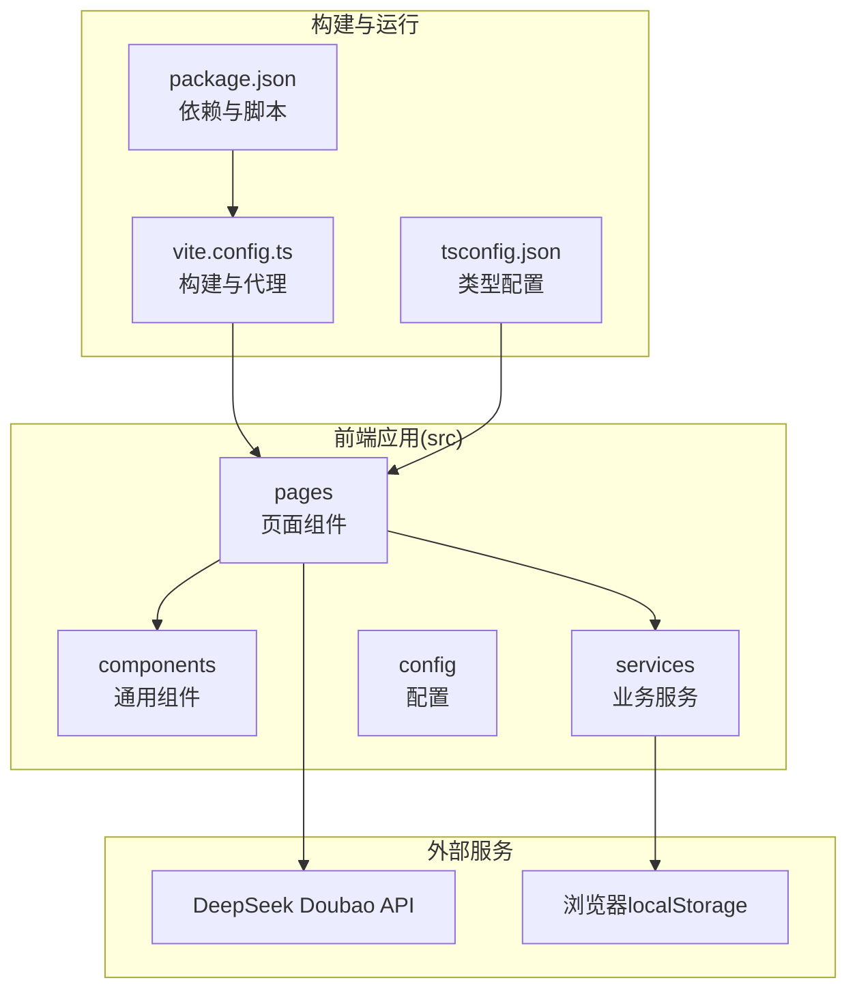
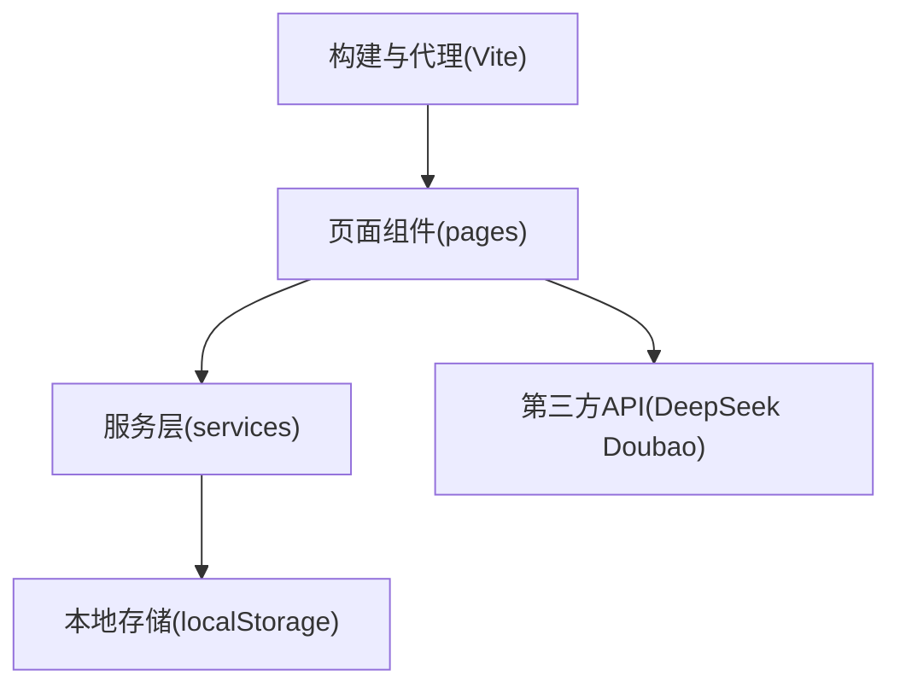
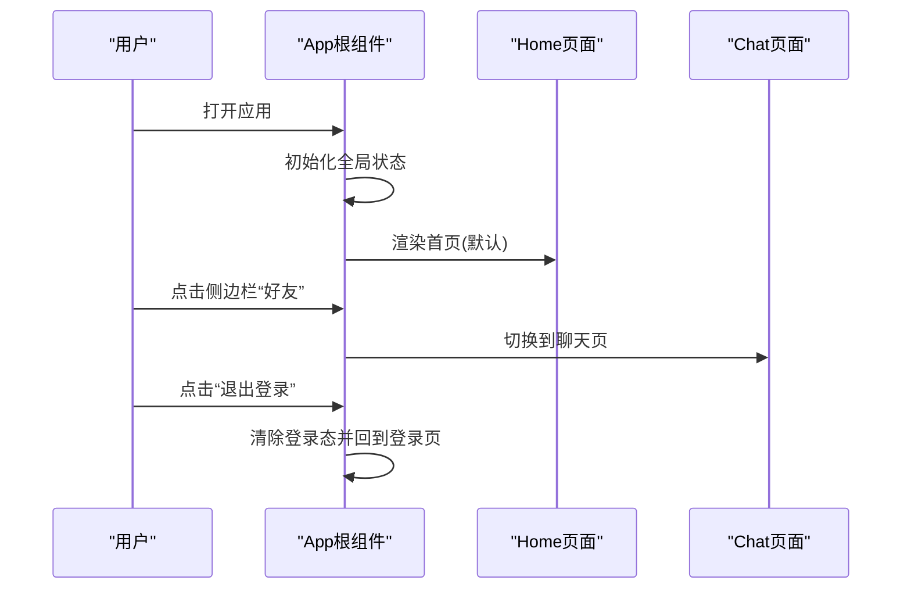
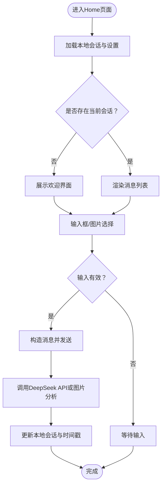
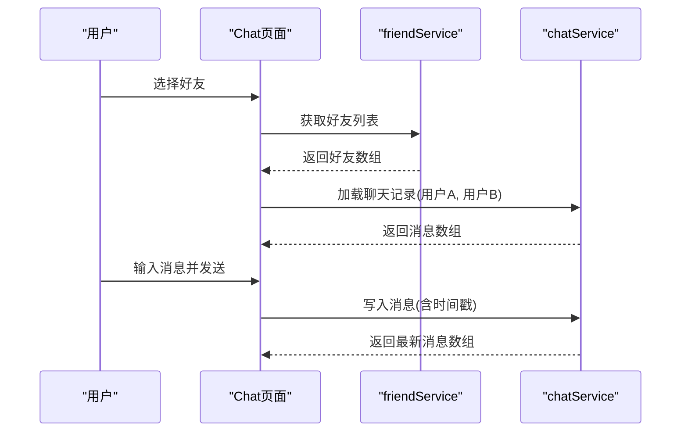
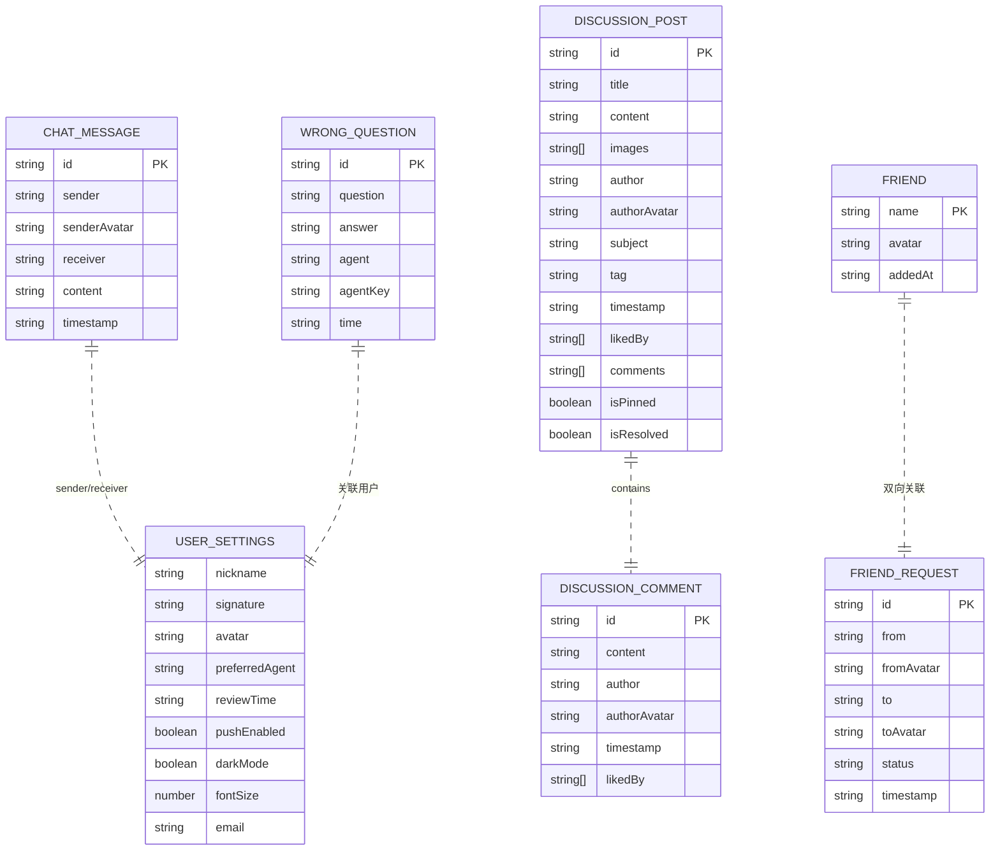
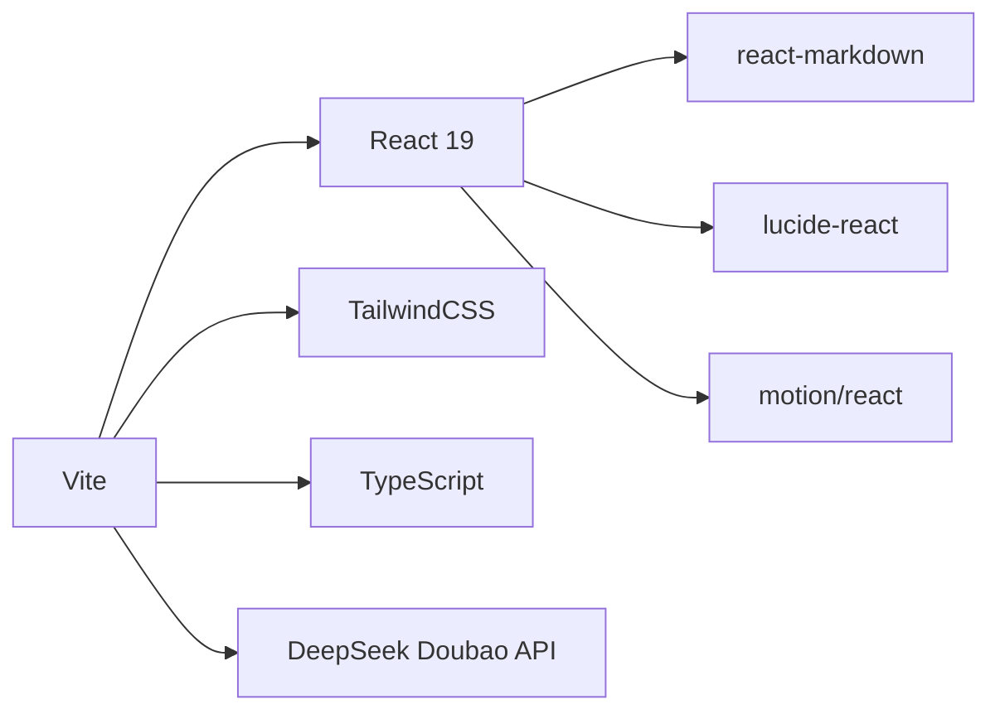

# 架构设计

<cite>
**本文引用的文件**
- [README.md](file://README.md)
- [package.json](file://package.json)
- [vite.config.ts](file://vite.config.ts)
- [tsconfig.json](file://tsconfig.json)
- [src/main.tsx](file://src/main.tsx)
- [src/App.tsx](file://src/App.tsx)
- [src/pages/Home.tsx](file://src/pages/Home.tsx)
- [src/pages/Chat.tsx](file://src/pages/Chat.tsx)
- [src/components/MessageContent.tsx](file://src/components/MessageContent.tsx)
- [src/components/VideoBackground.tsx](file://src/components/VideoBackground.tsx)
- [src/config/videoConfig.ts](file://src/config/videoConfig.ts)
- [src/services/chatService.ts](file://src/services/chatService.ts)
- [src/services/discussionService.ts](file://src/services/discussionService.ts)
- [src/services/wrongQuestions.ts](file://src/services/wrongQuestions.ts)
- [src/services/settingsService.ts](file://src/services/settingsService.ts)
- [src/services/friendService.ts](file://src/services/friendService.ts)
- [api/deepseek.js](file://api/deepseek.js)
</cite>

## 目录
1. [引言](#引言)
2. [项目结构](#项目结构)
3. [核心组件](#核心组件)
4. [架构总览](#架构总览)
5. [详细组件分析](#详细组件分析)
6. [依赖分析](#依赖分析)
7. [性能考量](#性能考量)
8. [故障排查指南](#故障排查指南)
9. [结论](#结论)
10. [附录](#附录)

## 引言
本项目为“智课通 AI Tutor”前端应用，采用 React 19 + TypeScript 技术栈，结合 Vite 构建工具与 TailwindCSS 样式框架，围绕多智能体助手（数学、Python、深度学习、矩阵）构建交互式学习体验。系统通过本地存储实现会话与用户设置持久化，集成第三方大模型服务（DeepSeek Doubao），并通过社交与讨论功能增强学习社区体验。

## 项目结构
项目采用按功能域划分的目录组织方式，核心目录与职责如下：
- src/pages：页面级组件，承载路由级视图与业务流程
- src/components：可复用 UI 组件与通用展示组件
- src/services：业务服务层，封装数据访问与本地存储
- src/config：静态配置（如视频背景）
- api：服务端代理接口（Vercel Functions 风格）
- public：公共资源（视频等）



**图表来源**
- [vite.config.ts:1-32](file://vite.config.ts#L1-L32)
- [tsconfig.json:1-28](file://tsconfig.json#L1-L28)
- [package.json:1-42](file://package.json#L1-L42)

**章节来源**
- [vite.config.ts:1-32](file://vite.config.ts#L1-L32)
- [tsconfig.json:1-28](file://tsconfig.json#L1-L28)
- [package.json:1-42](file://package.json#L1-L42)

## 核心组件
- 应用入口与根组件
  - 入口文件负责挂载根组件与全局样式
  - 根组件负责全局状态管理（当前页面、登录态、用户信息）、侧边栏导航与主内容区域渲染
- 页面组件
  - Home：多智能体对话与历史管理，支持文本与图片输入、多模态交互
  - Chat：好友系统与私聊，支持请求、接受、拒绝与删除好友
  - 其他页面：讨论区、帮助中心、设置、个人中心、错题本等
- 通用组件
  - MessageContent：Markdown + LaTeX 渲染
  - VideoBackground：自适应视频背景组件
- 服务层
  - 聊天、讨论、错题、设置、好友等服务均基于 localStorage 实现本地持久化

**章节来源**
- [src/main.tsx:1-11](file://src/main.tsx#L1-L11)
- [src/App.tsx:1-246](file://src/App.tsx#L1-L246)
- [src/pages/Home.tsx:1-554](file://src/pages/Home.tsx#L1-L554)
- [src/pages/Chat.tsx:1-381](file://src/pages/Chat.tsx#L1-L381)
- [src/components/MessageContent.tsx:1-31](file://src/components/MessageContent.tsx#L1-L31)
- [src/components/VideoBackground.tsx:1-159](file://src/components/VideoBackground.tsx#L1-L159)

## 架构总览
系统采用“页面组件 + 服务层 + 本地存储”的分层架构，页面组件负责交互与状态，服务层封装数据访问，本地存储承担持久化。构建阶段通过 Vite 提供开发服务器、热更新与代理能力；TypeScript 提供类型安全；TailwindCSS 提供原子化样式。



**图表来源**
- [src/pages/Home.tsx:1-554](file://src/pages/Home.tsx#L1-L554)
- [src/services/chatService.ts:1-72](file://src/services/chatService.ts#L1-L72)
- [api/deepseek.js:1-34](file://api/deepseek.js#L1-L34)
- [vite.config.ts:1-32](file://vite.config.ts#L1-L32)

## 详细组件分析

### 根组件与路由控制
- 全局状态：当前页面、登录态、用户昵称与头像、活动智能体
- 导航：侧边栏与顶部导航联动，支持页面跳转与新建对话
- 动画过渡：使用动画库实现页面切换的平滑过渡



**图表来源**
- [src/App.tsx:35-211](file://src/App.tsx#L35-L211)

**章节来源**
- [src/App.tsx:1-246](file://src/App.tsx#L1-L246)

### Home 页面与多智能体对话
- 多智能体：数学、Python、深度学习、矩阵四个角色，每个角色拥有专属图标、占位提示与背景图
- 会话管理：本地存储会话列表与当前会话 ID，支持新建、清空、删除会话
- 输入处理：支持文本与图片上传（OCR 分析），调用服务层接口与第三方 API
- 错题保存：在助手回复后提供“保存到错题本”操作，基于本地存储持久化



**图表来源**
- [src/pages/Home.tsx:79-223](file://src/pages/Home.tsx#L79-L223)
- [src/services/wrongQuestions.ts:1-35](file://src/services/wrongQuestions.ts#L1-L35)

**章节来源**
- [src/pages/Home.tsx:1-554](file://src/pages/Home.tsx#L1-L554)
- [src/services/wrongQuestions.ts:1-35](file://src/services/wrongQuestions.ts#L1-L35)

### Chat 页面与好友系统
- 好友列表：展示当前好友，支持移除好友
- 私聊：选择好友后加载聊天记录，发送消息写入本地存储
- 好友请求：支持发送、查看待处理请求、接受/拒绝、刷新状态



**图表来源**
- [src/pages/Chat.tsx:28-98](file://src/pages/Chat.tsx#L28-L98)
- [src/services/friendService.ts:1-151](file://src/services/friendService.ts#L1-L151)
- [src/services/chatService.ts:1-72](file://src/services/chatService.ts#L1-L72)

**章节来源**
- [src/pages/Chat.tsx:1-381](file://src/pages/Chat.tsx#L1-L381)
- [src/services/friendService.ts:1-151](file://src/services/friendService.ts#L1-L151)
- [src/services/chatService.ts:1-72](file://src/services/chatService.ts#L1-L72)

### 通用组件与配置
- MessageContent：对 LaTeX 表达式进行预处理，再由 Markdown 渲染器输出
- VideoBackground：根据设备性能与网络状况自动选择视频源，并提供遮罩层与降级策略
- videoConfig：集中管理视频背景配置项

```mermaid
classDiagram
class MessageContent {
+props : content : string
+render() : ReactNode
}
class VideoBackground {
+props : videoSrc, autoPlay, muted, loop, placeholder, overlayOpacity
+render() : ReactNode
}
class videoConfig {
+login : Config
+otherPages : Config
}
MessageContent --> "使用" KaTeX/Remark
VideoBackground --> "读取" videoConfig
```

**图表来源**
- [src/components/MessageContent.tsx:1-31](file://src/components/MessageContent.tsx#L1-L31)
- [src/components/VideoBackground.tsx:1-159](file://src/components/VideoBackground.tsx#L1-L159)
- [src/config/videoConfig.ts:1-47](file://src/config/videoConfig.ts#L1-L47)

**章节来源**
- [src/components/MessageContent.tsx:1-31](file://src/components/MessageContent.tsx#L1-L31)
- [src/components/VideoBackground.tsx:1-159](file://src/components/VideoBackground.tsx#L1-L159)
- [src/config/videoConfig.ts:1-47](file://src/config/videoConfig.ts#L1-L47)

### 服务层与数据模型
- 聊天服务：消息结构、生成 ID、时间格式化、按用户对检索与写入
- 讨论服务：帖子与评论结构、点赞与置顶/解决状态维护
- 错题服务：错题项结构与增删清空
- 设置服务：用户设置结构与默认值合并
- 好友服务：请求与好友结构、去重与双向添加



**图表来源**
- [src/services/chatService.ts:1-72](file://src/services/chatService.ts#L1-L72)
- [src/services/discussionService.ts:1-155](file://src/services/discussionService.ts#L1-L155)
- [src/services/wrongQuestions.ts:1-35](file://src/services/wrongQuestions.ts#L1-L35)
- [src/services/settingsService.ts:1-50](file://src/services/settingsService.ts#L1-L50)
- [src/services/friendService.ts:1-151](file://src/services/friendService.ts#L1-L151)

**章节来源**
- [src/services/chatService.ts:1-72](file://src/services/chatService.ts#L1-L72)
- [src/services/discussionService.ts:1-155](file://src/services/discussionService.ts#L1-L155)
- [src/services/wrongQuestions.ts:1-35](file://src/services/wrongQuestions.ts#L1-L35)
- [src/services/settingsService.ts:1-50](file://src/services/settingsService.ts#L1-L50)
- [src/services/friendService.ts:1-151](file://src/services/friendService.ts#L1-L151)

## 依赖分析
- 构建与工具链
  - Vite：开发服务器、热更新、代理与别名解析
  - TailwindCSS：原子化样式与主题变量
  - TypeScript：类型检查与编译配置
- 前端运行时
  - React 19：函数组件与并发特性
  - motion/react：轻量动画
  - react-markdown + remark-math + rehype-katex：富文本与公式渲染
  - lucide-react：图标库
- 第三方集成
  - DeepSeek Doubao API：通过本地代理转发请求
- 开发与运行
  - dotenv：环境变量注入
  - express：本地服务（用于代理场景）



**图表来源**
- [package.json:13-28](file://package.json#L13-L28)
- [vite.config.ts:1-32](file://vite.config.ts#L1-L32)

**章节来源**
- [package.json:1-42](file://package.json#L1-L42)
- [vite.config.ts:1-32](file://vite.config.ts#L1-L32)

## 性能考量
- 构建与打包
  - 使用 Vite 的原生 ESM 与按需编译，减少冷启动与热更新延迟
  - TailwindCSS 按需引入，避免无用样式
- 运行时优化
  - 本地存储持久化，减少网络往返
  - 图片 OCR 仅在需要时触发，避免不必要的计算
  - 动画与过渡使用轻量库，避免阻塞主线程
- 网络与代理
  - 通过 Vite 代理将 /api/deepseek 映射到目标服务，隐藏密钥与实现细节
- 可扩展性
  - 服务层抽象清晰，便于替换底层实现（如迁移到后端 API）
  - 组件拆分明确，利于测试与维护

## 故障排查指南
- 无法连接第三方 API
  - 检查代理配置与目标地址是否正确
  - 确认环境变量与密钥是否注入
- 视频背景加载失败
  - 检查视频源路径与可用性，确认降级策略生效
  - 确认浏览器媒体能力与网络状况
- 聊天或会话异常
  - 检查本地存储键名与数据结构一致性
  - 确认时间格式化逻辑与排序规则
- LaTeX 渲染问题
  - 确认预处理正则与渲染插件顺序

**章节来源**
- [vite.config.ts:22-28](file://vite.config.ts#L22-L28)
- [src/components/VideoBackground.tsx:94-103](file://src/components/VideoBackground.tsx#L94-L103)
- [src/services/chatService.ts:34-42](file://src/services/chatService.ts#L34-L42)
- [src/components/MessageContent.tsx:9-17](file://src/components/MessageContent.tsx#L9-L17)

## 结论
本项目以 React 19 + TypeScript 为基础，结合 Vite 与 TailwindCSS，构建了模块化、可扩展且具备良好用户体验的学习助手前端应用。通过服务层与本地存储解耦业务逻辑，配合动画与富文本渲染提升交互质量；同时通过代理与配置化策略确保可维护性与可移植性。未来可在服务层接入后端 API、完善错误监控与埋点、扩展主题与国际化支持。

## 附录
- 快速开始
  - 安装依赖、设置环境变量、启动开发服务器
- 关键配置
  - Vite 别名、代理、HMR 与环境变量注入
  - TypeScript 路径映射与 JSX 编译选项

**章节来源**
- [README.md:11-21](file://README.md#L11-L21)
- [vite.config.ts:6-12](file://vite.config.ts#L6-L12)
- [tsconfig.json:18-22](file://tsconfig.json#L18-L22)