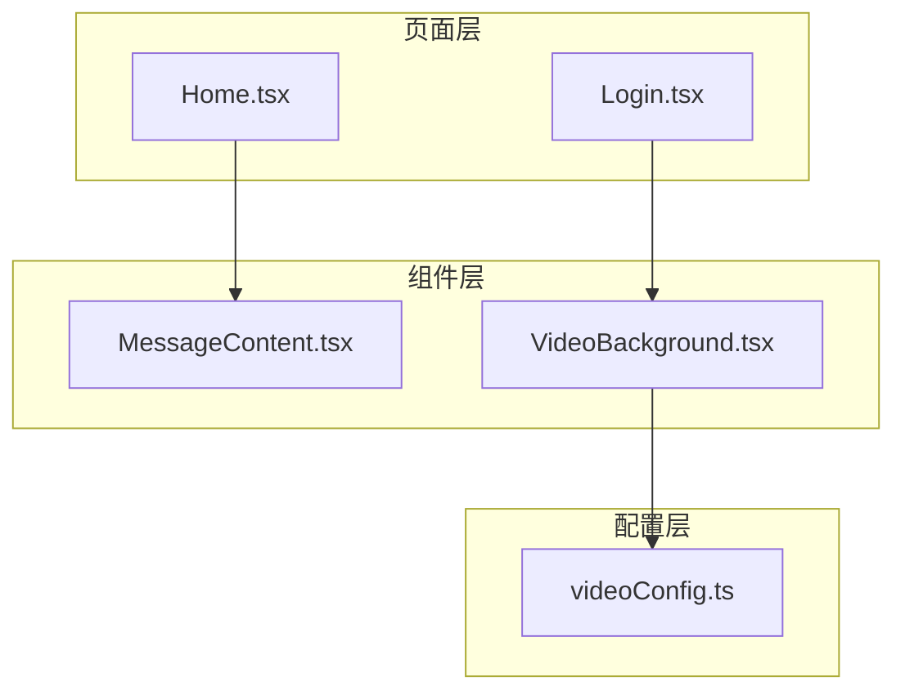
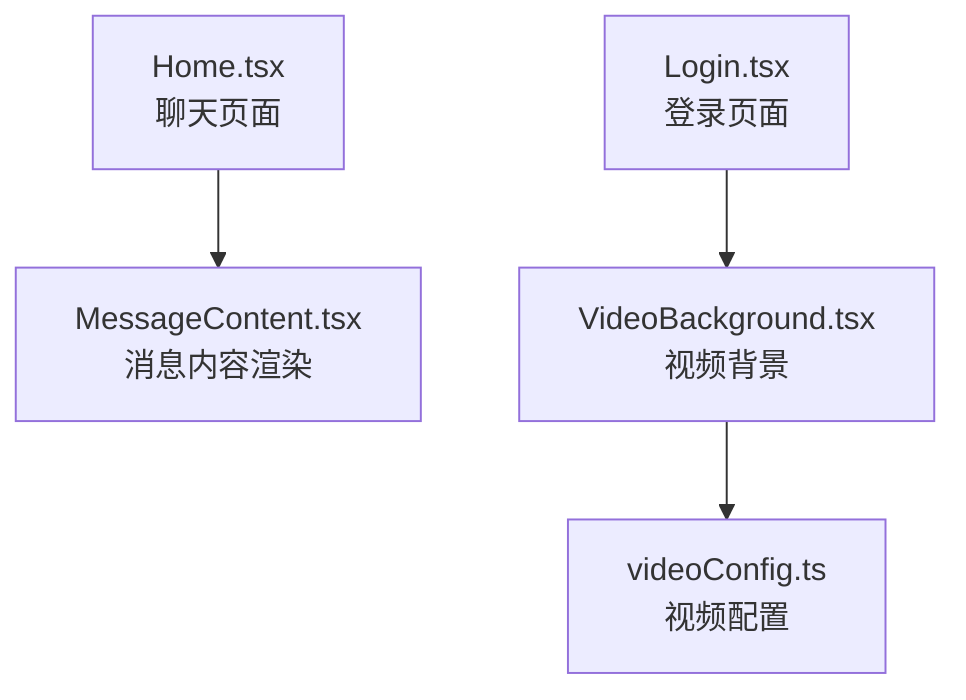
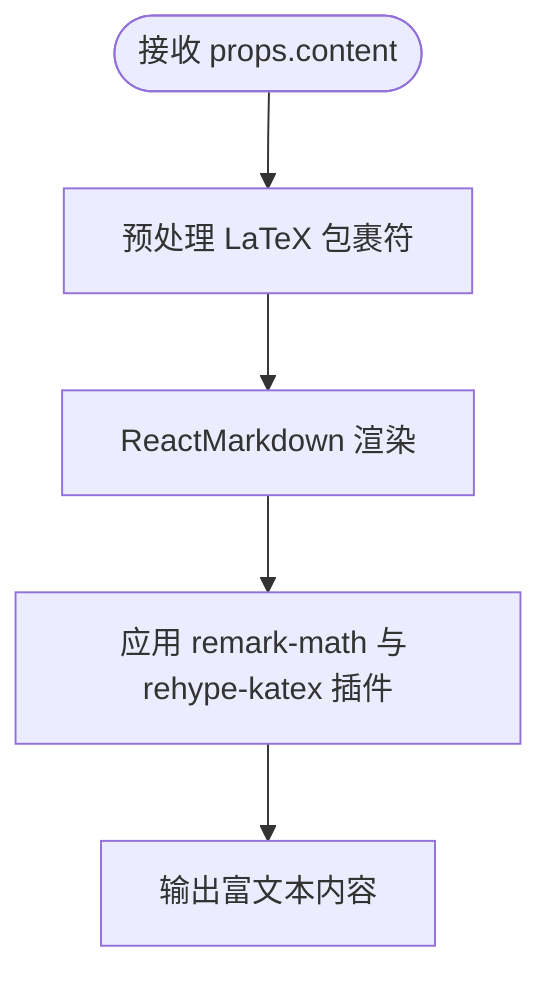
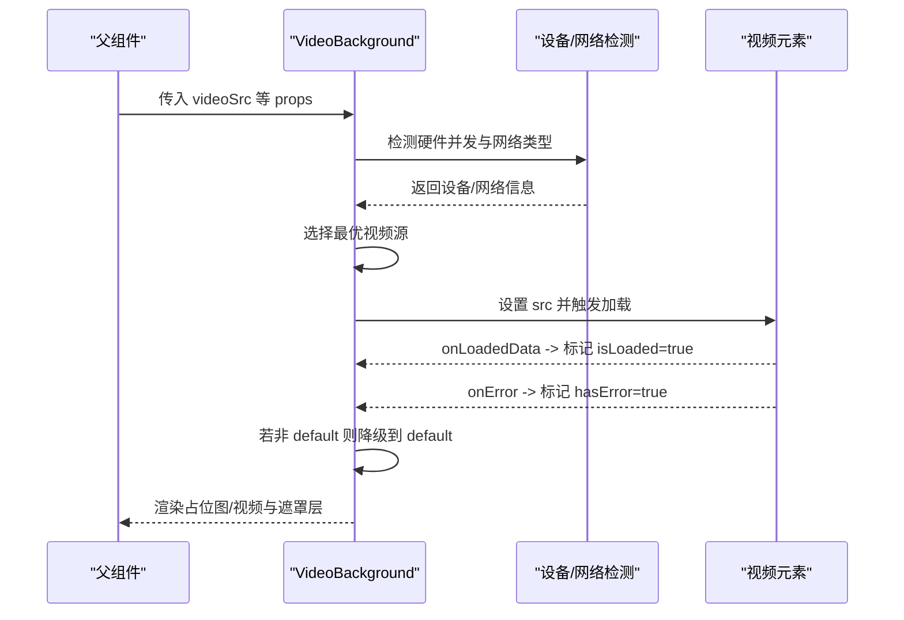
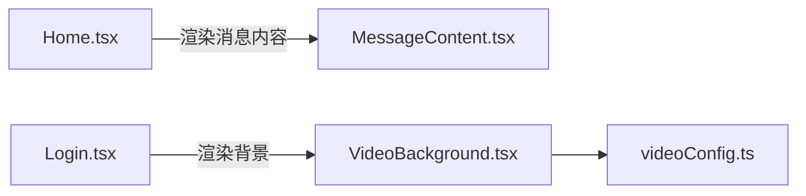
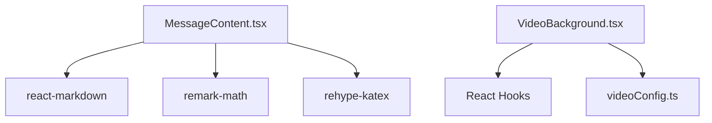

# 功能组件设计

<cite>
**本文档引用的文件**
- [MessageContent.tsx](file://src/components/MessageContent.tsx)
- [VideoBackground.tsx](file://src/components/VideoBackground.tsx)
- [videoConfig.ts](file://src/config/videoConfig.ts)
- [Home.tsx](file://src/pages/Home.tsx)
- [Login.tsx](file://src/pages/Login.tsx)
- [README.md](file://README.md)
- [VIDEO_BACKGROUND_GUIDE.md](file://VIDEO_BACKGROUND_GUIDE.md)
- [package.json](file://package.json)
</cite>

## 目录
1. [引言](#引言)
2. [项目结构](#项目结构)
3. [核心组件](#核心组件)
4. [架构总览](#架构总览)
5. [详细组件分析](#详细组件分析)
6. [依赖分析](#依赖分析)
7. [性能考虑](#性能考虑)
8. [故障排查指南](#故障排查指南)
9. [结论](#结论)
10. [附录](#附录)

## 引言
本设计文档聚焦于“智课通 AI Tutor”项目中的两个关键功能组件：消息内容渲染组件与视频背景组件。文档从设计原则、职责分离、复用策略出发，系统阐述组件的消息格式化、富文本处理与多媒体展示机制；同时深入解析视频背景的动态源选择、性能优化与用户体验增强策略，并给出 props 设计、事件处理与状态管理策略，以及可测试性设计与测试方案建议。最后总结组件与父组件的通信模式、回调设计与错误边界处理。

## 项目结构
项目采用按功能分层的组织方式，核心功能组件位于 src/components，页面组件位于 src/pages，全局配置位于 src/config。组件通过 props 与页面组件通信，页面组件负责状态管理与业务流程编排。

图表来源
- [Home.tsx:258-490](file://src/pages/Home.tsx#L258-L490)
- [Login.tsx:10-26](file://src/pages/Login.tsx#L10-L26)
- [MessageContent.tsx:19-30](file://src/components/MessageContent.tsx#L19-L30)
- [VideoBackground.tsx:42-158](file://src/components/VideoBackground.tsx#L42-L158)
- [videoConfig.ts:1-47](file://src/config/videoConfig.ts#L1-L47)

章节来源
- [README.md:1-21](file://README.md#L1-L21)
- [package.json:1-42](file://package.json#L1-L42)

## 核心组件
本节概述两个核心组件的功能定位与职责边界：
- 消息内容渲染组件：负责将后端返回的富文本内容（含 LaTeX 数学公式）安全地渲染为 HTML，支持数学公式与基础 Markdown 语法。
- 视频背景组件：负责根据设备性能与网络状况动态选择合适分辨率的视频源，提供平滑过渡与遮罩层，增强视觉体验并保障可用性。

章节来源
- [MessageContent.tsx:5-30](file://src/components/MessageContent.tsx#L5-L30)
- [VideoBackground.tsx:3-25](file://src/components/VideoBackground.tsx#L3-L25)

## 架构总览
消息内容渲染组件与视频背景组件分别在页面层的不同场景中被使用：消息内容渲染组件用于聊天对话区的富文本展示；视频背景组件用于登录页的沉浸式背景。

图表来源
- [Home.tsx:336-360](file://src/pages/Home.tsx#L336-L360)
- [Login.tsx:12-26](file://src/pages/Login.tsx#L12-L26)
- [VideoBackground.tsx:42-158](file://src/components/VideoBackground.tsx#L42-L158)
- [videoConfig.ts:1-47](file://src/config/videoConfig.ts#L1-L47)

## 详细组件分析

### 消息内容渲染组件（MessageContent）
该组件的核心职责是将字符串内容安全地转换为富文本，重点支持 LaTeX 数学公式渲染与基础 Markdown 语法。组件通过预处理将特定的 LaTeX 包裹符转换为 ReactMarkdown 可识别的格式，并结合 remark-math 与 rehype-katex 插件完成渲染。

- 设计原则
  - 单一职责：仅负责内容格式化与渲染，不参与业务数据处理。
  - 安全性：依赖 ReactMarkdown 的默认安全策略，避免注入风险。
  - 可扩展性：通过插件机制支持更多语法扩展（如代码高亮、表格等）。

- Props 设计
  - content: string（必填）——待渲染的富文本字符串，支持 Markdown 与 LaTeX。

- 处理流程
  - 预处理阶段：将行内与块级的 LaTeX 包裹符统一转换为 $$/$$ 形式，便于后续插件识别。
  - 渲染阶段：使用 ReactMarkdown 渲染基础 Markdown；remark-math 识别数学表达式；rehype-katex 渲染为高质量公式。

- 错误处理
  - 当 content 为空或格式异常时，ReactMarkdown 会安全回退为纯文本或空内容，不会抛出异常。

- 与父组件的通信
  - 通过 props 接收 content，不产生反向回调；适合纯展示型组件。

图表来源
- [MessageContent.tsx:9-29](file://src/components/MessageContent.tsx#L9-L29)

章节来源
- [MessageContent.tsx:5-30](file://src/components/MessageContent.tsx#L5-L30)

### 视频背景组件（VideoBackground）
该组件负责在页面中渲染动态背景视频，具备智能源选择、错误降级、占位图与遮罩层等功能，以提升性能与用户体验。

- 设计原则
  - 动态适配：根据设备性能与网络状况自动选择最优视频源。
  - 可靠性：加载失败时自动降级至默认源，保证背景可用。
  - 用户体验：提供占位图与平滑过渡，避免白屏与闪烁。
  - 性能优先：默认静音以满足自动播放要求，减少首屏阻塞。

- Props 设计
  - videoSrc: 对象，包含 src8k、src4k、src2k、default 四个字段；其中 default 为必填项。
  - autoPlay: boolean，默认 true。
  - muted: boolean，默认 true（浏览器自动播放最佳实践）。
  - loop: boolean，默认 true。
  - placeholder: string（可选），用于加载期间显示。
  - overlayOpacity: number，默认 0.3，范围 0-1。

- 状态管理策略
  - isLoaded: 布尔值，表示视频是否已成功加载。
  - hasError: 布尔值，表示视频加载是否发生错误。
  - selectedSrc: 字符串，当前选择的视频源地址。
  - videoRef: 引用，指向 video DOM 元素，便于控制播放与事件绑定。

- 动态背景切换机制
  - 设备性能检测：通过 hardwareConcurrency 判断 CPU 核心数，作为高性能设备的参考指标。
  - 网络状况检测：通过 navigator.connection/effectiveType 判断网络类型（如 4G/3G/WiFi）。
  - 源选择策略：优先选择高分辨率视频（8K/4K），若不可用则降级至 2K，最终回退到 default。
  - 事件驱动：onLoadedData 成功回调将 isLoaded 置为 true；onError 发生时将 hasError 置为 true，并尝试降级。

- 性能优化与用户体验增强
  - 预加载与按需加载：仅在确定源后加载对应分辨率视频。
  - 平滑过渡：通过 CSS transition 实现视频淡入，避免突兀切换。
  - 遮罩层：通过叠加半透明黑色层提升前景内容可读性。
  - 占位图：在加载期间显示占位图或加载提示，改善感知性能。

- 错误边界与降级策略
  - 当前源加载失败且非 default 时，自动切换到 default 源并重试。
  - 若 default 源也失败，则持续显示占位图或加载提示，避免空白背景。

图表来源
- [VideoBackground.tsx:55-103](file://src/components/VideoBackground.tsx#L55-L103)
- [VideoBackground.tsx:105-155](file://src/components/VideoBackground.tsx#L105-L155)

章节来源
- [VideoBackground.tsx:3-25](file://src/components/VideoBackground.tsx#L3-L25)
- [VideoBackground.tsx:42-158](file://src/components/VideoBackground.tsx#L42-L158)
- [videoConfig.ts:1-47](file://src/config/videoConfig.ts#L1-L47)
- [VIDEO_BACKGROUND_GUIDE.md:1-163](file://VIDEO_BACKGROUND_GUIDE.md#L1-L163)

### 组件在页面中的使用
- Home.tsx 中的消息内容渲染
  - 在对话列表中，每个消息项使用 MessageContent 渲染 content 字段，支持数学公式与基础 Markdown。
  - 该组件不与父组件进行反向通信，仅消费 props。

- Login.tsx 中的视频背景
  - 登录页通过 VideoBackground 组件渲染动态背景，使用 videoConfig.ts 中的配置项。
  - 支持点击展开/收起、叠加遮罩层与占位图，提升视觉体验与加载感知。

图表来源
- [Home.tsx:336-360](file://src/pages/Home.tsx#L336-L360)
- [Login.tsx:12-26](file://src/pages/Login.tsx#L12-L26)
- [VideoBackground.tsx:42-158](file://src/components/VideoBackground.tsx#L42-L158)
- [videoConfig.ts:1-47](file://src/config/videoConfig.ts#L1-L47)

章节来源
- [Home.tsx:336-360](file://src/pages/Home.tsx#L336-L360)
- [Login.tsx:12-26](file://src/pages/Login.tsx#L12-L26)

## 依赖分析
- 消息内容渲染组件依赖
  - react-markdown：基础 Markdown 渲染。
  - remark-math：识别数学表达式。
  - rehype-katex：将数学表达式渲染为高质量公式。
- 视频背景组件依赖
  - React Hooks：useState/useEffect/useRef 管理状态与副作用。
  - 浏览器 API：hardwareConcurrency、navigator.connection 用于设备与网络检测。
  - 配置文件：videoConfig.ts 提供视频源与遮罩层配置。

图表来源
- [MessageContent.tsx:1-3](file://src/components/MessageContent.tsx#L1-L3)
- [VideoBackground.tsx:1](file://src/components/VideoBackground.tsx#L1)
- [videoConfig.ts:1-47](file://src/config/videoConfig.ts#L1-L47)
- [package.json:23-27](file://package.json#L23-L27)

章节来源
- [package.json:13-28](file://package.json#L13-L28)

## 性能考虑
- 消息内容渲染组件
  - 通过插件化渲染，避免一次性解析大量内容；建议对长文本进行分段或懒加载。
  - 避免在渲染过程中执行复杂计算，确保预处理步骤轻量高效。
- 视频背景组件
  - 默认静音以满足自动播放要求，减少首屏阻塞。
  - 智能源选择与按需加载，避免不必要的带宽消耗。
  - 占位图与平滑过渡提升感知性能，减少用户等待焦虑。
  - 遮罩层适度降低亮度，提升前景内容可读性。

## 故障排查指南
- 视频背景组件常见问题
  - 视频不播放：检查视频地址是否正确、格式是否为 MP4、浏览器是否支持 video 标签、是否存在 CORS 限制。
  - 视频加载慢：压缩文件大小、使用 CDN、提供占位图、降低默认分辨率。
  - 移动端性能问题：为移动端提供 2K 或更低分辨率视频，优化文件大小，使用占位图。
  - 自动播放失败：确认 muted 为 true，遵循浏览器自动播放策略。
- 消息内容渲染组件常见问题
  - 数学公式未渲染：确认 content 中的 LaTeX 包裹符符合预期格式，或在预处理阶段正确转换。
  - Markdown 渲染异常：检查 content 是否包含不受支持的标签或脚本，ReactMarkdown 默认具备基本安全策略。

章节来源
- [VIDEO_BACKGROUND_GUIDE.md:123-163](file://VIDEO_BACKGROUND_GUIDE.md#L123-L163)
- [MessageContent.tsx:9-17](file://src/components/MessageContent.tsx#L9-L17)

## 结论
消息内容渲染组件与视频背景组件分别承担“内容展示”和“视觉背景”的职责，二者通过 props 与配置文件解耦，实现了良好的职责分离与复用策略。前者专注于富文本与数学公式渲染，后者专注于动态背景与性能优化。两者共同提升了“智课通 AI Tutor”的用户体验与技术可维护性。

## 附录
- 可测试性设计与测试方案建议
  - 消息内容渲染组件
    - 单元测试：针对不同 content 输入（含 LaTeX、Markdown、混合内容）验证渲染结果与安全性。
    - 集成测试：在页面中集成渲染组件，验证与聊天服务的数据流与 UI 呈现。
  - 视频背景组件
    - 单元测试：模拟设备性能与网络状况，验证源选择逻辑与降级策略。
    - 集成测试：在登录页中集成组件，验证占位图、遮罩层与自动播放行为。
- 组件通信与错误边界
  - 消息内容渲染组件为纯展示型组件，无需回调；父组件负责数据准备与错误处理。
  - 视频背景组件内部处理加载与错误状态，父组件通过 props 传递配置，必要时可通过外部样式或布局进行错误提示。