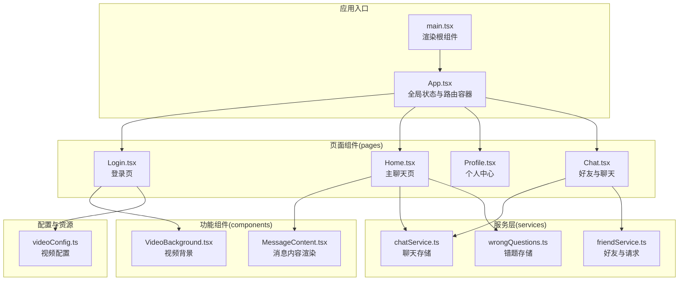
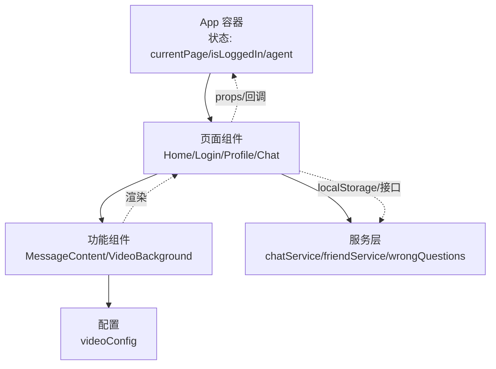
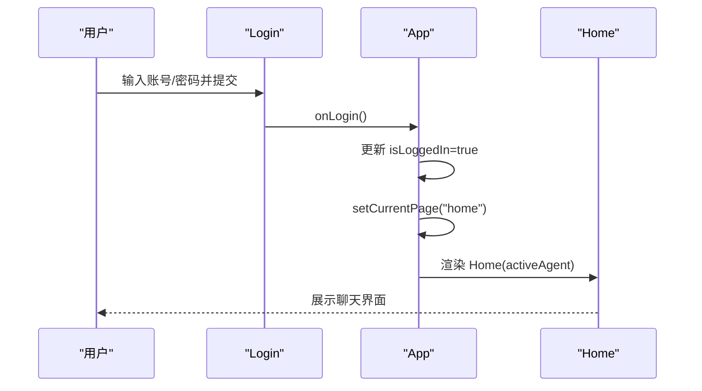
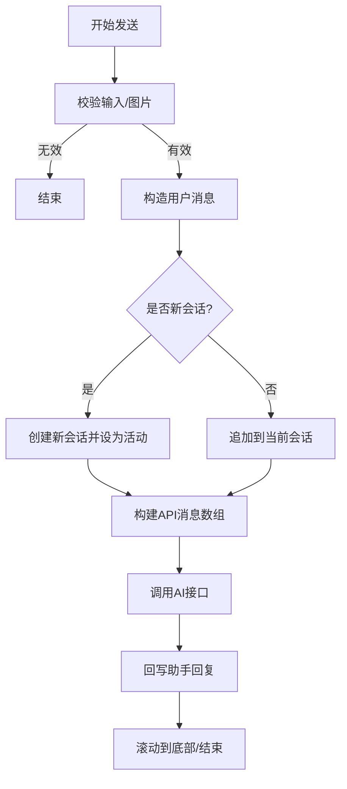
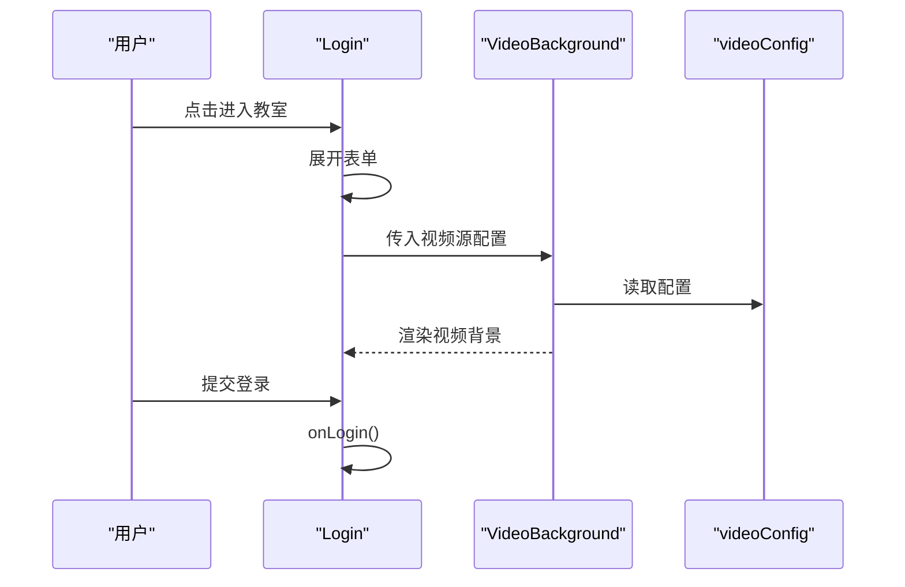
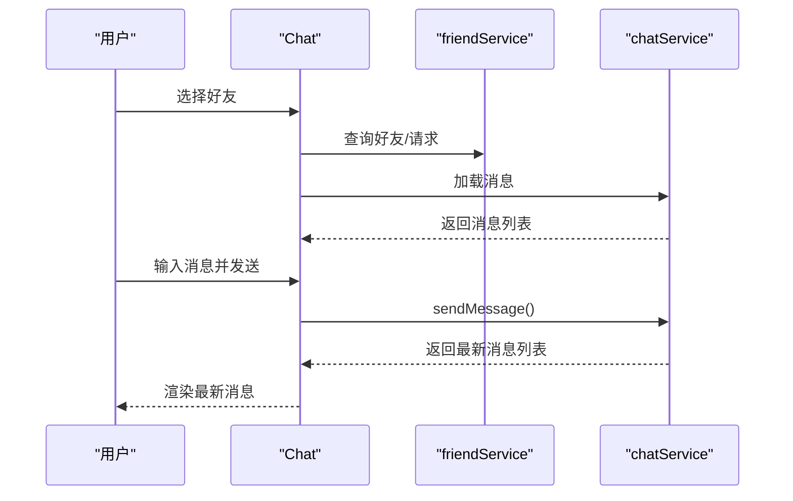
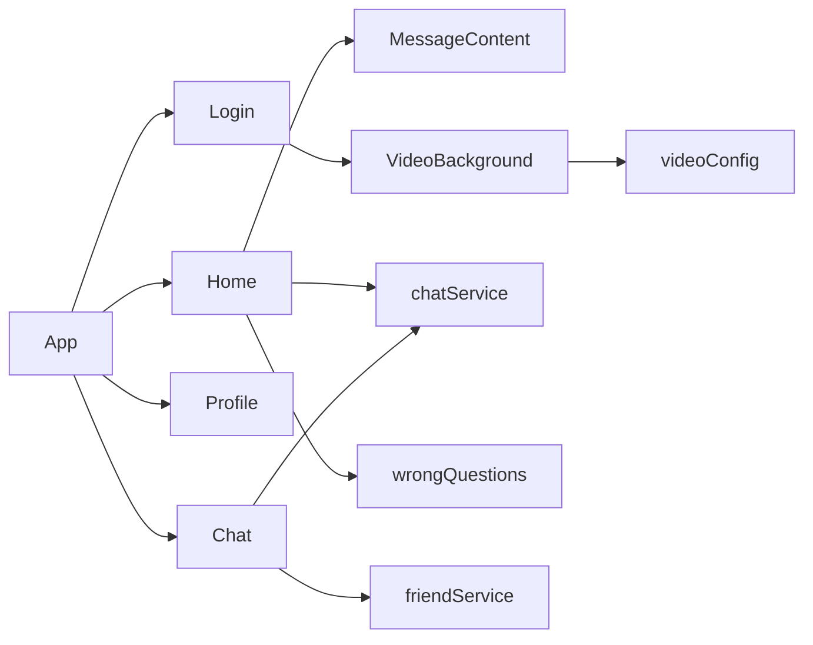
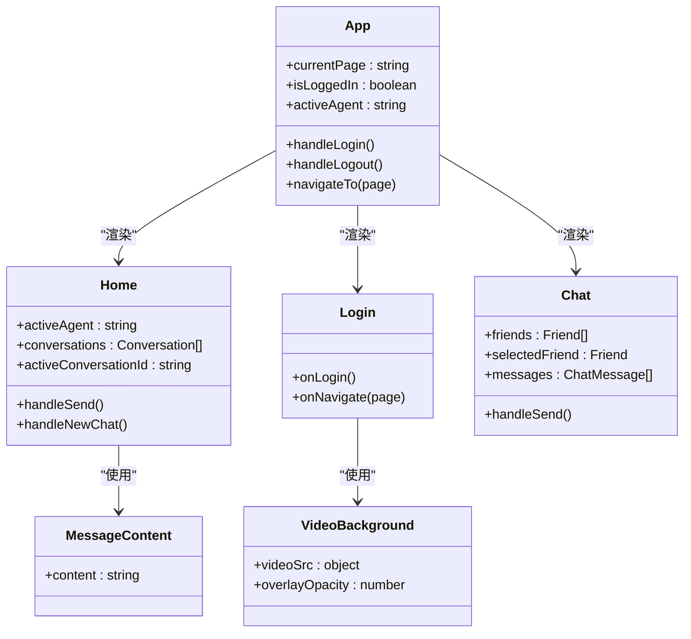

# 组件架构设计

<cite>
**本文引用的文件**
- [App.tsx](file://src/App.tsx)
- [main.tsx](file://src/main.tsx)
- [Home.tsx](file://src/pages/Home.tsx)
- [Login.tsx](file://src/pages/Login.tsx)
- [Profile.tsx](file://src/pages/Profile.tsx)
- [Chat.tsx](file://src/pages/Chat.tsx)
- [MessageContent.tsx](file://src/components/MessageContent.tsx)
- [VideoBackground.tsx](file://src/components/VideoBackground.tsx)
- [chatService.ts](file://src/services/chatService.ts)
- [friendService.ts](file://src/services/friendService.ts)
- [wrongQuestions.ts](file://src/services/wrongQuestions.ts)
- [videoConfig.ts](file://src/config/videoConfig.ts)
- [package.json](file://package.json)
</cite>

## 目录
1. [引言](#引言)
2. [项目结构](#项目结构)
3. [核心组件](#核心组件)
4. [架构总览](#架构总览)
5. [详细组件分析](#详细组件分析)
6. [依赖分析](#依赖分析)
7. [性能考虑](#性能考虑)
8. [故障排查指南](#故障排查指南)
9. [结论](#结论)
10. [附录](#附录)

## 引言
本文件面向“智课通 AI Tutor”项目的前端组件架构，系统化梳理页面级组件（Home、Login、Profile 等）、功能组件（MessageContent、VideoBackground 等）与可复用 UI 组件的设计原则；阐明组件间通信机制（props 传递、事件回调、状态提升）、生命周期管理、性能优化策略与代码分割方案；总结设计模式（容器/展示分离、高阶组件思路），并提供组件关系图与交互流程图，帮助开发者高效理解与维护系统。

## 项目结构
项目采用按“页面/功能/组件/服务”分层组织的目录结构，核心入口为 React 应用根节点，页面组件位于 pages 目录，通用 UI 功能组件位于 components 目录，业务服务封装于 services 目录，公共资源与配置位于 public 与 config 目录。

图表来源
- [main.tsx:1-11](file://src/main.tsx#L1-L11)
- [App.tsx:1-246](file://src/App.tsx#L1-L246)
- [Home.tsx:1-554](file://src/pages/Home.tsx#L1-L554)
- [Login.tsx:1-175](file://src/pages/Login.tsx#L1-L175)
- [Profile.tsx:1-297](file://src/pages/Profile.tsx#L1-L297)
- [Chat.tsx:1-381](file://src/pages/Chat.tsx#L1-L381)
- [MessageContent.tsx:1-31](file://src/components/MessageContent.tsx#L1-L31)
- [VideoBackground.tsx:1-159](file://src/components/VideoBackground.tsx#L1-L159)
- [chatService.ts:1-72](file://src/services/chatService.ts#L1-L72)
- [friendService.ts:1-151](file://src/services/friendService.ts#L1-L151)
- [wrongQuestions.ts:1-35](file://src/services/wrongQuestions.ts#L1-L35)
- [videoConfig.ts:1-47](file://src/config/videoConfig.ts#L1-L47)

章节来源
- [main.tsx:1-11](file://src/main.tsx#L1-L11)
- [App.tsx:1-246](file://src/App.tsx#L1-L246)

## 核心组件
- 页面级组件
  - App：全局状态（当前页面、登录态、当前代理）、导航与布局容器，负责页面切换与顶层动画过渡。
  - Home：多模态对话与历史管理，集成 AI 聊天与图片 OCR 分析，本地持久化会话与错题保存。
  - Login：登录表单与视频背景，演示动画与交互。
  - Profile：个人资料、成就与学习统计。
  - Chat：好友列表、请求管理、实时聊天消息。
- 功能组件
  - MessageContent：Markdown + LaTeX 渲染，支持数学公式显示。
  - VideoBackground：根据设备与网络自适应选择视频源，支持占位图与遮罩层。
- 可复用 UI 组件
  - SidebarItem、NavBtn：侧边栏与顶部导航按钮，统一样式与交互。
  - HistoryItem、StatCard、ActivityItem、TutorCard、Badge 等：卡片与列表项，语义明确、职责单一。

章节来源
- [App.tsx:22-246](file://src/App.tsx#L22-L246)
- [Home.tsx:1-554](file://src/pages/Home.tsx#L1-L554)
- [Login.tsx:1-175](file://src/pages/Login.tsx#L1-L175)
- [Profile.tsx:1-297](file://src/pages/Profile.tsx#L1-L297)
- [Chat.tsx:1-381](file://src/pages/Chat.tsx#L1-L381)
- [MessageContent.tsx:1-31](file://src/components/MessageContent.tsx#L1-L31)
- [VideoBackground.tsx:1-159](file://src/components/VideoBackground.tsx#L1-L159)

## 架构总览
整体采用“页面容器 + 功能组件 + 服务层”的分层设计。页面容器负责状态与路由，功能组件负责特定能力（如视频背景、消息渲染），服务层封装数据访问与本地持久化。组件间通过 props 传递与回调事件解耦，避免跨层级直接通信。

图表来源
- [App.tsx:35-211](file://src/App.tsx#L35-L211)
- [Home.tsx:3-6](file://src/pages/Home.tsx#L3-L6)
- [MessageContent.tsx:19-30](file://src/components/MessageContent.tsx#L19-L30)
- [VideoBackground.tsx:42-158](file://src/components/VideoBackground.tsx#L42-L158)
- [chatService.ts:34-71](file://src/services/chatService.ts#L34-L71)
- [friendService.ts:61-150](file://src/services/friendService.ts#L61-L150)
- [wrongQuestions.ts:12-34](file://src/services/wrongQuestions.ts#L12-L34)
- [videoConfig.ts:1-47](file://src/config/videoConfig.ts#L1-L47)

## 详细组件分析

### App 容器与页面路由
- 设计要点
  - 全局状态：currentPage、isLoggedIn、activeAgent、用户信息。
  - 顶层布局：固定侧边栏与主内容区，顶部导航与用户信息区。
  - 页面切换：基于 AnimatePresence 的淡入淡出过渡，key 为 currentPage。
  - 事件回调：onLogin/onLogout/navigateTo/onNavigate。
- 生命周期与状态提升
  - 登录态与用户信息由 App 提升至顶层，子页面仅消费 props。
  - 从设置页返回时通过 effect 刷新昵称与头像，体现状态提升与副作用管理。
- 性能优化
  - 使用 memo 化的 SidebarItem/NavBtn，减少重渲染。
  - 页面切换使用 key 隔离，避免动画期间的 DOM 残留。

图表来源
- [Login.tsx:78-120](file://src/pages/Login.tsx#L78-L120)
- [App.tsx:48-60](file://src/App.tsx#L48-L60)
- [App.tsx:198-204](file://src/App.tsx#L198-L204)

章节来源
- [App.tsx:35-211](file://src/App.tsx#L35-L211)

### Home 主聊天页
- 设计要点
  - 多代理支持：数学、Python、深度学习、矩阵四个代理，通过 activeAgent 切换。
  - 对话历史：左侧历史面板，支持新建、清空、删除。
  - 多模态输入：文本与图片上传（OCR 分析），异步流式回复。
  - 错题保存：助手最后一句消息提供“保存到错题本”操作。
  - 本地持久化：localStorage 存储会话、活动会话 ID、已保存错题、忽略动作。
- 数据结构
  - Conversation/ConversationMessage：会话与消息模型。
  - STORAGE_KEY_*：本地键名常量。
- 交互流程
  - 发送消息：校验输入/图片，构造消息，调用 AI 接口，更新会话。
  - 图片分析：调用 analyzeImageWithDeepSeek，回写 assistant 回复。
  - 错题保存：调用 saveWrongQuestion，更新本地集合。

图表来源
- [Home.tsx:139-223](file://src/pages/Home.tsx#L139-L223)
- [Home.tsx:178-222](file://src/pages/Home.tsx#L178-L222)

章节来源
- [Home.tsx:1-554](file://src/pages/Home.tsx#L1-L554)

### Login 登录页
- 设计要点
  - 视频背景：VideoBackground 组件，根据设备与网络自动选择视频源。
  - 动画与交互：点击触发展开表单，支持“其他登录方式”与“帮助中心”跳转。
  - 表单：邮箱/密码、记住登录、社交登录。
- 配置
  - videoConfig 提供不同分辨率与默认源，支持占位图与遮罩层透明度。

图表来源
- [Login.tsx:10-26](file://src/pages/Login.tsx#L10-L26)
- [VideoBackground.tsx:56-84](file://src/components/VideoBackground.tsx#L56-L84)
- [videoConfig.ts:1-32](file://src/config/videoConfig.ts#L1-L32)

章节来源
- [Login.tsx:1-175](file://src/pages/Login.tsx#L1-L175)
- [VideoBackground.tsx:1-159](file://src/components/VideoBackground.tsx#L1-L159)
- [videoConfig.ts:1-47](file://src/config/videoConfig.ts#L1-L47)

### Profile 个人中心
- 设计要点
  - 头像与封面、等级徽章、简介与个性签名。
  - 统计卡片：累计学习时长、问题解决数、正确率、连续打卡。
  - 动态与成就：最近动态、成就徽章。
  - 导师卡片：与 AI 导师互动次数与等级。
- 交互
  - 编辑资料跳转设置页；成就徽章与导师卡片 hover 效果。

章节来源
- [Profile.tsx:1-297](file://src/pages/Profile.tsx#L1-L297)

### Chat 好友与聊天
- 设计要点
  - 左侧面板：好友列表、待处理请求、添加好友。
  - 右侧面板：选中好友后的消息列表与输入框。
  - 服务层：好友请求、接受/拒绝、删除好友；聊天消息存储与查询。
- 数据结构
  - Friend/FriendRequest/ChatMessage。
- 流程
  - 选择好友 -> 加载消息 -> 发送消息 -> 滚动到底部。

图表来源
- [Chat.tsx:57-97](file://src/pages/Chat.tsx#L57-L97)
- [chatService.ts:34-71](file://src/services/chatService.ts#L34-L71)
- [friendService.ts:61-150](file://src/services/friendService.ts#L61-L150)

章节来源
- [Chat.tsx:1-381](file://src/pages/Chat.tsx#L1-L381)
- [chatService.ts:1-72](file://src/services/chatService.ts#L1-L72)
- [friendService.ts:1-151](file://src/services/friendService.ts#L1-L151)

### MessageContent 消息内容渲染
- 设计要点
  - 使用 react-markdown + remark-math + rehype-katex 实现 Markdown 与 LaTeX 渲染。
  - 预处理 LaTeX 语法，兼容行内与块级公式。
- 性能
  - 作为纯展示组件，props 变化时重新渲染，复杂内容建议结合缓存策略。

章节来源
- [MessageContent.tsx:1-31](file://src/components/MessageContent.tsx#L1-L31)

### VideoBackground 视频背景
- 设计要点
  - 自适应选择：根据硬件并发数与网络连接类型选择 8K/4K/2K/default。
  - 错误降级：加载失败自动降级到 default。
  - 占位图与遮罩层：支持占位图与透明度控制。
- 性能
  - 仅在必要时切换源，避免频繁切换导致卡顿。

章节来源
- [VideoBackground.tsx:1-159](file://src/components/VideoBackground.tsx#L1-L159)
- [videoConfig.ts:1-47](file://src/config/videoConfig.ts#L1-L47)

## 依赖分析
- 组件依赖
  - App 依赖所有页面组件与功能组件。
  - Home 依赖 MessageContent 与服务层（chatService、wrongQuestions）。
  - Login 依赖 VideoBackground 与 videoConfig。
  - Chat 依赖 chatService 与 friendService。
- 外部依赖
  - UI 图标库 lucide-react、动画 motion、Markdown 渲染 react-markdown/katex、数学插件 remark-math/rehype-katex。

图表来源
- [App.tsx:22-31](file://src/App.tsx#L22-L31)
- [Home.tsx:3-6](file://src/pages/Home.tsx#L3-L6)
- [Login.tsx:4-5](file://src/pages/Login.tsx#L4-L5)
- [chatService.ts:1-72](file://src/services/chatService.ts#L1-L72)
- [friendService.ts:1-151](file://src/services/friendService.ts#L1-L151)
- [wrongQuestions.ts:1-35](file://src/services/wrongQuestions.ts#L1-L35)
- [videoConfig.ts:1-47](file://src/config/videoConfig.ts#L1-L47)

章节来源
- [package.json:13-28](file://package.json#L13-L28)

## 性能考虑
- 渲染优化
  - 使用 AnimatePresence 控制页面切换动画，避免同时渲染多个页面。
  - 将高频交互组件（SidebarItem、NavBtn、HistoryItem）保持轻量，减少重渲染。
- 数据与存储
  - 本地持久化使用 localStorage，注意序列化/反序列化开销；对大对象建议分片或懒加载。
- 资源加载
  - VideoBackground 根据设备与网络选择合适分辨率，避免高分辨率视频在低端设备上造成卡顿。
- 代码分割
  - 页面组件可按需加载（动态 import），减少首屏体积；当前项目使用静态导入，后续可引入路由级懒加载。
- 渲染策略
  - MessageContent 内容较大时，建议在父组件做节流或虚拟化（如消息列表）以降低重排压力。

## 故障排查指南
- 登录页视频不加载
  - 检查 videoConfig 中的视频路径是否正确，确认占位图与遮罩层配置。
  - 查看浏览器控制台是否存在跨域或媒体加载错误。
- 聊天消息不显示
  - 确认 chatService 的存储键名与格式，检查 localStorage 是否被清理。
  - 确认 getChatKey 的用户排序一致性。
- 错题保存异常
  - 检查 saveWrongQuestion 的调用时机与参数完整性。
- 好友请求状态异常
  - 检查 friendService 的请求状态流转与本地存储键名。

章节来源
- [videoConfig.ts:1-47](file://src/config/videoConfig.ts#L1-L47)
- [chatService.ts:34-71](file://src/services/chatService.ts#L34-L71)
- [friendService.ts:113-134](file://src/services/friendService.ts#L113-L134)
- [wrongQuestions.ts:21-25](file://src/services/wrongQuestions.ts#L21-L25)

## 结论
本项目采用清晰的分层与职责划分：App 作为全局容器，页面组件承载业务逻辑，功能组件聚焦单一能力，服务层封装数据访问。通过 props 与回调实现组件间通信，配合状态提升与本地持久化，形成稳定可扩展的前端架构。未来可在路由级代码分割、复杂列表虚拟化与缓存策略方面进一步优化。

## 附录
- 组件关系图（类图）

图表来源
- [App.tsx:35-211](file://src/App.tsx#L35-L211)
- [Home.tsx:79-133](file://src/pages/Home.tsx#L79-L133)
- [Login.tsx:7-164](file://src/pages/Login.tsx#L7-L164)
- [Chat.tsx:28-97](file://src/pages/Chat.tsx#L28-L97)
- [MessageContent.tsx:5-30](file://src/components/MessageContent.tsx#L5-L30)
- [VideoBackground.tsx:3-158](file://src/components/VideoBackground.tsx#L3-L158)