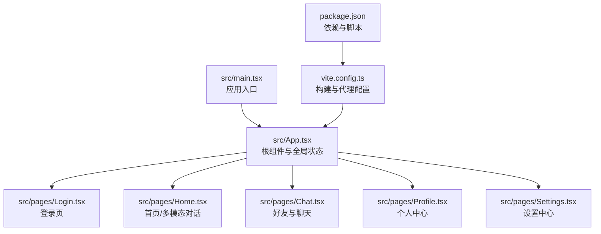
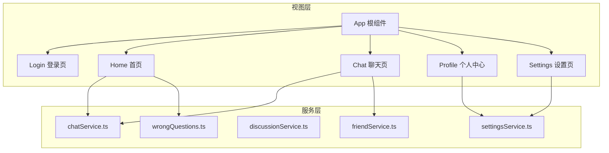
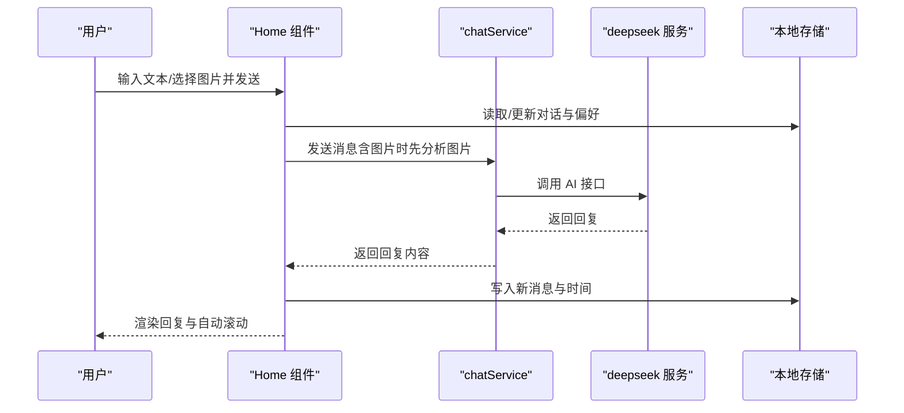
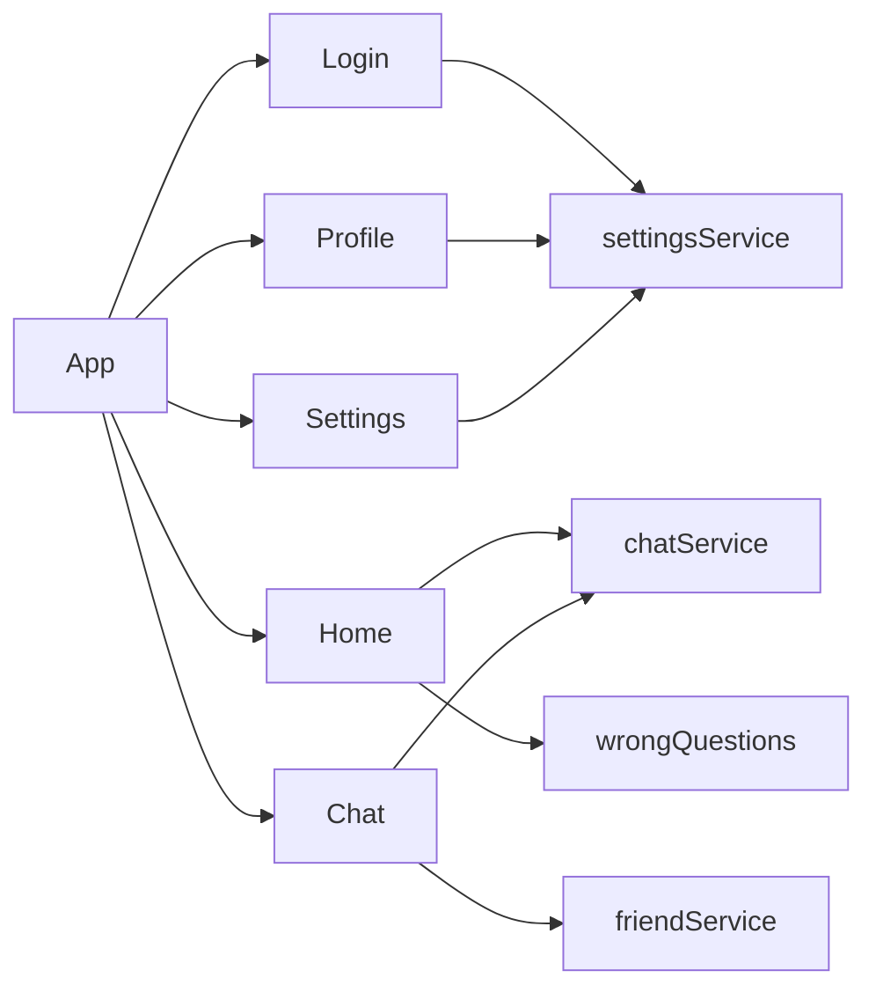

# 页面组件设计

<cite>
**本文引用的文件**
- [src/App.tsx](file://src/App.tsx)
- [src/main.tsx](file://src/main.tsx)
- [src/pages/Login.tsx](file://src/pages/Login.tsx)
- [src/pages/Home.tsx](file://src/pages/Home.tsx)
- [src/pages/Chat.tsx](file://src/pages/Chat.tsx)
- [src/pages/Profile.tsx](file://src/pages/Profile.tsx)
- [src/pages/Settings.tsx](file://src/pages/Settings.tsx)
- [vite.config.ts](file://vite.config.ts)
- [package.json](file://package.json)
- [README.md](file://README.md)
</cite>

## 目录
1. [引言](#引言)
2. [项目结构](#项目结构)
3. [核心组件](#核心组件)
4. [架构总览](#架构总览)
5. [详细组件分析](#详细组件分析)
6. [依赖分析](#依赖分析)
7. [性能考虑](#性能考虑)
8. [故障排查指南](#故障排查指南)
9. [结论](#结论)
10. [附录](#附录)

## 引言
本设计文档聚焦于“智课通 AI Tutor”项目的页面组件，系统化阐述各页面组件的功能职责、状态管理与生命周期处理；梳理导航逻辑、路由参数传递与页面间数据共享机制；明确权限控制与用户认证状态管理；说明页面切换动画效果；覆盖响应式设计、主题适配与国际化支持现状；给出性能优化策略（懒加载、代码分割、内存管理）；最后展示页面组件与服务层的交互模式及错误处理机制。

## 项目结构
项目采用以页面为中心的组织方式，入口通过根组件统一调度，页面组件按功能模块划分，配合服务层完成业务交互。构建工具采用 Vite，样式基于 TailwindCSS，动画库使用 Motion。

图示来源
- [src/main.tsx:1-11](file://src/main.tsx#L1-L11)
- [src/App.tsx:1-246](file://src/App.tsx#L1-L246)
- [src/pages/Login.tsx:1-175](file://src/pages/Login.tsx#L1-L175)
- [src/pages/Home.tsx:1-554](file://src/pages/Home.tsx#L1-L554)
- [src/pages/Chat.tsx:1-381](file://src/pages/Chat.tsx#L1-L381)
- [src/pages/Profile.tsx:1-297](file://src/pages/Profile.tsx#L1-L297)
- [src/pages/Settings.tsx:1-369](file://src/pages/Settings.tsx#L1-L369)
- [vite.config.ts:1-32](file://vite.config.ts#L1-L32)
- [package.json:1-42](file://package.json#L1-L42)

章节来源
- [src/main.tsx:1-11](file://src/main.tsx#L1-L11)
- [src/App.tsx:1-246](file://src/App.tsx#L1-L246)
- [vite.config.ts:1-32](file://vite.config.ts#L1-L32)
- [package.json:1-42](file://package.json#L1-L42)

## 核心组件
- 根组件 App：负责全局状态（当前页面、登录态、用户信息、活跃 AI 导师）、侧边栏与顶部导航、页面内容区域与切换动画。
- 页面组件：Login、Home、Chat、Profile、Settings 分别承担登录、多模态对话、社交聊天、个人中心、设置等功能。
- 构建与运行：Vite 提供开发服务器、热更新与代理；TailwindCSS 提供原子化样式；Motion 提供轻量动画。

章节来源
- [src/App.tsx:35-211](file://src/App.tsx#L35-L211)
- [src/pages/Login.tsx:7-175](file://src/pages/Login.tsx#L7-L175)
- [src/pages/Home.tsx:79-527](file://src/pages/Home.tsx#L79-L527)
- [src/pages/Chat.tsx:28-381](file://src/pages/Chat.tsx#L28-L381)
- [src/pages/Profile.tsx:19-297](file://src/pages/Profile.tsx#L19-L297)
- [src/pages/Settings.tsx:32-369](file://src/pages/Settings.tsx#L32-L369)
- [vite.config.ts:6-31](file://vite.config.ts#L6-L31)
- [package.json:13-28](file://package.json#L13-L28)

## 架构总览
整体采用“根组件集中状态 + 页面组件职责清晰”的单页应用架构。页面切换通过根组件的状态机驱动，页面内状态由各自组件内部管理。服务层通过独立模块封装网络与本地存储交互，页面组件仅负责调用与渲染。

图示来源
- [src/App.tsx:22-31](file://src/App.tsx#L22-L31)
- [src/pages/Home.tsx:3-5](file://src/pages/Home.tsx#L3-L5)
- [src/pages/Chat.tsx:14-26](file://src/pages/Chat.tsx#L14-L26)
- [src/pages/Settings.tsx:19-23](file://src/pages/Settings.tsx#L19-L23)

## 详细组件分析

### 登录页（Login）
- 功能职责
  - 提供登录入口与演示体验，支持展开表单与多种登录方式。
  - 触发登录成功回调，驱动根组件切换至首页。
- 状态管理
  - 展开/收起状态用于控制欢迎卡片与登录表单的切换。
  - 表单字段（用户名/邮箱、密码）在组件内部受控。
- 生命周期
  - 使用动画库实现进入/离开过渡，增强交互体验。
- 导航与数据共享
  - 通过回调 onLogin/onNavigate 与根组件通信，实现登录后跳转与帮助中心入口。
- 权限与认证
  - 当前为演示登录流程；实际项目应结合后端令牌与会话管理完善认证。
- 动画效果
  - 使用动画库在两种状态间平滑过渡。
- 国际化与主题
  - 未见国际化与深色模式切换逻辑，界面语言为简体中文。
- 性能
  - 组件体积小，无复杂计算；注意视频背景资源加载与占位图优化。

章节来源
- [src/pages/Login.tsx:7-175](file://src/pages/Login.tsx#L7-L175)
- [src/App.tsx:48-64](file://src/App.tsx#L48-L64)

### 首页（Home）
- 功能职责
  - 多模态对话：支持文本与图片输入，调用服务层与 AI 对话/图像分析接口。
  - 对话历史管理：本地持久化存储，支持新建、清空、删除对话。
  - 错题本联动：在助手回复后提供“保存到错题本”操作。
- 状态管理
  - 全局活跃导师（activeAgent）与页面状态（currentPage）由根组件维护。
  - 组件内管理对话列表、当前会话、输入框、图片选择、加载状态、本地持久化集合。
- 生命周期
  - 初始化从本地存储恢复对话与偏好；每次状态变更写回本地存储。
  - 自动滚动至最新消息。
- 导航与数据共享
  - 通过 props 接收 onNavigate 与 activeAgent；支持跳转错题本。
  - 与服务层通过 chatService 与 wrongQuestions 交互。
- 权限与认证
  - 未见显式鉴权逻辑；建议在服务层拦截未登录请求并引导登录。
- 动画效果
  - 页面切换使用动画库实现淡入淡出。
- 国际化与主题
  - 未见国际化与深色模式切换逻辑。
- 性能
  - 本地存储频繁写入，建议节流；图片预览与 OCR 请求需限制并发与超时。

图示来源
- [src/pages/Home.tsx:139-223](file://src/pages/Home.tsx#L139-L223)
- [src/pages/Home.tsx:178-222](file://src/pages/Home.tsx#L178-L222)

章节来源
- [src/pages/Home.tsx:79-527](file://src/pages/Home.tsx#L79-L527)

### 聊天页（Chat）
- 功能职责
  - 好友管理：添加好友、接受/拒绝请求、删除好友。
  - 即时聊天：选择好友后发起消息，支持发送与自动滚动。
- 状态管理
  - 好友列表、待处理请求、选中好友、消息列表、输入框等均在组件内管理。
  - 依赖服务层提供的本地数据模拟。
- 生命周期
  - 切换好友时重新加载消息；新增消息后滚动到底部。
- 导航与数据共享
  - 通过 props 接收 onNavigate；与服务层交互完成好友与消息管理。
- 权限与认证
  - 未见鉴权逻辑；建议在服务层拦截未登录状态。
- 动画效果
  - 无页面级动画，局部按钮悬停与渐变。
- 国际化与主题
  - 未见国际化与深色模式切换逻辑。
- 性能
  - 列表渲染与滚动优化良好；注意消息过多时的虚拟化与去抖。

章节来源
- [src/pages/Chat.tsx:28-381](file://src/pages/Chat.tsx#L28-L381)

### 个人中心（Profile）
- 功能职责
  - 用户资料展示与编辑入口（通过设置页）。
  - 学习统计、最近动态、成就徽章、当前目标等信息展示。
- 状态管理
  - 组件内无复杂状态，主要为静态数据与交互按钮。
- 生命周期
  - 无特殊生命周期钩子。
- 导航与数据共享
  - 提供跳转设置页的能力。
- 权限与认证
  - 未见鉴权逻辑。
- 动画效果
  - 使用动画库实现进度条入场动画。
- 国际化与主题
  - 未见国际化与深色模式切换逻辑。
- 性能
  - 组件结构清晰，渲染成本低。

章节来源
- [src/pages/Profile.tsx:19-297](file://src/pages/Profile.tsx#L19-L297)

### 设置页（Settings）
- 功能职责
  - 个人资料编辑（头像、昵称、签名）。
  - 学习设置（首选导师、每日复习时间、推送开关）。
  - 通用设置（深色模式、字体大小、界面语言）。
  - 账户安全（绑定邮箱、重置密码、注销）。
- 状态管理
  - 从服务层读取默认设置，本地编辑后保存。
  - 头像上传使用文件读取与受控输入。
- 生命周期
  - 初始化时从服务层恢复设置；保存后显示“已保存”反馈。
- 导航与数据共享
  - 支持返回首页；与服务层交互完成设置持久化。
- 权限与认证
  - 未见鉴权逻辑。
- 动画效果
  - 无页面级动画。
- 国际化与主题
  - 未见国际化与深色模式切换逻辑。
- 性能
  - 文件上传与本地预览注意内存占用；大图建议压缩或服务端处理。

章节来源
- [src/pages/Settings.tsx:32-369](file://src/pages/Settings.tsx#L32-L369)

## 依赖分析
- 组件耦合
  - 根组件集中管理页面与用户状态，页面组件通过回调与属性与根组件通信，降低跨组件耦合。
  - 页面组件与服务层解耦，通过独立模块暴露方法，便于替换与测试。
- 外部依赖
  - 动画：motion/react
  - 图标：lucide-react
  - 样式：TailwindCSS
  - 构建：Vite
  - 代理：/api/deepseek 代理至火山引擎 API
- 潜在循环依赖
  - 未发现直接循环依赖；页面组件不相互导入，避免循环。

图示来源
- [src/App.tsx:22-31](file://src/App.tsx#L22-L31)
- [src/pages/Home.tsx:3-5](file://src/pages/Home.tsx#L3-L5)
- [src/pages/Chat.tsx:14-26](file://src/pages/Chat.tsx#L14-L26)
- [src/pages/Settings.tsx:19-23](file://src/pages/Settings.tsx#L19-L23)

章节来源
- [src/App.tsx:22-31](file://src/App.tsx#L22-L31)
- [vite.config.ts:22-28](file://vite.config.ts#L22-L28)

## 性能考虑
- 懒加载与代码分割
  - 将页面组件拆分为独立模块，利用浏览器原生动态导入实现按需加载。
  - 对大型依赖（如数学渲染、PDF 导出）采用异步加载。
- 内存管理
  - 避免在组件外持有长生命周期引用；及时清理事件监听与定时器。
  - 图片预览与上传使用一次性对象 URL，结束后释放。
- 本地存储与 I/O
  - 对频繁写入的本地存储进行节流/防抖；必要时分批写入。
- 动画与渲染
  - 控制动画数量与复杂度；对长列表使用虚拟滚动。
- 代理与网络
  - 代理路径与目标地址稳定；对第三方 API 增加重试与超时控制。

## 故障排查指南
- 登录页无法进入
  - 检查根组件 onLogin 回调是否正确触发；确认环境变量与代理配置。
- 首页发送消息失败
  - 检查服务层调用链与错误分支；确保输入非空或已选择图片。
- 聊天消息不显示
  - 检查好友选择与消息加载逻辑；确认服务层数据一致性。
- 设置保存无效
  - 检查服务层保存逻辑与本地存储写入；确认头像尺寸与格式。
- 动画异常
  - 检查动画库版本与 key 值稳定性；避免重复渲染导致的抖动。

章节来源
- [src/pages/Home.tsx:211-223](file://src/pages/Home.tsx#L211-L223)
- [src/pages/Chat.tsx:41-53](file://src/pages/Chat.tsx#L41-L53)
- [src/pages/Settings.tsx:64-68](file://src/pages/Settings.tsx#L64-L68)

## 结论
该页面组件体系以根组件为核心，页面职责清晰、服务层解耦，具备良好的扩展性与可维护性。建议后续完善鉴权与会话管理、引入国际化与深色模式、优化本地存储与网络请求，并在大型页面中实施懒加载与虚拟化以提升性能。

## 附录
- 快速启动
  - 安装依赖、设置 API 密钥、运行开发服务器。
- 构建与部署
  - 使用 Vite 打包，产物输出至 dist；可结合静态托管或服务端渲染方案。

章节来源
- [README.md:16-20](file://README.md#L16-L20)
- [package.json:6-11](file://package.json#L6-L11)