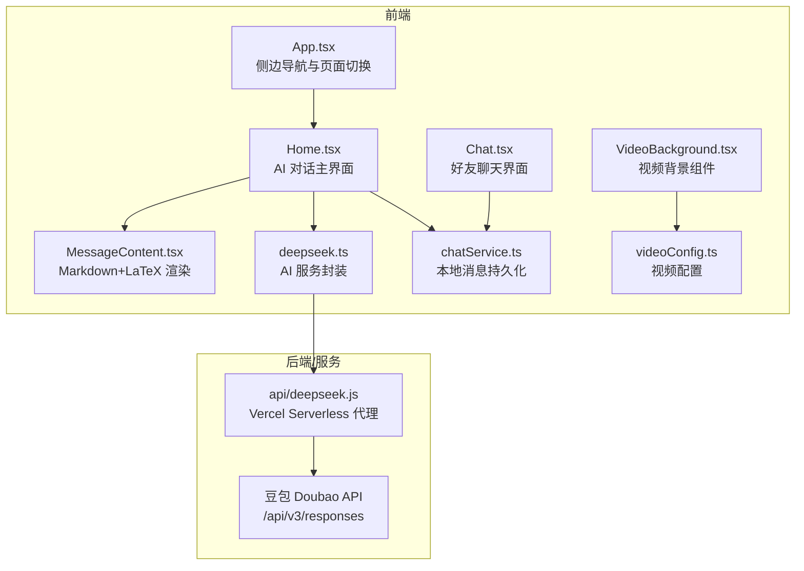
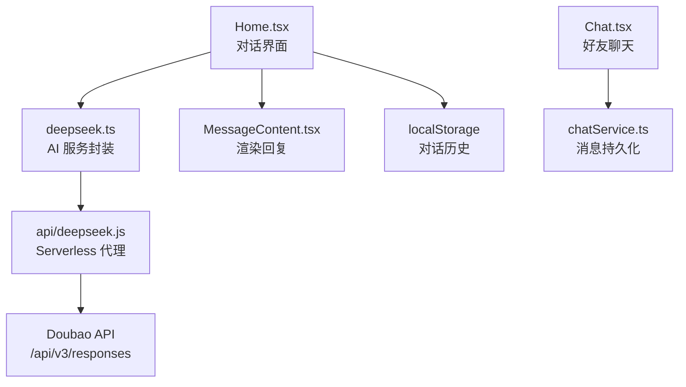
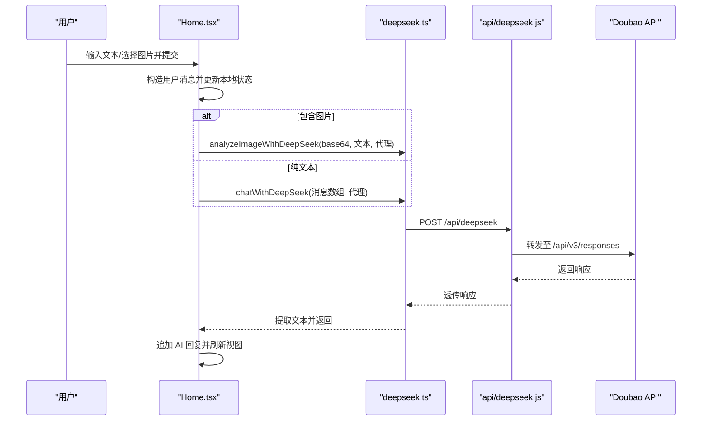
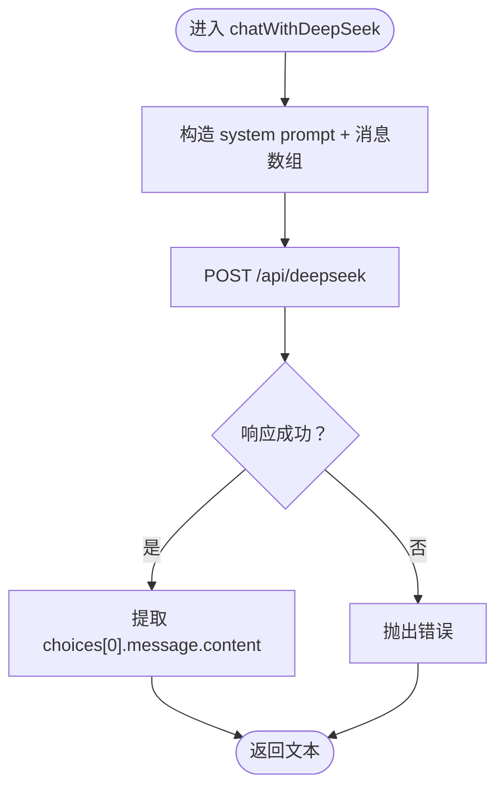
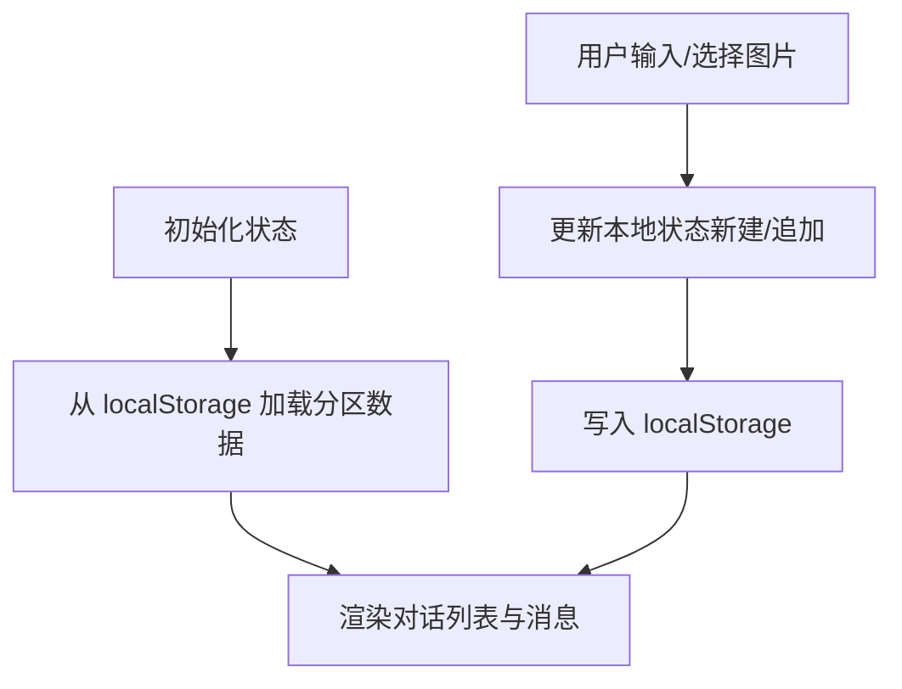
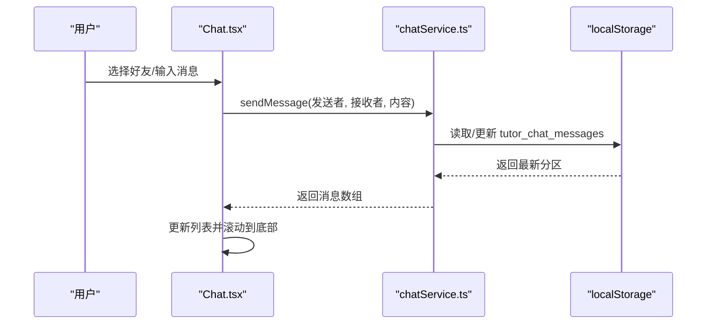
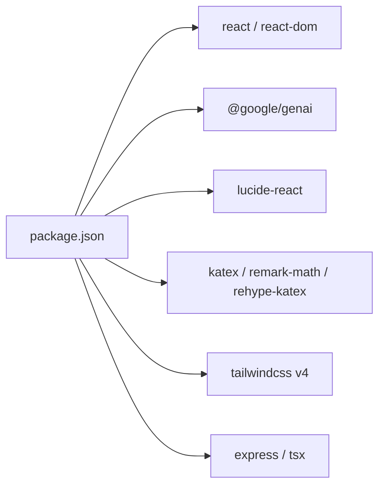

# AI 对话系统

<cite>
**本文引用的文件**
- [README.md](file://README.md)
- [AGENTS.md](file://AGENTS.md)
- [技术介绍.md](file://技术介绍.md)
- [package.json](file://package.json)
- [vercel.json](file://vercel.json)
- [api/deepseek.js](file://api/deepseek.js)
- [src/services/deepseek.ts](file://src/services/deepseek.ts)
- [src/pages/Home.tsx](file://src/pages/Home.tsx)
- [src/App.tsx](file://src/App.tsx)
- [src/components/MessageContent.tsx](file://src/components/MessageContent.tsx)
- [src/services/chatService.ts](file://src/services/chatService.ts)
- [src/pages/Chat.tsx](file://src/pages/Chat.tsx)
- [src/config/videoConfig.ts](file://src/config/videoConfig.ts)
- [src/components/VideoBackground.tsx](file://src/components/VideoBackground.tsx)
- [conversation-2026-05-08-165340.txt](file://conversation-2026-05-08-165340.txt)
</cite>

## 目录
1. [简介](#简介)
2. [项目结构](#项目结构)
3. [核心组件](#核心组件)
4. [架构总览](#架构总览)
5. [详细组件分析](#详细组件分析)
6. [依赖关系分析](#依赖关系分析)
7. [性能考量](#性能考量)
8. [故障排查指南](#故障排查指南)
9. [结论](#结论)
10. [附录](#附录)

## 简介
本文件为“智课通 AI Tutor”项目的 AI 对话系统提供系统化技术文档。重点涵盖多代理架构设计、DeepSeek API 集成、豆包（Doubao）多模态模型集成、对话流程管理、消息处理机制、图片分析功能与实时交互模式。文档同时提供错误处理策略、性能优化技巧与调试方法，并为初学者解释 AI 对话的基本概念，为开发者提供架构设计与扩展指南。

## 项目结构
该工程采用 React 19 + Vite 6 + Tailwind CSS v4 的单页应用架构，围绕“AI 导师对话”主线组织模块：
- 顶层说明与运行指引：README.md
- 架构与环境约定：AGENTS.md
- 技术实现与 API 说明：技术介绍.md
- 依赖与运行脚本：package.json
- 服务端部署与路由：vercel.json
- 服务端代理（Vercel Serverless）：api/deepseek.js
- 前端 AI 服务封装：src/services/deepseek.ts
- 核心对话界面：src/pages/Home.tsx
- 应用入口与侧边导航：src/App.tsx
- Markdown 渲染组件：src/components/MessageContent.tsx
- 好友聊天与消息持久化：src/services/chatService.ts、src/pages/Chat.tsx
- 视频背景组件与配置：src/components/VideoBackground.tsx、src/config/videoConfig.ts
- 会话与业务价值说明：conversation-2026-05-08-165340.txt

图表来源
- [src/App.tsx:75-104](file://src/App.tsx#L75-L104)
- [src/pages/Home.tsx:1-115](file://src/pages/Home.tsx#L1-L115)
- [src/components/MessageContent.tsx](file://src/components/MessageContent.tsx)
- [src/services/deepseek.ts](file://src/services/deepseek.ts)
- [src/services/chatService.ts:1-72](file://src/services/chatService.ts#L1-L72)
- [src/pages/Chat.tsx:1-381](file://src/pages/Chat.tsx#L1-L381)
- [src/components/VideoBackground.tsx](file://src/components/VideoBackground.tsx)
- [src/config/videoConfig.ts](file://src/config/videoConfig.ts)
- [api/deepseek.js:1-34](file://api/deepseek.js#L1-L34)

章节来源
- [README.md:1-21](file://README.md#L1-L21)
- [AGENTS.md:27-98](file://AGENTS.md#L27-L98)
- [技术介绍.md:119-217](file://技术介绍.md#L119-L217)
- [package.json:1-42](file://package.json#L1-L42)

## 核心组件
- 多代理架构（数学、Python、深度学习、线性代数）
  - 四个 Agent 分别覆盖不同学科领域，每个 Agent 配备独立 system prompt，确保回答风格与专业度匹配。
  - 侧边导航与页面切换由 App.tsx 控制，Home.tsx 作为对话主界面承载各 Agent 的对话历史与交互。
- AI 服务封装（src/services/deepseek.ts）
  - 封装豆包 Doubao 多模态模型 API，支持纯文本对话与图片分析。
  - 提供 chatWithDeepSeek 与 analyzeImageWithDeepSeek 两类接口，内部进行错误处理与响应提取。
- 对话状态管理（src/pages/Home.tsx）
  - 使用 localStorage 按 AgentKey 分区存储对话历史与活跃对话 ID，支持新建、追加消息与时间戳更新。
  - 使用 useRef 追踪最新状态，避免 React 批量更新导致的竞态问题。
- 好友聊天系统（src/services/chatService.ts、src/pages/Chat.tsx）
  - 基于 localStorage 的消息持久化，按双方用户生成 chatKey，支持发送、接收与滚动定位。
- 内容渲染（src/components/MessageContent.tsx）
  - 使用 react-markdown + remark-math + rehype-katex 渲染 AI 回复，包含 LaTeX 分隔符预处理逻辑。
- 视频背景（src/components/VideoBackground.tsx、src/config/videoConfig.ts）
  - 根据硬件并发与网络状况自动选择视频源，提升性能与体验。

章节来源
- [AGENTS.md:35-41](file://AGENTS.md#L35-L41)
- [src/pages/Home.tsx:79-127](file://src/pages/Home.tsx#L79-L127)
- [src/services/deepseek.ts:44-126](file://src/services/deepseek.ts#L44-L126)
- [src/services/chatService.ts:1-72](file://src/services/chatService.ts#L1-L72)
- [src/pages/Chat.tsx:1-381](file://src/pages/Chat.tsx#L1-L381)
- [src/components/MessageContent.tsx](file://src/components/MessageContent.tsx)
- [src/components/VideoBackground.tsx](file://src/components/VideoBackground.tsx)
- [src/config/videoConfig.ts](file://src/config/videoConfig.ts)

## 架构总览
系统采用“前端 React + Vercel Serverless 代理 + 第三方 AI API”的分层架构：
- 前端负责用户交互、对话状态管理与内容渲染；
- 通过 Vercel Serverless 函数代理第三方 AI API，隐藏密钥与实现细节；
- 本地持久化保障会话连续性与离线可用性。

图表来源
- [src/pages/Home.tsx:1-115](file://src/pages/Home.tsx#L1-L115)
- [src/services/deepseek.ts:44-126](file://src/services/deepseek.ts#L44-L126)
- [api/deepseek.js:9-33](file://api/deepseek.js#L9-L33)
- [src/components/MessageContent.tsx](file://src/components/MessageContent.tsx)
- [src/services/chatService.ts:1-72](file://src/services/chatService.ts#L1-L72)
- [src/pages/Chat.tsx:1-381](file://src/pages/Chat.tsx#L1-L381)

## 详细组件分析

### 多代理架构与对话流程
- 代理定义与占位提示：Home.tsx 中定义四类 Agent（数学、Python、深度学习、线性代数），并提供对应的占位提示与图标。
- 对话状态隔离：按 AgentKey 维度存储对话数组与活跃对话 ID，确保不同代理的会话互不干扰。
- 新建与追加消息：提交时根据是否存在活跃对话决定新建或追加；支持文本与图片混合输入。
- 图片分析流程：当存在图片时，调用 analyzeImageWithDeepSeek；否则构造纯文本消息序列调用 chatWithDeepSeek。
- 错误处理：捕获异常并回写错误消息，保持 UI 一致性与可恢复性。

图表来源
- [src/pages/Home.tsx:143-223](file://src/pages/Home.tsx#L143-L223)
- [src/services/deepseek.ts:44-126](file://src/services/deepseek.ts#L44-L126)
- [api/deepseek.js:9-33](file://api/deepseek.js#L9-L33)

章节来源
- [src/pages/Home.tsx:79-127](file://src/pages/Home.tsx#L79-L127)
- [src/pages/Home.tsx:143-223](file://src/pages/Home.tsx#L143-L223)
- [AGENTS.md:35-41](file://AGENTS.md#L35-L41)

### AI 服务封装（DeepSeek/Doubao）
- 豆包模型与代理规则
  - 开发环境：Vite 代理将 /api/deepseek 重写为 /api/v3，请求体使用 Doubao input 数组格式。
  - 生产环境：Vercel Serverless 函数 api/deepseek.js 接收 POST，转发至 Doubao /api/v3/responses。
- 接口职责
  - chatWithDeepSeek：构造 system prompt + 消息数组，调用 AI 模型并提取回复文本。
  - analyzeImageWithDeepSeek：将图片转为 base64，按 Doubao input_image 格式发送，提取文本回复。
- 错误处理
  - 对 HTTP 错误与异常进行捕获与抛出，便于上层统一处理。

图表来源
- [src/services/deepseek.ts:44-83](file://src/services/deepseek.ts#L44-L83)
- [api/deepseek.js:9-33](file://api/deepseek.js#L9-L33)

章节来源
- [AGENTS.md:43-48](file://AGENTS.md#L43-L48)
- [src/services/deepseek.ts:44-126](file://src/services/deepseek.ts#L44-L126)
- [api/deepseek.js:1-34](file://api/deepseek.js#L1-L34)

### 对话状态管理与本地持久化
- 状态分区
  - 使用 Record<AgentKey, Conversation[]> 存储各代理对话历史；
  - 使用 Record<AgentKey, string | null> 存储活跃对话 ID。
- 本地存储
  - 通过 localStorage 持久化：tutor_conversations、tutor_active_ids、tutor_saved_to_wrong、tutor_dismissed_actions。
- 竞态规避
  - 使用 useRef 保存 allConversationsRef，确保异步回调读取到最新状态。

图表来源
- [src/pages/Home.tsx:82-115](file://src/pages/Home.tsx#L82-L115)
- [src/pages/Home.tsx:100-101](file://src/pages/Home.tsx#L100-L101)

章节来源
- [AGENTS.md:50-58](file://AGENTS.md#L50-L58)
- [src/pages/Home.tsx:82-115](file://src/pages/Home.tsx#L82-L115)

### 好友聊天系统
- 消息模型与分区
  - ChatMessage 包含发送者、接收者、内容与时间戳；
  - 按双方名称排序生成 chatKey，实现双向一致的消息分区。
- 本地持久化
  - 使用 tutor_chat_messages 存储所有聊天记录，支持新增与读取。
- UI 交互
  - Chat.tsx 提供好友列表、请求处理、消息输入与滚动定位。

图表来源
- [src/pages/Chat.tsx:44-74](file://src/pages/Chat.tsx#L44-L74)
- [src/services/chatService.ts:34-71](file://src/services/chatService.ts#L34-L71)

章节来源
- [AGENTS.md:74-79](file://AGENTS.md#L74-L79)
- [src/pages/Chat.tsx:1-381](file://src/pages/Chat.tsx#L1-L381)
- [src/services/chatService.ts:1-72](file://src/services/chatService.ts#L1-L72)

### 内容渲染与公式支持
- 渲染链路
  - MessageContent.tsx 使用 react-markdown + remark-math + rehype-katex；
  - 预处理 LaTeX 分隔符，确保 Doubao 输出的 \[...\] 与 \(...\) 正确渲染为 $$...$$ 与 $...$。
- 性能建议
  - 对长文本进行分段渲染，避免一次性渲染造成卡顿；
  - 合理缓存渲染结果，减少重复计算。

章节来源
- [AGENTS.md:60-62](file://AGENTS.md#L60-L62)
- [技术介绍.md:164-217](file://技术介绍.md#L164-L217)

### 视频背景与性能适配
- 自适应策略
  - VideoBackground.tsx 根据 navigator.hardwareConcurrency 与网络 effectiveType 选择 8K/4K/2K/默认视频源；
  - videoConfig.ts 提供视频路径配置，便于统一管理。
- 优化建议
  - 在低端设备上优先选择低分辨率视频；
  - 首屏加载时延迟加载非关键视频资源。

章节来源
- [AGENTS.md:87-89](file://AGENTS.md#L87-L89)
- [src/components/VideoBackground.tsx](file://src/components/VideoBackground.tsx)
- [src/config/videoConfig.ts](file://src/config/videoConfig.ts)

## 依赖关系分析
- 前端依赖
  - @google/genai：用于 Gemini 相关能力（在本仓库中未直接使用）；
  - lucide-react：图标库；
  - motion/react：动画库；
  - react-markdown、remark-math、rehype-katex：Markdown 与公式渲染；
  - tailwindcss v4：样式系统。
- 服务端依赖
  - express、tsx：仅用于 Vercel Serverless 运行时，不参与前端打包。

图表来源
- [package.json:13-28](file://package.json#L13-L28)
- [package.json:30-40](file://package.json#L30-L40)

章节来源
- [package.json:1-42](file://package.json#L1-L42)

## 性能考量
- 本地状态与渲染
  - 使用 useRef 保存 allConversationsRef，避免闭包陷阱导致的状态陈旧；
  - 对长列表进行虚拟滚动（如后续扩展）以降低 DOM 压力。
- 网络与代理
  - Vercel Serverless 函数限制请求体大小为 10MB，适合图片分析场景；
  - 通过代理减少前端直连第三方 API 的复杂度与风险。
- 渲染优化
  - 对 Markdown 渲染进行节流或分段处理；
  - 公式渲染尽量使用缓存，避免重复解析。
- 资源适配
  - 视频背景按设备性能与网络状况选择分辨率，减少首屏压力。

章节来源
- [src/pages/Home.tsx:100-101](file://src/pages/Home.tsx#L100-L101)
- [AGENTS.md:96-97](file://AGENTS.md#L96-L97)
- [src/components/VideoBackground.tsx](file://src/components/VideoBackground.tsx)

## 故障排查指南
- 常见问题与定位
  - 无法连接 AI 服务：检查 /api/deepseek 是否被正确代理至 Doubao /api/v3/responses；
  - 响应为空或报错：确认代理函数是否正确转发 Authorization 与请求体格式；
  - 本地存储异常：检查 localStorage 权限与容量限制。
- 错误处理策略
  - 在 Home.tsx 中对异常进行捕获并回写错误消息，确保 UI 不中断；
  - deepseek.ts 中对 HTTP 错误与解析异常进行分类处理，便于前端统一提示。
- 调试建议
  - 使用浏览器 Network 面板观察 /api/deepseek 请求与响应；
  - 在控制台打印 allConversationsRef 与当前活跃对话 ID，验证状态一致性；
  - 对长文本与公式渲染进行断点调试，定位渲染瓶颈。

章节来源
- [src/pages/Home.tsx:211-222](file://src/pages/Home.tsx#L211-L222)
- [src/services/deepseek.ts:76-83](file://src/services/deepseek.ts#L76-L83)
- [api/deepseek.js:17-32](file://api/deepseek.js#L17-L32)

## 结论
本项目通过清晰的多代理架构与本地持久化策略，实现了稳定、可扩展的 AI 对话系统。前端与服务端分离的设计降低了耦合度，配合 Vercel Serverless 代理与豆包多模态模型，既满足了教学场景下的即时问答与图片分析需求，也为后续扩展（如引入更多 Agent、增强渲染性能与数据统计）提供了良好基础。

## 附录
- 代理角色与使用场景
  - 数学（高数酱）：微积分与线性代数问题解答与推导演示；
  - Python（Py酱）：数据分析、pandas/numpy 使用指导与代码示例；
  - 深度学习（Torch君）：神经网络结构、训练技巧与实践建议；
  - 线性代数（矩阵妹）：向量、矩阵运算与几何直观解释。
- 会话与业务价值
  - 会话历史与错题本联动，支持学习回顾与针对性练习；
  - 讨论区与好友系统促进协作学习，形成学习社区生态。

章节来源
- [AGENTS.md:35-41](file://AGENTS.md#L35-L41)
- [conversation-2026-05-08-165340.txt:164-202](file://conversation-2026-05-08-165340.txt#L164-L202)