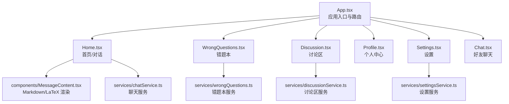
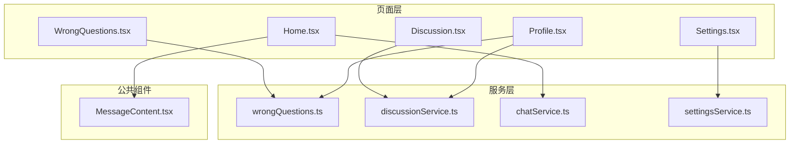
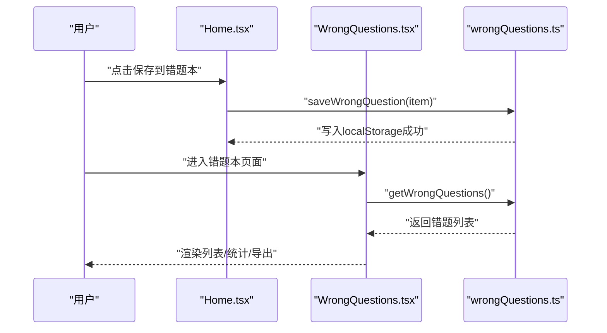
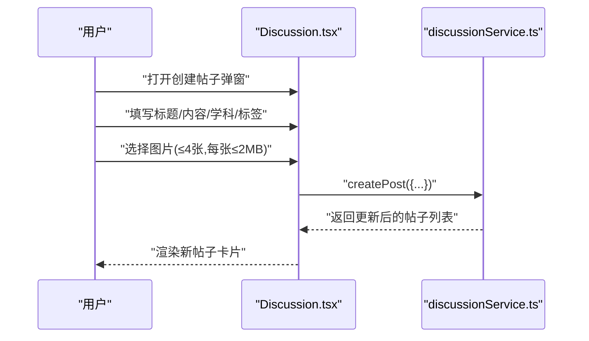
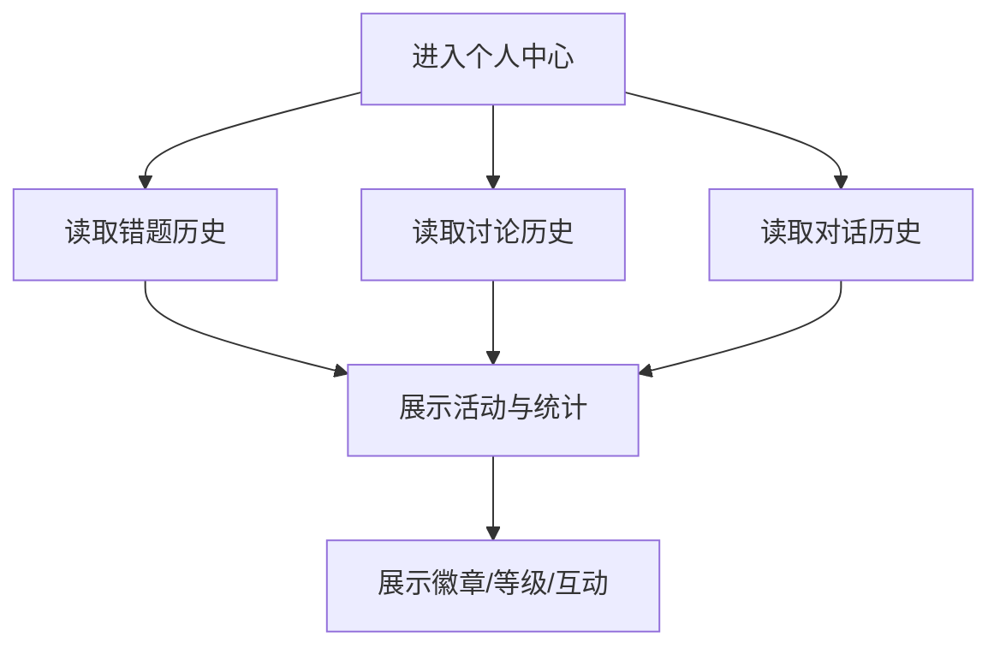
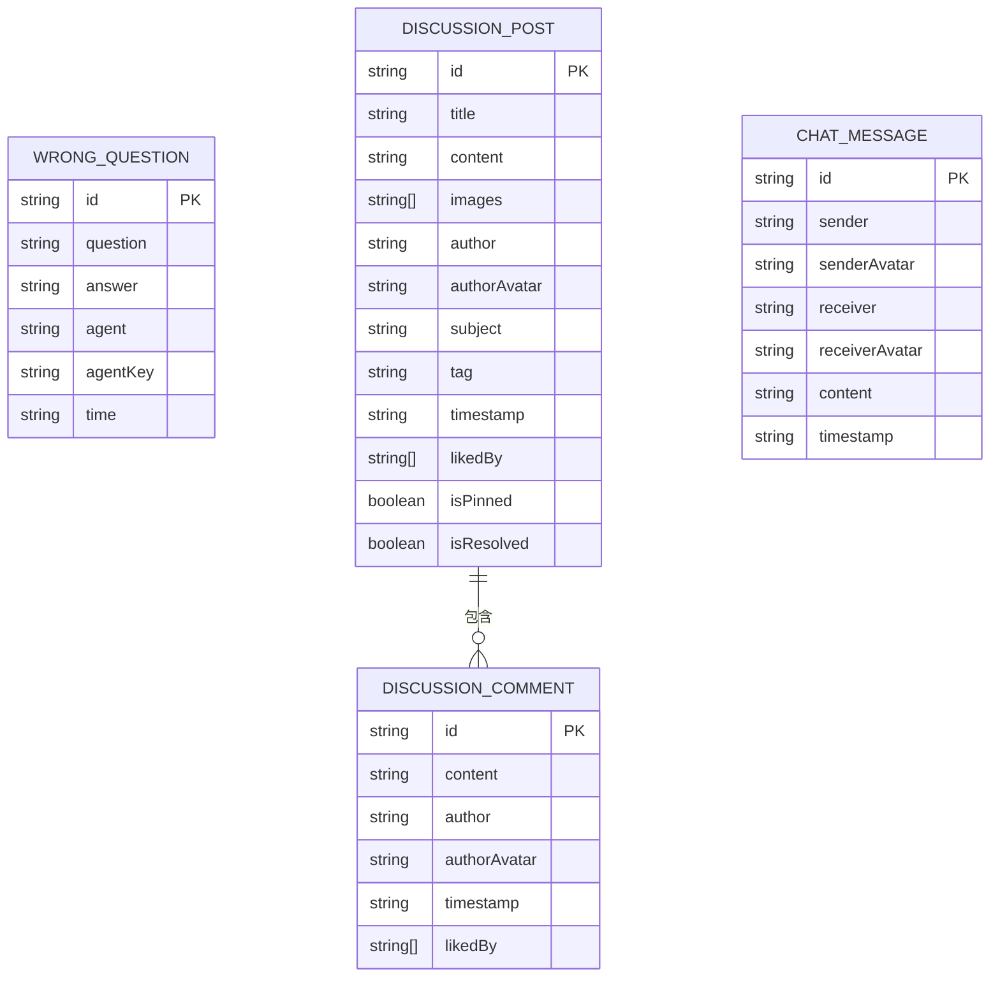
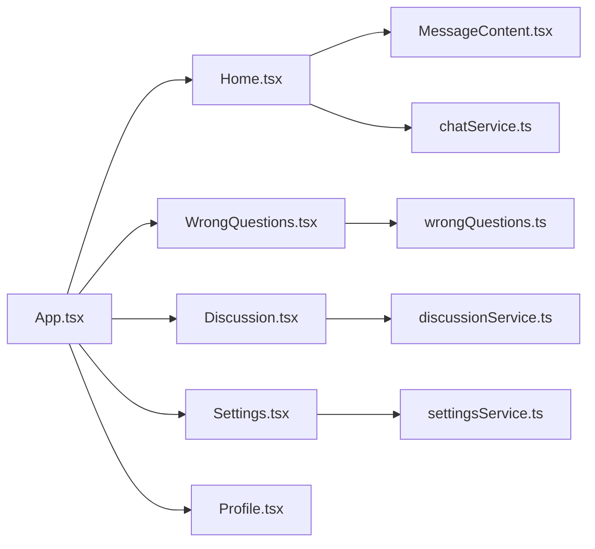

# 学习管理系统

<cite>
**本文引用的文件**
- [README.md](file://README.md)
- [package.json](file://package.json)
- [src/App.tsx](file://src/App.tsx)
- [src/pages/WrongQuestions.tsx](file://src/pages/WrongQuestions.tsx)
- [src/services/wrongQuestions.ts](file://src/services/wrongQuestions.ts)
- [src/pages/Discussion.tsx](file://src/pages/Discussion.tsx)
- [src/services/discussionService.ts](file://src/services/discussionService.ts)
- [src/components/MessageContent.tsx](file://src/components/MessageContent.tsx)
- [src/services/chatService.ts](file://src/services/chatService.ts)
- [src/pages/Settings.tsx](file://src/pages/Settings.tsx)
- [src/services/settingsService.ts](file://src/services/settingsService.ts)
- [src/pages/Home.tsx](file://src/pages/Home.tsx)
- [src/pages/Profile.tsx](file://src/pages/Profile.tsx)
- [技术介绍.md](file://技术介绍.md)
</cite>

## 目录
1. [简介](#简介)
2. [项目结构](#项目结构)
3. [核心组件](#核心组件)
4. [架构总览](#架构总览)
5. [详细组件分析](#详细组件分析)
6. [依赖关系分析](#依赖关系分析)
7. [性能考虑](#性能考虑)
8. [故障排查指南](#故障排查指南)
9. [结论](#结论)
10. [附录](#附录)

## 简介
本文件面向“智课通 AI Tutor”项目的学习管理系统，围绕错题本、讨论区、学习历史与进度跟踪、个性化推荐、数据持久化与缓存、UI 设计与状态管理、错误处理等主题，提供从概念到实现的系统化说明。文档同时给出关键流程图与时序图，帮助初学者理解整体架构，也为开发者提供扩展与定制的技术指引。

## 项目结构
项目采用前端单页应用（React + Vite）组织，页面与服务层清晰分离：
- 应用入口与路由：App.tsx 负责侧边栏导航、顶部导航与页面切换动画
- 页面组件：Home、WrongQuestions、Discussion、Profile、Settings、Chat 等
- 服务层：分别封装本地存储的数据模型与 CRUD 操作（错题本、讨论区、聊天、设置）
- 公共组件：MessageContent 支持 Markdown 与 LaTeX 渲染
- 依赖与运行：package.json 定义依赖与脚本；README 提供运行说明

图表来源
- [src/App.tsx:35-211](file://src/App.tsx#L35-L211)
- [src/pages/WrongQuestions.tsx:14-309](file://src/pages/WrongQuestions.tsx#L14-L309)
- [src/pages/Discussion.tsx:42-308](file://src/pages/Discussion.tsx#L42-L308)
- [src/pages/Home.tsx:79-200](file://src/pages/Home.tsx#L79-L200)
- [src/components/MessageContent.tsx:19-30](file://src/components/MessageContent.tsx#L19-L30)
- [src/services/wrongQuestions.ts:12-34](file://src/services/wrongQuestions.ts#L12-L34)
- [src/services/discussionService.ts:45-154](file://src/services/discussionService.ts#L45-L154)
- [src/services/chatService.ts:34-71](file://src/services/chatService.ts#L34-L71)
- [src/pages/Settings.tsx:32-144](file://src/pages/Settings.tsx#L32-L144)
- [src/services/settingsService.ts](file://src/services/settingsService.ts)

章节来源
- [src/App.tsx:35-211](file://src/App.tsx#L35-L211)
- [package.json:1-42](file://package.json#L1-L42)
- [README.md:1-21](file://README.md#L1-L21)

## 核心组件
- 错题本系统：提供错题的增删查、学科筛选、PDF 导出、学科统计
- 讨论区系统：支持发帖、点赞、评论、置顶/解答回复、图片上传、筛选
- 学习历史与进度：基于 localStorage 的会话与活动记录，配合个人中心展示
- 个性化推荐：结合用户行为与标签进行内容分发（讨论区）
- 数据持久化：统一使用 localStorage，键名区分模块
- UI 与交互：Material 风格组件库、Markdown/LaTeX 渲染、动画过渡

章节来源
- [src/pages/WrongQuestions.tsx:14-309](file://src/pages/WrongQuestions.tsx#L14-L309)
- [src/services/wrongQuestions.ts:12-34](file://src/services/wrongQuestions.ts#L12-L34)
- [src/pages/Discussion.tsx:42-308](file://src/pages/Discussion.tsx#L42-L308)
- [src/services/discussionService.ts:45-154](file://src/services/discussionService.ts#L45-L154)
- [src/pages/Profile.tsx:118-263](file://src/pages/Profile.tsx#L118-L263)
- [技术介绍.md:98-117](file://技术介绍.md#L98-L117)

## 架构总览
系统采用“页面组件 + 服务层 + 公共组件”的分层架构，页面组件负责交互与状态管理，服务层封装数据模型与本地存储，公共组件提供可复用的渲染能力。

图表来源
- [src/pages/WrongQuestions.tsx:14-309](file://src/pages/WrongQuestions.tsx#L14-L309)
- [src/pages/Discussion.tsx:42-308](file://src/pages/Discussion.tsx#L42-L308)
- [src/pages/Home.tsx:79-200](file://src/pages/Home.tsx#L79-L200)
- [src/pages/Profile.tsx:118-263](file://src/pages/Profile.tsx#L118-L263)
- [src/pages/Settings.tsx:32-144](file://src/pages/Settings.tsx#L32-L144)
- [src/services/wrongQuestions.ts:12-34](file://src/services/wrongQuestions.ts#L12-L34)
- [src/services/discussionService.ts:45-154](file://src/services/discussionService.ts#L45-L154)
- [src/services/chatService.ts:34-71](file://src/services/chatService.ts#L34-L71)
- [src/services/settingsService.ts](file://src/services/settingsService.ts)
- [src/components/MessageContent.tsx:19-30](file://src/components/MessageContent.tsx#L19-L30)

## 详细组件分析

### 错题本系统
- 功能要点
  - 增删查：读取、新增、删除错题项
  - 展示与筛选：按学科筛选、展开/折叠 AI 解答、学科统计
  - 导出：生成 PDF，包含题目与 AI 解答的结构化排版
- 数据模型
  - 错题项包含唯一 ID、题目、答案、学科名称与键、时间戳
- 交互流程
  - 用户在对话中选择“保存到错题本”，调用服务写入 localStorage
  - 错题本页面读取并渲染，支持删除与导出

图表来源
- [src/pages/Home.tsx:79-200](file://src/pages/Home.tsx#L79-L200)
- [src/pages/WrongQuestions.tsx:14-309](file://src/pages/WrongQuestions.tsx#L14-L309)
- [src/services/wrongQuestions.ts:12-34](file://src/services/wrongQuestions.ts#L12-L34)

章节来源
- [src/pages/WrongQuestions.tsx:14-309](file://src/pages/WrongQuestions.tsx#L14-L309)
- [src/services/wrongQuestions.ts:12-34](file://src/services/wrongQuestions.ts#L12-L34)
- [src/components/MessageContent.tsx:19-30](file://src/components/MessageContent.tsx#L19-L30)

### 讨论区系统
- 功能要点
  - 发帖：标题、内容、学科、标签、图片上传（最多 4 张，每张 ≤ 2MB）
  - 互动：点赞、评论、置顶、标记已解决、删除（作者或管理员）
  - 展示：最新/精华/未解决筛选，缩略图放大查看
- 数据模型
  - 帖子包含作者、头像、学科、标签、时间戳、点赞集合、评论数组、置顶/解决状态
  - 评论包含作者、头像、时间戳、点赞集合
- 交互流程
  - 创建帖子 -> 写入 localStorage
  - 点赞/评论 -> 更新对应集合并持久化
  - 图片上传 -> FileReader 转 base64，限制数量与大小

图表来源
- [src/pages/Discussion.tsx:53-71](file://src/pages/Discussion.tsx#L53-L71)
- [src/services/discussionService.ts:58-74](file://src/services/discussionService.ts#L58-L74)

章节来源
- [src/pages/Discussion.tsx:42-308](file://src/pages/Discussion.tsx#L42-L308)
- [src/services/discussionService.ts:45-154](file://src/services/discussionService.ts#L45-L154)

### 学习历史与进度跟踪
- 历史记录
  - 对话历史：Home.tsx 维护当前 Agent 的会话列表与活动标识
  - 错题历史：WrongQuestions.tsx 读取 localStorage 中的错题列表
  - 讨论历史：Discussion.tsx 读取 localStorage 中的帖子列表
- 进度展示
  - Profile.tsx 展示近期活动、徽章与导师互动情况
- 个性化推荐
  - 讨论区按学科与标签聚合，便于用户发现相关内容

图表来源
- [src/pages/Profile.tsx:118-263](file://src/pages/Profile.tsx#L118-L263)
- [src/pages/WrongQuestions.tsx:14-309](file://src/pages/WrongQuestions.tsx#L14-L309)
- [src/pages/Discussion.tsx:42-308](file://src/pages/Discussion.tsx#L42-L308)
- [src/pages/Home.tsx:79-200](file://src/pages/Home.tsx#L79-L200)

章节来源
- [src/pages/Profile.tsx:118-263](file://src/pages/Profile.tsx#L118-L263)
- [src/pages/WrongQuestions.tsx:14-309](file://src/pages/WrongQuestions.tsx#L14-L309)
- [src/pages/Discussion.tsx:42-308](file://src/pages/Discussion.tsx#L42-L308)
- [src/pages/Home.tsx:79-200](file://src/pages/Home.tsx#L79-L200)

### 个性化推荐机制
- 基于标签与学科的筛选与聚合
  - 讨论区支持“最新/精华/未解决”过滤，便于用户聚焦感兴趣内容
  - 错题本按学科统计占比，辅助复习规划
- 行为驱动
  - 用户点赞/评论/发帖/保存错题的行为可作为内容热度与兴趣信号

章节来源
- [src/pages/Discussion.tsx:119-127](file://src/pages/Discussion.tsx#L119-L127)
- [src/pages/WrongQuestions.tsx:295-309](file://src/pages/WrongQuestions.tsx#L295-L309)

### 数据模型设计
- 错题本
  - 字段：id、question、answer、agent、agentKey、time
- 讨论区
  - 帖子：id、title、content、images、author、authorAvatar、subject、tag、timestamp、likedBy、comments、isPinned、isResolved
  - 评论：id、content、author、authorAvatar、timestamp、likedBy
- 聊天
  - 字段：id、sender、senderAvatar、receiver、receiverAvatar、content、timestamp
- 设置
  - 字段：昵称、头像、偏好等（具体字段由设置服务定义）

图表来源
- [src/services/wrongQuestions.ts:1-8](file://src/services/wrongQuestions.ts#L1-L8)
- [src/services/discussionService.ts:1-24](file://src/services/discussionService.ts#L1-L24)
- [src/services/chatService.ts:1-8](file://src/services/chatService.ts#L1-L8)

章节来源
- [src/services/wrongQuestions.ts:1-8](file://src/services/wrongQuestions.ts#L1-L8)
- [src/services/discussionService.ts:1-24](file://src/services/discussionService.ts#L1-L24)
- [src/services/chatService.ts:1-8](file://src/services/chatService.ts#L1-L8)

### 用户交互流程示例

#### 添加错题
- 在对话中触发保存动作，调用服务写入 localStorage
- 刷新错题本页面，即可看到新增条目

章节来源
- [src/pages/Home.tsx:79-200](file://src/pages/Home.tsx#L79-L200)
- [src/services/wrongQuestions.ts:21-25](file://src/services/wrongQuestions.ts#L21-L25)
- [src/pages/WrongQuestions.tsx:21-31](file://src/pages/WrongQuestions.tsx#L21-L31)

#### 查看学习记录
- 进入“个人中心”，系统读取错题与讨论历史并展示

章节来源
- [src/pages/Profile.tsx:118-263](file://src/pages/Profile.tsx#L118-L263)
- [src/pages/WrongQuestions.tsx:21-31](file://src/pages/WrongQuestions.tsx#L21-L31)
- [src/pages/Discussion.tsx:49-51](file://src/pages/Discussion.tsx#L49-L51)

#### 参与讨论
- 打开“讨论区”，选择学科与标签，填写标题与内容，上传图片后提交
- 支持点赞、评论、置顶/解答回复等互动

章节来源
- [src/pages/Discussion.tsx:53-71](file://src/pages/Discussion.tsx#L53-L71)
- [src/services/discussionService.ts:58-74](file://src/services/discussionService.ts#L58-L74)

## 依赖关系分析
- 组件耦合
  - 页面组件与服务层松耦合，通过接口暴露 CRUD 方法
  - 公共组件（MessageContent）被多个页面复用
- 外部依赖
  - react-markdown + remark-math + rehype-katex：用于 Markdown 与 LaTeX 渲染
  - html2pdf.js：用于错题本 PDF 导出
  - lucide-react：图标库
  - motion/react：页面切换动画
- 潜在循环依赖
  - 当前结构为单向依赖（页面 -> 服务 -> 存储），无明显循环

图表来源
- [src/pages/Home.tsx:79-200](file://src/pages/Home.tsx#L79-L200)
- [src/components/MessageContent.tsx:19-30](file://src/components/MessageContent.tsx#L19-L30)
- [src/services/chatService.ts:34-71](file://src/services/chatService.ts#L34-L71)
- [src/pages/WrongQuestions.tsx:14-309](file://src/pages/WrongQuestions.tsx#L14-L309)
- [src/services/wrongQuestions.ts:12-34](file://src/services/wrongQuestions.ts#L12-L34)
- [src/pages/Discussion.tsx:42-308](file://src/pages/Discussion.tsx#L42-L308)
- [src/services/discussionService.ts:45-154](file://src/services/discussionService.ts#L45-L154)
- [src/pages/Settings.tsx:32-144](file://src/pages/Settings.tsx#L32-L144)
- [src/services/settingsService.ts](file://src/services/settingsService.ts)
- [src/App.tsx:35-211](file://src/App.tsx#L35-L211)

章节来源
- [package.json:13-28](file://package.json#L13-L28)
- [src/App.tsx:35-211](file://src/App.tsx#L35-L211)

## 性能考虑
- 渲染优化
  - 使用 React.memo、useMemo、useCallback 缓存计算与回调，减少重渲染
  - 图片懒加载与缩略图预览，避免一次性加载大量资源
- 网络与存储
  - 本地存储读写批量进行，避免频繁 IO
  - 图片上传采用 FileReader，转为 base64 后再持久化，控制文件大小与数量
- 运行时优化
  - 页面切换使用动画库，保持流畅体验
  - 讨论区与错题本列表采用虚拟滚动（如需要）以提升大数据量场景下的性能

章节来源
- [.codeartsdoer/specs/video-background-login/design.md:460-519](file://.codeartsdoer/specs/video-background-login/design.md#L460-L519)
- [src/pages/Discussion.tsx:594-634](file://src/pages/Discussion.tsx#L594-L634)
- [src/pages/WrongQuestions.tsx:33-161](file://src/pages/WrongQuestions.tsx#L33-L161)

## 故障排查指南
- 错题本为空
  - 检查 localStorage 中的键是否存在且可解析
  - 确认保存流程是否正确调用服务方法
- 讨论区无法发帖
  - 校验必填字段（标题）与图片限制（数量/大小）
  - 查看控制台是否有异常（FileReader 或存储写入失败）
- PDF 导出失败
  - 确认 html2pdf.js 是否正确引入
  - 检查容器元素与样式是否影响渲染
- LaTeX 渲染异常
  - 确保 Markdown 文本中数学语法符合预处理规则
  - 检查 remark-math 与 rehype-katex 插件是否启用

章节来源
- [src/services/wrongQuestions.ts:12-19](file://src/services/wrongQuestions.ts#L12-L19)
- [src/services/discussionService.ts:58-74](file://src/services/discussionService.ts#L58-L74)
- [src/pages/Discussion.tsx:606-634](file://src/pages/Discussion.tsx#L606-L634)
- [src/pages/WrongQuestions.tsx:33-161](file://src/pages/WrongQuestions.tsx#L33-L161)
- [src/components/MessageContent.tsx:9-17](file://src/components/MessageContent.tsx#L9-L17)

## 结论
本学习管理系统以 localStorage 为核心实现数据持久化，结合页面组件与服务层的清晰分工，提供了错题本、讨论区、学习历史与进度跟踪等核心功能。通过 Markdown/LaTeX 渲染与 PDF 导出增强学习体验，配合筛选与统计提升信息检索效率。建议后续在用户体量增长时引入 IndexedDB 或服务端存储，以进一步提升性能与可靠性。

## 附录

### 数据持久化策略
- 错题本：localStorage 键名区分模块，统一序列化/反序列化
- 讨论区：帖子与评论统一存储，支持置顶/解决状态
- 聊天：按会话键（双方排序拼接）组织消息列表
- 设置：用户偏好与头像等信息持久化

章节来源
- [src/services/wrongQuestions.ts:10-34](file://src/services/wrongQuestions.ts#L10-L34)
- [src/services/discussionService.ts:26-56](file://src/services/discussionService.ts#L26-L56)
- [src/services/chatService.ts:10-32](file://src/services/chatService.ts#L10-L32)
- [src/pages/Settings.tsx:64-68](file://src/pages/Settings.tsx#L64-L68)

### 缓存机制与最佳实践
- 前端缓存：localStorage 作为主要缓存介质，键名规范化
- UI 缓存：对计算型数据（如学科统计）进行 memo 化
- 服务端集成：当前为本地存储，未来可接入服务端 API 以实现跨设备同步

章节来源
- [src/pages/WrongQuestions.tsx:163-166](file://src/pages/WrongQuestions.tsx#L163-L166)
- [src/pages/Discussion.tsx:119-127](file://src/pages/Discussion.tsx#L119-L127)

### 界面设计指南与状态管理
- 设计指南
  - 使用语义化标签与无障碍属性
  - 控制输入长度与格式（标题、评论、图片）
  - 明确反馈（加载、成功、错误状态）
- 状态管理
  - 页面内局部状态与全局状态分离
  - 通过服务层集中处理副作用与持久化

章节来源
- [src/pages/Discussion.tsx:597-767](file://src/pages/Discussion.tsx#L597-L767)
- [src/pages/WrongQuestions.tsx:14-309](file://src/pages/WrongQuestions.tsx#L14-L309)

### 开发者扩展与定制建议
- 新增学科/标签
  - 在 Discussion.tsx 与 WrongQuestions.tsx 中维护学科映射与筛选选项
- 接入服务端
  - 将 localStorage 替换为 HTTP API，增加鉴权与错误处理
- 性能增强
  - 引入虚拟列表、分页加载、图片 CDN
- 个性化
  - 基于用户行为构建推荐算法，结合标签与学科热度

章节来源
- [src/pages/Discussion.tsx:37-38](file://src/pages/Discussion.tsx#L37-L38)
- [src/pages/WrongQuestions.tsx:7-12](file://src/pages/WrongQuestions.tsx#L7-L12)
- [技术介绍.md:98-117](file://技术介绍.md#L98-L117)