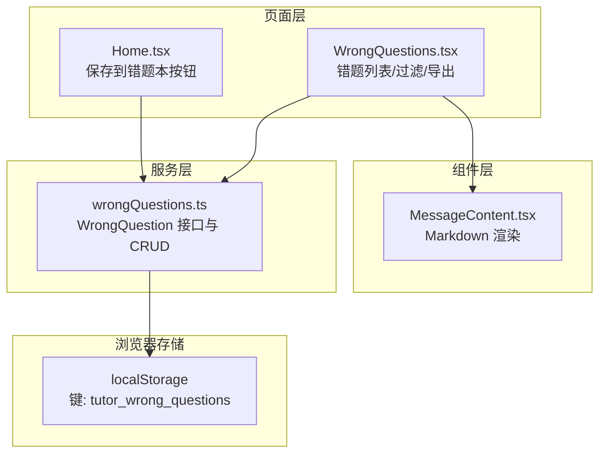
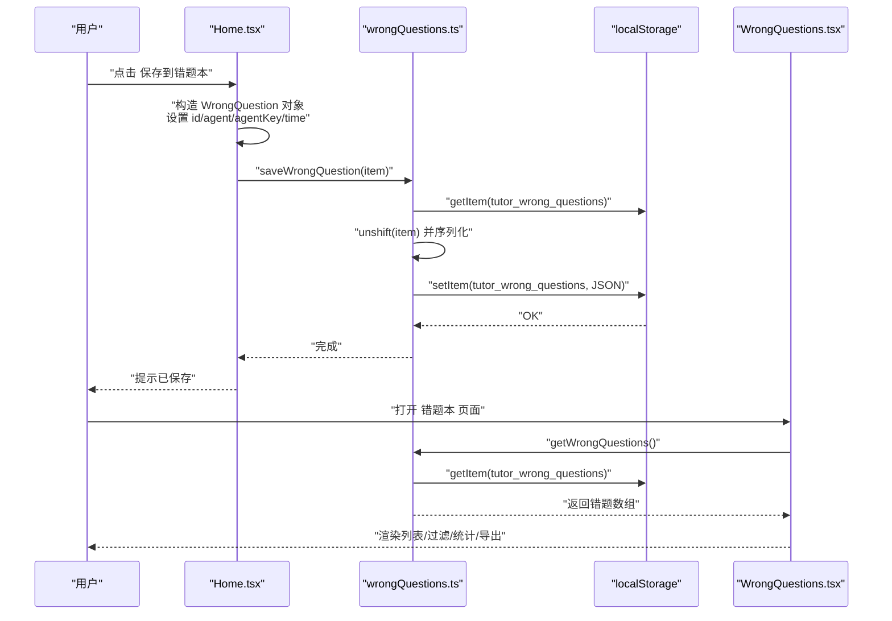
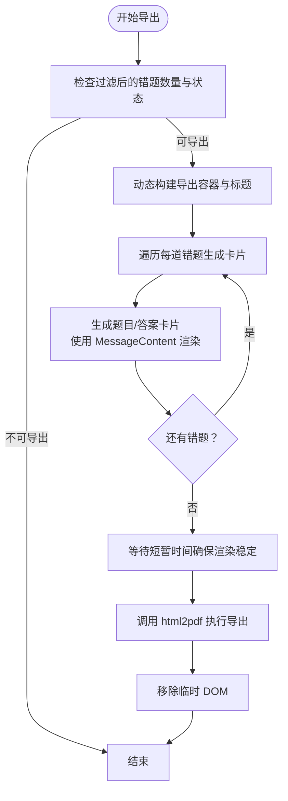
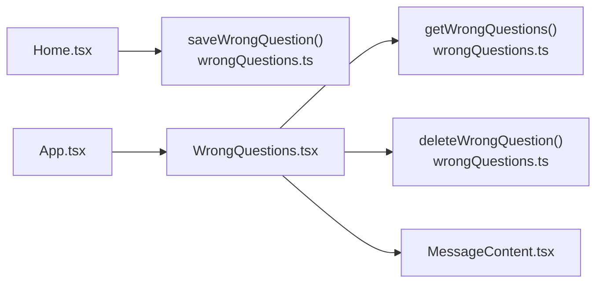

# 错题本功能

<cite>
**本文引用的文件**
- [src/services/wrongQuestions.ts](file://src/services/wrongQuestions.ts)
- [src/pages/WrongQuestions.tsx](file://src/pages/WrongQuestions.tsx)
- [src/pages/Home.tsx](file://src/pages/Home.tsx)
- [src/components/MessageContent.tsx](file://src/components/MessageContent.tsx)
- [src/App.tsx](file://src/App.tsx)
</cite>

## 目录
1. [简介](#简介)
2. [项目结构](#项目结构)
3. [核心组件](#核心组件)
4. [架构总览](#架构总览)
5. [详细组件分析](#详细组件分析)
6. [依赖关系分析](#依赖关系分析)
7. [性能考虑](#性能考虑)
8. [故障排查指南](#故障排查指南)
9. [结论](#结论)
10. [附录](#附录)

## 简介
本文件面向“智课通 AI Tutor”项目中的“错题本”功能，系统性阐述其数据模型、本地存储机制、增删改查操作、时间戳与代理类型/分类的业务逻辑、错误处理与持久化策略，并提供扩展建议（如错题标签、分类管理、搜索等）。同时给出在组件中调用服务函数的实践示例与可视化流程图。

## 项目结构
错题本功能由三部分组成：
- 数据模型与服务层：定义错题接口与本地存储的 CRUD 操作
- 页面展示层：渲染错题列表、过滤、导出 PDF、统计分布
- 调用入口层：在对话页提供“保存到错题本”的交互按钮，触发写入

图表来源
- [src/pages/Home.tsx:368-384](file://src/pages/Home.tsx#L368-L384)
- [src/pages/WrongQuestions.tsx:1-309](file://src/pages/WrongQuestions.tsx#L1-L309)
- [src/services/wrongQuestions.ts:1-35](file://src/services/wrongQuestions.ts#L1-L35)
- [src/components/MessageContent.tsx:1-31](file://src/components/MessageContent.tsx#L1-L31)

章节来源
- [src/pages/Home.tsx:3-386](file://src/pages/Home.tsx#L3-L386)
- [src/pages/WrongQuestions.tsx:1-309](file://src/pages/WrongQuestions.tsx#L1-L309)
- [src/services/wrongQuestions.ts:1-35](file://src/services/wrongQuestions.ts#L1-L35)
- [src/components/MessageContent.tsx:1-31](file://src/components/MessageContent.tsx#L1-L31)
- [src/App.tsx](file://src/App.tsx#L198)

## 核心组件
- WrongQuestion 接口：定义错题实体的字段与语义
- 本地存储常量 STORAGE_KEY：统一键名，避免分散硬编码
- CRUD 函数族：获取、新增、删除、清空

章节来源
- [src/services/wrongQuestions.ts:1-8](file://src/services/wrongQuestions.ts#L1-L8)
- [src/services/wrongQuestions.ts:10](file://src/services/wrongQuestions.ts#L10)
- [src/services/wrongQuestions.ts:12-34](file://src/services/wrongQuestions.ts#L12-L34)

## 架构总览
下图展示了从“保存到错题本”到“错题列表展示”的端到端流程：

图表来源
- [src/pages/Home.tsx:368-384](file://src/pages/Home.tsx#L368-L384)
- [src/services/wrongQuestions.ts:12-25](file://src/services/wrongQuestions.ts#L12-L25)
- [src/pages/WrongQuestions.tsx:21-31](file://src/pages/WrongQuestions.tsx#L21-L31)

## 详细组件分析

### 数据模型：WrongQuestion 字段定义
- id：字符串，唯一标识每条错题
- question：字符串，原始问题内容（支持 Markdown）
- answer：字符串，AI 回答内容（支持 Markdown）
- agent：字符串，代理名称（如“高数”、“Python”等）
- agentKey：字符串，代理键（用于分类与筛选）
- time：字符串，时间戳（格式见后文）

章节来源
- [src/services/wrongQuestions.ts:1-8](file://src/services/wrongQuestions.ts#L1-L8)

### 本地存储机制
- 常量 STORAGE_KEY：统一键名“tutor_wrong_questions”，集中管理
- 存储介质：浏览器 localStorage
- 序列化策略：数组整体以 JSON 字符串形式存储；读取时解析，异常兜底为空数组

章节来源
- [src/services/wrongQuestions.ts:10](file://src/services/wrongQuestions.ts#L10)
- [src/services/wrongQuestions.ts:12-19](file://src/services/wrongQuestions.ts#L12-L19)

### CRUD 操作详解

#### 获取所有错题：getWrongQuestions()
- 行为：从 localStorage 读取并解析，异常时返回空数组
- 复杂度：O(n)，n 为已存错题数量
- 使用场景：页面初始化、刷新、导出前拉取

章节来源
- [src/services/wrongQuestions.ts:12-19](file://src/services/wrongQuestions.ts#L12-L19)
- [src/pages/WrongQuestions.tsx:21-23](file://src/pages/WrongQuestions.tsx#L21-L23)

#### 新增错题：saveWrongQuestion(item)
- 行为：先读取现有列表，将新项插入头部，再写回 localStorage
- 复杂度：O(n)
- 注意：插入头部便于“最新在前”的展示

章节来源
- [src/services/wrongQuestions.ts:21-25](file://src/services/wrongQuestions.ts#L21-L25)
- [src/pages/Home.tsx:368-384](file://src/pages/Home.tsx#L368-L384)

#### 删除错题：deleteWrongQuestion(id)
- 行为：过滤掉指定 id 的错题，再写回 localStorage
- 复杂度：O(n)
- 边界：若 id 不存在，结果不变

章节来源
- [src/services/wrongQuestions.ts:27-30](file://src/services/wrongQuestions.ts#L27-L30)
- [src/pages/WrongQuestions.tsx:27-31](file://src/pages/WrongQuestions.tsx#L27-L31)

#### 清空错题：clearWrongQuestions()
- 行为：将数组置空并写回
- 复杂度：O(1)

章节来源
- [src/services/wrongQuestions.ts:32-34](file://src/services/wrongQuestions.ts#L32-L34)

### 时间戳格式与业务逻辑
- 时间戳生成：在“保存到错题本”时调用格式化函数生成时间字符串
- 格式特征：采用“小时:分钟”的本地时间格式，适合短链路展示
- 展示位置：错题卡片顶部显示 time 字段；导出 PDF 页眉也包含导出时间

章节来源
- [src/pages/Home.tsx:53-61](file://src/pages/Home.tsx#L53-L61)
- [src/pages/Home.tsx:368-384](file://src/pages/Home.tsx#L368-L384)
- [src/pages/WrongQuestions.tsx:220](file://src/pages/WrongQuestions.tsx#L220)
- [src/pages/WrongQuestions.tsx:61](file://src/pages/WrongQuestions.tsx#L61)

### 代理类型与错题分类
- 代理键 agentKey：来源于当前激活的智能体键值（如 math/python/torch/matrix）
- 代理名称 agent：用于展示与回退显示
- 分类映射：页面侧维护 agentLabels 将 agentKey 映射为中文标签（如“高数”）
- 过滤逻辑：按 agentKey 进行筛选，支持“全部学科”

章节来源
- [src/pages/Home.tsx:63](file://src/pages/Home.tsx#L63)
- [src/pages/WrongQuestions.tsx:7-12](file://src/pages/WrongQuestions.tsx#L7-L12)
- [src/pages/WrongQuestions.tsx:25](file://src/pages/WrongQuestions.tsx#L25)

### 组件内调用示例（路径指引）
- 在 Home.tsx 中触发保存：[src/pages/Home.tsx:368-384](file://src/pages/Home.tsx#L368-L384)
- 在 WrongQuestions.tsx 中读取与删除：[src/pages/WrongQuestions.tsx:21-31](file://src/pages/WrongQuestions.tsx#L21-L31)
- 在 WrongQuestions.tsx 中渲染 Markdown 内容：[src/pages/WrongQuestions.tsx:230](file://src/pages/WrongQuestions.tsx#L230)、[src/pages/WrongQuestions.tsx:244](file://src/pages/WrongQuestions.tsx#L244)
- Markdown 渲染组件：[src/components/MessageContent.tsx:19-30](file://src/components/MessageContent.tsx#L19-L30)

章节来源
- [src/pages/Home.tsx:368-384](file://src/pages/Home.tsx#L368-L384)
- [src/pages/WrongQuestions.tsx:21-31](file://src/pages/WrongQuestions.tsx#L21-L31)
- [src/components/MessageContent.tsx:19-30](file://src/components/MessageContent.tsx#L19-L30)

### 导出 PDF 流程（概念流程图）

图表来源
- [src/pages/WrongQuestions.tsx:33-161](file://src/pages/WrongQuestions.tsx#L33-L161)

## 依赖关系分析
- WrongQuestions.tsx 依赖 wrongQuestions.ts 提供的 CRUD 方法
- WrongQuestions.tsx 依赖 MessageContent.tsx 渲染 Markdown
- Home.tsx 通过 saveWrongQuestion 触发写入
- App.tsx 将 WrongQuestions 页面作为路由之一进行挂载

图表来源
- [src/pages/Home.tsx:3-386](file://src/pages/Home.tsx#L3-L386)
- [src/pages/WrongQuestions.tsx:1-309](file://src/pages/WrongQuestions.tsx#L1-L309)
- [src/services/wrongQuestions.ts:1-35](file://src/services/wrongQuestions.ts#L1-L35)
- [src/App.tsx:198](file://src/App.tsx#L198)

章节来源
- [src/pages/Home.tsx:3-386](file://src/pages/Home.tsx#L3-L386)
- [src/pages/WrongQuestions.tsx:1-309](file://src/pages/WrongQuestions.tsx#L1-L309)
- [src/services/wrongQuestions.ts:1-35](file://src/services/wrongQuestions.ts#L1-L35)
- [src/App.tsx:198](file://src/App.tsx#L198)

## 性能考虑
- 读写复杂度：当前实现对数组进行完整序列化/反序列化，单次 O(n)
- 优化建议：
  - 分页/虚拟滚动：当错题数量增长时，采用分页或虚拟列表减少 DOM
  - 增量更新：仅在必要时重写 localStorage，避免频繁写入
  - 防抖/节流：在高频交互（如快速多次保存）时增加防抖
  - 缓存策略：在内存中缓存当前会话的错题集合，减少重复读取
  - 压缩存储：对超长内容进行压缩后再存储（需权衡 CPU 开销）

## 故障排查指南
- 读取失败：getWrongQuestions() 在解析异常时返回空数组，避免应用崩溃
- 写入失败：未捕获异常会导致写入中断，建议在外层包裹 try/catch 并提示用户
- 导出失败：PDF 导出过程可能因网络或资源加载失败而抛错，已在组件中捕获并记录日志
- 数据不一致：若出现重复或顺序异常，检查 id 生成策略与插入位置逻辑

章节来源
- [src/services/wrongQuestions.ts:12-19](file://src/services/wrongQuestions.ts#L12-L19)
- [src/pages/WrongQuestions.tsx:156-160](file://src/pages/WrongQuestions.tsx#L156-L160)

## 结论
错题本功能以简洁的 WrongQuestion 接口与 localStorage 实现为基础，结合页面层的过滤、统计与导出能力，形成完整的本地化错题管理闭环。当前实现具备良好的可读性与可维护性，后续可在数据结构、UI 性能与功能扩展上持续演进。

## 附录

### 业务扩展建议
- 错题标签：在 WrongQuestion 中新增 tags 字段，支持多标签与模糊匹配
- 分类管理：引入分类树或标签体系，支持动态增删与批量操作
- 搜索功能：基于关键词、时间范围、学科维度进行检索
- 同步与备份：在 localStorage 外增加导出/导入能力，或接入后端同步
- 条件过滤：支持“未掌握”“易错”“收藏”等状态位，配合排序与筛选

### 代码级参考路径
- 新增字段与 CRUD 扩展：[src/services/wrongQuestions.ts:1-35](file://src/services/wrongQuestions.ts#L1-L35)
- 页面渲染与交互：[src/pages/WrongQuestions.tsx:1-309](file://src/pages/WrongQuestions.tsx#L1-L309)
- Markdown 渲染组件：[src/components/MessageContent.tsx:1-31](file://src/components/MessageContent.tsx#L1-L31)
- 保存入口与时间格式化：[src/pages/Home.tsx:53-61](file://src/pages/Home.tsx#L53-L61)