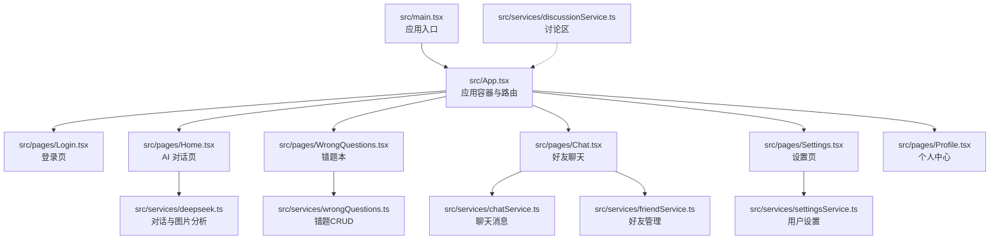
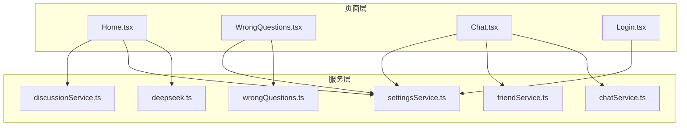
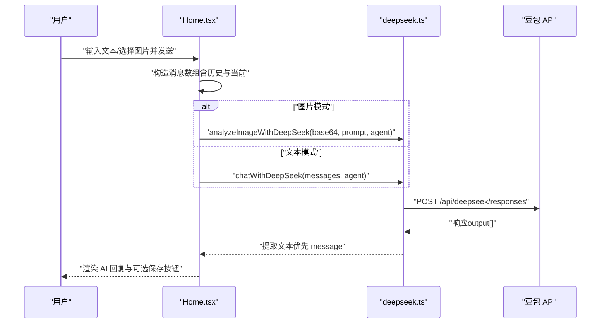
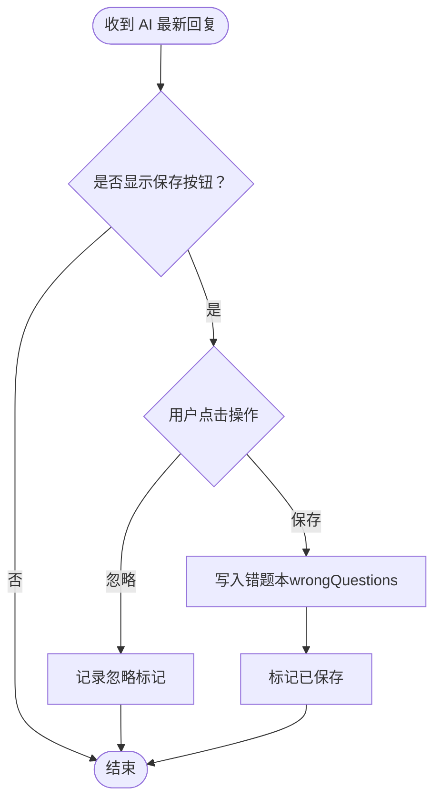
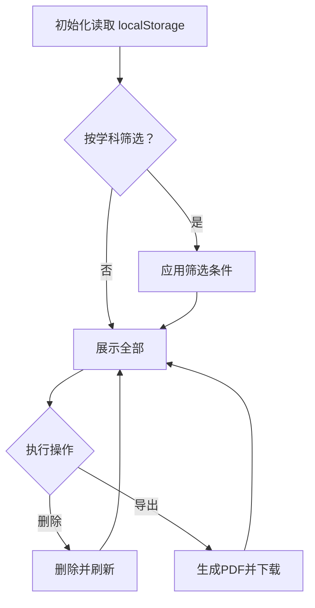
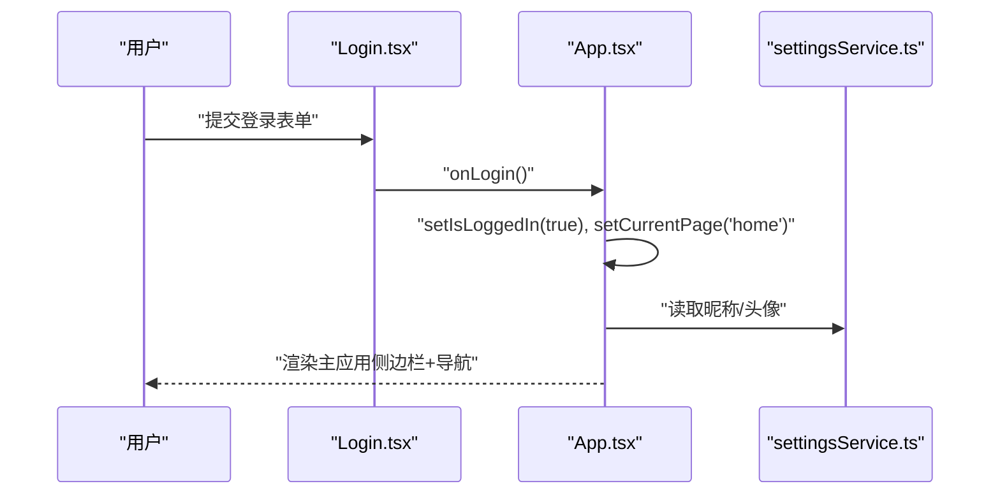
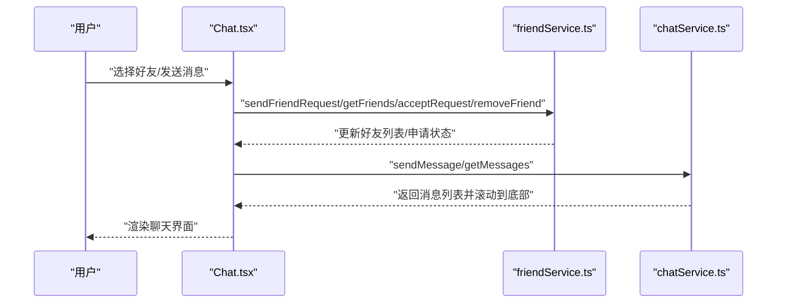
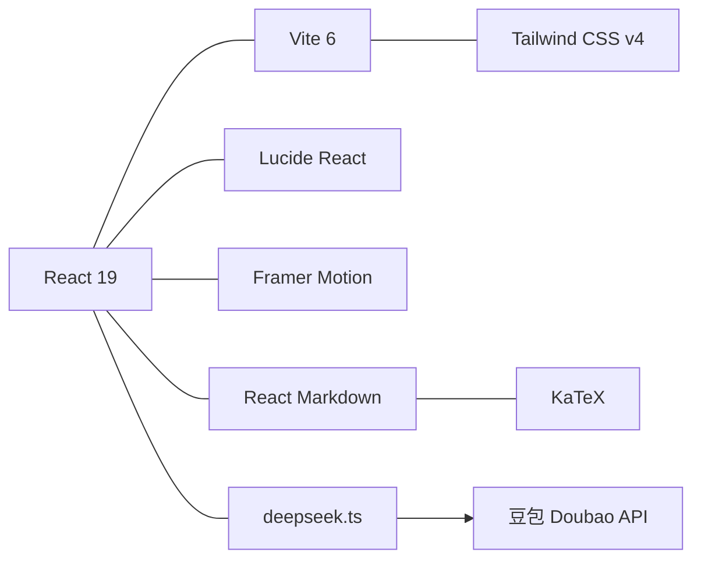

# 核心功能模块

<cite>
**本文引用的文件**
- [README.md](file://README.md)
- [AGENTS.md](file://AGENTS.md)
- [src\App.tsx](file://src\App.tsx)
- [src\main.tsx](file://src\main.tsx)
- [src\pages\Home.tsx](file://src\pages\Home.tsx)
- [src\pages\Login.tsx](file://src\pages\Login.tsx)
- [src\pages\WrongQuestions.tsx](file://src\pages\WrongQuestions.tsx)
- [src\pages\Chat.tsx](file://src\pages\Chat.tsx)
- [src\services\deepseek.ts](file://src\services\deepseek.ts)
- [src\services\chatService.ts](file://src\services\chatService.ts)
- [src\services\wrongQuestions.ts](file://src\services\wrongQuestions.ts)
- [src\services\settingsService.ts](file://src\services\settingsService.ts)
- [src\services\discussionService.ts](file://src\services\discussionService.ts)
- [src\services\friendService.ts](file://src\services\friendService.ts)
- [package.json](file://package.json)
</cite>

## 目录
1. [引言](#引言)
2. [项目结构](#项目结构)
3. [核心组件](#核心组件)
4. [架构总览](#架构总览)
5. [详细组件分析](#详细组件分析)
6. [依赖分析](#依赖分析)
7. [性能考虑](#性能考虑)
8. [故障排查指南](#故障排查指南)
9. [结论](#结论)
10. [附录](#附录)

## 引言
本文件为“智课通 AI Tutor”项目的核心功能模块综合文档，聚焦四大主题：
- AI 对话系统：多代理（数学、Python、深度学习、线性代数）对话、多模态图片分析、对话历史与状态管理
- 多代理架构：四个专用 Agent 的职责边界、系统提示词、API 调用与响应提取
- 错题本管理：错题的采集、过滤、导出 PDF、统计与交互
- 用户认证系统：登录页、会话状态与导航控制

文档解释每个功能的设计目标、实现原理、使用场景，并梳理模块间的协作关系、数据交互模式与状态管理策略；同时提供可落地的使用模式与最佳实践，兼顾初学者与高级开发者。

## 项目结构
项目采用 React 19 + Vite 6 + Tailwind CSS v4 的单页应用架构，页面通过 App.tsx 中的状态机驱动路由切换，未登录时渲染登录页，登录后展示侧边栏 + 顶部导航 + 主内容区。页面组件通过 onNavigate 属性实现跨页面跳转。

图示来源
- [src\main.tsx:1-11](file://src\main.tsx#L1-L11)
- [src\App.tsx:35-211](file://src\App.tsx#L35-L211)
- [src\pages\Home.tsx:79-527](file://src\pages\Home.tsx#L79-L527)
- [src\pages\Login.tsx:7-175](file://src\pages\Login.tsx#L7-L175)
- [src\pages\WrongQuestions.tsx:14-309](file://src\pages\WrongQuestions.tsx#L14-L309)
- [src\pages\Chat.tsx:28-381](file://src\pages\Chat.tsx#L28-L381)
- [src\services\deepseek.ts:45-132](file://src\services\deepseek.ts#L45-L132)
- [src\services\wrongQuestions.ts:12-35](file://src\services\wrongQuestions.ts#L12-L35)
- [src\services\chatService.ts:34-72](file://src\services\chatService.ts#L34-L72)
- [src\services\friendService.ts:61-151](file://src\services\friendService.ts#L61-L151)
- [src\services\settingsService.ts:27-50](file://src\services\settingsService.ts#L27-L50)
- [src\services\discussionService.ts:45-155](file://src\services\discussionService.ts#L45-L155)

章节来源
- [src\App.tsx:35-211](file://src\App.tsx#L35-L211)
- [AGENTS.md:27-34](file://AGENTS.md#L27-L34)

## 核心组件
- 应用容器与路由：App.tsx 维护 currentPage、activeAgent、登录状态，通过 AnimatePresence 实现页面切换动画，提供侧边栏导航与顶部导航。
- 登录页：Login.tsx 提供学生/教师登录入口与多种登录方式，触发 onLogin 后进入主应用。
- AI 对话系统：Home.tsx 集成四个 Agent 的对话、图片上传与分析、对话历史、保存错题、加载状态与滚动行为。
- 错题本：WrongQuestions.tsx 提供错题列表、筛选、展开详情、删除与导出 PDF。
- 好友聊天：Chat.tsx 提供好友列表、聊天消息、申请管理、删除好友与消息发送。
- 用户设置：settingsService.ts 提供用户偏好、头像、昵称等设置的读写。
- 讨论区：discussionService.ts 提供发帖、评论、点赞、置顶/已解决、删除等完整论坛能力。
- API 代理：deepseek.ts 封装豆包 Doubao 多模态模型 API，支持文本与图片混合输入，统一响应提取。

章节来源
- [src\App.tsx:35-211](file://src\App.tsx#L35-L211)
- [src\pages\Home.tsx:79-527](file://src\pages\Home.tsx#L79-L527)
- [src\pages\WrongQuestions.tsx:14-309](file://src\pages\WrongQuestions.tsx#L14-L309)
- [src\pages\Chat.tsx:28-381](file://src\pages\Chat.tsx#L28-L381)
- [src\services\settingsService.ts:27-50](file://src\services\settingsService.ts#L27-L50)
- [src\services\discussionService.ts:45-155](file://src\services\discussionService.ts#L45-L155)
- [src\services\deepseek.ts:45-132](file://src\services\deepseek.ts#L45-L132)

## 架构总览
系统采用“页面 + 服务层”的分层设计：
- 页面层：负责 UI 与用户交互，调用服务层接口
- 服务层：封装本地存储与外部 API（豆包），提供领域内 CRUD 与业务方法
- 状态管理：页面内局部状态 + localStorage 持久化，避免复杂状态库引入

图示来源
- [src\pages\Home.tsx:79-527](file://src\pages\Home.tsx#L79-L527)
- [src\pages\WrongQuestions.tsx:14-309](file://src\pages\WrongQuestions.tsx#L14-L309)
- [src\pages\Chat.tsx:28-381](file://src\pages\Chat.tsx#L28-L381)
- [src\pages\Login.tsx:7-175](file://src\pages\Login.tsx#L7-L175)
- [src\services\deepseek.ts:45-132](file://src\services\deepseek.ts#L45-L132)
- [src\services\wrongQuestions.ts:12-35](file://src\services\wrongQuestions.ts#L12-L35)
- [src\services\chatService.ts:34-72](file://src\services\chatService.ts#L34-L72)
- [src\services\friendService.ts:61-151](file://src\services\friendService.ts#L61-L151)
- [src\services\settingsService.ts:27-50](file://src\services\settingsService.ts#L27-L50)
- [src\services\discussionService.ts:45-155](file://src\services\discussionService.ts#L45-L155)

## 详细组件分析

### AI 对话系统与多代理架构
- 设计目标
  - 为不同学科提供专业 Agent，支持纯文本与图片多模态问答
  - 保持对话上下文与历史，提供“保存到错题本”的闭环学习体验
- 实现原理
  - 四个 Agent：math（高数酱）、python（Py酱）、torch（Torch君）、matrix（矩阵妹），各自拥有独立 system prompt
  - 文本对话：将历史消息序列化为 ChatMessage[]，调用 chatWithDeepSeek
  - 图片分析：将 base64 图片与文本提示组合为 input_image + input_text，调用 analyzeImageWithDeepSeek
  - 响应提取：优先取 output 中 type === 'message' 的文本，兜底兼容 OpenAI 兼容格式
  - 状态隔离：localStorage 按 Agent 分区存储对话历史、活跃对话 ID、已保存错题标记与忽略操作
- 使用场景
  - 学生上传作业照片获取解析与讲解
  - 提问高数/线代/Python/深度学习相关问题
  - 在对话中一键保存到错题本，便于复习巩固
- 交互与数据流

图示来源
- [src\pages\Home.tsx:139-223](file://src\pages\Home.tsx#L139-L223)
- [src\services\deepseek.ts:45-132](file://src\services\deepseek.ts#L45-L132)

- 关键状态与持久化
  - tutor_conversations：Record<AgentKey, Conversation[]>
  - tutor_active_ids：活跃对话 ID
  - tutor_saved_to_wrong：已保存到错题本的标记集合
  - tutor_dismissed_actions：已忽略操作集合
- 错题保存交互

图示来源
- [src\pages\Home.tsx:336-410](file://src\pages\Home.tsx#L336-L410)
- [src\services\wrongQuestions.ts:21-25](file://src\services\wrongQuestions.ts#L21-L25)

章节来源
- [src\pages\Home.tsx:79-527](file://src\pages\Home.tsx#L79-L527)
- [src\services\deepseek.ts:11-16](file://src\services\deepseek.ts#L11-L16)
- [src\services\deepseek.ts:23-43](file://src\services\deepseek.ts#L23-L43)
- [AGENTS.md:35-49](file://AGENTS.md#L35-L49)

### 错题本管理
- 设计目标：集中管理学习中的错题，支持筛选、导出 PDF、统计分布
- 实现原理
  - CRUD：读取、新增、删除、清空
  - 导出：使用 html2pdf.js 将错题内容渲染为 PDF，中文宋体回退
  - 统计：按学科统计数量与占比
- 使用场景
  - 复习阶段查看错题
  - 导出打印或归档
  - 按学科分析薄弱点

图示来源
- [src\pages\WrongQuestions.tsx:21-31](file://src\pages\WrongQuestions.tsx#L21-L31)
- [src\pages\WrongQuestions.tsx:163-166](file://src\pages\WrongQuestions.tsx#L163-L166)
- [src\services\wrongQuestions.ts:12-35](file://src\services\wrongQuestions.ts#L12-L35)

章节来源
- [src\pages\WrongQuestions.tsx:14-309](file://src\pages\WrongQuestions.tsx#L14-L309)
- [src\services\wrongQuestions.ts:12-35](file://src\services\wrongQuestions.ts#L12-L35)

### 用户认证系统
- 设计目标：提供简单登录入口，切换应用状态并进入主功能区
- 实现原理
  - Login.tsx 提供登录表单与“立即登录”触发器
  - App.tsx 维护 isLoggedIn 状态，登录成功后进入 home 页
  - 用户信息来自 settingsService.ts（昵称、头像等）
- 使用场景
  - 首次进入应用进行身份确认
  - 切换用户或登出后重新登录

图示来源
- [src\pages\Login.tsx:78-121](file://src\pages\Login.tsx#L78-L121)
- [src\App.tsx:48-56](file://src\App.tsx#L48-L56)
- [src\services\settingsService.ts:43-49](file://src\services\settingsService.ts#L43-L49)

章节来源
- [src\pages\Login.tsx:7-175](file://src\pages\Login.tsx#L7-L175)
- [src\App.tsx:35-211](file://src\App.tsx#L35-L211)
- [src\services\settingsService.ts:27-50](file://src\services\settingsService.ts#L27-L50)

### 好友与聊天系统
- 设计目标：提供社交互动与即时沟通，支持好友管理与消息持久化
- 实现原理
  - 好友管理：发送/接受/拒绝/删除好友，维护好友列表与申请状态
  - 聊天消息：按双方用户生成 chatKey，分区存储消息
  - UI：左侧好友列表，右侧聊天窗口，支持输入发送与滚动定位
- 使用场景
  - 与同学互相发起聊天
  - 管理好友关系与申请通知

图示来源
- [src\pages\Chat.tsx:57-97](file://src\pages\Chat.tsx#L57-L97)
- [src\services\friendService.ts:74-151](file://src\services\friendService.ts#L74-L151)
- [src\services\chatService.ts:34-72](file://src\services\chatService.ts#L34-L72)

章节来源
- [src\pages\Chat.tsx:28-381](file://src\pages\Chat.tsx#L28-L381)
- [src\services\friendService.ts:61-151](file://src\services\friendService.ts#L61-L151)
- [src\services\chatService.ts:34-72](file://src\services\chatService.ts#L34-L72)

### 讨论区系统
- 设计目标：提供课程讨论、问答社区，支持点赞、评论、置顶/已解决、删除
- 实现原理
  - 帖子：标题、内容、标签、作者、时间戳、置顶/已解决标记
  - 评论：评论内容、作者、时间戳、点赞列表
  - 操作：发帖、点赞（帖子/评论）、置顶/取消置顶、标记已解决/未解决、删除
- 使用场景
  - 提问与分享学习经验
  - 社区互动与知识沉淀

章节来源
- [src\services\discussionService.ts:45-155](file://src\services\discussionService.ts#L45-L155)
- [AGENTS.md:70-73](file://AGENTS.md#L70-L73)

## 依赖分析
- 前端依赖
  - React 19、Vite 6、Tailwind CSS v4、Lucide React、Framer Motion、React Markdown + KaTeX
- 外部集成
  - 豆包 Doubao 多模态模型 API，开发环境通过 Vite proxy 或生产环境通过 Vercel serverless function 转发
- 环境变量
  - GEMINI_API_KEY（README 提及）、Doubao API Key（开发环境硬编码于 deepseek.ts 与 api/deepseek.js）

图示来源
- [package.json:13-28](file://package.json#L13-L28)
- [src\services\deepseek.ts:1-5](file://src\services\deepseek.ts#L1-L5)
- [README.md:16-20](file://README.md#L16-L20)

章节来源
- [package.json:13-28](file://package.json#L13-L28)
- [src\services\deepseek.ts:1-5](file://src\services\deepseek.ts#L1-L5)
- [README.md:16-20](file://README.md#L16-L20)

## 性能考虑
- 图片上传与多模态
  - 建议在前端限制图片大小与格式，避免超大文件导致内存压力
  - 图片转 base64 前可做压缩或尺寸裁剪
- 消息渲染
  - 使用虚拟滚动（如 react-window）处理长对话与大量评论
- 状态更新
  - 使用 useRef 缓存最新状态，避免闭包陷阱引发的竞态
- 本地存储
  - localStorage 读写应批量合并，减少频繁 IO
- 导出 PDF
  - 预渲染 HTML 片段，避免在导出过程中再次计算 DOM

## 故障排查指南
- 登录无反应
  - 检查 onLogin 是否被正确调用，App.tsx 中 isLoggedIn 与 currentPage 是否变更
- 对话无响应
  - 确认豆包 API Key 与代理配置（开发/生产），检查 extractResponseText 的输出格式
- 图片分析失败
  - 确保 base64 格式正确，input_image 传入方式符合豆包要求
- 错题本为空
  - 检查 localStorage tutor_wrong_questions 是否存在，确认保存流程是否执行
- 聊天消息缺失
  - 确认 chatKey 生成规则（字母序拼接），检查分区存储结构

章节来源
- [src\pages\Login.tsx:78-121](file://src\pages\Login.tsx#L78-L121)
- [src\services\deepseek.ts:23-43](file://src\services\deepseek.ts#L23-L43)
- [src\services\wrongQuestions.ts:21-25](file://src\services\wrongQuestions.ts#L21-L25)
- [src\services\chatService.ts:30-32](file://src\services\chatService.ts#L30-L32)

## 结论
本项目以简洁的页面 + 服务层架构实现了 AI 辅学平台的核心能力：多代理对话、错题本、好友聊天与讨论区。通过 localStorage 实现轻量持久化，配合豆包 API 提供多模态问答能力。整体设计易于扩展与维护，适合在教学场景中快速迭代与推广。

## 附录
- 快速开始
  - 安装依赖：npm install
  - 设置环境变量：GEMINI_API_KEY（README 提及），开发环境 Doubao Key（deepseek.ts 硬编码）
  - 启动应用：npm run dev
- 关键约定
  - @ 路径别名指向项目根目录
  - Tailwind CSS v4，无 tailwind.config.js
  - motion/react 替代 framer-motion
  - 路由通过 App.tsx 的 useState<Page> 实现

章节来源
- [README.md:16-20](file://README.md#L16-L20)
- [AGENTS.md:18-26](file://AGENTS.md#L18-L26)