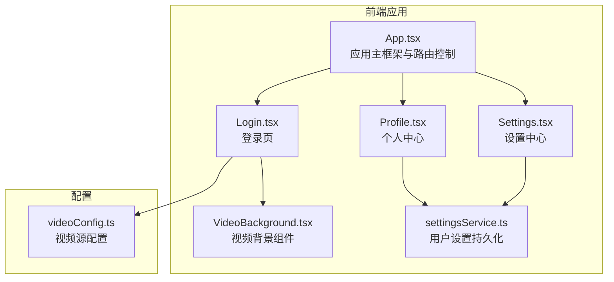
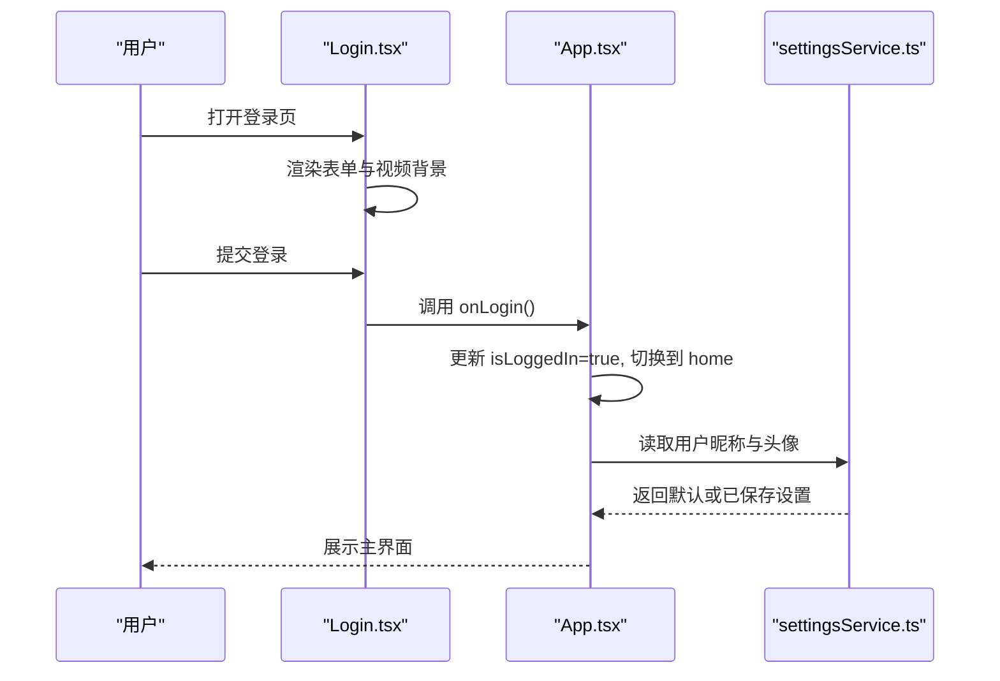
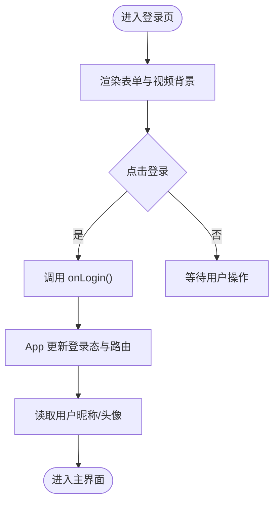
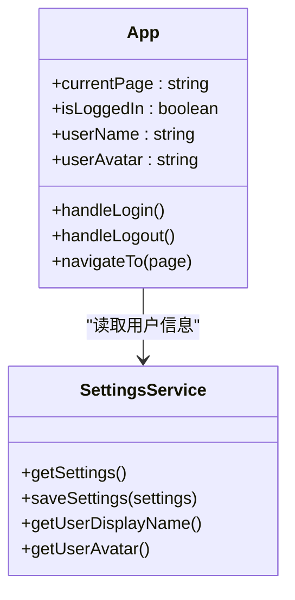
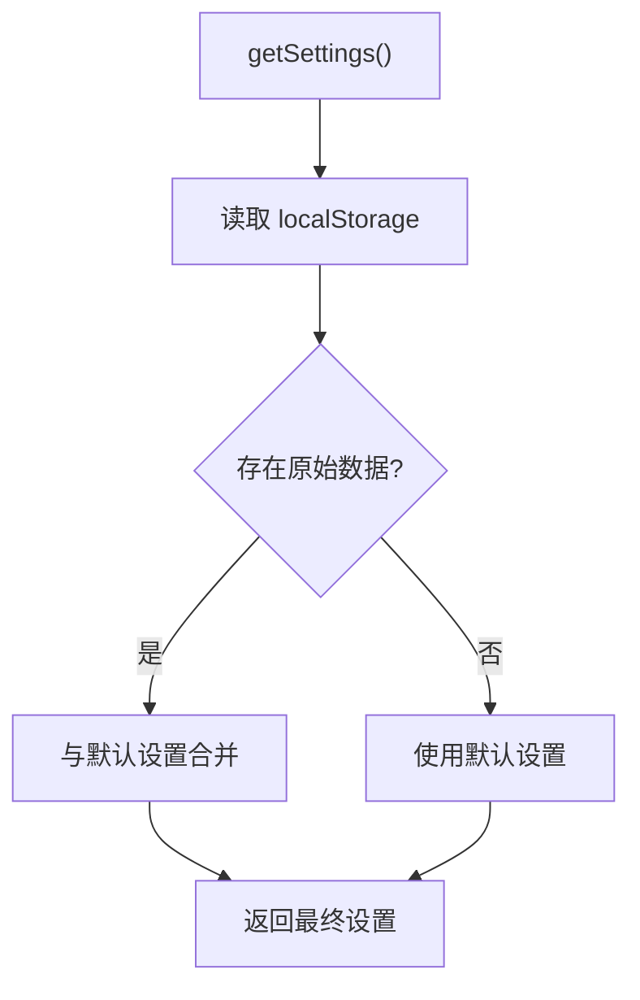
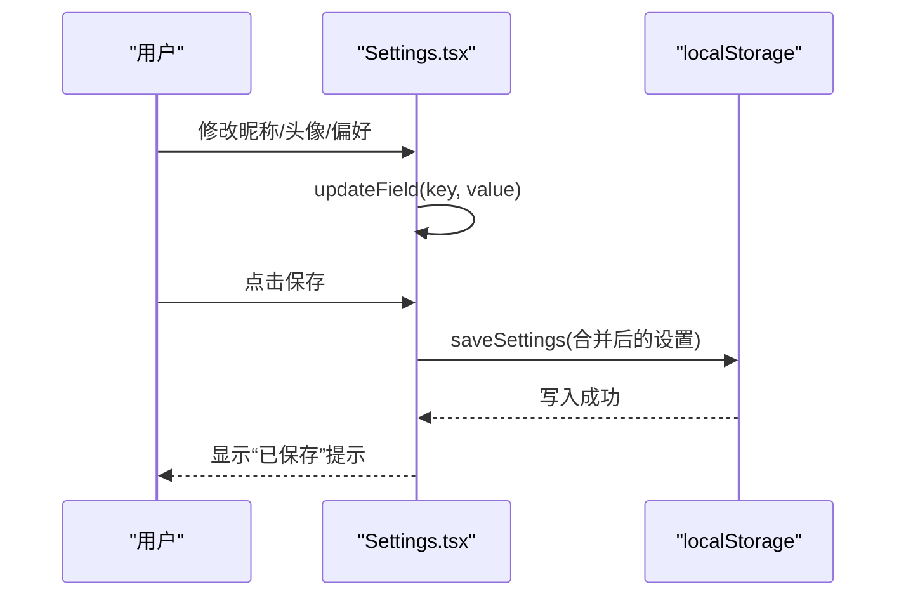
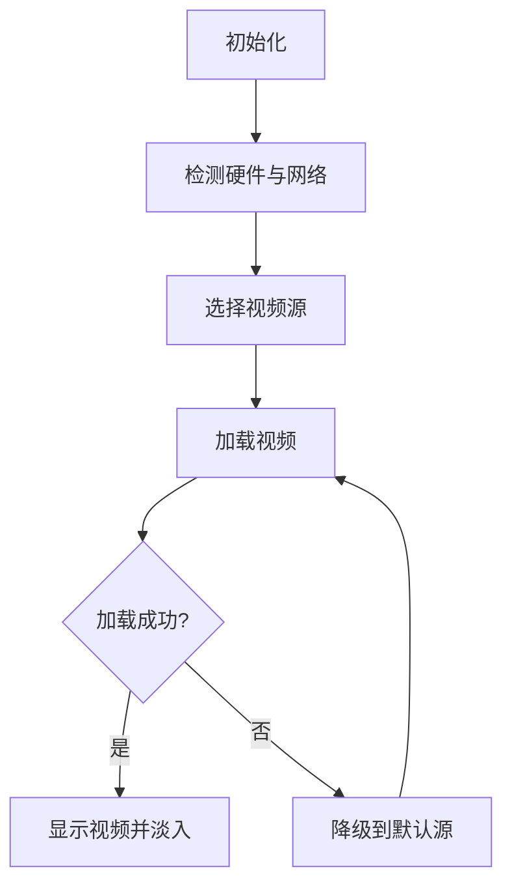
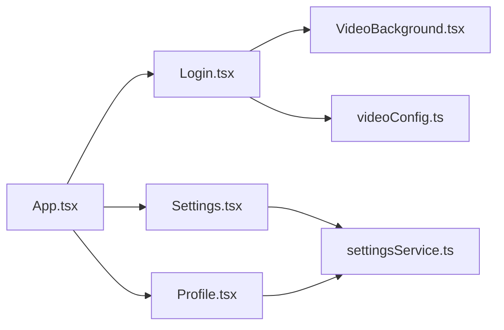

# 用户认证系统

<cite>
**本文引用的文件**
- [src/pages/Login.tsx](file://src/pages/Login.tsx)
- [src/App.tsx](file://src/App.tsx)
- [src/services/settingsService.ts](file://src/services/settingsService.ts)
- [src/pages/Settings.tsx](file://src/pages/Settings.tsx)
- [src/pages/Profile.tsx](file://src/pages/Profile.tsx)
- [src/components/VideoBackground.tsx](file://src/components/VideoBackground.tsx)
- [src/config/videoConfig.ts](file://src/config/videoConfig.ts)
- [package.json](file://package.json)
</cite>

## 目录
1. [简介](#简介)
2. [项目结构](#项目结构)
3. [核心组件](#核心组件)
4. [架构总览](#架构总览)
5. [详细组件分析](#详细组件分析)
6. [依赖关系分析](#依赖关系分析)
7. [性能考虑](#性能考虑)
8. [故障排查指南](#故障排查指南)
9. [结论](#结论)
10. [附录](#附录)

## 简介
本文件面向“智课通 AI Tutor”项目的用户认证系统，提供从登录注册流程、权限管理机制、会话管理策略，到用户信息管理、个人资料编辑与账户设置的完整说明。文档同时覆盖数据验证、错误处理与用户体验优化，并给出安全最佳实践、密码加密策略与会话超时处理建议。对于初学者，我们将用通俗易懂的方式解释用户认证的基本概念与重要性；对于开发者，则提供扩展身份验证方式与集成第三方登录的技术指导。

## 项目结构
该项目采用前端单页应用（SPA）架构，使用 React + Vite 构建，认证相关逻辑集中在登录页与应用主框架中，用户设置与资料编辑通过独立页面完成，视频背景组件负责登录页的沉浸式体验。

**图表来源**
- [src/App.tsx:35-64](file://src/App.tsx#L35-L64)
- [src/pages/Login.tsx:10-26](file://src/pages/Login.tsx#L10-L26)
- [src/components/VideoBackground.tsx:42-84](file://src/components/VideoBackground.tsx#L42-L84)
- [src/config/videoConfig.ts:1-32](file://src/config/videoConfig.ts#L1-L32)
- [src/services/settingsService.ts:13-49](file://src/services/settingsService.ts#L13-L49)

**章节来源**
- [src/App.tsx:35-64](file://src/App.tsx#L35-L64)
- [src/pages/Login.tsx:10-26](file://src/pages/Login.tsx#L10-L26)
- [src/components/VideoBackground.tsx:42-84](file://src/components/VideoBackground.tsx#L42-L84)
- [src/config/videoConfig.ts:1-32](file://src/config/videoConfig.ts#L1-L32)
- [src/services/settingsService.ts:13-49](file://src/services/settingsService.ts#L13-L49)

## 核心组件
- 登录页（Login.tsx）：提供登录表单、第三方登录入口与视频背景渲染。
- 应用主框架（App.tsx）：维护登录状态、页面路由与导航。
- 设置服务（settingsService.ts）：封装用户设置的读取、保存与默认值合并。
- 设置中心（Settings.tsx）：个人资料、学习设置、通用设置与账户安全。
- 个人中心（Profile.tsx）：展示用户信息与学习统计。
- 视频背景组件（VideoBackground.tsx）：根据设备与网络自动选择视频源并渲染背景。
- 视频配置（videoConfig.ts）：集中管理各页面的视频背景源。

**章节来源**
- [src/pages/Login.tsx:7-175](file://src/pages/Login.tsx#L7-L175)
- [src/App.tsx:35-64](file://src/App.tsx#L35-L64)
- [src/services/settingsService.ts:15-49](file://src/services/settingsService.ts#L15-L49)
- [src/pages/Settings.tsx:32-369](file://src/pages/Settings.tsx#L32-L369)
- [src/pages/Profile.tsx:19-297](file://src/pages/Profile.tsx#L19-L297)
- [src/components/VideoBackground.tsx:42-159](file://src/components/VideoBackground.tsx#L42-L159)
- [src/config/videoConfig.ts:1-47](file://src/config/videoConfig.ts#L1-L47)

## 架构总览
认证系统采用“前端会话驱动”的轻量方案：登录成功后在应用内切换到主页，退出登录则回到登录页。用户设置与资料存储于本地存储（localStorage），便于快速访问与离线使用。

**图表来源**
- [src/pages/Login.tsx:78-120](file://src/pages/Login.tsx#L78-L120)
- [src/App.tsx:48-51](file://src/App.tsx#L48-L51)
- [src/services/settingsService.ts:43-49](file://src/services/settingsService.ts#L43-L49)

## 详细组件分析

### 登录页（Login.tsx）
- 功能要点
  - 表单字段：用户名/邮箱、密码、记住登录状态、忘记密码链接。
  - 第三方登录：微信登录、QQ登录入口。
  - 视频背景：通过 VideoBackground 组件按设备与网络自动选择视频源。
  - 交互：提交表单触发 onLogin 回调，切换到主界面。
- 数据流
  - 输入校验：当前为前端占位样式，实际业务需在回调中补充。
  - 状态更新：onLogin 内部由 App.tsx 控制登录态与页面跳转。
- 用户体验
  - 动画展开/收起、遮罩层过渡、按钮悬停缩放等增强交互。
  - 帮助中心入口与“立即注册”引导。

**图表来源**
- [src/pages/Login.tsx:7-175](file://src/pages/Login.tsx#L7-L175)
- [src/App.tsx:48-51](file://src/App.tsx#L48-L51)
- [src/services/settingsService.ts:43-49](file://src/services/settingsService.ts#L43-L49)

**章节来源**
- [src/pages/Login.tsx:7-175](file://src/pages/Login.tsx#L7-L175)

### 应用主框架（App.tsx）
- 功能要点
  - 维护 currentPage、isLoggedIn、用户名与头像状态。
  - 提供登录/退出回调，控制页面切换。
  - 侧边栏与顶部导航，支持进入个人中心、设置中心与退出登录。
- 权限与会话
  - 通过 isLoggedIn 控制是否渲染登录页。
  - 退出登录时重置到登录页，实现会话回收。
- 用户信息展示
  - 顶部导航显示当前用户昵称与头像，来源于设置服务。

**图表来源**
- [src/App.tsx:35-64](file://src/App.tsx#L35-L64)
- [src/services/settingsService.ts:27-49](file://src/services/settingsService.ts#L27-L49)

**章节来源**
- [src/App.tsx:35-64](file://src/App.tsx#L35-L64)

### 设置服务（settingsService.ts）
- 功能要点
  - 用户设置模型：昵称、个性签名、头像、首选导师、复习时间、推送开关、深色模式、字体大小、邮箱等。
  - 默认设置：提供默认值，避免空值。
  - 本地存储：以 localStorage 为持久化介质，读写统一接口。
- 数据验证与容错
  - 解析失败时回退到默认设置，保证健壮性。
- 性能与复杂度
  - 读写均为 O(1)，序列化/反序列化为 O(n)（n 为设置对象大小）。

**图表来源**
- [src/services/settingsService.ts:27-49](file://src/services/settingsService.ts#L27-L49)

**章节来源**
- [src/services/settingsService.ts:1-50](file://src/services/settingsService.ts#L1-L50)

### 设置中心（Settings.tsx）
- 功能要点
  - 个人资料：头像上传（限制大小）、昵称、学习签名。
  - 学习设置：首选导师、每日复习时间、推送开关。
  - 通用设置：深色模式、字体大小、界面语言。
  - 账户安全：绑定邮箱展示、重置密码入口、注销账户。
- 数据验证与错误处理
  - 头像文件大小限制（2MB）。
  - 图片加载失败时回退到默认头像。
  - 保存成功反馈（2秒内显示“已保存”）。
- 用户体验优化
  - 分组布局、滑块与开关控件提升交互效率。
  - 取消/保存按钮明确操作意图。

**图表来源**
- [src/pages/Settings.tsx:42-68](file://src/pages/Settings.tsx#L42-L68)
- [src/services/settingsService.ts:39-41](file://src/services/settingsService.ts#L39-L41)

**章节来源**
- [src/pages/Settings.tsx:32-369](file://src/pages/Settings.tsx#L32-L369)
- [src/services/settingsService.ts:39-41](file://src/services/settingsService.ts#L39-L41)

### 个人中心（Profile.tsx）
- 功能要点
  - 展示用户头像、昵称、学校/邮箱、学习签名。
  - 统计卡片：累计学习时长、已解决问题、平均正确率、连续打卡。
  - 动态与成就：最近动态、我的导师、成就徽章、当前目标。
- 与设置联动
  - 头像与昵称来自设置服务；若未设置则使用默认值。
- 用户体验
  - 卡片式布局、渐变背景与动效增强视觉层次。

**章节来源**
- [src/pages/Profile.tsx:19-297](file://src/pages/Profile.tsx#L19-L297)
- [src/services/settingsService.ts:43-49](file://src/services/settingsService.ts#L43-L49)

### 视频背景组件（VideoBackground.tsx）
- 功能要点
  - 自动选择视频源：根据硬件并发数与网络连接类型（如 4G）选择 8K/4K/2K 或默认源。
  - 加载与错误处理：加载成功/失败回调，失败时自动降级到默认源。
  - 渐变过渡与遮罩层：提升前景内容可读性。
- 性能与兼容性
  - playsInline 与静音（muted）确保移动端自动播放。
  - 支持占位图与加载提示，改善首屏体验。

**图表来源**
- [src/components/VideoBackground.tsx:56-84](file://src/components/VideoBackground.tsx#L56-L84)
- [src/components/VideoBackground.tsx:87-103](file://src/components/VideoBackground.tsx#L87-L103)

**章节来源**
- [src/components/VideoBackground.tsx:42-159](file://src/components/VideoBackground.tsx#L42-L159)
- [src/config/videoConfig.ts:1-47](file://src/config/videoConfig.ts#L1-L47)

## 依赖关系分析
- 组件依赖
  - App.tsx 依赖 Login、Settings、Profile 等页面组件。
  - Login.tsx 依赖 VideoBackground 与 videoConfig。
  - Settings.tsx 依赖 settingsService。
  - Profile.tsx 依赖 settingsService。
- 外部依赖
  - React、Lucide Icons、Motion（动画）、TailwindCSS（样式）。
  - 无后端依赖，认证与设置均在前端完成。

**图表来源**
- [src/App.tsx:22-30](file://src/App.tsx#L22-L30)
- [src/pages/Login.tsx:1-6](file://src/pages/Login.tsx#L1-L6)
- [src/services/settingsService.ts:1-11](file://src/services/settingsService.ts#L1-L11)
- [src/config/videoConfig.ts:1-32](file://src/config/videoConfig.ts#L1-L32)

**章节来源**
- [package.json:13-28](file://package.json#L13-L28)
- [src/App.tsx:22-30](file://src/App.tsx#L22-L30)

## 性能考虑
- 视频背景
  - 自适应选择视频源，避免高分辨率视频在低端设备上造成卡顿。
  - 静音与 inline 播放减少资源占用与兼容性问题。
- 设置读写
  - settingsService 对设置进行合并与默认值处理，避免频繁 IO。
  - 仅在保存时写入 localStorage，减少磁盘压力。
- 交互优化
  - 动画与过渡使用 CSS/JS 合理控制帧率，避免阻塞主线程。

[本节为通用性能建议，无需特定文件引用]

## 故障排查指南
- 登录页无法显示或视频不加载
  - 检查 videoConfig 中的视频路径是否正确。
  - 确认浏览器允许自动播放（静音策略）。
  - 若加载失败，组件会自动降级到默认源，请确认默认源可用。
- 设置保存无效或头像不更新
  - 确认文件大小不超过 2MB。
  - 检查 localStorage 是否被禁用或超出配额。
  - 保存成功后会短暂提示“已保存”，若未出现请刷新页面重试。
- 退出登录后仍显示主界面
  - 确认 handleLogout 正确设置 isLoggedIn=false 并切换到 login 页面。
- 用户名/头像显示异常
  - settingsService 会在解析失败时回退到默认值，检查本地存储数据格式。

**章节来源**
- [src/components/VideoBackground.tsx:87-103](file://src/components/VideoBackground.tsx#L87-L103)
- [src/pages/Settings.tsx:50-62](file://src/pages/Settings.tsx#L50-L62)
- [src/services/settingsService.ts:28-36](file://src/services/settingsService.ts#L28-L36)
- [src/App.tsx:53-56](file://src/App.tsx#L53-L56)

## 结论
当前认证系统以“前端会话驱动”为核心，登录成功后在应用内切换页面，退出登录则回到登录页。用户设置与资料通过本地存储持久化，兼顾易用性与性能。建议后续在生产环境中引入后端认证服务、令牌管理与密码加密策略，以满足更严格的安全要求。

[本节为总结性内容，无需特定文件引用]

## 附录

### 安全最佳实践
- 密码加密策略
  - 前端仅做基础格式校验；密码应在后端进行哈希处理（如 bcrypt）并安全存储。
- 令牌管理
  - 使用 HttpOnly Cookie 存储短期会话令牌，避免 XSS 泄露。
  - 令牌过期时间短、支持刷新令牌；前端定期轮询刷新。
- 会话超时处理
  - 前端定时器检测最后活跃时间，超时自动登出并清理本地存储。
- 输入验证与错误处理
  - 表单提交前进行格式校验（邮箱、密码强度、头像大小）。
  - 错误信息统一提示，避免泄露敏感细节。
- 用户体验优化
  - 提供“记住登录状态”选项，但应结合安全策略（如二次验证）。
  - 退出登录时清除敏感数据与缓存。

[本节为通用安全建议，无需特定文件引用]

### 扩展身份验证方式与第三方登录
- 微信/QQ登录
  - 在登录页保留“微信登录”“QQ登录”按钮，接入对应开放平台 SDK。
  - 建议使用授权码流程，后端换取用户信息并发放应用内令牌。
- 多因子认证（MFA）
  - 在账户安全区域增加“启用两步验证”入口，支持短信/邮箱验证码。
- 单点登录（SSO）
  - 与企业身份提供商集成，实现统一认证入口与会话同步。

[本节为通用技术指导，无需特定文件引用]