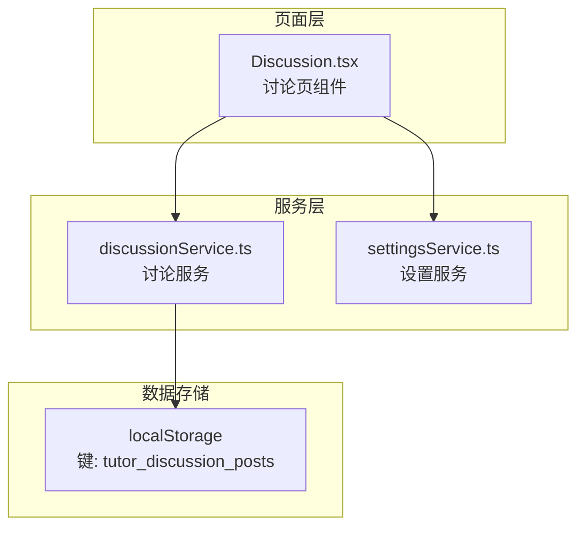
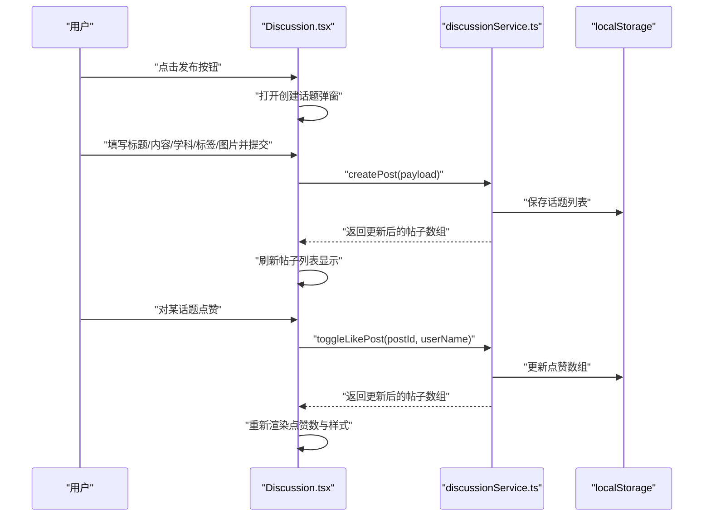
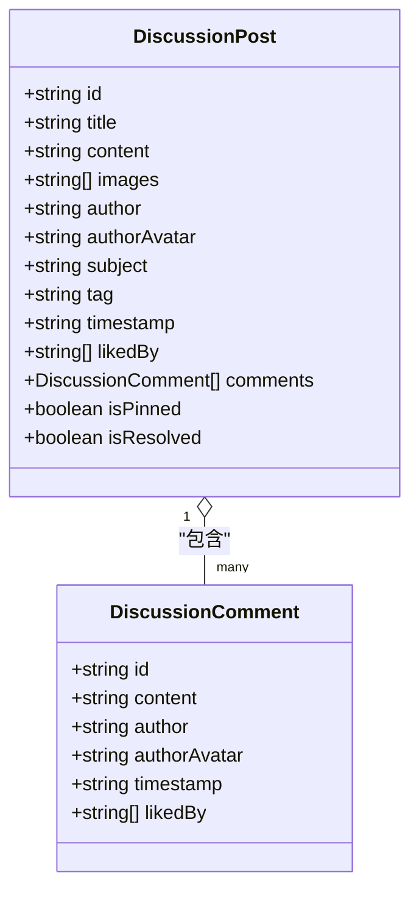
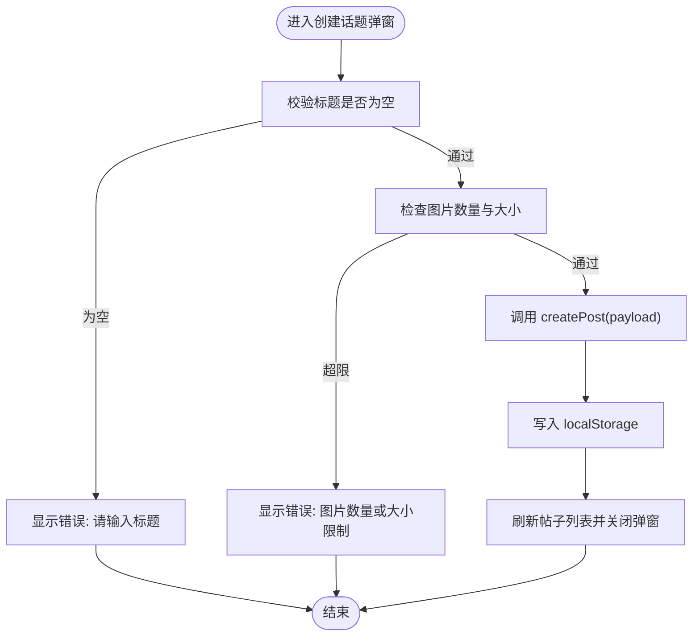
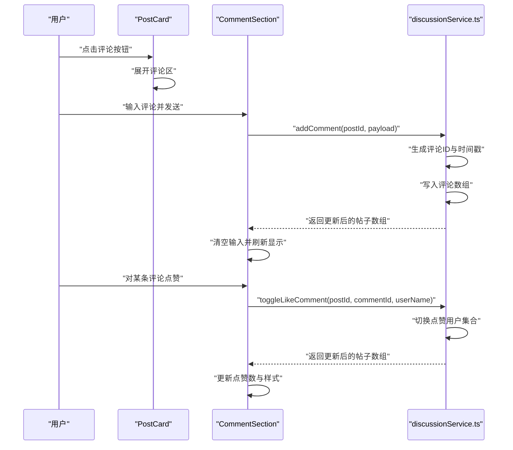
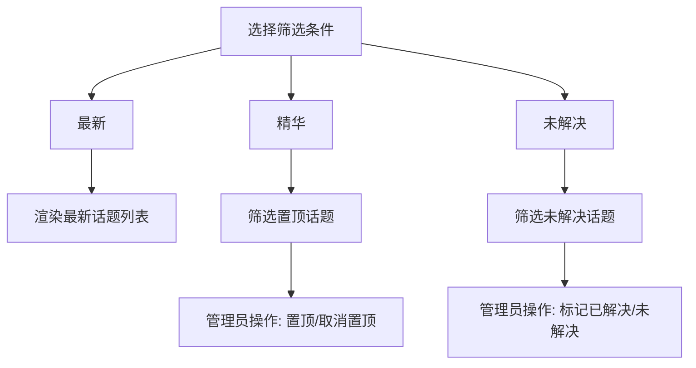
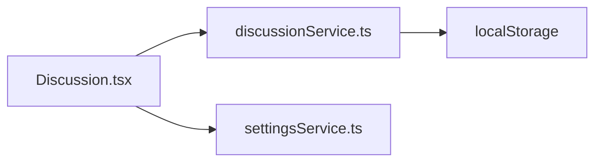

# 讨论社区系统

<cite>
**本文档引用的文件**
- [Discussion.tsx](file://src/pages/Discussion.tsx)
- [discussionService.ts](file://src/services/discussionService.ts)
- [settingsService.ts](file://src/services/settingsService.ts)
- [README.md](file://README.md)
- [package.json](file://package.json)
</cite>

## 目录
1. [简介](#简介)
2. [项目结构](#项目结构)
3. [核心组件](#核心组件)
4. [架构总览](#架构总览)
5. [详细组件分析](#详细组件分析)
6. [依赖关系分析](#依赖关系分析)
7. [性能考虑](#性能考虑)
8. [故障排除指南](#故障排除指南)
9. [结论](#结论)
10. [附录](#附录)

## 简介
本文件为智课通 AI Tutor 项目的讨论社区系统提供综合性技术文档。系统围绕“话题发布—评论互动—点赞—内容分类—管理员操作”的完整闭环展开，采用前端本地存储（localStorage）实现数据持久化，支持话题置顶、问题解决标记、图片附件等特性。本文从设计理念、交互模式、数据模型、服务层处理逻辑、API 接口设计、实时更新机制、内容审核与垃圾信息过滤策略、用户体验优化、性能监控与扩展开发等方面进行深入说明，并提供面向初学者的概念介绍与面向开发者的定制与优化方案。

## 项目结构
讨论社区系统主要由页面组件与服务层组成：
- 页面组件：负责用户交互、状态管理、UI 渲染与事件分发
- 服务层：封装数据模型、本地存储访问、业务逻辑处理
- 设置服务：提供用户显示名与头像等基础信息

图表来源
- [Discussion.tsx:1-800](file://src/pages/Discussion.tsx#L1-L800)
- [discussionService.ts:1-155](file://src/services/discussionService.ts#L1-L155)
- [settingsService.ts:26-47](file://src/services/settingsService.ts#L26-L47)

章节来源
- [Discussion.tsx:1-800](file://src/pages/Discussion.tsx#L1-L800)
- [discussionService.ts:1-155](file://src/services/discussionService.ts#L1-L155)
- [settingsService.ts:26-47](file://src/services/settingsService.ts#L26-L47)

## 核心组件
- 讨论页主组件：负责加载话题列表、筛选、图片放大、创建话题弹窗、侧边活跃贡献者统计等
- 话题卡片组件：展示标题、内容、标签、学科、作者、时间戳、点赞数、评论数、置顶/解决标记、图片缩略图、管理员操作按钮等
- 评论区组件：支持展开/收起、输入评论、按回车发送、点赞评论、显示评论作者与时间
- 创建话题弹窗：支持选择学科与标签、输入标题与正文、多图上传（限制数量与大小）、错误提示
- 设置服务：提供当前用户显示名与头像，用于话题与评论的作者信息展示

章节来源
- [Discussion.tsx:42-308](file://src/pages/Discussion.tsx#L42-L308)
- [Discussion.tsx:310-473](file://src/pages/Discussion.tsx#L310-L473)
- [Discussion.tsx:475-579](file://src/pages/Discussion.tsx#L475-L579)
- [Discussion.tsx:581-767](file://src/pages/Discussion.tsx#L581-L767)
- [settingsService.ts:26-47](file://src/services/settingsService.ts#L26-L47)

## 架构总览
系统采用“页面组件 + 服务层 + 本地存储”的轻量级架构。页面组件通过服务层暴露的函数完成话题与评论的增删改查、点赞切换、置顶与解决标记等操作；服务层统一管理数据模型与本地存储；设置服务提供用户上下文信息。

图表来源
- [Discussion.tsx:53-71](file://src/pages/Discussion.tsx#L53-L71)
- [Discussion.tsx:73-76](file://src/pages/Discussion.tsx#L73-L76)
- [discussionService.ts:58-74](file://src/services/discussionService.ts#L58-L74)
- [discussionService.ts:76-89](file://src/services/discussionService.ts#L76-L89)

## 详细组件分析

### 数据模型与复杂度
- 话题（DiscussionPost）包含：标识符、标题、内容、图片数组、作者与头像、学科、标签、时间戳、点赞用户集合、评论数组、置顶与解决标记
- 评论（DiscussionComment）包含：标识符、内容、作者与头像、时间戳、点赞用户集合
- 复杂度分析：
  - 获取全部话题：O(n)，n 为话题数量
  - 增加/删除评论：O(1)
  - 切换点赞（话题/评论）：O(k)，k 为点赞用户数或评论点赞用户数
  - 删除话题：O(n)
  - 置顶/解决标记：O(1)

图表来源
- [discussionService.ts:1-24](file://src/services/discussionService.ts#L1-L24)

章节来源
- [discussionService.ts:1-24](file://src/services/discussionService.ts#L1-L24)

### 话题创建流程
- 用户在创建弹窗中填写标题、内容、选择学科与标签、可选添加图片（最多 4 张，单张不超过 2MB）
- 提交时进行必填校验与图片容量校验，失败则显示错误提示
- 调用服务层 createPost，生成唯一 ID 与本地时间戳，插入到列表头部并保存至 localStorage
- 页面接收返回值后刷新帖子列表并关闭弹窗

图表来源
- [Discussion.tsx:594-646](file://src/pages/Discussion.tsx#L594-L646)
- [discussionService.ts:58-74](file://src/services/discussionService.ts#L58-L74)

章节来源
- [Discussion.tsx:581-767](file://src/pages/Discussion.tsx#L581-L767)
- [discussionService.ts:58-74](file://src/services/discussionService.ts#L58-L74)

### 评论系统与点赞交互
- 展开评论区后，用户可在输入框中输入评论内容，支持回车发送
- 评论列表展示作者头像、名称、时间戳与内容，支持对单条评论点赞
- 点赞状态与数量实时更新，避免重复点赞导致的异常

图表来源
- [Discussion.tsx:483-579](file://src/pages/Discussion.tsx#L483-L579)
- [discussionService.ts:91-108](file://src/services/discussionService.ts#L91-L108)
- [discussionService.ts:110-130](file://src/services/discussionService.ts#L110-L130)

章节来源
- [Discussion.tsx:475-579](file://src/pages/Discussion.tsx#L475-L579)
- [discussionService.ts:91-130](file://src/services/discussionService.ts#L91-L130)

### 管理员操作与内容分类
- 管理员按钮支持对话题进行置顶/取消置顶与标记已解决/未解决
- 支持按“最新/精华/未解决”三种方式筛选话题
- 侧边栏展示活跃贡献者排行榜（基于点赞数与评论数计算）

图表来源
- [Discussion.tsx:119-127](file://src/pages/Discussion.tsx#L119-L127)
- [Discussion.tsx:366-391](file://src/pages/Discussion.tsx#L366-L391)
- [Discussion.tsx:198-230](file://src/pages/Discussion.tsx#L198-L230)

章节来源
- [Discussion.tsx:119-127](file://src/pages/Discussion.tsx#L119-L127)
- [Discussion.tsx:366-391](file://src/pages/Discussion.tsx#L366-L391)
- [Discussion.tsx:198-230](file://src/pages/Discussion.tsx#L198-L230)

### 实时更新机制
- 当前实现基于 React 本地状态与 localStorage 同步，页面组件在每次服务层返回更新后的帖子数组后立即重渲染
- 由于使用本地存储，不同浏览器或设备间不共享数据；如需跨端实时，建议引入 WebSocket 或服务端推送

章节来源
- [Discussion.tsx:49-51](file://src/pages/Discussion.tsx#L49-L51)
- [discussionService.ts:45-56](file://src/services/discussionService.ts#L45-L56)

### 内容管理与规则
- 内容分类：学科（高数、线性代数、Python、深度学习）、标签（新问题、急需、分享、求助）
- 图片上传：最多 4 张，单张不超过 2MB，支持预览与移除
- 管理员权限：置顶/取消置顶、标记已解决/未解决、删除话题
- 用户权限：仅话题作者可删除自己的话题

章节来源
- [Discussion.tsx:37-38](file://src/pages/Discussion.tsx#L37-L38)
- [Discussion.tsx:594-646](file://src/pages/Discussion.tsx#L594-L646)
- [Discussion.tsx:341-400](file://src/pages/Discussion.tsx#L341-L400)
- [Discussion.tsx:130-131](file://src/pages/Discussion.tsx#L130-L131)

### 社区规则、内容审核与垃圾信息过滤策略
- 输入校验：标题必填、图片数量与大小限制、评论非空校验
- 防刷策略：前端层面限制图片数量与大小；可结合后端增加频率限制与敏感词过滤
- 审核建议：对高频匿名用户或异常行为（短时间内大量发布/点赞）进行标记与人工复核
- 过滤策略：关键词黑名单、重复内容检测、图片鉴黄/涉政识别（建议接入第三方审核服务）

章节来源
- [Discussion.tsx:641-646](file://src/pages/Discussion.tsx#L641-L646)
- [Discussion.tsx:606-634](file://src/pages/Discussion.tsx#L606-L634)
- [Discussion.tsx:486-498](file://src/pages/Discussion.tsx#L486-L498)

### API 接口设计（服务层函数）
以下为服务层提供的接口定义与职责说明：
- getPosts(): 获取全部话题列表
- createPost(payload): 创建新话题并保存
- toggleLikePost(postId, userName): 切换话题点赞
- addComment(postId, payload): 为指定话题添加评论
- toggleLikeComment(postId, commentId, userName): 切换评论点赞
- deletePost(postId): 删除话题
- togglePinPost(postId): 切换置顶状态
- toggleResolvePost(postId): 切换解决状态

章节来源
- [discussionService.ts:45-154](file://src/services/discussionService.ts#L45-L154)

### 代码示例路径（如何实现常见功能）
- 发布话题
  - 触发入口：[Discussion.tsx:53-71](file://src/pages/Discussion.tsx#L53-L71)
  - 服务实现：[discussionService.ts:58-74](file://src/services/discussionService.ts#L58-L74)
- 管理评论
  - 评论输入与发送：[Discussion.tsx:486-498](file://src/pages/Discussion.tsx#L486-L498)
  - 添加评论与点赞：[discussionService.ts:91-130](file://src/services/discussionService.ts#L91-L130)
- 处理用户互动
  - 切换点赞（话题/评论）：[discussionService.ts:76-130](file://src/services/discussionService.ts#L76-L130)
- 管理员操作
  - 删除/置顶/解决：[discussionService.ts:132-154](file://src/services/discussionService.ts#L132-L154)

## 依赖关系分析
- 讨论页依赖设置服务以获取当前用户显示名与头像
- 讨论页直接依赖讨论服务以进行数据操作
- 讨论服务依赖 localStorage 进行持久化
- 项目依赖包括 React、TailwindCSS、Lucide React 等

图表来源
- [Discussion.tsx:16-28](file://src/pages/Discussion.tsx#L16-L28)
- [discussionService.ts:26-56](file://src/services/discussionService.ts#L26-L56)
- [settingsService.ts:26-47](file://src/services/settingsService.ts#L26-L47)

章节来源
- [package.json:13-29](file://package.json#L13-L29)
- [Discussion.tsx:16-28](file://src/pages/Discussion.tsx#L16-L28)
- [discussionService.ts:26-56](file://src/services/discussionService.ts#L26-L56)
- [settingsService.ts:26-47](file://src/services/settingsService.ts#L26-L47)

## 性能考虑
- 本地存储读写：当前实现为同步读写，适合小规模数据；若帖子/评论数量增长，建议：
  - 引入分页或虚拟滚动减少一次性渲染
  - 对频繁操作进行防抖（如点赞）
  - 将热门数据缓存于内存，减少重复序列化
- 图片处理：前端预览与限制大小，避免大图导致内存压力
- 渲染优化：React.memo 包装子组件、key 设计合理、避免不必要的重渲染
- 存储迁移：未来可考虑 IndexedDB 或服务端存储，提升并发与一致性

## 故障排除指南
- 无法加载话题
  - 检查 localStorage 中键是否存在与格式是否正确
  - 参考：[discussionService.ts:45-52](file://src/services/discussionService.ts#L45-L52)
- 点赞无效或重复
  - 确认用户名唯一且与 likedBy 数组匹配
  - 参考：[discussionService.ts:76-89](file://src/services/discussionService.ts#L76-L89)、[discussionService.ts:110-130](file://src/services/discussionService.ts#L110-L130)
- 评论无法发送
  - 检查输入是否为空、是否触发了回车事件
  - 参考：[Discussion.tsx:486-498](file://src/pages/Discussion.tsx#L486-L498)
- 图片上传失败
  - 检查数量与大小限制、FileReader 是否成功读取
  - 参考：[Discussion.tsx:606-634](file://src/pages/Discussion.tsx#L606-L634)

章节来源
- [discussionService.ts:45-52](file://src/services/discussionService.ts#L45-L52)
- [discussionService.ts:76-89](file://src/services/discussionService.ts#L76-L89)
- [discussionService.ts:110-130](file://src/services/discussionService.ts#L110-L130)
- [Discussion.tsx:486-498](file://src/pages/Discussion.tsx#L486-L498)
- [Discussion.tsx:606-634](file://src/pages/Discussion.tsx#L606-L634)

## 结论
讨论社区系统以简洁的前端架构实现了话题发布、评论互动、点赞与内容分类等核心功能，并通过本地存储保障数据持久化。建议在后续版本中引入服务端存储、实时推送、内容审核与垃圾过滤机制，以支撑更大规模的用户群体与更复杂的社区治理需求。

## 附录
- 快速开始
  - 安装依赖与运行：参考 [README.md:16-20](file://README.md#L16-L20)
  - 本地开发端口与主机配置：参考 [package.json](file://package.json#L7)
- 开发环境
  - 使用 Vite 启动，支持热更新与类型检查
  - 依赖项包括 React、TailwindCSS、Lucide React 等

章节来源
- [README.md:16-20](file://README.md#L16-L20)
- [package.json](file://package.json#L7)