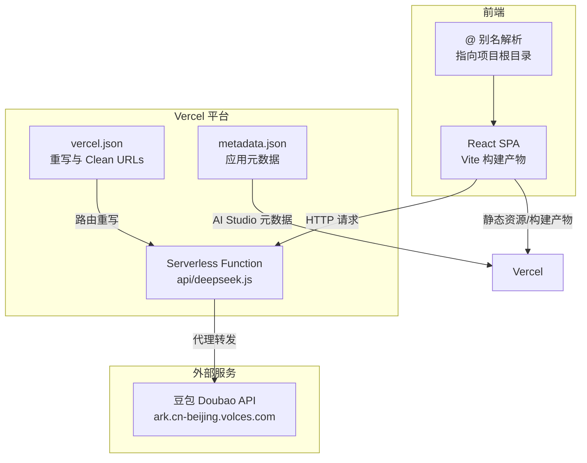
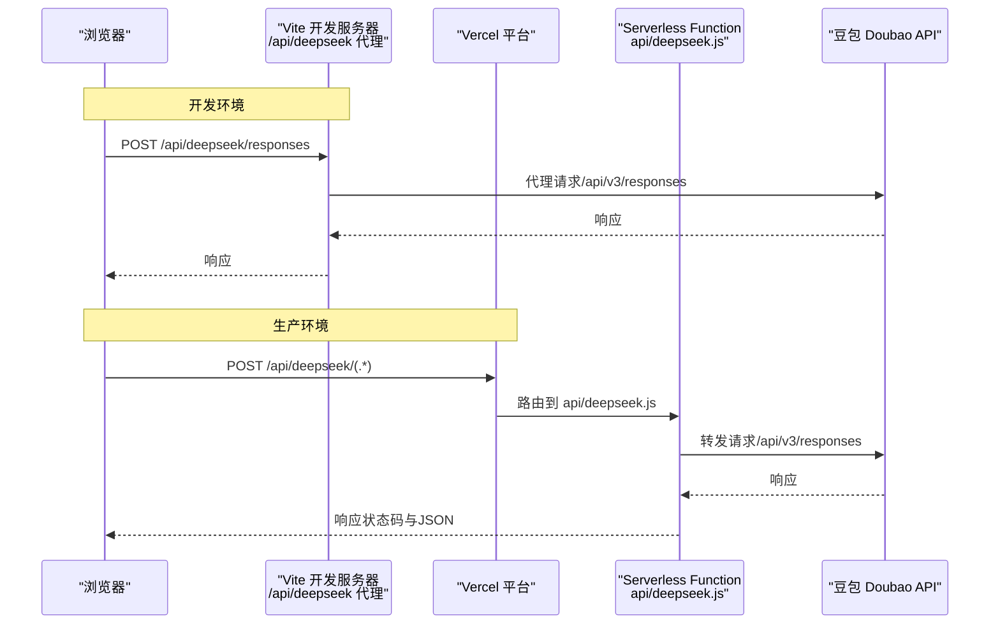
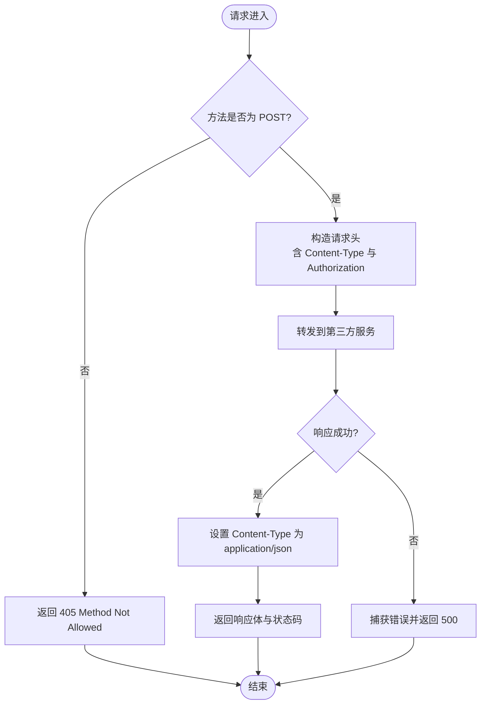
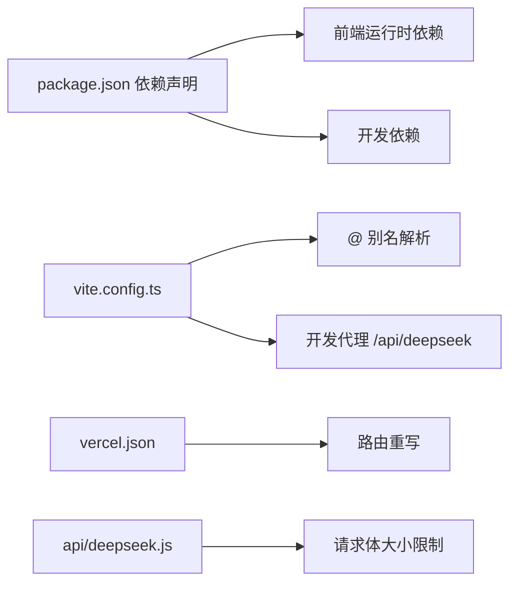

# 部署与运维

<cite>
**本文引用的文件**
- [vercel.json](file://vercel.json)
- [package.json](file://package.json)
- [vite.config.ts](file://vite.config.ts)
- [README.md](file://README.md)
- [AGENTS.md](file://AGENTS.md)
- [api/deepseek.js](file://api/deepseek.js)
- [metadata.json](file://metadata.json)
- [src/services/deepseek.ts](file://src/services/deepseek.ts)
</cite>

## 目录
1. [简介](#简介)
2. [项目结构](#项目结构)
3. [核心组件](#核心组件)
4. [架构总览](#架构总览)
5. [详细组件分析](#详细组件分析)
6. [依赖分析](#依赖分析)
7. [性能考虑](#性能考虑)
8. [故障排除指南](#故障排除指南)
9. [结论](#结论)
10. [附录](#附录)

## 简介
本文件面向运维与开发团队，提供“智课通 AI Tutor”项目的部署与运维指南。内容覆盖构建配置、部署流程、环境变量管理、CI/CD 流程建议、生产环境优化、性能监控与日志管理策略、故障排除、安全配置、备份与灾难恢复，以及系统监控、性能调优与容量规划建议。项目采用 Vercel + AI Studio 平台部署，前端基于 React 19 + Vite 6 + Tailwind CSS v4，后端通过 Vercel Serverless Function 代理第三方 AI 服务。

## 项目结构
项目采用前端单页应用（SPA）+ Vercel Serverless Function 的混合架构：
- 前端：React 19 + Vite 6 构建，Tailwind CSS v4 样式，本地开发与生产构建脚本由 npm scripts 管理。
- 后端：Vercel Serverless Function（Node.js 运行时）位于 api/deepseek.js，负责代理第三方 AI 服务请求，并限制请求体大小以支持图片上传。
- 部署：通过 vercel.json 配置 cleanUrls 与 API 重写规则；metadata.json 描述应用元信息；README 与 AGENTS.md 提供运行与部署指引。

图表来源
- [vite.config.ts:1-32](file://vite.config.ts#L1-L32)
- [vercel.json:1-7](file://vercel.json#L1-L7)
- [api/deepseek.js:1-34](file://api/deepseek.js#L1-L34)
- [metadata.json:1-6](file://metadata.json#L1-L6)

章节来源
- [README.md:1-21](file://README.md#L1-L21)
- [AGENTS.md:91-98](file://AGENTS.md#L91-L98)

## 核心组件
- 构建与开发工具链
  - Vite 6 作为构建与开发服务器，提供热更新与代理能力。
  - npm scripts 定义 dev/build/preview/lint/clean 等任务。
- 环境变量与密钥
  - GEMINI_API_KEY 通过 Vite 在构建期注入至前端代码。
  - Doubao API Key 在开发与生产环境分别处理：开发环境由前端直连，生产环境由 Vercel Function 代理并携带密钥。
- 代理与路由
  - 开发环境：Vite 代理 /api/deepseek 到第三方服务，路径重写为 /api/v3。
  - 生产环境：vercel.json 将 /api/deepseek/(.*) 重写到 api/deepseek.js；函数内部转发到第三方服务。
- Serverless Function
  - 限制请求体大小以支持大图片上传；返回原始响应体与状态码。
- 应用元数据
  - metadata.json 描述应用名称、描述等，供 AI Studio 使用。

章节来源
- [package.json:6-12](file://package.json#L6-L12)
- [vite.config.ts:6-31](file://vite.config.ts#L6-L31)
- [vercel.json:1-7](file://vercel.json#L1-L7)
- [api/deepseek.js:1-34](file://api/deepseek.js#L1-L34)
- [AGENTS.md:14-16](file://AGENTS.md#L14-L16)
- [AGENTS.md:43-49](file://AGENTS.md#L43-L49)

## 架构总览
下图展示了从浏览器到第三方 AI 服务的完整请求链路，涵盖开发与生产两种环境：

图表来源
- [vite.config.ts:22-28](file://vite.config.ts#L22-L28)
- [vercel.json:2-4](file://vercel.json#L2-L4)
- [api/deepseek.js:9-33](file://api/deepseek.js#L9-L33)

## 详细组件分析

### Vercel 部署配置
- 路由重写
  - 将 /api/deepseek/(.*) 重写到 /api/deepseek，使前端请求无需关心底层实现细节。
- Clean URLs
  - 启用后去除 .html 后缀，提升用户体验。
- Serverless Function
  - 限制请求体大小为 10MB，满足图片上传场景。
  - 返回原始响应体与状态码，便于前端统一处理。

章节来源
- [vercel.json:1-7](file://vercel.json#L1-L7)
- [api/deepseek.js:1-7](file://api/deepseek.js#L1-L7)

### 环境变量与密钥管理
- GEMINI_API_KEY
  - 通过 Vite 在构建期注入，前端以 process.env.GEMINI_API_KEY 访问。
  - 建议在 Vercel 项目设置中配置环境变量，避免提交到仓库。
- Doubao API Key
  - 开发环境：前端直连第三方服务，携带密钥。
  - 生产环境：Vercel Function 内部携带密钥并转发，前端无需暴露密钥。
- APP_URL
  - 由 AI Studio 运行时自动注入，无需手动配置。

章节来源
- [AGENTS.md:14-16](file://AGENTS.md#L14-L16)
- [vite.config.ts:10-12](file://vite.config.ts#L10-L12)
- [src/services/deepseek.ts:1-4](file://src/services/deepseek.ts#L1-L4)

### API 代理与转发流程
- 开发环境
  - Vite 代理将 /api/deepseek 重写为 /api/v3，并转发到第三方服务。
- 生产环境
  - vercel.json 重写路由到 api/deepseek.js；
  - 函数接收请求体，附加认证头后转发至第三方服务；
  - 返回原始响应体与状态码。

图表来源
- [api/deepseek.js:9-33](file://api/deepseek.js#L9-L33)

章节来源
- [vite.config.ts:22-28](file://vite.config.ts#L22-L28)
- [vercel.json:2-4](file://vercel.json#L2-L4)
- [src/services/deepseek.ts:69-82](file://src/services/deepseek.ts#L69-L82)

### 构建与预览流程
- 本地开发
  - 安装依赖后，设置 GEMINI_API_KEY，启动开发服务器。
- 生产构建
  - 使用 Vite 进行生产构建，输出静态资源。
- 预览
  - 在本地预览生产构建效果，验证路由与资源加载。

章节来源
- [README.md:16-20](file://README.md#L16-L20)
- [package.json:6-11](file://package.json#L6-L11)

### 应用元数据与平台集成
- metadata.json
  - 包含应用名称与描述，供 AI Studio 展示。
- 平台
  - 部署于 Vercel + AI Studio，无需额外 CI/CD 管道即可上线。

章节来源
- [metadata.json:1-6](file://metadata.json#L1-L6)
- [AGENTS.md:93-94](file://AGENTS.md#L93-L94)

## 依赖分析
- 前端依赖
  - React 19、Vite 6、Tailwind CSS v4、@vitejs/plugin-react、@tailwindcss/vite 等。
- 开发依赖
  - TypeScript、TailwindCSS、autoprefixer、tailwindcss、vite 等。
- 运行时依赖
  - express、tsx 仅用于 Vercel Serverless 运行时，前端不直接使用。
- 关键耦合点
  - 前端通过 @ 别名访问项目根目录，减少相对路径复杂度。
  - 代理与重写规则确保前后端交互一致。

图表来源
- [package.json:13-40](file://package.json#L13-L40)
- [vite.config.ts:13-28](file://vite.config.ts#L13-L28)
- [vercel.json:2-4](file://vercel.json#L2-L4)
- [api/deepseek.js:3-6](file://api/deepseek.js#L3-L6)

章节来源
- [package.json:13-40](file://package.json#L13-L40)
- [vite.config.ts:13-17](file://vite.config.ts#L13-L17)

## 性能考虑
- 构建与缓存
  - 使用 Vite 的快速冷启动与按需编译，减少开发等待时间。
  - 生产构建开启压缩与 Tree Shaking，降低包体积。
- 资源加载
  - Tailwind CSS v4 通过 @theme 块集中配置，避免重复样式导致的体积膨胀。
  - 视频背景组件根据硬件与网络动态选择分辨率，平衡画质与性能。
- API 代理
  - 生产环境通过 Serverless Function 统一转发，减少跨域与密钥泄露风险。
  - 请求体大小限制为 10MB，兼顾大图片上传与安全阈值。
- 缓存策略
  - 建议在 Vercel 上启用静态资源缓存与边缘缓存，缩短首屏加载时间。
- 监控与日志
  - 建议在 Vercel 平台启用访问日志与错误日志，结合第三方监控服务（如 Sentry、DataDog）进行性能与错误追踪。

## 故障排除指南
- 前端无法连接 AI 服务
  - 检查开发代理配置与重写规则是否正确。
  - 确认 GEMINI_API_KEY 是否在 Vercel 环境变量中正确配置。
- 生产环境返回 405 或 500
  - 确认请求方法为 POST，且 Serverless Function 正常运行。
  - 查看函数日志，定位第三方服务响应异常或网络超时。
- 图片上传失败
  - 确认请求体大小未超过 10MB 限制。
  - 检查前端 Base64 编码与后端解析逻辑。
- 路由 404 或 Clean URLs 异常
  - 检查 vercel.json 的重写规则与 Clean URLs 设置。
- 本地开发 HMR 闪烁
  - 如需禁用 HMR，设置 DISABLE_HMR=true，避免文件监听导致的闪烁。

章节来源
- [vite.config.ts:18-21](file://vite.config.ts#L18-L21)
- [vercel.json:5](file://vercel.json#L5)
- [api/deepseek.js:9-33](file://api/deepseek.js#L9-L33)

## 结论
本项目采用轻量级部署方案，在 Vercel + AI Studio 平台上实现了前端 SPA 与后端 Serverless Function 的无缝协作。通过明确的环境变量管理、路由重写与代理转发，既保证了开发体验，也确保了生产环境的安全与稳定。建议在上线后持续关注性能指标与日志，结合容量规划与备份策略，保障系统的高可用与可维护性。

## 附录
- 部署清单
  - 配置 GEMINI_API_KEY 与 Doubao API Key（生产环境由函数内管理）。
  - 在 Vercel 项目中启用 Clean URLs 与 vercel.json 中的重写规则。
  - 验证开发代理与生产代理的一致性。
- 维护最佳实践
  - 定期审查第三方服务可用性与配额。
  - 对关键接口进行限流与熔断，防止雪崩效应。
  - 建立灰度发布与回滚机制，降低变更风险。
- 安全配置
  - 前端不暴露敏感密钥；生产环境密钥由函数管理。
  - 严格控制 API 路由权限，避免未授权访问。
- 备份与灾难恢复
  - 对关键数据（localStorage 级别）建立用户导出机制。
  - 对服务端日志与监控数据进行定期归档与异地备份。
- 监控与容量规划
  - 关注 Vercel 平台的吞吐、延迟与错误率指标。
  - 根据用户增长与峰值流量进行弹性扩容与缓存优化。