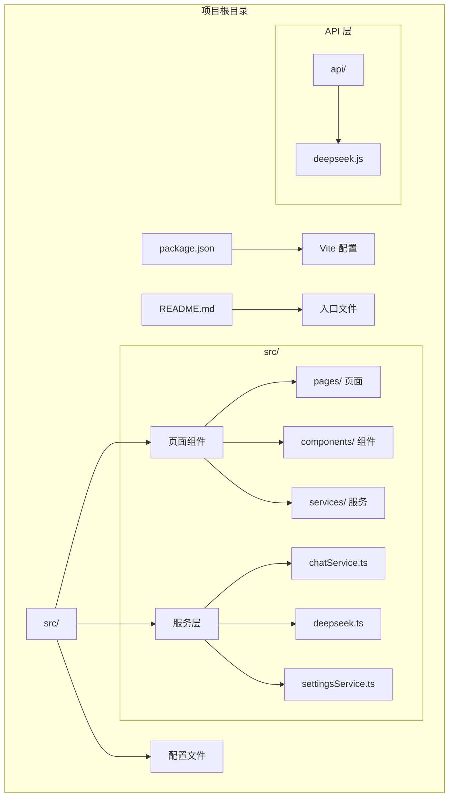
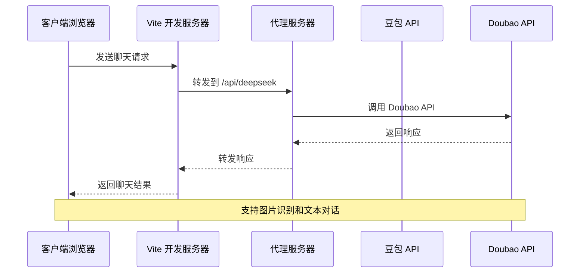
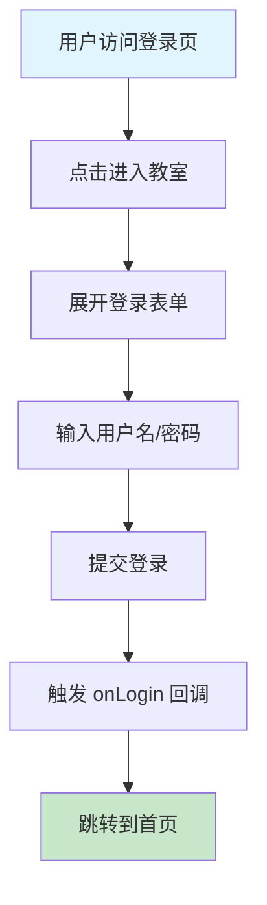
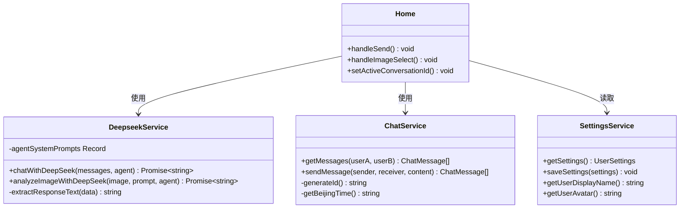

# 快速开始指南

<cite>
**本文档引用的文件**
- [README.md](file://README.md)
- [package.json](file://package.json)
- [vite.config.ts](file://vite.config.ts)
- [tsconfig.json](file://tsconfig.json)
- [src/main.tsx](file://src/main.tsx)
- [src/App.tsx](file://src/App.tsx)
- [src/pages/Home.tsx](file://src/pages/Home.tsx)
- [src/services/deepseek.ts](file://src/services/deepseek.ts)
- [api/deepseek.js](file://api/deepseek.js)
- [src/services/chatService.ts](file://src/services/chatService.ts)
- [src/services/settingsService.ts](file://src/services/settingsService.ts)
- [src/pages/Login.tsx](file://src/pages/Login.tsx)
- [src/pages/Settings.tsx](file://src/pages/Settings.tsx)
- [src/components/MessageContent.tsx](file://src/components/MessageContent.tsx)
</cite>

## 目录
1. [简介](#简介)
2. [项目结构](#项目结构)
3. [核心组件](#核心组件)
4. [架构概览](#架构概览)
5. [详细组件分析](#详细组件分析)
6. [依赖分析](#依赖分析)
7. [性能考虑](#性能考虑)
8. [故障排除指南](#故障排除指南)
9. [结论](#结论)
10. [附录](#附录)

## 简介
智课通 AI Tutor 是一个基于 React 和 Vite 的 AI 辅导应用，提供多模态交互体验。本指南将帮助您在最短时间内完成环境准备、依赖安装、API 配置和应用启动。

## 项目结构
项目采用现代化前端技术栈，主要目录结构如下：



**图表来源**
- [package.json:1-42](file://package.json#L1-L42)
- [vite.config.ts:1-32](file://vite.config.ts#L1-L32)
- [src/main.tsx:1-11](file://src/main.tsx#L1-L11)

**章节来源**
- [package.json:1-42](file://package.json#L1-L42)
- [README.md:1-21](file://README.md#L1-L21)

## 核心组件
应用的核心组件包括：

### 主应用容器
- **App.tsx**: 应用主容器，管理页面路由和用户状态
- **main.tsx**: 应用入口点，初始化 React 根节点

### 页面组件
- **Home.tsx**: 主页面，集成聊天功能和多模态 AI 交互
- **Login.tsx**: 登录页面，提供用户认证界面
- **Settings.tsx**: 设置页面，管理用户偏好和系统配置

### 服务层
- **deepseek.ts**: AI 对话服务，处理与豆包 API 的通信
- **chatService.ts**: 聊天消息持久化服务
- **settingsService.ts**: 用户设置管理服务

**章节来源**
- [src/App.tsx:1-246](file://src/App.tsx#L1-L246)
- [src/main.tsx:1-11](file://src/main.tsx#L1-L11)
- [src/pages/Home.tsx:1-554](file://src/pages/Home.tsx#L1-L554)

## 架构概览
应用采用前后端分离架构，通过代理机制实现 API 通信：



**图表来源**
- [vite.config.ts:22-28](file://vite.config.ts#L22-L28)
- [src/services/deepseek.ts:69-82](file://src/services/deepseek.ts#L69-L82)

## 详细组件分析

### 环境准备与依赖安装

#### Node.js 环境要求
- **最低版本**: Node.js 16+
- **推荐版本**: Node.js 18+ 或 20+
- **包管理器**: npm 8+

#### 依赖安装步骤
1. **克隆项目**
   ```bash
   git clone <repository-url>
   cd tutor
   ```

2. **安装依赖**
   ```bash
   npm install
   ```

3. **验证安装**
   ```bash
   npm run lint
   ```

**章节来源**
- [README.md:13-17](file://README.md#L13-L17)
- [package.json:6-11](file://package.json#L6-L11)

### API 密钥配置

#### 配置文件设置
1. **创建 .env.local 文件**
   ```
   GEMINI_API_KEY=your_gemini_api_key_here
   ```

2. **Vite 环境变量处理**
   ```typescript
   // vite.config.ts
   define: {
     'process.env.GEMINI_API_KEY': JSON.stringify(env.GEMINI_API_KEY),
   }
   ```

3. **TypeScript 类型定义**
   ```json
   // tsconfig.json
   "types": ["vite/client"]
   ```

**章节来源**
- [README.md:18-18](file://README.md#L18-L18)
- [vite.config.ts:10-12](file://vite.config.ts#L10-L12)
- [tsconfig.json:25-25](file://tsconfig.json#L25-L25)

### 应用启动流程

#### 开发服务器启动
```bash
# 启动开发服务器
npm run dev

# 默认端口
http://localhost:3000
```

#### 服务器配置
```typescript
// vite.config.ts
server: {
  port: 3000,
  host: '0.0.0.0',
  hmr: process.env.DISABLE_HMR !== 'true',
  proxy: {
    '/api/deepseek': {
      target: 'https://ark.cn-beijing.volces.com',
      changeOrigin: true,
      rewrite: (path) => path.replace(/^\/api\/deepseek/, '/api/v3'),
    },
  },
}
```

**章节来源**
- [package.json:7-7](file://package.json#L7-L7)
- [vite.config.ts:18-29](file://vite.config.ts#L18-L29)

### 核心功能测试

#### 登录流程


**图表来源**
- [src/pages/Login.tsx:78-120](file://src/pages/Login.tsx#L78-L120)
- [src/App.tsx:48-56](file://src/App.tsx#L48-L56)

#### 聊天功能测试
1. **基础对话**
   - 在输入框中输入问题
   - 点击发送按钮或按 Enter 键
   - 查看 AI 回复

2. **图片识别**
   - 点击相册图标选择图片
   - 输入对图片的说明
   - 查看多模态分析结果

3. **对话历史**
   - 在侧边栏查看历史记录
   - 点击历史记录恢复对话

**章节来源**
- [src/pages/Home.tsx:139-223](file://src/pages/Home.tsx#L139-L223)
- [src/pages/Home.tsx:446-480](file://src/pages/Home.tsx#L446-L480)

## 依赖分析

### 核心依赖关系

```mermaid
graph TB
subgraph "运行时依赖"
A[react] --> B[react-dom]
C[vite] --> D[@vitejs/plugin-react]
E[dotenv] --> F[环境变量]
G[express] --> H[HTTP 服务器]
end
subgraph "开发依赖"
I[typescript] --> J[TSC 编译器]
K[tailwindcss] --> L[样式框架]
M[autoprefixer] --> N[CSS 处理]
end
subgraph "AI 服务"
O[@google/genai] --> P[Google AI SDK]
Q[html2pdf.js] --> R[PDF 导出]
S[katex] --> T[数学公式渲染]
end
```

**图表来源**
- [package.json:13-28](file://package.json#L13-L28)
- [package.json:30-39](file://package.json#L30-L39)

### 服务层架构



**图表来源**
- [src/services/deepseek.ts:45-82](file://src/services/deepseek.ts#L45-L82)
- [src/services/chatService.ts:34-42](file://src/services/chatService.ts#L34-L42)
- [src/services/settingsService.ts:27-49](file://src/services/settingsService.ts#L27-L49)

**章节来源**
- [package.json:13-40](file://package.json#L13-L40)

## 性能考虑
- **懒加载**: 页面组件使用 React.lazy 实现按需加载
- **缓存策略**: 本地存储对话历史和用户设置
- **CDN 优化**: 图片资源使用 CDN 加速
- **代码分割**: Vite 自动进行代码分割和 Tree Shaking

## 故障排除指南

### 常见安装问题

#### 依赖安装失败
**问题**: npm install 执行失败
**解决方案**:
1. 清理缓存
   ```bash
   npm cache clean --force
   ```

2. 删除 node_modules 和 package-lock.json
   ```bash
   rm -rf node_modules package-lock.json
   ```

3. 重新安装
   ```bash
   npm install --legacy-peer-deps
   ```

#### 端口占用问题
**问题**: 端口 3000 被占用
**解决方案**:
```bash
# 修改端口配置
npm run dev -- --port 3001
```

#### TypeScript 类型错误
**问题**: TS2339: Property 'env' does not exist on type 'ImportMeta'
**解决方案**:
```json
// tsconfig.json 中添加
"types": ["vite/client", "node"]
```

### 运行时问题

#### API 调用失败
**问题**: 豆包 API 请求失败
**排查步骤**:
1. 检查网络连接
2. 验证 API 密钥配置
3. 查看浏览器开发者工具的网络面板

#### 跨域问题
**问题**: API 调用出现 CORS 错误
**解决方案**:
```typescript
// vite.config.ts 中配置代理
proxy: {
  '/api/deepseek': {
    target: 'https://ark.cn-beijing.volces.com',
    changeOrigin: true,
    rewrite: (path) => path.replace(/^\/api\/deepseek/, '/api/v3'),
  },
}
```

#### 图片上传问题
**问题**: 图片无法上传或显示
**解决方案**:
1. 检查文件大小限制 (2MB)
2. 验证文件格式 (仅支持图片)
3. 确认浏览器允许文件访问

**章节来源**
- [src/services/chatService.ts:50-71](file://src/services/chatService.ts#L50-L71)
- [src/pages/Home.tsx:244-256](file://src/pages/Home.tsx#L244-L256)

## 结论
通过本指南，您应该能够：
- 成功安装和配置智课通 AI Tutor 项目
- 理解项目的核心架构和组件关系
- 运行本地开发服务器并测试核心功能
- 处理常见的安装和运行时问题

项目提供了完整的 AI 辅导功能，包括多模态对话、图片识别、用户管理和个性化设置等特性。

## 附录

### 快速命令参考
```bash
# 环境准备
node --version
npm --version

# 依赖安装
npm install

# 启动开发服务器
npm run dev

# 构建生产版本
npm run build

# 预览生产构建
npm run preview
```

### 配置文件模板
```javascript
// .env.local 示例
GEMINI_API_KEY=your_api_key_here
DISABLE_HMR=false
```