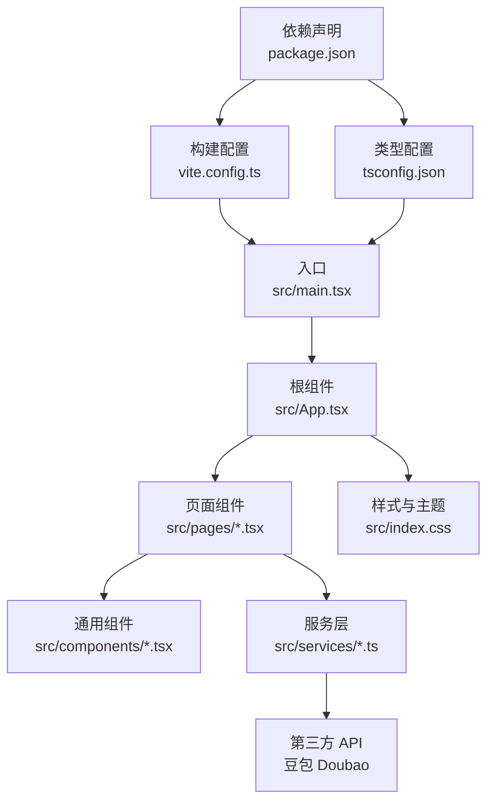
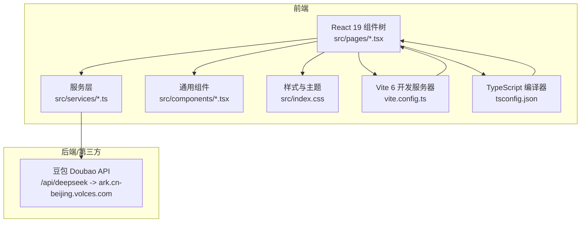
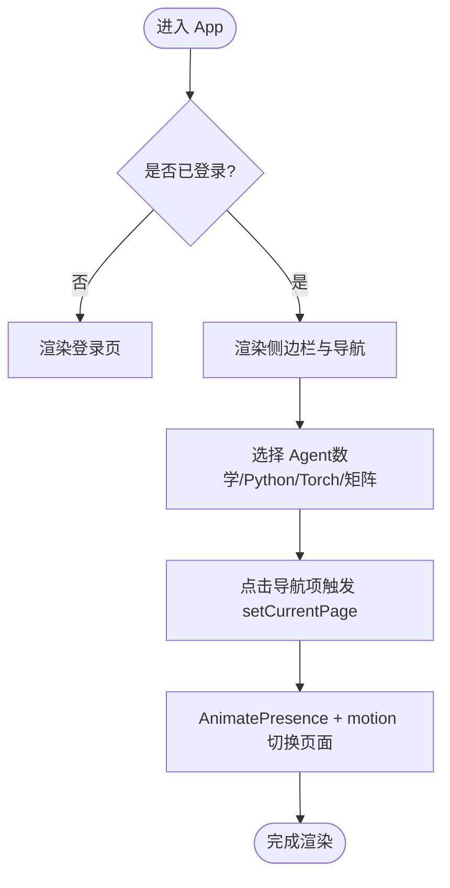
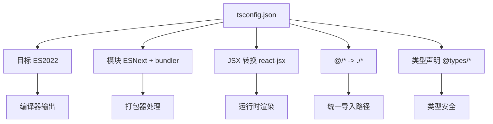
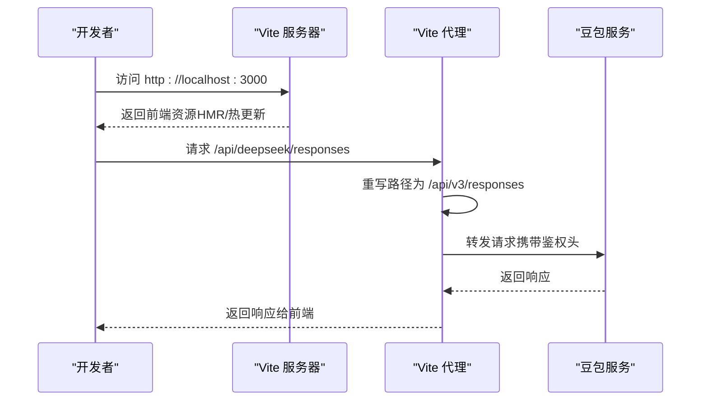
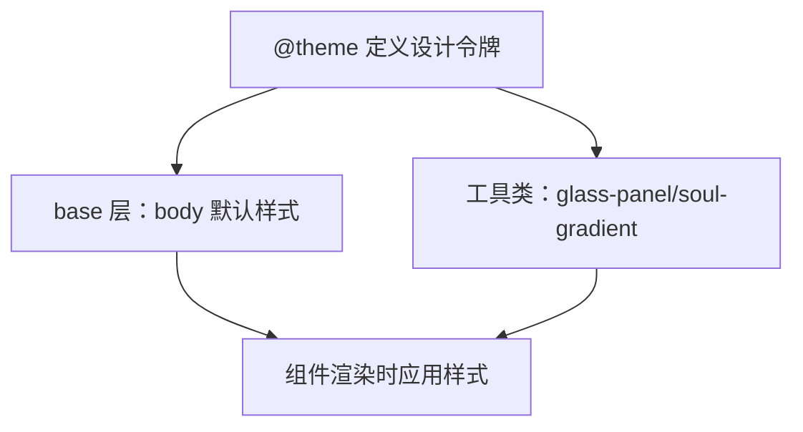
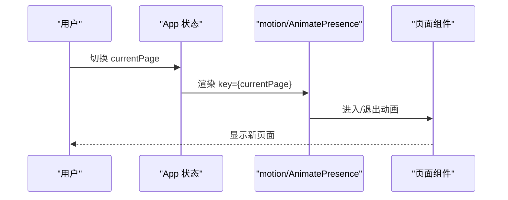
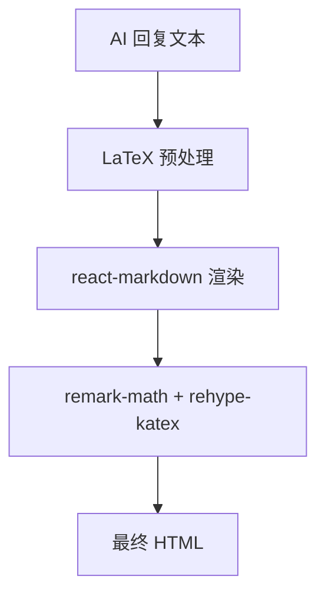
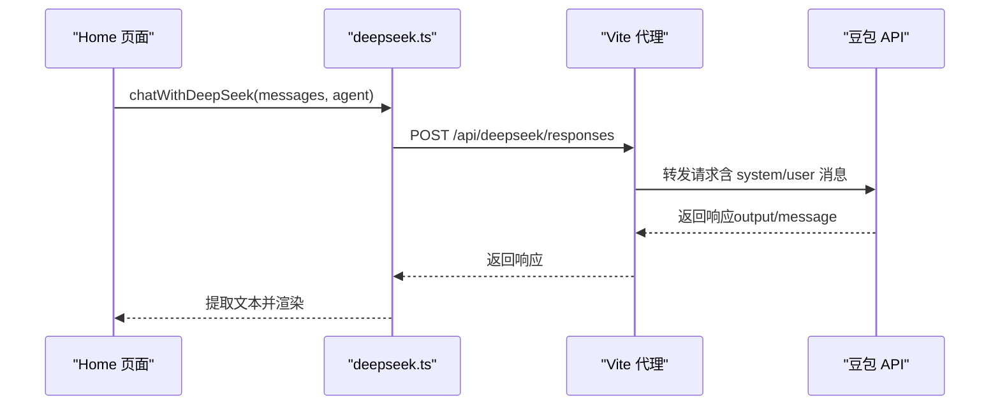
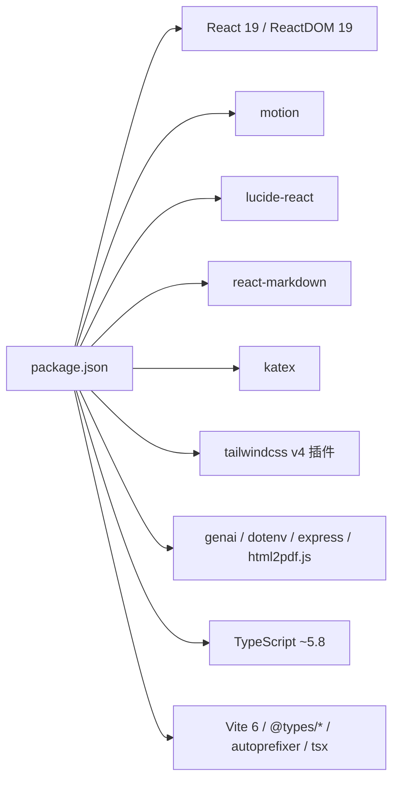

# 技术栈概览

<cite>
**本文引用的文件**
- [package.json](file://package.json)
- [vite.config.ts](file://vite.config.ts)
- [tsconfig.json](file://tsconfig.json)
- [src/main.tsx](file://src/main.tsx)
- [src/App.tsx](file://src/App.tsx)
- [src/pages/Home.tsx](file://src/pages/Home.tsx)
- [src/components/MessageContent.tsx](file://src/components/MessageContent.tsx)
- [src/services/deepseek.ts](file://src/services/deepseek.ts)
- [src/services/chatService.ts](file://src/services/chatService.ts)
- [src/config/videoConfig.ts](file://src/config/videoConfig.ts)
- [src/index.css](file://src/index.css)
- [README.md](file://README.md)
- [AGENTS.md](file://AGENTS.md)
</cite>

## 目录
1. [引言](#引言)
2. [项目结构](#项目结构)
3. [核心组件](#核心组件)
4. [架构总览](#架构总览)
5. [详细组件分析](#详细组件分析)
6. [依赖关系分析](#依赖关系分析)
7. [性能考量](#性能考量)
8. [故障排查指南](#故障排查指南)
9. [结论](#结论)
10. [附录](#附录)

## 引言
本文件为“智课通 AI Tutor”项目的整体技术栈概览，聚焦于项目采用的主要技术框架与工具链，包括 React 19、TypeScript、Vite、Tailwind CSS v4、Motion、Lucide React 等，并结合项目实际代码与配置，说明各技术选型的原因、优势及其在项目中的作用；同时提供版本兼容性信息、性能考虑与未来升级建议，帮助开发者快速理解并高效迭代。

## 项目结构
项目采用以功能域划分的组织方式，核心入口与页面、服务、样式、配置分层清晰：
- 入口与根组件：src/main.tsx、src/App.tsx
- 页面与业务：src/pages 下按功能划分页面组件
- 通用组件：src/components 下通用 UI 组件
- 服务层：src/services 下封装 API 与本地存储
- 配置与样式：src/config、src/index.css
- 构建与类型：vite.config.ts、tsconfig.json
- 依赖与脚本：package.json

图表来源
- [src/main.tsx:1-11](file://src/main.tsx#L1-L11)
- [src/App.tsx:1-246](file://src/App.tsx#L1-L246)
- [vite.config.ts:1-32](file://vite.config.ts#L1-L32)
- [tsconfig.json:1-28](file://tsconfig.json#L1-L28)
- [package.json:1-42](file://package.json#L1-L42)

章节来源
- [src/main.tsx:1-11](file://src/main.tsx#L1-L11)
- [src/App.tsx:1-246](file://src/App.tsx#L1-L246)
- [vite.config.ts:1-32](file://vite.config.ts#L1-L32)
- [tsconfig.json:1-28](file://tsconfig.json#L1-L28)
- [package.json:1-42](file://package.json#L1-L42)

## 核心组件
- React 19：项目使用 React 19.0.0 作为 UI 框架，提供组件化与状态管理能力；在根组件中启用严格模式，确保开发期更早发现潜在问题。
- TypeScript：通过 tsconfig.json 配置 ES2022 目标、ESNext 模块系统、bundler 模块解析、JSX 转换策略以及路径别名，配合 @types/* 提供类型安全与开发体验。
- Vite 6：使用 Vite 6.2.0 作为构建与开发服务器，集成 React 插件与 Tailwind CSS 插件，提供快速热更新与代理能力；通过 define 与环境变量注入实现 API Key 安全传递。
- Tailwind CSS v4：通过 @theme 自定义设计令牌，实现 Material Design 3 风格的主题与工具类，避免传统 CSS 文件，提升样式一致性与可维护性。
- Motion：使用 motion/react 提供页面切换与元素动画，结合 AnimatePresence 实现平滑过渡，增强交互体验。
- Lucide React：统一图标库，提供语义化图标与一致的视觉风格，便于维护与扩展。
- React Markdown + KaTeX：通过 remark-math 与 rehype-katex 渲染富文本与公式，结合自定义预处理逻辑适配 LaTeX 语法。

章节来源
- [package.json:13-28](file://package.json#L13-L28)
- [tsconfig.json:2-26](file://tsconfig.json#L2-L26)
- [vite.config.ts:1-32](file://vite.config.ts#L1-L32)
- [src/index.css:1-34](file://src/index.css#L1-L34)
- [src/App.tsx:18-19](file://src/App.tsx#L18-L19)
- [src/components/MessageContent.tsx:1-31](file://src/components/MessageContent.tsx#L1-L31)

## 架构总览
系统采用单页应用（SPA）架构，页面切换通过状态驱动而非路由库；服务层通过 fetch 与 Vite 代理访问第三方模型服务；数据持久化使用 localStorage；样式通过 Tailwind CSS v4 的 @theme 与工具类统一管理。

图表来源
- [src/App.tsx:35-211](file://src/App.tsx#L35-L211)
- [src/pages/Home.tsx:79-527](file://src/pages/Home.tsx#L79-L527)
- [src/services/deepseek.ts:45-82](file://src/services/deepseek.ts#L45-L82)
- [vite.config.ts:6-31](file://vite.config.ts#L6-L31)
- [tsconfig.json:1-28](file://tsconfig.json#L1-L28)

## 详细组件分析

### React 19 与状态管理
- 根组件与严格模式：在入口处以严格模式挂载根组件，有助于提前暴露副作用与并发相关问题。
- App 状态：通过 useState 管理当前页面、激活 Agent、登录态、用户信息等，形成集中式状态树，简化跨页面共享。
- 页面切换：使用 AnimatePresence 与 motion/react 实现页面级过渡动画，提升交互体验。
- 事件与导航：通过 props 向子组件传递导航回调，实现无路由库的页面跳转。

图表来源
- [src/App.tsx:35-211](file://src/App.tsx#L35-L211)

章节来源
- [src/main.tsx:1-11](file://src/main.tsx#L1-L11)
- [src/App.tsx:35-211](file://src/App.tsx#L35-L211)

### TypeScript 类型安全
- 目标与模块：ES2022 目标、ESNext 模块、bundler 解析、隔离模块、JSX 转换策略均在 tsconfig.json 中明确配置，确保编译与运行时行为一致。
- 路径别名：通过 paths 配置 @/* 指向项目根目录，统一导入路径，减少相对路径复杂度。
- 类型声明：@types/* 提供 React、Node、Express 等类型支持，提升开发体验与类型安全。

图表来源
- [tsconfig.json:2-26](file://tsconfig.json#L2-L26)

章节来源
- [tsconfig.json:1-28](file://tsconfig.json#L1-L28)

### Vite 构建与开发体验
- 插件生态：集成 @vitejs/plugin-react 与 @tailwindcss/vite，提供 React 快速热更新与 Tailwind CSS v4 支持。
- 环境变量注入：通过 define 将环境变量注入到客户端代码，避免明文暴露敏感信息。
- 路径别名：resolve.alias 配置 @ 指向项目根目录，与 tsconfig 路径保持一致。
- 代理规则：开发环境将 /api/deepseek 代理至豆包服务，rewrite 为 /api/v3，屏蔽后端细节。
- HMR 控制：通过环境变量控制 HMR 开关，避免在特定场景下的闪烁问题。

图表来源
- [vite.config.ts:6-31](file://vite.config.ts#L6-L31)
- [src/services/deepseek.ts:45-82](file://src/services/deepseek.ts#L45-L82)

章节来源
- [vite.config.ts:1-32](file://vite.config.ts#L1-L32)
- [package.json:6-11](file://package.json#L6-L11)

### Tailwind CSS v4 与主题系统
- 设计令牌：通过 @theme 定义主色、容器色、表面色与反色等，形成 Material Design 3 风格主题。
- 工具类：提供 .glass-panel、.soul-gradient 等常用样式，统一视觉语言。
- 无配置文件：通过 @import 与 @theme 在单一 CSS 文件内完成主题配置，降低维护成本。

图表来源
- [src/index.css:1-34](file://src/index.css#L1-L34)

章节来源
- [src/index.css:1-34](file://src/index.css#L1-L34)

### Motion 动画与过渡
- 页面级过渡：使用 AnimatePresence 与 motion/div 实现页面切换时的淡入淡出与位移动画，提升用户体验。
- 状态驱动：通过 key 与 transition 参数控制动画时长与缓动，保证流畅自然。

图表来源
- [src/App.tsx:189-206](file://src/App.tsx#L189-L206)

章节来源
- [src/App.tsx:189-206](file://src/App.tsx#L189-L206)

### Lucide React 图标系统
- 统一风格：所有页面与组件使用 lucide-react 提供图标，确保视觉一致性。
- 按需引入：在组件中按需从 lucide-react 导入所需图标，减小打包体积。

章节来源
- [src/App.tsx:18](file://src/App.tsx#L18)
- [src/pages/Home.tsx:2](file://src/pages/Home.tsx#L2)

### React Markdown 与 KaTeX 数学渲染
- Markdown 渲染：MessageContent 使用 react-markdown 渲染 AI 回复，支持段落、标题、列表等基础结构。
- 数学公式：remark-math 与 rehype-katex 支持行内与块级公式；通过预处理将 \[...\] 与 \(...\) 转换为 $$...$$ 与 $...$，提升兼容性。

图表来源
- [src/components/MessageContent.tsx:9-29](file://src/components/MessageContent.tsx#L9-L29)

章节来源
- [src/components/MessageContent.tsx:1-31](file://src/components/MessageContent.tsx#L1-L31)

### 服务层与第三方集成
- 豆包 Doubao API：封装 chatWithDeepSeek 与 analyzeImageWithDeepSeek，支持纯文本与图片多模态输入；开发环境通过 Authorization 头与固定 API Key 访问，生产环境通过 Vercel Serverless 转发。
- 响应提取：extractResponseText 优先从 output[].type === 'message' 中提取文本，兜底兼容 OpenAI 兼容格式。
- 代理与重写：Vite 将 /api/deepseek 重写为 /api/v3，隐藏后端细节，简化前端调用。

图表来源
- [src/pages/Home.tsx:139-223](file://src/pages/Home.tsx#L139-L223)
- [src/services/deepseek.ts:45-82](file://src/services/deepseek.ts#L45-L82)
- [vite.config.ts:22-28](file://vite.config.ts#L22-L28)

章节来源
- [src/services/deepseek.ts:1-133](file://src/services/deepseek.ts#L1-L133)
- [src/pages/Home.tsx:79-527](file://src/pages/Home.tsx#L79-L527)
- [vite.config.ts:22-28](file://vite.config.ts#L22-L28)

### 数据持久化与本地存储
- 对话历史：localStorage 存储各 Agent 的对话数组、活跃会话 ID、已保存到错题本标记与已忽略操作标记。
- 聊天消息：按双方用户 ID 排序生成 key，实现好友间消息分区存储。
- 设置与个人中心：用户昵称、头像、偏好 Agent 等统一存于用户设置模块。

章节来源
- [src/pages/Home.tsx:65-117](file://src/pages/Home.tsx#L65-L117)
- [src/services/chatService.ts:34-71](file://src/services/chatService.ts#L34-L71)

### 视频背景与性能自适应
- 多分辨率视频：通过 videoConfig.ts 配置不同分辨率视频源，按设备硬件并发与网络状况自动选择。
- 组件化封装：VideoBackground.tsx 与 videoConfig.ts 协作，实现自适应加载与遮罩层透明度控制。

章节来源
- [src/config/videoConfig.ts:1-47](file://src/config/videoConfig.ts#L1-L47)

## 依赖关系分析
- 运行时依赖：React 19、React DOM 19、motion、lucide-react、react-markdown、katex、tailwindcss v4 插件、@google/genai、dotenv、express、html2pdf.js 等。
- 开发依赖：TypeScript ~5.8、Vite 6、@types/*、autoprefixer、tailwindcss v4、tsx 等。
- 版本兼容性：React 19 与 Vite 6 均为较新版本，需关注插件生态与浏览器兼容性；TypeScript 5.8 与 bundler 模块解析配合良好；Tailwind CSS v4 通过 @theme 与 @import 简化配置。

图表来源
- [package.json:13-39](file://package.json#L13-L39)

章节来源
- [package.json:13-39](file://package.json#L13-L39)

## 性能考量
- 构建与打包：Vite 6 提供快速冷启动与热更新；bundler 模块解析与 noEmit 配置减少运行时开销。
- 样式体积：Tailwind CSS v4 通过 @import 与 @theme 集中管理，避免重复样式；建议按需引入图标与组件，减少首屏体积。
- 动画与渲染：Motion 动画参数合理设置，避免过度动画影响性能；图片分析与对话渲染使用 useRef 优化状态读取。
- 第三方请求：代理与鉴权头在开发环境可控，生产环境通过 Serverless 转发，减少前端耦合与风险。
- 本地存储：localStorage 使用前需注意容量限制与序列化开销，建议对大对象进行压缩或分片存储。

## 故障排查指南
- 环境变量与 API Key
  - 确认 .env.local 中 GEMINI_API_KEY 已正确设置；Vite 通过 define 注入，代码中以 process.env.GEMINI_API_KEY 访问。
  - 开发环境豆包 API Key 硬编码于服务层，生产环境通过 Vercel Serverless 转发，无需前端携带 Key。
- 代理与重写
  - 若 /api/deepseek 无法访问，检查 vite.config.ts 中 proxy 的 target、changeOrigin、rewrite 是否匹配后端路径。
- 类型与导入
  - 若路径别名 @/* 无法解析，检查 tsconfig.json 的 paths 与 Vite resolve.alias 是否一致。
- 动画与 HMR
  - 若出现闪烁或 HMR 失效，检查 DISABLE_HMR 环境变量与 hmr 配置。
- 数学公式渲染
  - 若公式未正确渲染，确认 MessageContent 的预处理逻辑与 remark-math、rehype-katex 插件已正确安装与启用。

章节来源
- [AGENTS.md:14-16](file://AGENTS.md#L14-L16)
- [vite.config.ts:6-31](file://vite.config.ts#L6-L31)
- [tsconfig.json:18-22](file://tsconfig.json#L18-L22)
- [src/components/MessageContent.tsx:23-29](file://src/components/MessageContent.tsx#L23-L29)

## 结论
本项目以 React 19 为核心，结合 Vite 6、TypeScript、Tailwind CSS v4、Motion 与 Lucide React，构建了高性能、可维护且具有良好交互体验的 AI 辅助学习平台。通过服务层封装与代理机制，实现了与豆包 Doubao 的稳定对接；通过 localStorage 与 @theme 主题系统，保障了数据持久化与视觉一致性。建议在后续迭代中持续关注依赖生态与浏览器兼容性，优化动画与渲染性能，并完善错误边界与监控埋点。

## 附录
- 快速开始
  - 安装依赖后设置 GEMINI_API_KEY，运行 npm run dev 启动开发服务器。
- 版本与兼容性
  - React 19、Vite 6、TypeScript ~5.8、Tailwind CSS v4 插件、motion、lucide-react、react-markdown、katex 均已在 package.json 中声明。
- 未来升级建议
  - 关注 React 19 的新特性与 Vite 生态演进，适时升级插件与工具链。
  - 对动画与渲染进行性能基准测试，按需调整动画参数与组件拆分。
  - 引入错误边界与日志上报，提升稳定性与可观测性。

章节来源
- [README.md:16-20](file://README.md#L16-L20)
- [package.json:13-28](file://package.json#L13-L28)