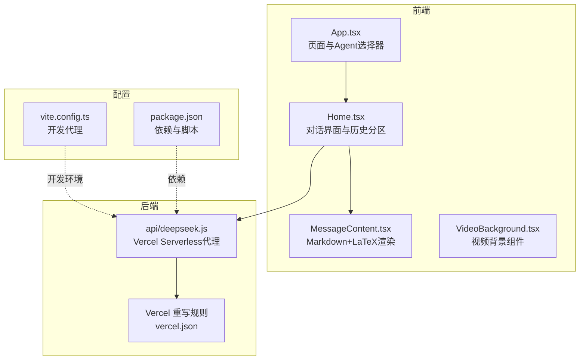
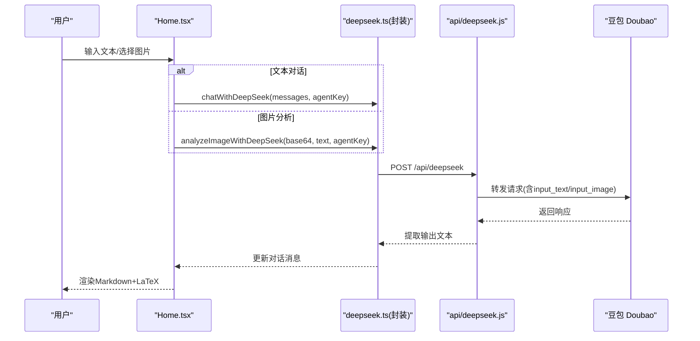
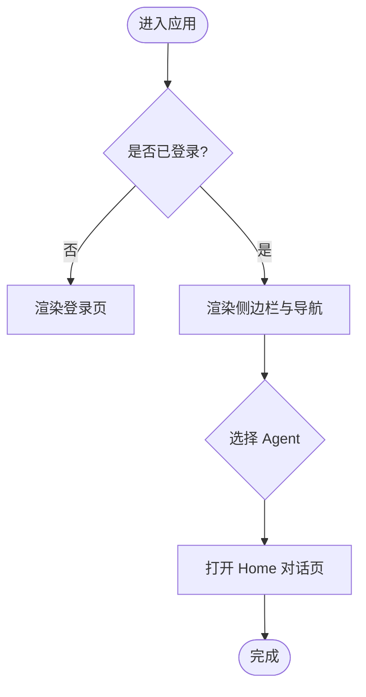
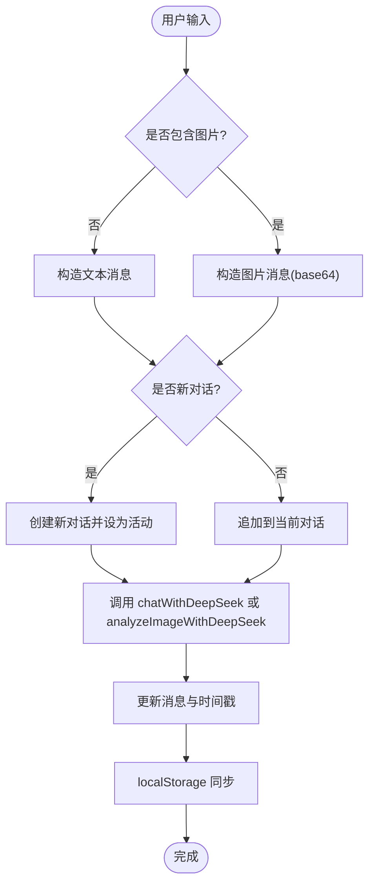
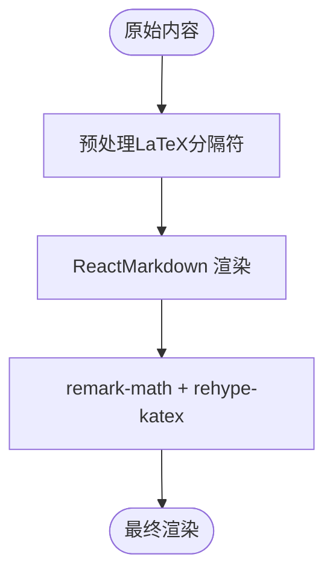
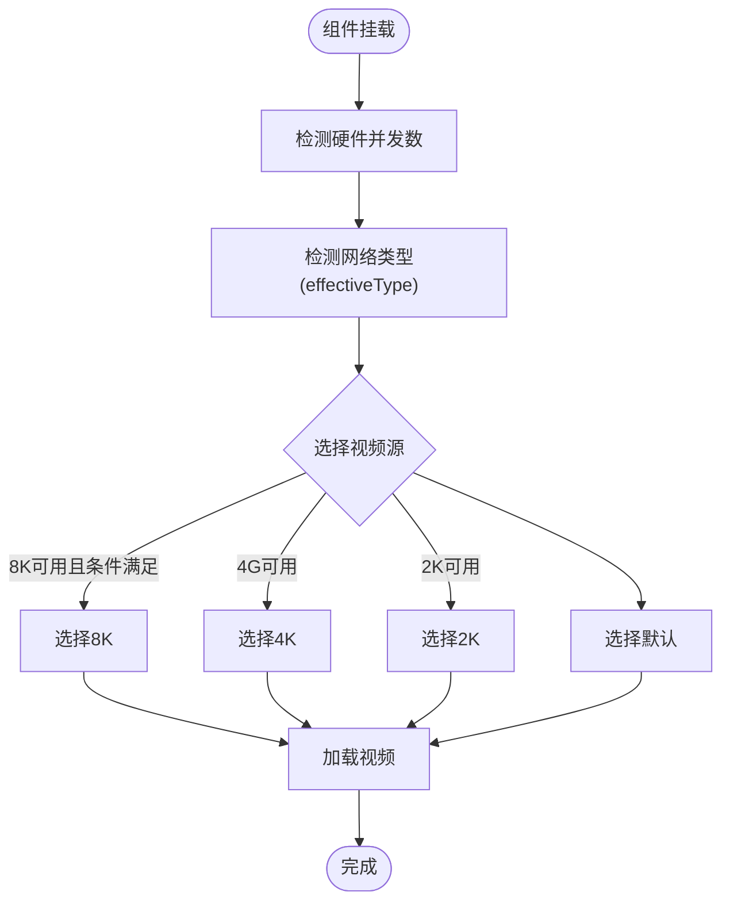
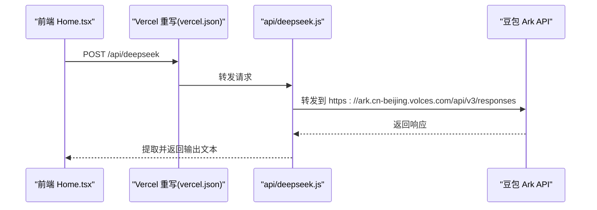
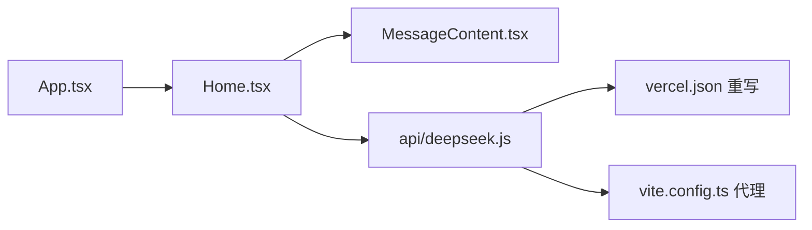

# 多代理 AI 架构

<cite>
**本文引用的文件**
- [AGENTS.md](file://AGENTS.md)
- [README.md](file://README.md)
- [src/App.tsx](file://src/App.tsx)
- [src/pages/Home.tsx](file://src/pages/Home.tsx)
- [src/components/MessageContent.tsx](file://src/components/MessageContent.tsx)
- [src/components/VideoBackground.tsx](file://src/components/VideoBackground.tsx)
- [src/main.tsx](file://src/main.tsx)
- [api/deepseek.js](file://api/deepseek.js)
- [vite.config.ts](file://vite.config.ts)
- [vercel.json](file://vercel.json)
- [package.json](file://package.json)
</cite>

## 目录
1. [引言](#引言)
2. [项目结构](#项目结构)
3. [核心组件](#核心组件)
4. [架构总览](#架构总览)
5. [详细组件分析](#详细组件分析)
6. [依赖关系分析](#依赖关系分析)
7. [性能考虑](#性能考虑)
8. [故障排查指南](#故障排查指南)
9. [结论](#结论)
10. [附录](#附录)

## 引言
本文件面向“智课通 AI Tutor”项目，系统化阐述其多代理 AI 架构与多模态对话系统的设计理念与实现细节。项目围绕四大专业 AI Agent（数学高数酱、Python编程酱、深度学习Torch君、线性代数矩阵妹）构建，提供文本对话与图片分析两种模式，并通过独立的对话历史分区、状态管理与本地持久化，确保各 Agent 的专业能力边界清晰、交互体验流畅。

## 项目结构
项目采用 React 19 + Vite 6 + Tailwind CSS v4 的单页应用架构，页面通过 App.tsx 中的状态机驱动路由切换；对话系统位于 Home 页面，按 Agent 分区管理对话历史；多模态 API 通过 Vercel Serverless Function 代理至豆包 Doubao 模型服务；LaTeX 数学公式渲染由 MessageContent 组件负责。

图表来源
- [src/App.tsx:35-211](file://src/App.tsx#L35-L211)
- [src/pages/Home.tsx:79-527](file://src/pages/Home.tsx#L79-L527)
- [src/components/MessageContent.tsx:19-30](file://src/components/MessageContent.tsx#L19-L30)
- [api/deepseek.js:1-98](file://api/deepseek.js#L1-L98)
- [vercel.json:1-200](file://vercel.json#L1-L200)
- [vite.config.ts:1-200](file://vite.config.ts#L1-L200)
- [package.json:1-200](file://package.json#L1-L200)

章节来源
- [AGENTS.md:27-98](file://AGENTS.md#L27-L98)
- [src/App.tsx:32-103](file://src/App.tsx#L32-L103)
- [src/pages/Home.tsx:79-137](file://src/pages/Home.tsx#L79-L137)

## 核心组件
- 多代理对话系统
  - 四个 Agent：math（高数酱）、python（Py酱）、torch（Torch君）、matrix（矩阵妹）
  - 独立 system prompt 与专业能力边界，分别覆盖微积分/线代、Python 数据分析、深度学习、线性代数
  - 文本对话与图片分析双模式，图片经 base64 编码后提交给豆包多模态模型
- 对话历史隔离与状态管理
  - 按 Agent 分区存储对话历史，使用 localStorage 持久化
  - 使用 useRef 追踪最新状态，避免 React 批处理导致的竞态
- 多模态与渲染
  - 图片分析流程：FileReader -> base64 -> analyzeImageWithDeepSeek -> 豆包 input_image
  - Markdown + KaTeX 渲染数学公式，预处理 LaTeX 分隔符
- 页面与导航
  - App.tsx 通过 useState 控制页面与当前激活 Agent，侧边栏提供四类 Agent 快速入口

章节来源
- [AGENTS.md:35-62](file://AGENTS.md#L35-L62)
- [src/pages/Home.tsx:7-36](file://src/pages/Home.tsx#L7-L36)
- [src/pages/Home.tsx:139-223](file://src/pages/Home.tsx#L139-L223)
- [src/components/MessageContent.tsx:9-29](file://src/components/MessageContent.tsx#L9-L29)
- [src/App.tsx:75-103](file://src/App.tsx#L75-L103)

## 架构总览
下图展示了从用户输入到后端模型调用与响应渲染的整体流程，包括文本对话与图片分析两条主路径。

图表来源
- [src/pages/Home.tsx:139-223](file://src/pages/Home.tsx#L139-L223)
- [api/deepseek.js:1-98](file://api/deepseek.js#L1-L98)
- [AGENTS.md:38-48](file://AGENTS.md#L38-L48)

## 详细组件分析

### 组件一：App.tsx（页面与 Agent 选择器）
- 负责页面切换与当前 Agent 的选择，侧边栏提供四类 Agent 的入口与快捷操作
- 与 Home 页面通过 activeAgent 参数联动，确保对话界面与侧边栏状态一致

图表来源
- [src/App.tsx:35-103](file://src/App.tsx#L35-L103)

章节来源
- [src/App.tsx:32-103](file://src/App.tsx#L32-L103)

### 组件二：Home.tsx（多代理对话与历史分区）
- 对话历史分区：按 AgentKey 存储对话数组，独立维护 activeId
- 发送消息流程：区分文本与图片，构造消息并调用 chatWithDeepSeek 或 analyzeImageWithDeepSeek
- 错题本集成：对最后一条助手回复提供“保存到错题本”的交互
- 状态持久化：localStorage 自动同步 allConversations、allActiveIds、已保存/忽略标记

图表来源
- [src/pages/Home.tsx:139-223](file://src/pages/Home.tsx#L139-L223)
- [src/pages/Home.tsx:103-117](file://src/pages/Home.tsx#L103-L117)

章节来源
- [src/pages/Home.tsx:79-137](file://src/pages/Home.tsx#L79-L137)
- [src/pages/Home.tsx:139-223](file://src/pages/Home.tsx#L139-L223)

### 组件三：MessageContent.tsx（Markdown 与 LaTeX 渲染）
- 预处理 LaTeX 分隔符，将 \[...\] 与 \(...\) 转换为 KaTeX 兼容格式
- 使用 remark-math 与 rehype-katex 渲染数学公式，保证公式在对话内容中的正确显示

图表来源
- [src/components/MessageContent.tsx:9-29](file://src/components/MessageContent.tsx#L9-L29)

章节来源
- [src/components/MessageContent.tsx:9-29](file://src/components/MessageContent.tsx#L9-L29)

### 组件四：VideoBackground.tsx（视频背景）
- 根据硬件并发数与网络连接类型（effectiveType）自动选择 8K/4K/2K/默认视频源
- 支持占位图与错误降级，提升弱网与低端设备的体验

图表来源
- [src/components/VideoBackground.tsx:55-84](file://src/components/VideoBackground.tsx#L55-L84)

章节来源
- [src/components/VideoBackground.tsx:55-84](file://src/components/VideoBackground.tsx#L55-L84)

### 组件五：API 代理（api/deepseek.js 与 Vercel 重写）
- 开发环境：Vite 代理将 /api/deepseek 重写为豆包 API 前缀 /api/v3
- 生产环境：Vercel Serverless function 处理 POST 请求，转发至豆包 responses 接口
- 响应提取：优先取 output 中 type === 'message' 的条目

图表来源
- [AGENTS.md:43-48](file://AGENTS.md#L43-L48)
- [api/deepseek.js:1-98](file://api/deepseek.js#L1-L98)
- [vercel.json:1-200](file://vercel.json#L1-L200)

章节来源
- [AGENTS.md:43-48](file://AGENTS.md#L43-L48)
- [api/deepseek.js:1-98](file://api/deepseek.js#L1-L98)
- [vercel.json:1-200](file://vercel.json#L1-L200)

## 依赖关系分析
- 组件耦合
  - Home.tsx 依赖 MessageContent 进行内容渲染，依赖 api/deepseek.js 的代理接口
  - App.tsx 作为顶层容器，控制页面与 Agent 切换，影响 Home 的 activeAgent
- 外部依赖
  - Vercel Serverless 与重写规则负责生产环境 API 转发
  - Vite 代理负责开发环境 API 转发
- 数据持久化
  - localStorage 作为唯一持久化介质，按模块划分 key，避免冲突

图表来源
- [src/App.tsx:35-211](file://src/App.tsx#L35-L211)
- [src/pages/Home.tsx:79-527](file://src/pages/Home.tsx#L79-L527)
- [api/deepseek.js:1-98](file://api/deepseek.js#L1-L98)
- [vercel.json:1-200](file://vercel.json#L1-L200)
- [vite.config.ts:1-200](file://vite.config.ts#L1-L200)

章节来源
- [AGENTS.md:50-59](file://AGENTS.md#L50-L59)
- [src/App.tsx:35-211](file://src/App.tsx#L35-L211)
- [src/pages/Home.tsx:79-527](file://src/pages/Home.tsx#L79-L527)

## 性能考虑
- 图片分析
  - 前端将图片转为 base64，注意大图体积对内存与网络的影响；建议在移动端谨慎上传大尺寸图片
  - Serverless 函数配置了较大的 body 尺寸限制，以支持大图片上传
- 渲染性能
  - MessageContent 使用轻量的 remark-math + rehype-katex，避免复杂 DOM 结构
  - 对话列表使用虚拟滚动与局部更新，减少不必要的重渲染
- 网络与设备适配
  - VideoBackground 根据硬件并发与网络类型自动选择视频源，避免低端设备卡顿
- 状态与竞态
  - 使用 useRef 保存 allConversationsRef，避免在异步回调中读取过期状态

章节来源
- [AGENTS.md:96-98](file://AGENTS.md#L96-L98)
- [src/components/VideoBackground.tsx:55-84](file://src/components/VideoBackground.tsx#L55-L84)
- [src/pages/Home.tsx:100-101](file://src/pages/Home.tsx#L100-L101)

## 故障排查指南
- 无法连接后端
  - 检查开发环境代理配置与生产环境 Vercel 重写规则是否生效
  - 确认 api/deepseek.js 的转发地址与请求体格式符合豆包要求
- 图片分析失败
  - 确认前端已将图片转换为 base64，并以 input_image 形式提交
  - 检查 Serverless 的 body 尺寸限制是否足够
- 渲染异常
  - 确认 LaTeX 分隔符已被预处理为 KaTeX 兼容格式
- 历史丢失
  - 检查 localStorage 是否被清理或跨域访问受限
  - 确认各模块独立 key 未被误删或覆盖

章节来源
- [AGENTS.md:43-48](file://AGENTS.md#L43-L48)
- [src/components/MessageContent.tsx:9-17](file://src/components/MessageContent.tsx#L9-L17)
- [AGENTS.md:50-59](file://AGENTS.md#L50-L59)

## 结论
本项目通过明确的多代理分工与严格的对话历史隔离，实现了高专业度与良好用户体验的平衡。文本与图片双模态输入、本地持久化与生产级 API 代理，共同构成了稳定可靠的 AI 辅学系统。建议在实际使用中遵循最佳实践，合理选择 Agent 与输入方式，以最大化发挥各 Agent 的专业能力。

## 附录
- 快速开始
  - 在本地安装依赖并启动开发服务器，设置环境变量后即可运行
- 使用示例
  - 数学高数酱：适合微积分与线性代数问题；可直接输入或上传草稿图片
  - Python编程酱：适合数据处理与算法实现；可上传代码截图或描述需求
  - 深度学习Torch君：适合模型结构与训练过程解释；可上传图示或文字描述
  - 线性代数矩阵妹：适合矩阵运算与向量空间问题；可上传作业图片或文字描述
- 最佳实践
  - 优先使用对应 Agent 的专业领域，以获得更准确的解答
  - 图片分析时尽量提供清晰、完整的内容，必要时配合简短文字说明
  - 利用错题本功能保存重要知识点，定期回顾巩固

章节来源
- [README.md:16-20](file://README.md#L16-L20)
- [src/pages/Home.tsx:7-36](file://src/pages/Home.tsx#L7-L36)
- [src/pages/Home.tsx:318-333](file://src/pages/Home.tsx#L318-L333)