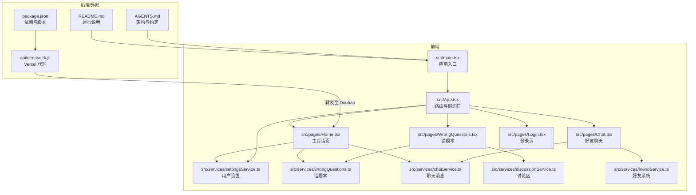
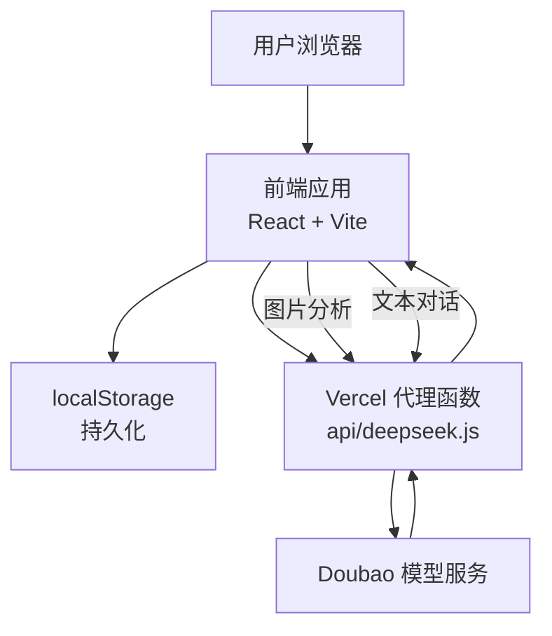
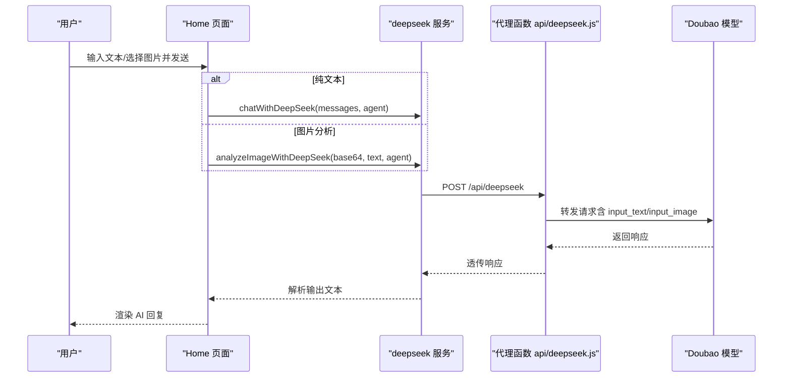
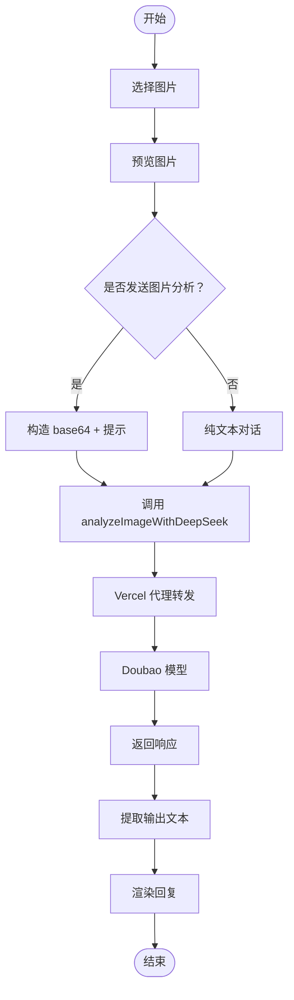
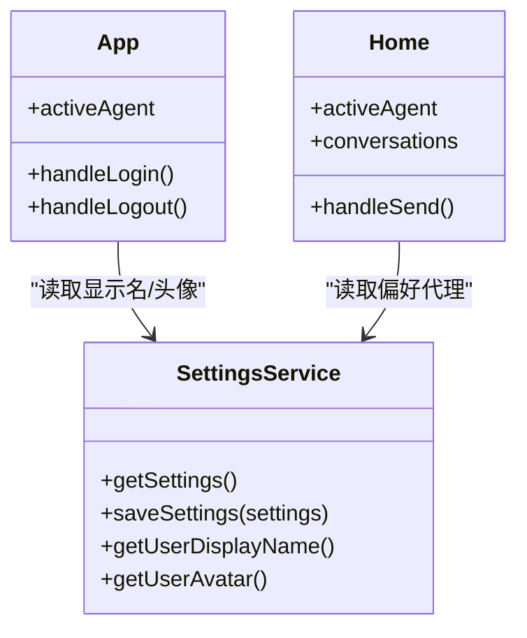
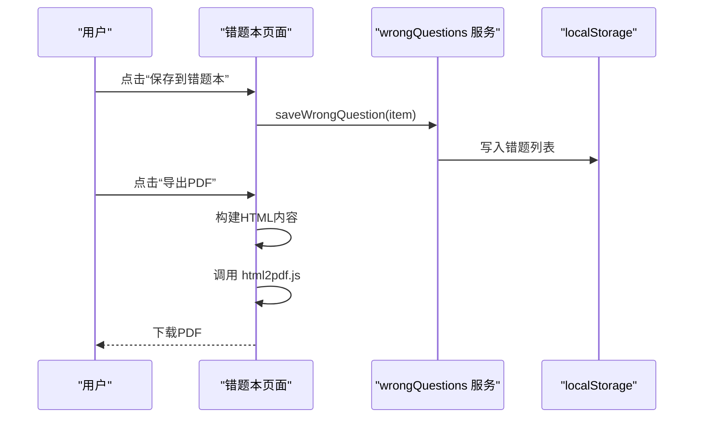
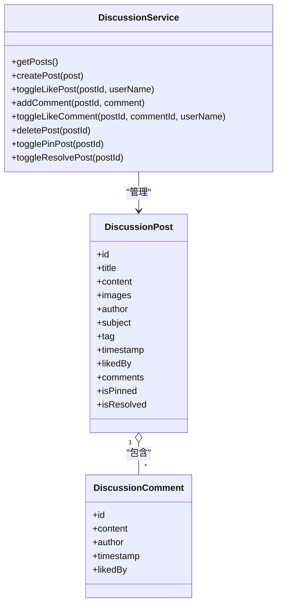
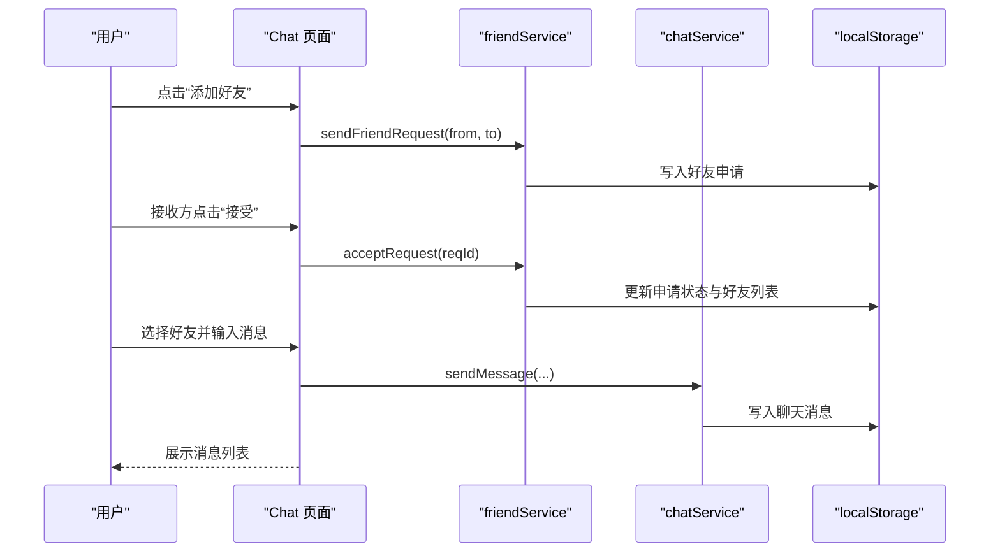
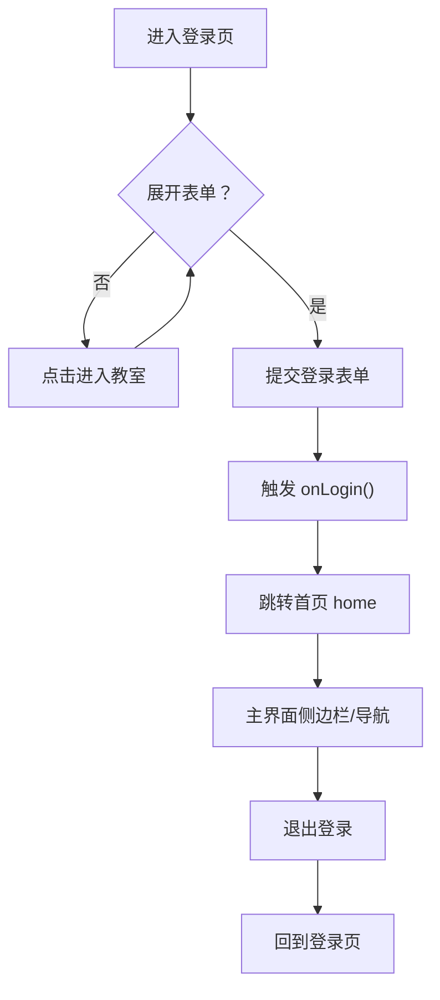
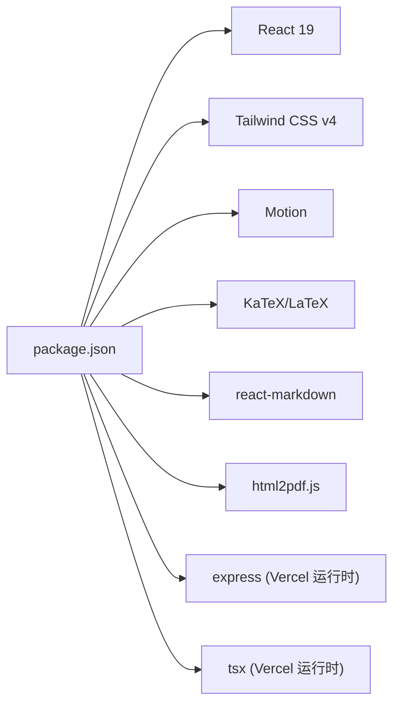

# 核心功能特性

<cite>
**本文引用的文件**
- [README.md](file://README.md)
- [AGENTS.md](file://AGENTS.md)
- [src/App.tsx](file://src/App.tsx)
- [src/main.tsx](file://src/main.tsx)
- [src/pages/Home.tsx](file://src/pages/Home.tsx)
- [src/pages/Login.tsx](file://src/pages/Login.tsx)
- [src/pages/WrongQuestions.tsx](file://src/pages/WrongQuestions.tsx)
- [src/pages/Chat.tsx](file://src/pages/Chat.tsx)
- [src/services/chatService.ts](file://src/services/chatService.ts)
- [src/services/wrongQuestions.ts](file://src/services/wrongQuestions.ts)
- [src/services/discussionService.ts](file://src/services/discussionService.ts)
- [src/services/settingsService.ts](file://src/services/settingsService.ts)
- [src/services/friendService.ts](file://src/services/friendService.ts)
- [api/deepseek.js](file://api/deepseek.js)
- [package.json](file://package.json)
</cite>

## 目录
1. [引言](#引言)
2. [项目结构](#项目结构)
3. [核心组件](#核心组件)
4. [架构总览](#架构总览)
5. [详细组件分析](#详细组件分析)
6. [依赖分析](#依赖分析)
7. [性能考虑](#性能考虑)
8. [故障排查指南](#故障排查指南)
9. [结论](#结论)
10. [附录](#附录)

## 引言
本文件面向“智课通 AI Tutor”项目，系统化梳理并说明以下核心能力与特性：
- 多代理 AI 架构（数学、Python、深度学习、线性代数等）
- 多模态 AI 对话系统（文本+图片分析）
- 个性化学习助手
- 错题本管理
- 实时在线学习
- 用户认证系统
- 讨论区与好友社交
- 在线部署与 API 代理

文档旨在帮助用户理解功能工作原理、使用场景与实现方式，并为开发者提供扩展与优化参考。

## 项目结构
项目采用 React 19 + Vite 6 + Tailwind CSS v4 的单页应用架构，页面通过 App.tsx 内部状态驱动切换，未使用 react-router。前端通过本地存储实现数据持久化，部分后端能力通过 Vercel Serverless Function 代理第三方模型服务。

图表来源
- [src/main.tsx:1-11](file://src/main.tsx#L1-L11)
- [src/App.tsx:1-246](file://src/App.tsx#L1-L246)
- [src/pages/Home.tsx:1-554](file://src/pages/Home.tsx#L1-L554)
- [src/pages/WrongQuestions.tsx:1-309](file://src/pages/WrongQuestions.tsx#L1-L309)
- [src/pages/Chat.tsx:1-381](file://src/pages/Chat.tsx#L1-L381)
- [src/pages/Login.tsx:1-175](file://src/pages/Login.tsx#L1-L175)
- [src/services/settingsService.ts:1-50](file://src/services/settingsService.ts#L1-L50)
- [src/services/wrongQuestions.ts:1-35](file://src/services/wrongQuestions.ts#L1-L35)
- [src/services/chatService.ts:1-72](file://src/services/chatService.ts#L1-L72)
- [src/services/discussionService.ts:1-155](file://src/services/discussionService.ts#L1-L155)
- [src/services/friendService.ts:1-151](file://src/services/friendService.ts#L1-L151)
- [api/deepseek.js:1-34](file://api/deepseek.js#L1-L34)
- [package.json:1-42](file://package.json#L1-L42)

章节来源
- [README.md:1-21](file://README.md#L1-L21)
- [AGENTS.md:27-98](file://AGENTS.md#L27-L98)
- [src/App.tsx:32-211](file://src/App.tsx#L32-L211)

## 核心组件
- 多代理对话系统：Math（高数酱）、Python（Py酱）、Torch（Torch君）、Matrix（矩阵妹），分别对应不同学科专家，支持纯文本与图片多模态分析。
- 多模态分析：图片上传经 FileReader 转 base64，调用分析接口后由 Doubao 模型解析并返回结果。
- 错题本：本地存储错题，支持筛选、导出 PDF、查看统计。
- 好友与聊天：本地存储好友列表与聊天消息，支持申请、接受、删除好友及消息发送。
- 讨论区：本地存储帖子、评论、点赞、置顶/已解决标记。
- 设置与个人中心：昵称、头像、偏好代理、复习时间、推送开关、深色模式、字号等。
- 登录与导航：登录页触发登录后进入主界面，侧边栏与顶部导航控制页面切换。

章节来源
- [AGENTS.md:35-69](file://AGENTS.md#L35-L69)
- [src/pages/Home.tsx:7-36](file://src/pages/Home.tsx#L7-L36)
- [src/pages/WrongQuestions.tsx:14-31](file://src/pages/WrongQuestions.tsx#L14-L31)
- [src/pages/Chat.tsx:28-98](file://src/pages/Chat.tsx#L28-L98)
- [src/services/discussionService.ts:10-24](file://src/services/discussionService.ts#L10-L24)
- [src/services/settingsService.ts:15-25](file://src/services/settingsService.ts#L15-L25)
- [src/pages/Login.tsx:7-174](file://src/pages/Login.tsx#L7-L174)

## 架构总览
系统采用“前端本地状态 + 本地存储 + 后端代理”的混合架构：
- 前端负责 UI、状态管理与本地存储读写；
- 后端通过 Vercel Serverless Function 代理 Doubao API，避免前端暴露密钥；
- 开发环境通过 Vite Proxy 将 /api/deepseek 转发到 Doubao；
- 生产环境通过 api/deepseek.js 直接转发请求并返回响应。

图表来源
- [AGENTS.md:43-49](file://AGENTS.md#L43-L49)
- [api/deepseek.js:9-33](file://api/deepseek.js#L9-L33)

章节来源
- [AGENTS.md:43-49](file://AGENTS.md#L43-L49)
- [api/deepseek.js:14-32](file://api/deepseek.js#L14-L32)

## 详细组件分析

### 多代理 AI 对话系统
- 组件职责
  - Home 页面承载多代理对话 UI，按 AgentKey 隔离对话历史，支持新建会话、清空当前会话、查看历史。
  - 消息渲染通过 MessageContent 组件，支持 Markdown 与 LaTeX 渲染。
  - 图片分析流程：选择图片 → FileReader 转 base64 → 调用 analyzeImageWithDeepSeek → Doubao 返回结果。
- 数据流
  - 文本对话：收集当前会话消息，过滤掉图片消息，构造 API 消息数组，调用 chatWithDeepSeek。
  - 图片分析：将 base64 图片与可选提示一并传入 analyzeImageWithDeepSeek。
- 本地存储
  - 对话历史、活跃会话 ID、已保存到错题本标记、已忽略操作标记均以独立 key 存储。

图表来源
- [src/pages/Home.tsx:139-223](file://src/pages/Home.tsx#L139-L223)
- [api/deepseek.js:9-33](file://api/deepseek.js#L9-L33)

章节来源
- [src/pages/Home.tsx:79-223](file://src/pages/Home.tsx#L79-L223)
- [AGENTS.md:35-49](file://AGENTS.md#L35-L49)

### 多模态 AI 对话（文本+图片分析）
- 图片上传与预览：文件选择器触发 FileReader，读取为 base64 并预览；支持移除图片。
- 图片分析调用：将 base64 图片与可选提示文本组合，调用 analyzeImageWithDeepSeek，内部以 Doubao input_image 格式发送。
- 响应解析：代理函数返回原始响应，前端提取输出文本（优先取类型为 message 的条目）。

图表来源
- [src/pages/Home.tsx:244-256](file://src/pages/Home.tsx#L244-L256)
- [src/pages/Home.tsx:178-223](file://src/pages/Home.tsx#L178-L223)
- [api/deepseek.js:14-32](file://api/deepseek.js#L14-L32)

章节来源
- [src/pages/Home.tsx:244-256](file://src/pages/Home.tsx#L244-L256)
- [src/pages/Home.tsx:178-223](file://src/pages/Home.tsx#L178-L223)
- [AGENTS.md:41-49](file://AGENTS.md#L41-L49)

### 个性化学习助手
- 代理选择：侧边栏提供四个代理入口，点击切换 activeAgent，Home 页面根据代理动态加载其专属对话历史与占位提示。
- 用户设置：昵称、头像、偏好代理、复习时间、推送开关、深色模式、字号等，通过设置服务读取与保存。
- 个人中心：展示用户信息与偏好设置，支持从设置页返回后刷新显示。

图表来源
- [src/services/settingsService.ts:27-49](file://src/services/settingsService.ts#L27-L49)
- [src/App.tsx:35-60](file://src/App.tsx#L35-L60)
- [src/pages/Home.tsx:79-84](file://src/pages/Home.tsx#L79-L84)

章节来源
- [src/App.tsx:75-103](file://src/App.tsx#L75-L103)
- [src/services/settingsService.ts:27-49](file://src/services/settingsService.ts#L27-L49)

### 错题本管理
- 功能点：新增、删除、清空、筛选、导出 PDF、统计分布。
- 数据模型：错题项包含题目、答案、代理名称与键、时间戳。
- 导出流程：构建 HTML 内容，使用 html2pdf.js 导出为 PDF，中文使用宋体回退字体。

图表来源
- [src/pages/Home.tsx:366-380](file://src/pages/Home.tsx#L366-L380)
- [src/services/wrongQuestions.ts:21-25](file://src/services/wrongQuestions.ts#L21-L25)
- [src/pages/WrongQuestions.tsx:33-161](file://src/pages/WrongQuestions.tsx#L33-L161)

章节来源
- [src/pages/WrongQuestions.tsx:14-31](file://src/pages/WrongQuestions.tsx#L14-L31)
- [src/pages/WrongQuestions.tsx:163-166](file://src/pages/WrongQuestions.tsx#L163-L166)
- [src/services/wrongQuestions.ts:12-34](file://src/services/wrongQuestions.ts#L12-L34)

### 实时在线学习与讨论区
- 讨论区功能：发帖、评论、点赞（帖子与评论）、置顶/取消置顶、标记已解决/未解决、删除帖子。
- 数据模型：帖子包含标题、内容、图片、作者、标签、时间戳、点赞集合、评论列表、置顶与已解决标记。
- 本地存储：所有数据以独立 key 存储于 localStorage，便于离线使用与快速迭代。

图表来源
- [src/services/discussionService.ts:10-24](file://src/services/discussionService.ts#L10-L24)
- [src/services/discussionService.ts:45-155](file://src/services/discussionService.ts#L45-L155)

章节来源
- [src/services/discussionService.ts:45-155](file://src/services/discussionService.ts#L45-L155)

### 好友与聊天系统
- 好友管理：发送申请、查看待处理、接受/拒绝、删除好友；支持从预设用户列表中添加。
- 聊天消息：按双方用户名排序生成 chatKey，分区间存取消息；支持发送与滚动到底部。
- UI 流程：左侧好友列表，右侧聊天窗口，支持选择好友、发送消息、删除好友。

图表来源
- [src/pages/Chat.tsx:57-97](file://src/pages/Chat.tsx#L57-L97)
- [src/services/friendService.ts:74-134](file://src/services/friendService.ts#L74-L134)
- [src/services/chatService.ts:34-71](file://src/services/chatService.ts#L34-L71)

章节来源
- [src/pages/Chat.tsx:28-98](file://src/pages/Chat.tsx#L28-L98)
- [src/services/friendService.ts:61-151](file://src/services/friendService.ts#L61-L151)
- [src/services/chatService.ts:16-71](file://src/services/chatService.ts#L16-L71)

### 用户认证系统
- 登录页：提供学生/教师登录 Tab、表单字段、第三方登录入口；点击“立即登录”触发 onLogin。
- 登录状态：App.tsx 维护 isLoggedIn 与 currentPage，登录后进入主界面并默认跳转首页。
- 退出登录：重置状态并回到登录页。

图表来源
- [src/pages/Login.tsx:31-174](file://src/pages/Login.tsx#L31-L174)
- [src/App.tsx:48-56](file://src/App.tsx#L48-L56)
- [src/App.tsx:198-204](file://src/App.tsx#L198-L204)

章节来源
- [src/pages/Login.tsx:7-174](file://src/pages/Login.tsx#L7-L174)
- [src/App.tsx:35-60](file://src/App.tsx#L35-L60)

## 依赖分析
- 前端依赖：React 19、Tailwind CSS v4、Lucide 图标、Motion 动画、react-markdown + remark-math + rehype-katex 渲染、html2pdf.js 导出 PDF。
- 后端依赖：Vercel serverless 运行时依赖 express 与 tsx（仅用于运行时，前端不直接使用）。
- 关键约定：路径别名 @ 指向根目录；路由通过 useState 控制页面字符串；环境变量 GEMINI_API_KEY 用于演示（本项目实际使用 Doubao 代理）。

图表来源
- [package.json:13-29](file://package.json#L13-L29)
- [package.json:30-40](file://package.json#L30-L40)

章节来源
- [package.json:13-42](file://package.json#L13-L42)
- [AGENTS.md:18-26](file://AGENTS.md#L18-L26)

## 性能考虑
- 图片上传体积：代理函数限制请求体大小为 10MB，适合较大图片的 OCR/分析场景。
- 渲染性能：Markdown + KaTeX 渲染在长文本场景下可能较重，建议对超长内容分段或延迟渲染。
- 本地存储：localStorage 读写频繁时注意避免阻塞主线程，必要时拆分存储键或批量写入。
- 动画与滚动：页面切换使用 AnimatePresence，消息滚动使用 smooth，注意在大量消息时的滚动性能。

章节来源
- [api/deepseek.js:3-7](file://api/deepseek.js#L3-L7)
- [src/pages/Home.tsx:135-137](file://src/pages/Home.tsx#L135-L137)

## 故障排查指南
- Doubao 代理失败
  - 现象：发送请求后返回失败或空白回复。
  - 排查：确认代理函数已部署、Authorization 正确、请求体格式符合 Doubao input 数组规范。
- 图片分析异常
  - 现象：选择图片后无法分析或报错。
  - 排查：检查文件类型、base64 编码、代理函数是否正确转发、Doubao 模型可用性。
- 本地存储异常
  - 现象：错题本/聊天消息丢失或显示异常。
  - 排查：检查 localStorage 是否被清理、键名是否正确、JSON 解析是否抛错。
- 页面切换与状态
  - 现象：切换页面后状态未刷新或显示旧数据。
  - 排查：确认 App.tsx 中页面切换逻辑、useEffect 刷新策略与子组件 props 传递。

章节来源
- [api/deepseek.js:14-32](file://api/deepseek.js#L14-L32)
- [src/pages/Home.tsx:178-223](file://src/pages/Home.tsx#L178-L223)
- [src/services/wrongQuestions.ts:12-18](file://src/services/wrongQuestions.ts#L12-L18)
- [src/services/chatService.ts:34-42](file://src/services/chatService.ts#L34-L42)
- [src/App.tsx:43-46](file://src/App.tsx#L43-L46)

## 结论
智课通 AI Tutor 以“多代理 + 多模态 + 本地存储 + 代理后端”的轻量架构实现了高校学生的学习辅助闭环：从个性化代理问答、图片 OCR 分析，到错题本沉淀、讨论区协作与好友社交，覆盖了从“学”到“练”再到“用”的关键环节。前端通过本地存储保障离线可用性与快速迭代，后端代理确保安全与可扩展。后续可在模型接入、富媒体渲染、消息推送等方面进一步增强体验。

## 附录
- 快速开始
  - 安装依赖、设置环境变量、启动开发服务器。
- 环境变量
  - GEMINI_API_KEY（用于演示）；Doubao API Key 已在代理函数中硬编码（生产环境通过 Vercel 转发）。
- 路由约定
  - 页面类型为字符串枚举，通过 App.tsx 内部状态切换；未使用 react-router。

章节来源
- [README.md:16-20](file://README.md#L16-L20)
- [AGENTS.md:14-26](file://AGENTS.md#L14-L26)