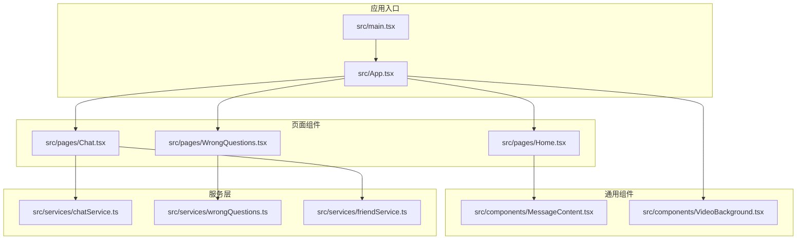
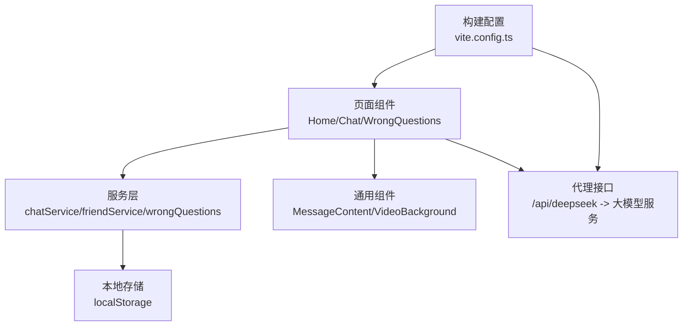
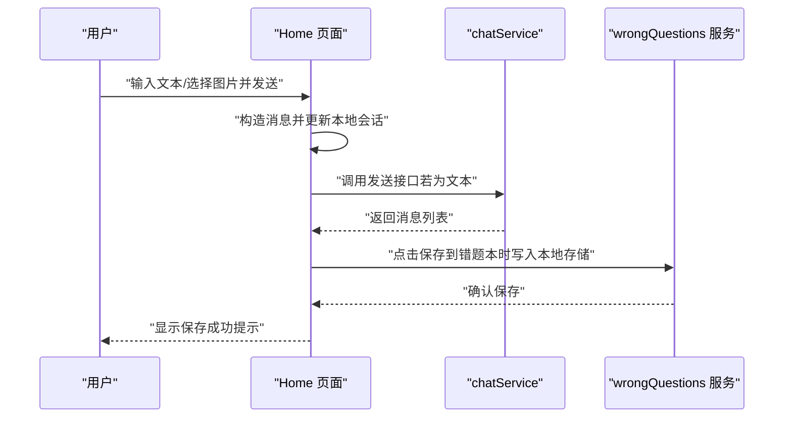
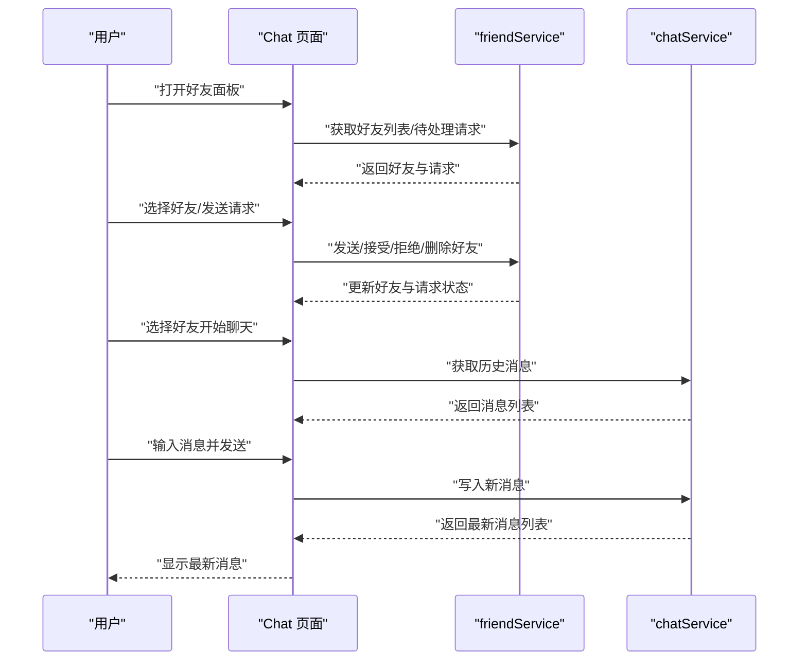
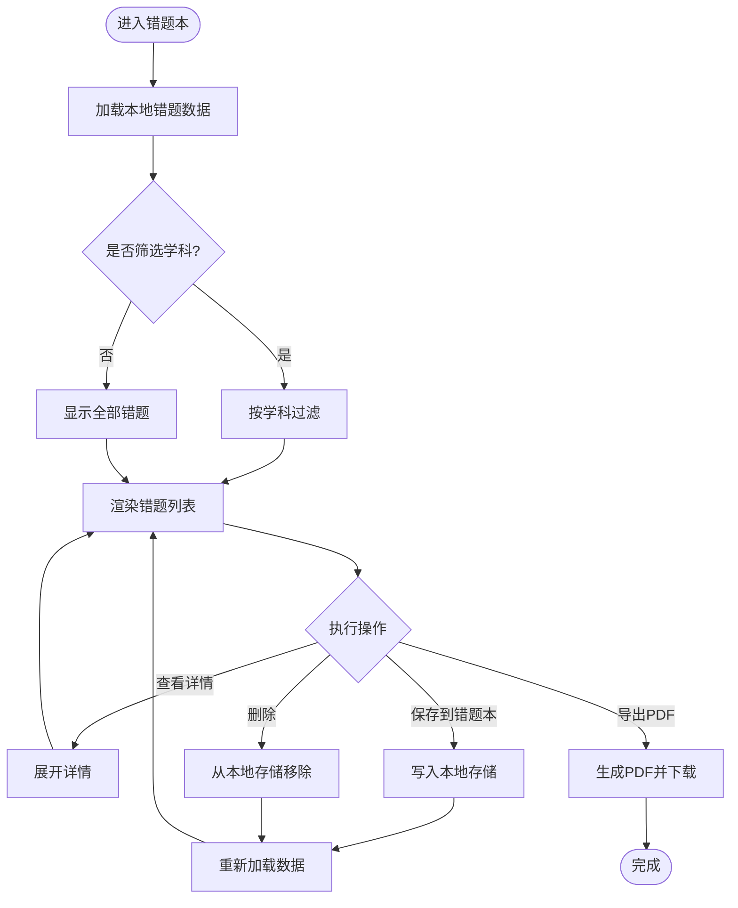
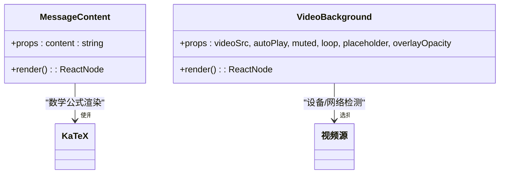
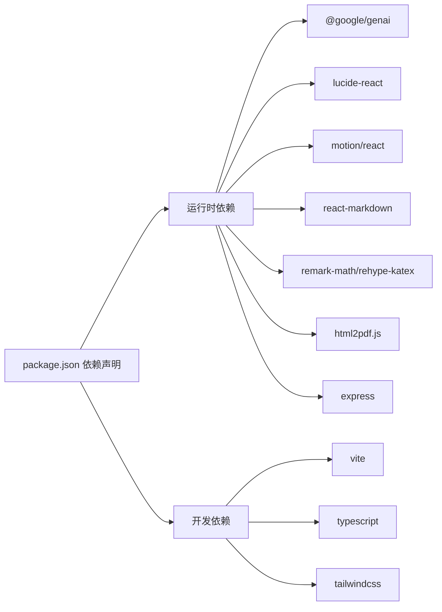

# 项目概述

<cite>
**本文档引用的文件**
- [README.md](file://README.md)
- [package.json](file://package.json)
- [vite.config.ts](file://vite.config.ts)
- [src/main.tsx](file://src/main.tsx)
- [src/App.tsx](file://src/App.tsx)
- [src/pages/Home.tsx](file://src/pages/Home.tsx)
- [src/pages/Chat.tsx](file://src/pages/Chat.tsx)
- [src/pages/WrongQuestions.tsx](file://src/pages/WrongQuestions.tsx)
- [src/components/MessageContent.tsx](file://src/components/MessageContent.tsx)
- [src/components/VideoBackground.tsx](file://src/components/VideoBackground.tsx)
- [src/config/videoConfig.ts](file://src/config/videoConfig.ts)
- [src/services/chatService.ts](file://src/services/chatService.ts)
- [src/services/wrongQuestions.ts](file://src/services/wrongQuestions.ts)
- [src/services/friendService.ts](file://src/services/friendService.ts)
</cite>

## 目录
1. [引言](#引言)
2. [项目结构](#项目结构)
3. [核心组件](#核心组件)
4. [架构总览](#架构总览)
5. [详细组件分析](#详细组件分析)
6. [依赖关系分析](#依赖关系分析)
7. [性能考虑](#性能考虑)
8. [故障排除指南](#故障排除指南)
9. [结论](#结论)
10. [附录](#附录)

## 引言
智课通 AI Tutor 是一个基于 React 19 与 TypeScript 的智能教学助手平台，面向学生与自学者，提供多模态 AI 对话、个性化学习体验与错题本管理等核心能力。系统通过集成大模型推理能力，支持文本与图像输入，实现“拍照即问”的即时反馈；同时内置社交化聊天与好友系统，促进学习交流与互助。

项目采用现代化前端技术栈，结合 Vite 构建工具、TailwindCSS 样式框架、Motion 动画库与 KaTeX 数学公式渲染，确保交互流畅与视觉体验。后端代理通过 Vite 开发服务器配置，对接第三方大模型服务，满足本地开发与部署需求。

## 项目结构
项目采用按页面与功能模块划分的组织方式，核心目录与职责如下：
- src/pages：页面级组件，包括首页聊天、错题本、讨论区、帮助中心、设置、个人中心与好友聊天等
- src/components：通用 UI 组件，如消息内容渲染、视频背景等
- src/services：业务服务层，封装本地存储与外部接口调用（如聊天、错题、好友）
- src/config：配置文件，如视频背景参数
- api：外部接口封装（如 DeepSeek 调用）
- public：静态资源（如视频背景）

**图表来源**
- [src/main.tsx:1-11](file://src/main.tsx#L1-L11)
- [src/App.tsx:1-246](file://src/App.tsx#L1-L246)
- [src/pages/Home.tsx:1-554](file://src/pages/Home.tsx#L1-L554)
- [src/pages/Chat.tsx:1-381](file://src/pages/Chat.tsx#L1-L381)
- [src/pages/WrongQuestions.tsx:1-309](file://src/pages/WrongQuestions.tsx#L1-L309)
- [src/components/MessageContent.tsx:1-31](file://src/components/MessageContent.tsx#L1-L31)
- [src/components/VideoBackground.tsx:1-159](file://src/components/VideoBackground.tsx#L1-L159)
- [src/services/chatService.ts:1-72](file://src/services/chatService.ts#L1-L72)
- [src/services/wrongQuestions.ts:1-35](file://src/services/wrongQuestions.ts#L1-L35)
- [src/services/friendService.ts:1-151](file://src/services/friendService.ts#L1-L151)

**章节来源**
- [src/main.tsx:1-11](file://src/main.tsx#L1-L11)
- [src/App.tsx:1-246](file://src/App.tsx#L1-L246)

## 核心组件
- 应用入口与路由容器
  - 应用根节点负责初始化样式与渲染根组件
  - 主容器 App 实现侧边栏导航、顶部导航与页面切换，统一管理登录状态与用户信息
- 页面组件
  - 首页 Home：多模态对话、会话历史、图片上传与 OCR 分析、错题本保存动作
  - 好友聊天 Chat：好友列表、请求管理、实时消息收发
  - 错题本 WrongQuestions：错题展示、筛选、展开详情、PDF 导出
- 通用组件
  - MessageContent：Markdown + KaTeX 数学公式渲染
  - VideoBackground：根据设备与网络自动选择视频源，支持遮罩层与降级策略
- 服务层
  - chatService：基于本地存储的消息持久化与时间戳生成
  - wrongQuestions：错题本的增删查与本地存储
  - friendService：好友关系、请求管理与本地存储

**章节来源**
- [src/App.tsx:35-211](file://src/App.tsx#L35-L211)
- [src/pages/Home.tsx:79-527](file://src/pages/Home.tsx#L79-L527)
- [src/pages/Chat.tsx:28-381](file://src/pages/Chat.tsx#L28-L381)
- [src/pages/WrongQuestions.tsx:14-309](file://src/pages/WrongQuestions.tsx#L14-L309)
- [src/components/MessageContent.tsx:19-31](file://src/components/MessageContent.tsx#L19-L31)
- [src/components/VideoBackground.tsx:42-159](file://src/components/VideoBackground.tsx#L42-L159)
- [src/services/chatService.ts:34-72](file://src/services/chatService.ts#L34-L72)
- [src/services/wrongQuestions.ts:12-35](file://src/services/wrongQuestions.ts#L12-L35)
- [src/services/friendService.ts:61-151](file://src/services/friendService.ts#L61-L151)

## 架构总览
系统采用“页面组件 + 服务层 + 通用组件”的分层架构，页面组件负责交互与状态管理，服务层封装数据持久化与外部接口，通用组件提供可复用能力。开发服务器通过 Vite 提供热更新与代理，本地开发时可直接访问第三方大模型服务。

**图表来源**
- [src/pages/Home.tsx:3-5](file://src/pages/Home.tsx#L3-L5)
- [src/services/chatService.ts:10](file://src/services/chatService.ts#L10)
- [src/services/wrongQuestions.ts:10](file://src/services/wrongQuestions.ts#L10)
- [src/services/friendService.ts:17-18](file://src/services/friendService.ts#L17-L18)
- [vite.config.ts:22-28](file://vite.config.ts#L22-L28)

**章节来源**
- [vite.config.ts:6-32](file://vite.config.ts#L6-L32)

## 详细组件分析

### 首页聊天组件（Home）
- 多模态对话流程
  - 支持文本与图片输入，图片经 OCR 分析后与文本一起提交至大模型
  - 会话历史基于本地存储，支持新建、清空与删除
  - 最后一条 AI 回复出现“保存到错题本”快捷操作，避免重复点击
- 数据结构
  - 会话与消息采用本地存储键值，便于离线使用与跨页面共享
- 性能与体验
  - 使用滚动定位与动画过渡提升交互流畅度

**图表来源**
- [src/pages/Home.tsx:139-223](file://src/pages/Home.tsx#L139-L223)
- [src/services/chatService.ts:44-72](file://src/services/chatService.ts#L44-L72)
- [src/services/wrongQuestions.ts:21-25](file://src/services/wrongQuestions.ts#L21-L25)

**章节来源**
- [src/pages/Home.tsx:79-527](file://src/pages/Home.tsx#L79-L527)

### 好友聊天组件（Chat）
- 好友系统
  - 支持添加好友、查看待处理请求、接受/拒绝/删除好友
  - 基于本地存储维护好友列表与请求状态
- 实时聊天
  - 选择好友后加载历史消息，发送消息即时更新并滚动到底部
- 交互细节
  - 请求计数徽标、悬浮删除按钮、输入回车发送等

**图表来源**
- [src/pages/Chat.tsx:28-381](file://src/pages/Chat.tsx#L28-L381)
- [src/services/friendService.ts:74-151](file://src/services/friendService.ts#L74-L151)
- [src/services/chatService.ts:34-72](file://src/services/chatService.ts#L34-L72)

**章节来源**
- [src/pages/Chat.tsx:28-381](file://src/pages/Chat.tsx#L28-L381)

### 错题本组件（WrongQuestions）
- 功能特性
  - 错题展示、按学科筛选、展开/收起详情、一键删除
  - PDF 导出：将错题与 AI 解答转换为 PDF，支持中文宋体排版
- 数据持久化
  - 基于本地存储的增删查，支持清空与重新加载
- 统计可视化
  - 学科分布统计条，直观展示各科目错题占比

**图表来源**
- [src/pages/WrongQuestions.tsx:14-309](file://src/pages/WrongQuestions.tsx#L14-L309)
- [src/services/wrongQuestions.ts:12-35](file://src/services/wrongQuestions.ts#L12-L35)

**章节来源**
- [src/pages/WrongQuestions.tsx:14-309](file://src/pages/WrongQuestions.tsx#L14-L309)

### 通用组件与配置
- MessageContent：统一处理 Markdown 与 LaTeX 公式渲染，支持块级与行内公式
- VideoBackground：根据硬件并发数与网络连接类型自动选择视频源，具备降级与遮罩层能力

**图表来源**
- [src/components/MessageContent.tsx:19-31](file://src/components/MessageContent.tsx#L19-L31)
- [src/components/VideoBackground.tsx:42-159](file://src/components/VideoBackground.tsx#L42-L159)

**章节来源**
- [src/components/MessageContent.tsx:19-31](file://src/components/MessageContent.tsx#L19-L31)
- [src/components/VideoBackground.tsx:42-159](file://src/components/VideoBackground.tsx#L42-L159)
- [src/config/videoConfig.ts:1-47](file://src/config/videoConfig.ts#L1-L47)

## 依赖关系分析
- 运行时依赖
  - @google/genai：大模型推理接入
  - lucide-react：图标库
  - motion/react：动画库
  - react-markdown + remark-math + rehype-katex：Markdown 与数学公式渲染
  - html2pdf.js：PDF 导出
  - express：服务端示例（开发环境）
- 构建与开发依赖
  - vite、@vitejs/plugin-react、tailwindcss、typescript 等

**图表来源**
- [package.json:13-29](file://package.json#L13-L29)
- [package.json:30-40](file://package.json#L30-L40)

**章节来源**
- [package.json:1-42](file://package.json#L1-L42)

## 性能考虑
- 视频背景自适应
  - 根据硬件并发数与网络连接类型自动选择更高分辨率视频源，失败时自动降级至默认源，保障加载稳定性
- 本地存储优化
  - 会话与错题数据均使用 localStorage，减少网络往返；对频繁更新的数据采用批量写入策略
- 渲染性能
  - 使用动画库与滚动定位，避免不必要的重绘；Markdown 渲染仅在内容变化时触发
- 构建与代理
  - Vite 提供快速热更新与按需编译；开发服务器代理大模型接口，减少跨域与调试复杂度

**章节来源**
- [src/components/VideoBackground.tsx:55-103](file://src/components/VideoBackground.tsx#L55-L103)
- [src/pages/Home.tsx:103-117](file://src/pages/Home.tsx#L103-L117)
- [vite.config.ts:6-32](file://vite.config.ts#L6-L32)

## 故障排除指南
- 大模型 API 密钥未配置
  - 现象：无法发起对话或收到鉴权错误
  - 处理：在本地环境变量中设置密钥，并重启开发服务器
- 视频背景加载失败
  - 现象：视频区域显示加载提示或默认渐变背景
  - 处理：检查视频路径与占位图配置，确认网络连通性；组件会自动降级到默认源
- PDF 导出异常
  - 现象：导出按钮禁用或报错
  - 处理：确保已选择错题并处于可用状态；检查浏览器兼容性与弹窗拦截设置
- 好友请求状态异常
  - 现象：请求无法接受/拒绝或好友列表不同步
  - 处理：清理本地存储相关键值并重新加载页面

**章节来源**
- [README.md:16-21](file://README.md#L16-L21)
- [src/components/VideoBackground.tsx:94-103](file://src/components/VideoBackground.tsx#L94-L103)
- [src/pages/WrongQuestions.tsx:33-161](file://src/pages/WrongQuestions.tsx#L33-L161)
- [src/services/friendService.ts:112-151](file://src/services/friendService.ts#L112-L151)

## 结论
智课通 AI Tutor 以 React 19 与 TypeScript 为基础，结合多模态 AI 对话、错题本管理与社交化聊天，构建了面向学习场景的智能助手平台。通过本地存储与代理服务，兼顾易用性与可扩展性；通过视频背景与动画组件，提升用户体验。项目适合初学者快速上手，也为有经验的开发者提供了清晰的分层架构与可拓展的组件体系。

## 附录
- 快速开始
  - 安装依赖、配置 API 密钥、启动开发服务器
- 关键使用案例
  - 在首页上传图片并提问，查看 AI 回答后一键保存到错题本
  - 打开好友聊天，添加好友并进行实时对话
  - 在错题本中筛选学科、展开详情并导出 PDF

**章节来源**
- [README.md:16-21](file://README.md#L16-L21)
- [src/pages/Home.tsx:320-333](file://src/pages/Home.tsx#L320-L333)
- [src/pages/Chat.tsx:105-381](file://src/pages/Chat.tsx#L105-L381)
- [src/pages/WrongQuestions.tsx:168-309](file://src/pages/WrongQuestions.tsx#L168-L309)