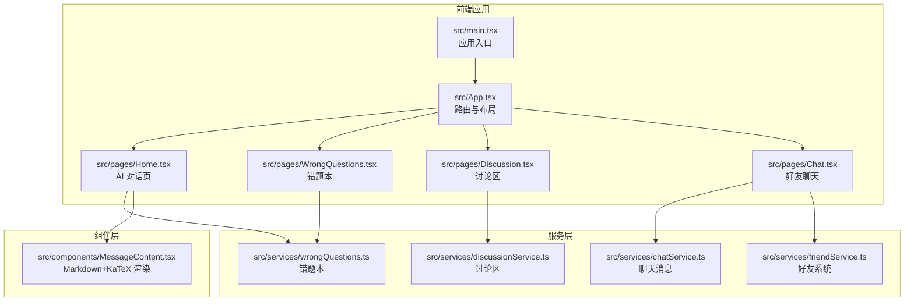
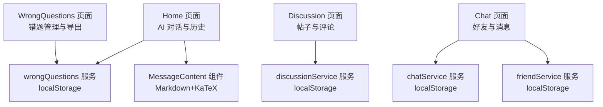
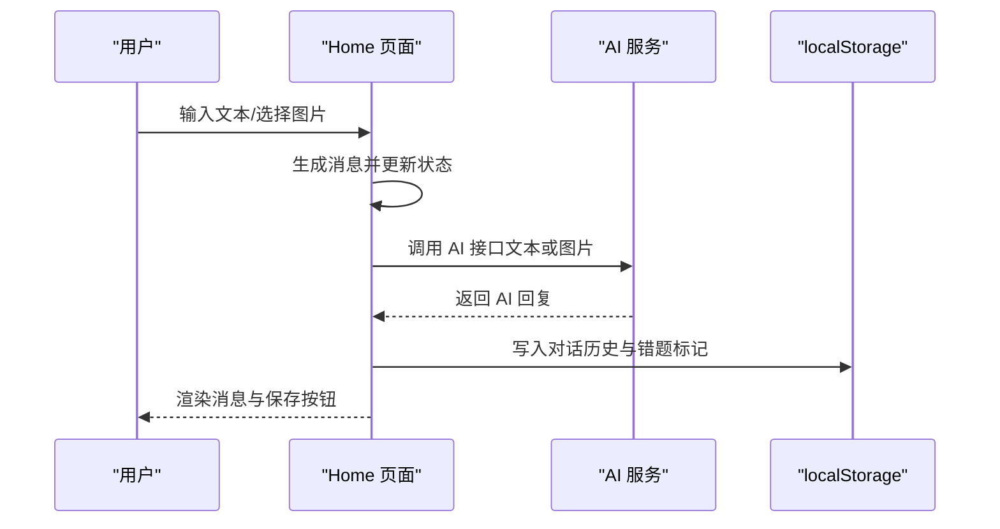
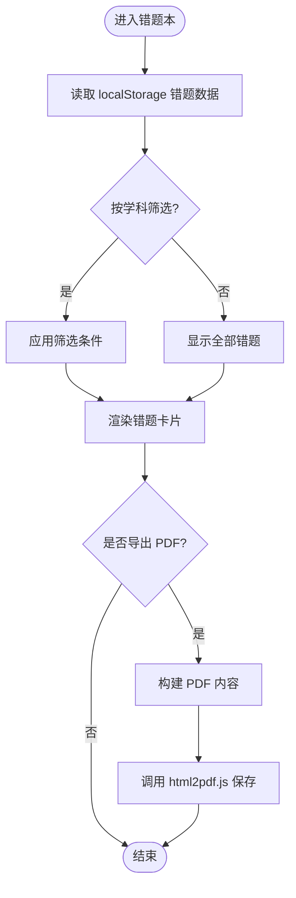
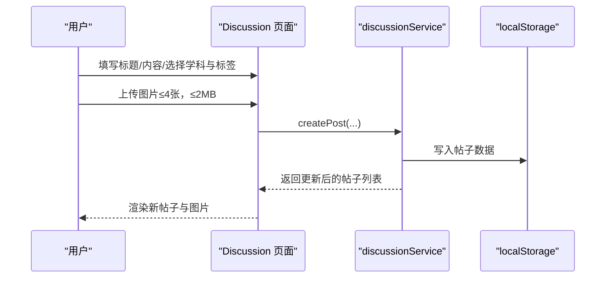
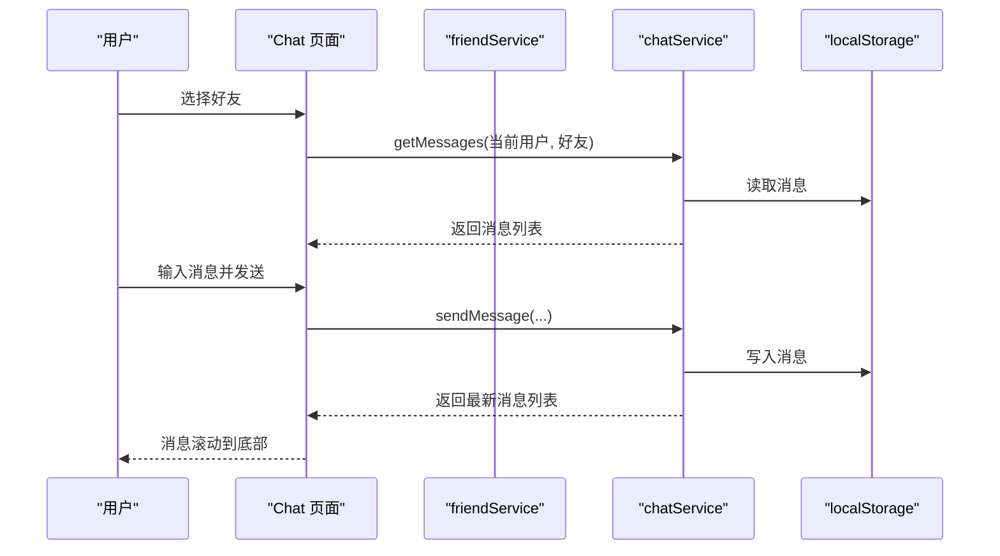
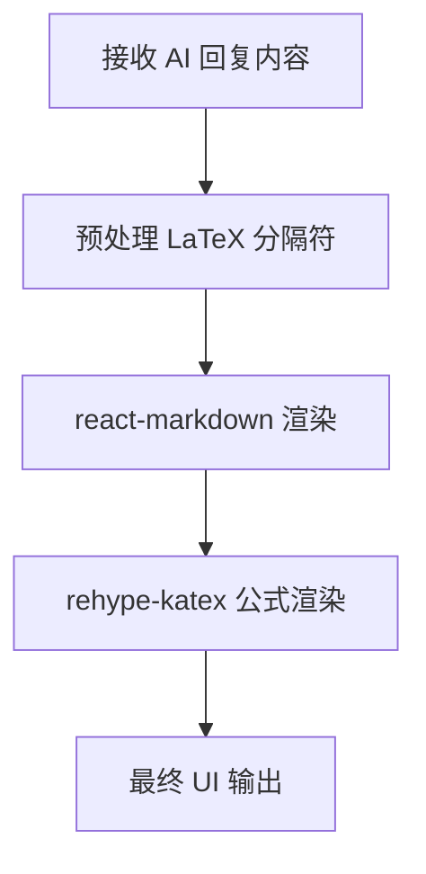
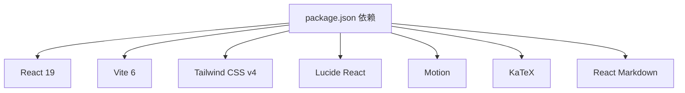

# 项目简介

<cite>
**本文档引用的文件**
- [README.md](file://README.md)
- [package.json](file://package.json)
- [AGENTS.md](file://AGENTS.md)
- [src/main.tsx](file://src/main.tsx)
- [src/App.tsx](file://src/App.tsx)
- [src/pages/Home.tsx](file://src/pages/Home.tsx)
- [src/pages/WrongQuestions.tsx](file://src/pages/WrongQuestions.tsx)
- [src/pages/Discussion.tsx](file://src/pages/Discussion.tsx)
- [src/pages/Chat.tsx](file://src/pages/Chat.tsx)
- [src/services/chatService.ts](file://src/services/chatService.ts)
- [src/services/wrongQuestions.ts](file://src/services/wrongQuestions.ts)
- [src/services/discussionService.ts](file://src/services/discussionService.ts)
- [src/services/friendService.ts](file://src/services/friendService.ts)
- [src/components/MessageContent.tsx](file://src/components/MessageContent.tsx)
</cite>

## 目录
1. [引言](#引言)
2. [项目结构](#项目结构)
3. [核心组件](#核心组件)
4. [架构总览](#架构总览)
5. [详细组件分析](#详细组件分析)
6. [依赖关系分析](#依赖关系分析)
7. [性能考量](#性能考量)
8. [故障排查指南](#故障排查指南)
9. [结论](#结论)
10. [附录](#附录)

## 引言
智课通 AI Tutor 是一个基于 React 19 与 TypeScript 的智能 AI 教学助手平台，面向高校学生、教师与教育机构，提供多模态 AI 对话、个性化学习体验与错题本管理等能力。项目通过内置四个专业 AI Agent（高数酱、Py酱、Torch君、矩阵妹），结合讨论区、好友社交与聊天系统，帮助用户实现“拍照/文字提问—即时解答—错题巩固—协作学习”的闭环学习路径。

- 核心价值主张
  - 多模态 AI 对话：支持文本与图片输入，实现拍照即问、OCR 分析与数学公式渲染。
  - 个性化学习体验：按学科 Agent 切换、对话历史隔离、错题本沉淀与导出。
  - 协作与社区：讨论区、好友系统与聊天，促进同伴互助与知识共享。
  - 本地化与隐私友好：所有数据默认存储于浏览器 localStorage，保障用户数据安全可控。

- 目标用户
  - 学生：课堂难点突破、作业答疑、错题巩固与知识拓展。
  - 教师：辅助答疑、知识点讲解、课堂互动与学习反馈收集。
  - 教育机构：课堂辅助工具、学习行为分析与教学资源沉淀。

- 主要应用场景
  - 课后一对一答疑：通过多模态对话快速解决疑难。
  - 错题本管理：自动保存与导出 PDF，形成个人知识档案。
  - 学习小组协作：讨论区与好友系统促进知识分享与互助。
  - 教学辅助：教师可基于 AI 回答设计课程案例与练习。

- 创新点与竞争优势
  - 多 Agent 专业化：不同学科 Agent 拥有专属角色与提示词，提升回答质量与可信度。
  - 本地持久化：localStorage 驱动的对话与错题管理，无需服务端即可完整使用。
  - 一体化 UI：统一的导航与侧边栏设计，页面切换流畅，交互直观。
  - 数学渲染：内置 KaTeX 与 Markdown 渲染，支持复杂公式与排版。

- 对教育科技行业的影响
  - 降低 AI 教育应用门槛：前端即用、零部署，便于学校与教师快速试用。
  - 推动多模态教学：拍照答疑与 OCR 分析为传统题库补充新的入口。
  - 强化学习闭环：从“提问—解答—巩固—分享”形成完整学习生态。

## 项目结构
项目采用单页应用（SPA）架构，基于 React 19 + Vite 6 + Tailwind CSS v4，页面通过状态机驱动切换，未引入 react-router。核心页面包括首页（AI 对话）、错题本、讨论区、聊天、个人中心与设置；服务层负责数据持久化与业务逻辑；组件层提供通用 UI 与内容渲染。

**图表来源**
- [src/main.tsx:1-11](file://src/main.tsx#L1-L11)
- [src/App.tsx:1-246](file://src/App.tsx#L1-L246)
- [src/pages/Home.tsx:1-554](file://src/pages/Home.tsx#L1-L554)
- [src/pages/WrongQuestions.tsx:1-309](file://src/pages/WrongQuestions.tsx#L1-L309)
- [src/pages/Discussion.tsx:1-800](file://src/pages/Discussion.tsx#L1-L800)
- [src/pages/Chat.tsx:1-381](file://src/pages/Chat.tsx#L1-L381)
- [src/services/chatService.ts:1-72](file://src/services/chatService.ts#L1-L72)
- [src/services/wrongQuestions.ts:1-35](file://src/services/wrongQuestions.ts#L1-L35)
- [src/services/discussionService.ts:1-155](file://src/services/discussionService.ts#L1-L155)
- [src/services/friendService.ts:1-151](file://src/services/friendService.ts#L1-L151)
- [src/components/MessageContent.tsx:1-31](file://src/components/MessageContent.tsx#L1-L31)

**章节来源**
- [AGENTS.md:27-34](file://AGENTS.md#L27-L34)
- [package.json:1-42](file://package.json#L1-L42)

## 核心组件
- 应用入口与布局
  - 入口文件负责挂载 React 应用，App 组件提供全局状态与页面导航。
  - 侧边栏与顶部导航统一承载 Agent 切换、页面跳转与用户信息。
- AI 对话页（Home）
  - 支持 Agent 切换、图片上传与 OCR 分析、对话历史管理、错题保存与提醒。
- 错题本（WrongQuestions）
  - 展示与筛选错题、PDF 导出、统计分析与详情展开。
- 讨论区（Discussion）
  - 帖子发布、评论、点赞、置顶/已解决标记与图片放大查看。
- 好友与聊天（Chat）
  - 好友管理、申请与通知、私聊消息与滚动同步。
- 服务与组件
  - 服务层以 localStorage 为核心实现数据持久化，组件层统一内容渲染与交互样式。

**章节来源**
- [src/App.tsx:35-211](file://src/App.tsx#L35-L211)
- [src/pages/Home.tsx:79-527](file://src/pages/Home.tsx#L79-L527)
- [src/pages/WrongQuestions.tsx:14-309](file://src/pages/WrongQuestions.tsx#L14-L309)
- [src/pages/Discussion.tsx:42-308](file://src/pages/Discussion.tsx#L42-L308)
- [src/pages/Chat.tsx:28-381](file://src/pages/Chat.tsx#L28-L381)
- [src/services/chatService.ts:34-72](file://src/services/chatService.ts#L34-L72)
- [src/services/wrongQuestions.ts:12-35](file://src/services/wrongQuestions.ts#L12-L35)
- [src/services/discussionService.ts:45-155](file://src/services/discussionService.ts#L45-L155)
- [src/services/friendService.ts:61-151](file://src/services/friendService.ts#L61-L151)
- [src/components/MessageContent.tsx:19-31](file://src/components/MessageContent.tsx#L19-L31)

## 架构总览
项目采用“页面 + 服务 + 组件”的分层架构，页面负责交互与状态，服务负责数据持久化，组件负责复用与渲染。AI 对话通过 API 代理访问多模态模型，讨论区与聊天通过本地存储实现数据一致性。

**图表来源**
- [src/pages/Home.tsx:38-527](file://src/pages/Home.tsx#L38-L527)
- [src/pages/WrongQuestions.tsx:14-309](file://src/pages/WrongQuestions.tsx#L14-L309)
- [src/pages/Discussion.tsx:42-800](file://src/pages/Discussion.tsx#L42-L800)
- [src/pages/Chat.tsx:28-381](file://src/pages/Chat.tsx#L28-L381)
- [src/services/wrongQuestions.ts:12-35](file://src/services/wrongQuestions.ts#L12-L35)
- [src/services/discussionService.ts:45-155](file://src/services/discussionService.ts#L45-L155)
- [src/services/chatService.ts:34-72](file://src/services/chatService.ts#L34-L72)
- [src/services/friendService.ts:61-151](file://src/services/friendService.ts#L61-L151)
- [src/components/MessageContent.tsx:19-31](file://src/components/MessageContent.tsx#L19-L31)

## 详细组件分析

### AI 对话组件（Home）
- 功能要点
  - 多 Agent 支持：数学、Python、深度学习、线性代数四类 Agent，分别提供专属角色与提示词。
  - 多模态输入：支持文本与图片上传，图片经 FileReader 转 base64 后提交至多模态模型。
  - 对话历史：按 Agent 分区存储，支持新建会话、清空当前会话与历史查看。
  - 错题保存：在助手回复后弹出保存按钮，一键加入错题本并持久化。
- 数据流
  - 输入处理 → 生成消息 → 调用 AI 服务 → 更新状态与本地存储 → 渲染消息与动作。

**图表来源**
- [src/pages/Home.tsx:139-223](file://src/pages/Home.tsx#L139-L223)
- [src/services/wrongQuestions.ts:21-25](file://src/services/wrongQuestions.ts#L21-L25)

**章节来源**
- [src/pages/Home.tsx:7-36](file://src/pages/Home.tsx#L7-L36)
- [src/pages/Home.tsx:139-223](file://src/pages/Home.tsx#L139-L223)
- [src/pages/Home.tsx:335-425](file://src/pages/Home.tsx#L335-L425)

### 错题本组件（WrongQuestions）
- 功能要点
  - 错题列表：按学科筛选、时间排序、展开查看 AI 解答。
  - 导出 PDF：使用 html2pdf.js 将错题内容渲染为 A4 PDF，支持中文字体。
  - 统计分析：按学科统计占比，可视化展示。
- 数据流
  - 读取 localStorage → 过滤与排序 → 渲染卡片与统计 → 导出流程。

**图表来源**
- [src/pages/WrongQuestions.tsx:21-161](file://src/pages/WrongQuestions.tsx#L21-L161)
- [src/services/wrongQuestions.ts:12-35](file://src/services/wrongQuestions.ts#L12-L35)

**章节来源**
- [src/pages/WrongQuestions.tsx:14-309](file://src/pages/WrongQuestions.tsx#L14-L309)

### 讨论区组件（Discussion）
- 功能要点
  - 发帖与评论：支持标题、内容、图片上传与标签分类。
  - 点赞与置顶：支持帖子与评论点赞、置顶与标记已解决。
  - 活跃贡献者：按评分统计活跃用户。
- 数据流
  - 表单提交 → 生成 ID 与时间戳 → 写入 localStorage → 刷新列表。

**图表来源**
- [src/pages/Discussion.tsx:53-71](file://src/pages/Discussion.tsx#L53-L71)
- [src/services/discussionService.ts:58-74](file://src/services/discussionService.ts#L58-L74)

**章节来源**
- [src/pages/Discussion.tsx:42-800](file://src/pages/Discussion.tsx#L42-L800)
- [src/services/discussionService.ts:45-155](file://src/services/discussionService.ts#L45-L155)

### 好友与聊天组件（Chat）
- 功能要点
  - 好友管理：发送/接收/处理好友申请，删除好友。
  - 私聊消息：按对话双方生成唯一 key，存储消息列表并滚动到底部。
- 数据流
  - 选择好友 → 加载消息 → 输入发送 → 写入 localStorage → 滚动同步。

**图表来源**
- [src/pages/Chat.tsx:41-97](file://src/pages/Chat.tsx#L41-L97)
- [src/services/chatService.ts:34-72](file://src/services/chatService.ts#L34-L72)
- [src/services/friendService.ts:74-151](file://src/services/friendService.ts#L74-L151)

**章节来源**
- [src/pages/Chat.tsx:28-381](file://src/pages/Chat.tsx#L28-L381)
- [src/services/chatService.ts:34-72](file://src/services/chatService.ts#L34-L72)
- [src/services/friendService.ts:61-151](file://src/services/friendService.ts#L61-L151)

### 内容渲染组件（MessageContent）
- 功能要点
  - 使用 react-markdown + remark-math + rehype-katex 渲染 AI 回复。
  - 预处理 LaTeX 分隔符，确保数学公式正确渲染。
- 数据流
  - 接收原始内容 → 预处理 LaTeX → 渲染 Markdown 与公式。

**图表来源**
- [src/components/MessageContent.tsx:9-31](file://src/components/MessageContent.tsx#L9-L31)

**章节来源**
- [src/components/MessageContent.tsx:19-31](file://src/components/MessageContent.tsx#L19-L31)

## 依赖关系分析
- 前端依赖
  - React 19、Vite 6、Tailwind CSS v4、Lucide React 图标、Motion 动画、KaTeX 数学渲染、React Markdown。
- 运行与部署
  - 开发环境通过 Vite 启动，生产构建使用 Vite；AI 服务通过 API 代理或 Vercel Serverless Function 转发。
- 数据持久化
  - 所有页面数据均使用 localStorage，避免后端耦合，提升可用性与隐私保护。

**图表来源**
- [package.json:13-28](file://package.json#L13-L28)

**章节来源**
- [package.json:1-42](file://package.json#L1-L42)
- [AGENTS.md:91-98](file://AGENTS.md#L91-L98)

## 性能考量
- 前端性能
  - 使用 React 19 的并发特性与 Motion 动画优化页面切换与交互流畅度。
  - 图片上传采用 FileReader 异步处理，避免阻塞主线程。
- 渲染性能
  - MessageContent 组件按需渲染 Markdown 与公式，减少不必要的重绘。
- 数据访问
  - localStorage 读写集中在服务层，避免页面频繁 IO；必要时使用引用缓存（如 Home 中的 ref）避免竞态。
- 网络与 API
  - 开发环境通过 Vite 代理访问 AI 服务，生产环境使用 Vercel Serverless Function，减少跨域与密钥暴露风险。

## 故障排查指南
- 环境变量与 API
  - 确认 GEMINI_API_KEY 已在 .env.local 设置，或在生产环境通过 Vercel 转发配置。
- 图片上传
  - 检查文件类型与大小限制（仅允许图片且不超过 2MB），确认 FileReader 正常触发。
- 错题保存
  - 若保存按钮未出现，请确认已产生助手回复且未被忽略；检查 localStorage 中的保存标记。
- 讨论区与聊天
  - 若消息未显示，请确认 localStorage 中对应 key 是否存在；检查时间戳与排序逻辑。
- PDF 导出
  - 若导出失败，检查 html2pdf.js 初始化与容器样式；确认页面内容已渲染完成再触发导出。

**章节来源**
- [AGENTS.md:14-16](file://AGENTS.md#L14-L16)
- [src/pages/Discussion.tsx:596-634](file://src/pages/Discussion.tsx#L596-L634)
- [src/pages/Home.tsx:366-391](file://src/pages/Home.tsx#L366-L391)
- [src/pages/WrongQuestions.tsx:33-161](file://src/pages/WrongQuestions.tsx#L33-L161)

## 结论
智课通 AI Tutor 以“多模态 AI + 本地化数据 + 协作生态”为核心，为学生提供高效的学习助手，为教师提供便捷的教学辅助，为教育机构提供可落地的课堂工具。其低门槛、强交互与可扩展的设计，使其在教育科技领域具备良好的推广潜力与实践价值。

## 附录
- 快速开始
  - 安装依赖、设置 API Key、启动开发服务器，即可在本地体验 AI 对话与学习功能。
- 技术背景
  - 项目采用 React 19 + TypeScript + Vite + Tailwind CSS，页面通过状态机实现导航，服务层以 localStorage 为核心实现数据持久化，组件层统一内容渲染与交互风格。

**章节来源**
- [README.md:11-21](file://README.md#L11-L21)
- [AGENTS.md:27-34](file://AGENTS.md#L27-L34)